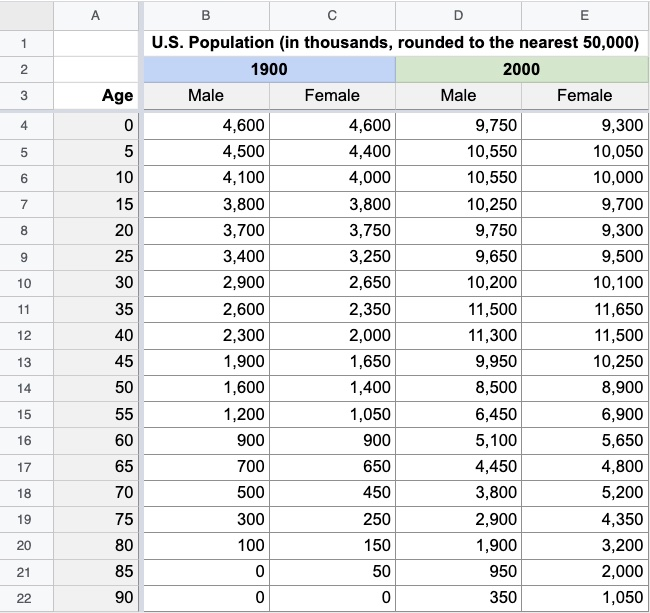

::: callout-important
This assignment is to be submitted as a PDF file into Canvas. All questions are worth 15 points
:::

## Question 1

List 5 things that you might want to look for while doing exploratory data analysis

## Question 2

The following dataset is a simplified version of population data in the United States.

a. Clearly state a question you would like to address using this data (5)
b. Sketch out (in pen/pencil and paper) two data visualizations that would help you address the question you have stated above. Draw these out, take pictures and include them below. Properly label the visualizations so that they are self-explanatory. Describe what insight you gain from each visualization. (10)

::: callout-tip
Yes, I'm really asking you to sketch these graphs with pen and paper. Not a joke. As I was saying in class, I think data visualizations develop better with the end in mind. The software is just a tool for getting there in a pretty and reproducible manner
:::

## Question 3

The file `crabs.csv` provides data on fiddler crab body size in 13 marshes along the east coast of the US in 2016, along with 
water and air temperature data colected from monitoring programs, weather stations and ocean buoys. A description of the dataset is available in Canvas. 

a. Pose 2 questions you would like to address using this data set, that are reflective of relationships between the available variables. (5)
b. Using any approved software, generate one visualization per question to explore the data and get an idea about the answer to the question. (10)

## Extra credit

A data set from Mother Jones provides details on 151 mass shootings in the United States. This data is a bit messy. 

1. Identify issues with the data 
2. What questions might be interesting to ask of this data?
3. Evaluate the completeness of the data (in other words, are there variables with a lot of missing values)
4. Create one interesting visualization from this dataset, relevant to your questions. Make sure it "stands on its own" with proper labels and the like
5. What other kinds of visualizations might be interesting?

(3 points each)

::: callout-tip
You can continue to work on this dataset as an exercise to try out new concepts, or to just get more proficient at . 
:::
