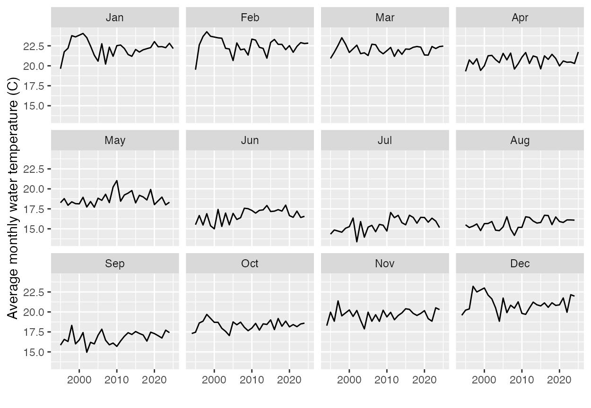

::: callout-important
## Instructions

This assignment is to be submitted as a PDF file into Canvas. All questions are worth 5 points each, or as marked. The preferred option is to render this Quarto document to PDF and submit that file. This file is set up to render to PDF by default. If you have trouble with that, you can also render to HTML and print to PDF from your browser. (Change `typst` in the header lines above to `html`)

You will fill in the blanks (indicated by `______`) in the code chunks below. You will also need to write some code from scratch in a few places. Once you're done filling in the blanks, you should be able to run all the code chunks without errors. To make the code chunks run, you will need to change the `eval` option from `false` to `true` in the execute options at the top of the document.

You should install any required packages on your own. If you run into trouble, please reach out to me for help. You should do this outside this document, so the code for installing packages is not included here (You should [never]{style="color: red; font-weight: bold;"} include code for installing packages in a Quarto document).
:::

```{r}
#| label: setup
#| eval: true
library(tidyverse)
library(rio)

```

The following dataset provides water quality measurements from various beaches in Sydney, Australia for the period Sept 1991 to April, 2025.

> This data was used for a [Tidy Tuesday](https://github.com/rfordatascience/tidytuesday/blob/main/README.md) competition. You can get a more detailed description [here](https://github.com/rfordatascience/tidytuesday/blob/main/data/2025/2025-05-20/readme.md), The inspiration behind using this data for the competition was [this article](https://www.abc.net.au/news/2025-01-10/pollution-risks-in-sydney-beaches-contaminated-waterways-rain/104790856)

```{r}
#| eval: true
water_quality = rio::import('https://raw.githubusercontent.com/rfordatascience/tidytuesday/main/data/2025/2025-05-20/water_quality.csv')
```

### Data dictionary

| variable | class | description |
|:-------------------|:-----------------|:---------------------------------|
| region | character | Area of Sydney City |
| council | character | City council responsible for water quality |
| swim_site | character | Name of beach/swimming location |
| date | date | Date |
| time | time | Time of day |
| enterococci_cfu_100ml | integer | Enterococci bacteria levels in colony forming units (CFU) per 100 millilitres of water |
| water_temperature_c | integer | Water temperature in degrees Celsius |
| conductivity_ms_cm | integer | Conductivity in microsiemens per centimetre |
| latitude | double | Latitude |
| longitude | double | Longitude |

We will start exploring this dataset using R.

### Structure of the dataset

1a. How many rows and columns are in the dataset? (5)

```{r}
____ (water_quality)
```

1b. What are the variable names in the dataset? (5)

```{r}
#| eval: false
____(water_quality)
```

1c. What are the data types of each variable? (5)

You can use the `glimpse` function from the **dplyr** package to get a quick overview of the data types of each variable. The **dplyr** package is part of the **tidyverse** collection of packages, which we loaded at the start of this assignment.

```{r}
< Your code here >

```

### Data munging (cleaning and transforming the data)

2a. Are there any missing values in the dataset? If so, which variables have missing values and how many? (5)

> Hint: The `is.na` function returns a `TRUE` if a value is missing (NA) and `FALSE` otherwise. In R, `TRUE` and `FALSE` are treated as 1 and 0 respectively, so you can use the `sum` function to count the number of missing values in a variable.

Choose one variable in the dataset and find the number of missing values it has

```{r}
sum(is.na(______$_____))
```

> You can use the `summarise` function from the **dplyr** package to count the number of missing values in each variable in the dataset. The `across` function allows you to apply a function to multiple columns at once.
>
> You will also need to create an **anonymous function** with one argument (the variable name) that returns the sum of missing values in that variable. The formal way to do this is `\(x) sum(is.na(x))`.

```{r}
#| eval: true
water_quality |> 
  summarise(across(everything(), \(x) sum(is.na(x))))
```

Read the documentation for `summarise` and `across` to understand how they work. You can access the documentation by running `?summarise` and `?across` in your R console.

2b. Create a new variable called `log_enterococci` that is the natural logarithm of the `enterococci_cfu_100ml` variable. (5)

```{r}
water_quality <- water_quality |> 
  ______(log_enterococci = log(enterococci_cfu_100ml + 1)) # to avoid the log(0) situation
```

2c. Create a new variable called `month` that is the month of the year extracted from the `date` variable. We want a textual representation of the month (e.g., "January", "February", etc.) (5)

> See the documentation for `lubridate::month` for how to do this. You will need to change one of the default options in the `lubridate::month` function. The **lubridate** package is part of the **tidyverse** collection of packages, so you don't need to load it separately.

```{r}
< Your code here >
```

2d. The maximum value of the recorded water temperature is `r max(water_quality$water_temperature_c, na.rm=T)`, which seems unreasonably high. The question is, are measurements at particular beaches being done poorly. Extract observations where the water temperature is above 35 degrees Celsius, and then create a frequency table of the beaches in this filtered dataset (5)

> You can use the `filter` function from the **dplyr** package to filter the dataset, and then use the `count` function to create a frequency table of the `swim_site` variable in the filtered dataset.

```{r}
water_quality |> 
  ______(water_temperature_c > 35) |> 
  _____(swim_site)
```

2e. Were the high temperature readings more common in particular years? (5)

```{r}
< Your code here >
```

### Data summaries

3a. How many unique swim sites are in each region? (5)

Overall, there are `r n_distinct(water_quality$swim_site)` unique swim sites in the dataset. Use the `group_by` and `summarise` functions from the **dplyr** package to find the number of unique swim sites in each region. We will use a pipe (`|>`) to pass the `water_quality` dataset to the `group_by` function, and then pass the result to the `summarise` function.

```{r}
water_quality |> 
  group_by(_____) |> 
  summarise(num_swim_sites = n_distinct(_____))
```

3b. What is the average water temperature in each region per month, after filtering out readings \> 35C? (5)

```{r}
water_quality |> 
  ______________ |> # filter out readings > 35C
  group_by(_____, _____) |> 
  summarise(avg_water_temp = mean(_____, na.rm = TRUE)) |> 
  ungroup() # this is to remove the grouping and make it usable for other operations
```

#### Extra credit (10)

Using the water quality data filtered for water temperatures ≤ 35C, recreate the following plot. Even if you can't code them in R yet, write out what data steps you would need to be able to draw these plots.

> This exercise is meant to train you to (a) reverse-engineer graphs, and (b) conceptualize the data munging steps you need to get to these visualization

`< Your explanation of the data process here>`

```{r}
< Your code here >
```

