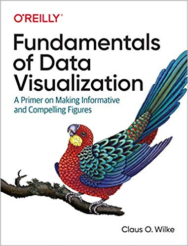
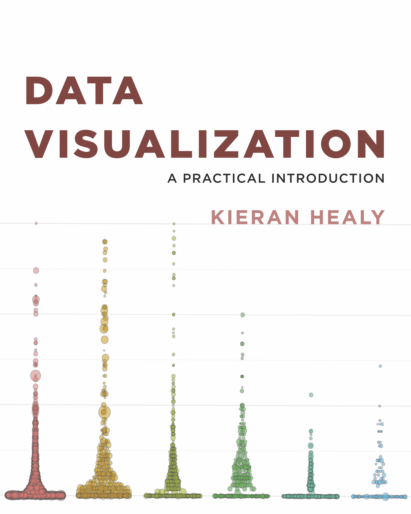
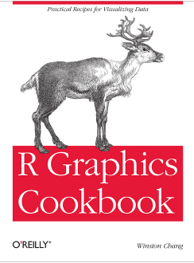
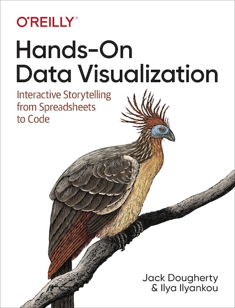
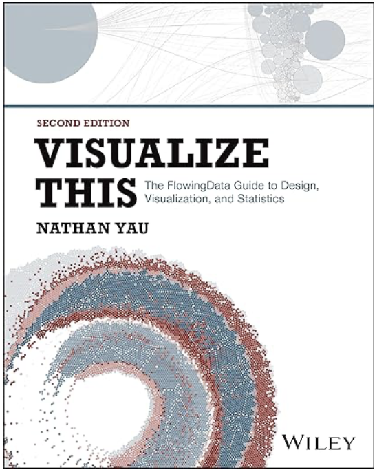
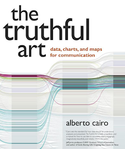
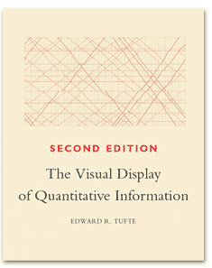
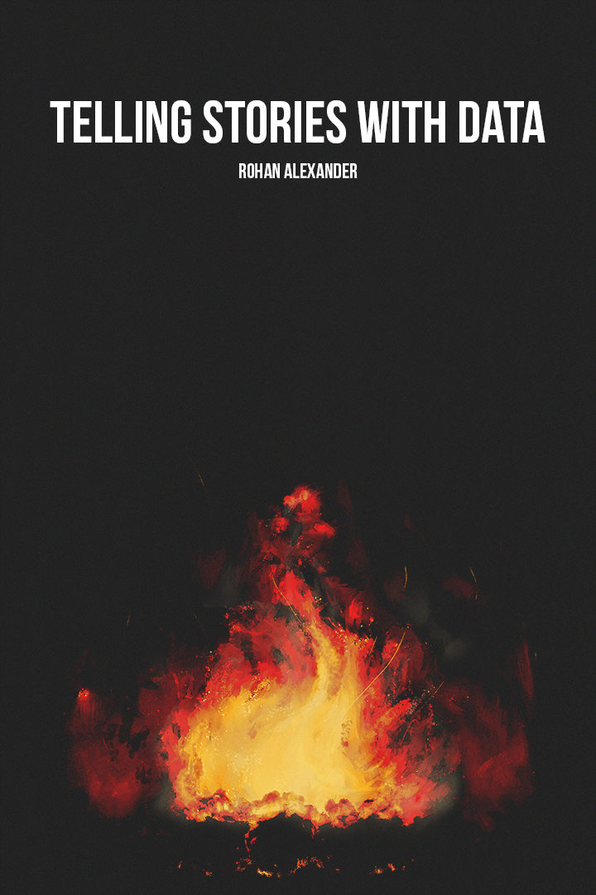

# Required materials

1. Introduction to Modern Statistics (2e) by Mine Cetinkaya-Rundel and Johanna Hardin (2024) <https://openintro-ims.netlify.app/>
2. R for Data Science (2e) by Hadely Wickham, Mine Cetinkaya-Rundel and Garret Grolemund (2025). <https://r4ds.hadley.nz/>
3. Statistical Inference via Data Science (2e) by Chester Ismay, Albert Y. Kim and Arturo Valdivia (2025). <https://moderndive.com/v2/index.html>

# Books

## Data science books

1. Introduction to Environmental Data Science by Jerry Davis (2025). <https://bookdown.org/igisc/EnvDataSci/>
2. Tidy Modeling with R by Max Kuhn and Julia Silge (2023). <https://www.tmwr.org/>
3. Geocomputation with R by Robin Lovelace, Jakub Nowosad and Jannes Muenchow (2025). <https://r.geocompx.org/>
4. Geographic Data Science with R: Visualizing and Analyzing Environmental Change by Michael C. Wimberley (2023). <https://bookdown.org/mcwimberly/gdswr-book/>

## Data visualization books

{target="_blank"} 
{target="_blank"}
{target="blank"}
{target="_blank"}

Clicking on the covers will send you to the free online versions of each book

The following books' content are not available. The links are **non-affiliate**
Amazon links to the books, or to the books' web pages:

{target="_blank"}
{target="_blank"}
{target="_blank"}
{target="_blank"}

:::: {.columns}
::: {.column width="15%"}

:::
::: {.column width="85%"}
The [Royal Statistical Society](https://rss.org.uk/) published a guide to [Best Practices in Data Visualization](https://royal-statistical-society.github.io/datavisguide/),
written by Andreas Krause, Nicola Rennie, and Brian Tarran. Krause and Rennie published a 
series of tutorial papers in the journal [Significance](https://academic.oup.com/) that are 
quite informative in thinking about data visualization. You can read this series [here](https://georgetown.box.com/s/50oajtoml2mm2fybh5fay67e7cjcbf46){target="_blank"}
:::
::::

## Toolkits

### JASP
1. Bayesian Inference in JASP: A Guide for Students by Mark A Goss-Sampson, Johnny van Doorn and EJ Wagenmakers (2020). https://static.jasp-stats.org/Manuals/Bayesian_Guide_v0_12_2_1.pdf
2. Statistical Analysis in JASP: A Guide for Students by Mark A Goss-Sampson (2025). https://static.jasp-stats.org/Manuals/Bayesian_Guide_v0_12_2_1.pdf

## Writing and publishing

{target="_blank"}
{target="_blank"}

Of partcular interest to us will be chapters on [HTML documents](https://bookdown.org/yihui/rmarkdown/html-document.html){target="_blank"} and [HTML Presentations](https://bookdown.org/yihui/rmarkdown/ioslides-presentation.html){target="_blank"}

------------------------------------------------------------------------

# Web references

## Publishing 

- [Quarto](https://www.quarto.org){target="_blank"}

## R-related

- [Cheatsheets](https://posit.co/resources/cheatsheets/){target="_blank"} from
Posit.co (formerly RStudio)
-   [ggplot2 reference](https://ggplot2.tidyverse.org/){target="_blank"}: The definitive guide to `ggplot2`. Check out the pages for the different functions for great examples
-   [R graph gallery](https://www.r-graph-gallery.com/){target="_blank"}: Example-filled site for different R-based graphs, especially in `ggplot2`. The ads can be a bit irritating, but the content is great.
-   [Themes to improve your ggplot figures](https://rfortherestofus.com/2019/08/themes-to-improve-your-ggplot-figures/)
-   [R Graphics Cookbook](http://www.cookbook-r.com/Graphs/){target="_blank"} by Winston Chang
-   [htmlwidgets for R](https://www.htmlwidgets.org/){target="_blank"}: Reference and gallery for different Javascript interactive graphics libraries that have been ported to R, or have a R wrapper

