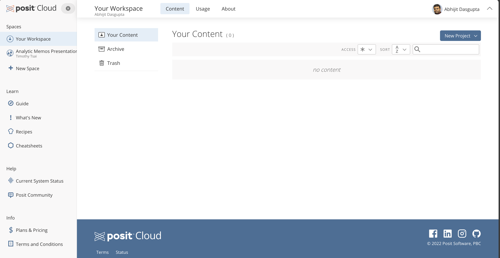
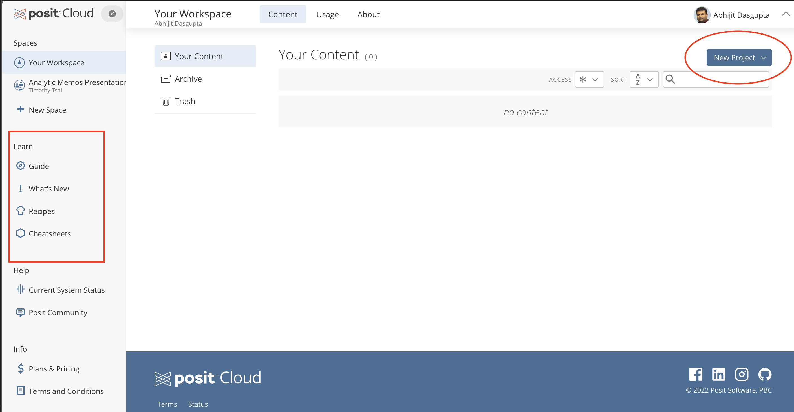

The primary software we will use for class is [](https://www.r-project.org). This is an industry-standard statistical analysis platform with a very large supportive ecosystem of packages for particuar analytic purposes.

## Accessing R

### Using R in the browser

The no-installation method to using R and RStudio is to get an account on [Posit Cloud](https://posit.cloud), which will enable you to use R in your web browser. You can get a free account, which should generally suffice for learning . Once you login, you should see something like this:

The two things you want to pay attention to here are highlighted below:

We will organize ourselves in RStudio **Projects**. This is a generally good practice for dealing with data science projects, and we'll discuss this in class

On the left you have access to several learning guides for self-learning .

### Using R on your laptop

We are going to use  through the Integrated Development Environment (IDE) called [RStudio](https://posit.co/download/rstudio-desktop/). Note that  and RStudio are **two different things.** You need to install  first, and then install RStudio.

::: aside
You can use other IDEs like Positron or Visual Studio, or even a plain text editing software, but for this class, we will use RStudio
:::

#### Install R

1.  Go to <https://cran.r-project.org>

2.  At the very top, follow the link to download and install  for your operating system

    i.  Note that there are two versions of  for the Mac: the *Apple Silicon* version for those with a M1, M2, M3, M4 Mac, and the *Intel* version for older Macs. Install as appropriate

#### Installing RStudio

1.  Download the appropriate version of RStudio for your operating system from <https://posit.co/download/rstudio-desktop/>

2.  Install RStudio on your computer

3.  Open RStudio

    i.  On a Windows machine you can open RStudio from the Start () menu

    ii. On a Mac, you can search for RStudio using Searchlight ( + Space)

Rstudio will pick up your current  installation and run it within RStudio.

## Other GUI-based software running 

Robert Muenchen provides a comprehensive review of GUI-based software running  [here](https://r4stats.com/articles/software-reviews/r-gui-comparison/)

### Bluesky

Bluesky is a GUI-based software that runs  as the computational engine. It allows a menu- and GUI-driven use of  that is quite nice. It also produces the  code that it is running for a particular operation, so you can both learn  and reproduce the analyses independent of Bluesky

1. Download Bluesky from [this link](https://www.blueskystatistics.com/support). You will need to create an account
2. Follow the installation instructions found [here](https://www.blueskystatistics.com/latest-install-readme). Special note for Mac users, you will need to install [Xquartz](https://www.xquartz.org/) in order for Bluesky to work. 

### ExploratoryIO

[ExploratoryIO](https://exploratory.io/) is an online statistical platform also using  as the computational engine. It has quite a nice UI. The free version has you [download](https://exploratory.io/download) an app that will work on your desktop but only when you're online. 

### jamovi

[jamovi](https://www.jamovi.org/) is another free GUI-based statistical analysis platform that uses  as the computational engine. Much like Bluesky, you can also get the  code that is used for particular analyses. You can download jamovi [here](https://www.jamovi.org/download.html) or run it [in your browser](https://cloud.jamovi.org/) without downloads or installation.

### JASP

We will occasionally use [JASP](https://jasp-stats.org/) for menu-driven graphs and analyses. JASP runs  in the background as its engine, and so the outputs generally will be quite compatible with what we'll do in .

1.  Download JASP from <https://jasp-stats.org/download/> and install the appropriate version to your computer
