# Challenges of visualizing Big Data

```{r}
#| label: mysetup1
#| include: false
library(pacman)
library(tidyverse)
library(plotly)
library(rasterly)
library(here)
library(fs)
library(patchwork)

currdir <- here::here("slides/topics/big-data-challenges")
```

## Challenges

- You're dealing with millions, or even billions, of observations
- You're looking for patterns in a **HUGE** cloud of data

:::{.fragment}
### Primary issues

1. **Computational speed:** plotting large data sets results in very slow
rendering and will likely crash/freeze the rendering from your plotting library
2. **Image quality:** Rendering, interactivity, overplotting, undersaturation, etc.
:::

## Challenges

**The primary challenge is computation**

  - You have to map every point to a location on your canvas
  - Depending on the visual encoding you want, this may be difficult
      - Compute inter-relationships and then figure out a way to place every point in a part of a network
      - Map each point to a latitude-longitude  and then incorporate particular projections to make sure the map is proportionate and accurate
      - Even a scatter plot will require mapping millions of points to a coordinate system

. . .

  - On top of this coordinate system issue, you can certainly have more visual encodings to
    map, including shape and color of the marks, or computing summarising lines (like loess or regression lines)


## Challenges

**A simple experiment:** Draw a scatter plot

::: {.columns}
::: {.column width="47%"}
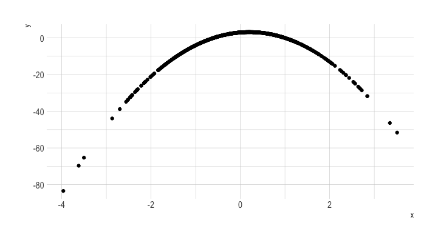</img>

Increase N from 10 to 100,000,000 (100 Million)

:::
::: {.column width="47%"}
:::{.fragment fragment-index=1}
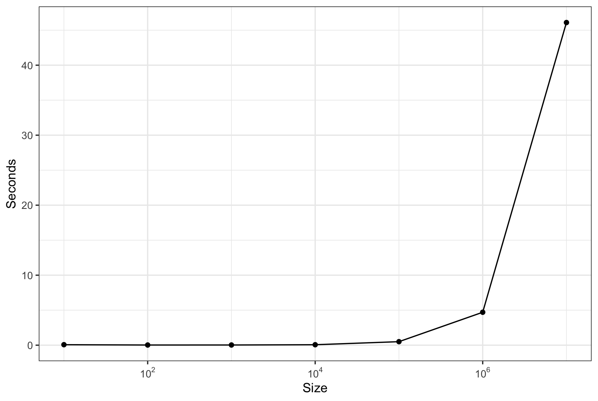</img>
:::

::: {.aside}
::: {.fragment fragment-index=3}
**Update:**
The 100 Million case crashed on my Macbook Pro 2024 (M3 Pro) with 36GB memory 
:::
:::
:::
:::
:::{.fragment fragment-index=2}
This is sort of the simplest challenge you could do.

With more complexity (like maps or networks),
things fall apart **much faster**
:::

## Another simple experiment

Timing summary: Trying to plotting sine curves with different N ($2^k$, k=1,...,26)

```{python}
#| code-fold: true
#| echo: true
import matplotlib.pyplot as plt
import numpy as np
import time
N_i=[]; T_i=[]
for i in range(1,26):
  N=2**i
  # Data for plotting
  t = np.linspace(0.0, 2*np.pi, N)
  s = np.sin(2 * np.pi * t)
  #START TIME
  to = time.process_time()
  fig, ax = plt.subplots()
  ax.plot(t, s,'-o')
  ax.set(xlabel='time (s)', ylabel='sin(x)')
  ax.grid()
  fig.savefig("img/test.png")
  # plt.show()
  #REPORT TIME NEEDED TO PLOT
  tf=time.process_time() - to
  #print(i,N,np.round(tf,2))
  N_i.append(N); T_i.append(tf)
  #ONLY SHOW NEXT PLOT
  plt.close("all") #this is the line to be added
#PLOT N VS TIME
fig, ax = plt.subplots()
ax.plot(N_i, T_i,'-o')
ax.set(xlabel='Number of points', ylabel='Time (s)')
ax.grid()
plt.show()

```


## Some voodoo (or so it might appear)

:::: {.columns}
::: {.column width="47%"}
```{r}
#| fig.width: 5
#| fig.asp: 1/1.618
#| eval: false

x <- rnorm(1e8) # 100 Million
y <- 3 + 2 * x - 5 * (x^2)
d <- data.frame("x" = x, "y" = y)
start <- Sys.time()
p <- d %>%
  rasterly(mapping = aes(x, y)) %>%
  rasterly_points()
p
times <- (Sys.time() - start)
```

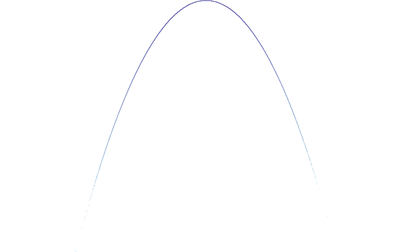
```{r}
#| echo: false
#| eval: false

```

:::
::: {.column width="47%"}
This takes only 3.38 seconds!!!

Note we don't have axes or the like, but we'll fix that in a bit.

We'll also be able to create interactive visualization using this voodoo
:::
::::

## Let's see some more!


```{r}
#| include: false
library(fst)
library(readr)
library(glue)
if (!file.exists(file.path(currdir, "rides.fst"))) {
  bl <- list()
  url_format <- "https://github.com/tuanthng/datasets-1/blob/master/uber-rides-data{i}.csv?raw=true"
  for (i in 1:3) {
    bl[[i]] <- read_csv(glue(url_format))
  }
  d <- bind_rows(bl)
  write_fst(d, file.path(currdir, "rides.fst"))
}
```

```{r}
library(fst)
rides <- read.fst(file.path(currdir, "rides.fst"))
```

This is a data set of Uber trips in New York City between April and September, 2014 ([Source](https://www.kaggle.com/fivethirtyeight/uber-pickups-in-new-york-city/))

This data has `r prettyNum(nrow(rides), big.mark=',', scientific=F)` rows and `r ncol(rides)` columns

```{r}
#| label: uber1
#| output-location: column
p <- rides %>%
  rasterly(mapping = aes(x = Lon, y = Lat)) %>%
  rasterly_points()
p
```


This takes **0.26 seconds**

##

This voodoo creates a compressed representation of the data (details coming up), but doesn't
actually display the data it generates. We can use **ggplot2**, if we like.

```{r}
#| output-location: slide
#| code-fold: false
rides <- rides |>
  mutate(hour = lubridate::hour(`Date/Time`))
ggRasterly(
  data = rides,
  mapping = aes(x = Lat, y = Lon, color = hour),
  color = hourColors_map
) +
  labs(
    title = "New York Uber",
    subtitle = "Apr to Sept, 2014",
    caption = "Data from https://raw.githubusercontent.com/plotly/datasets/master"
  ) +
  hrbrthemes::theme_ipsum()
```

## We can make this interactive!!!

::: {.columns}
::: {.column width="47%"}
```{r}
#| eval: false
#| code-fold: false

plot_ly(rides, x = ~Lon, y = ~Lat) |>
  add_rasterly_heatmap()
```

What are the colors representing?

The represent the frequency of rides (on a log scale)
:::
::: {.column width="47%"}
```{r}
#| eval: true
#| echo: false
knitr::include_url("img/uber2.html")
```

:::
:::

. . .

### Zoom in

::: {.notes}
The main point here is to see that this image is actually made up of tiny rectangles.
The pixel-level detail is evident.

This points to rasterization, which is reducing data into a matrix of cells or pixels
arranged in a grid-like fashion where each pixel represents a value in the source data

:::

# Introducing a Python toolset: HoloViz

## HoloViz


</img>

**HoloViz** is a set of Python packages that makes data visualization easier, more accurate and more powerful

- **Panel** for making apps and dashboards
- **hvPlot** to quickly generate interactive plots from data
- **HoloViews** to help make all your data easily visualizable
  + leverages **matplotlib**, **bokeh** and **plotly**
- **GeoViews** extends HoloViews to geographic data
- **Datashader** for rendering even the largest datasets
- **Lumen** for building data-driven dashboards from YAML specifications
- **Param** to create delarative user-configurable objects
- **Colorcet** for perceptually uniform colormaps

## hvPlot {.smaller}

</img>

### Allowed inputs

- **Pandas:** DataFrrame, Series (columnar/tidy data)
- **Rapids cuDF:** GPU DataFrame, Series
- **Dask:** Distributed DataFrame and Series
- **XArray:** Dataset, DataArray (labelled multi-dimensional array)
- **Streamz:** DataFrame, Series (streaming columnar data)
- **Intake:** Data Source (data catalogues)
- **GeoPandas:** GeoDataFrame (geometry data)
- **NetworkX:** Graph/Network data.

# Issues with visualizing large data

## Common pitfalls made worse by large data

1. Overplotting
1. Oversaturation
1. Undersampling
1. Undersaturation
1. Underutilized range
1. Nonuniform colormapping

## Overplotting

Let's look at an example

```{r overplot}
#| eval: true
#| output-location: slide
#| code-fold: false
n <- 300
offset <- 0.5
d <- data.frame(
  x = c(rnorm(n, mean = offset), rnorm(n, mean = -offset)),
  y = c(rnorm(n, mean = offset), rnorm(n, mean = -offset)),
  z = rep(c(1, -1), c(n, n))
)
theme_set(hrbrthemes::theme_ipsum())
a <- ggplot(d[d$z == 1, ], aes(x, y)) +
  geom_point(color = "blue")
b <- ggplot(d[d$z == -1, ], aes(x, y)) +
  geom_point(color = "red")
e <- ggplot() +
  geom_point(data = d[d$z == 1, ], aes(x, y), color = "blue") +
  geom_point(data = d[d$z == -1, ], aes(x, y), color = "red")
f <- ggplot() +
  geom_point(data = d[d$z == -1, ], aes(x, y), color = "red") +
  geom_point(data = d[d$z == 1, ], aes(x, y), color = "blue")
cowplot::plot_grid(a, b, e, f, labels = c("A", "B", "C", "D"))
# ggsave('img/overplot1.png')
```

::: {.notes}
Though plots C and D have the same distribution of points, overlaying them
provides very different visual signals of which group is the dominant
group. Neither C nor D gives the accurate picture

:::

## Overplotting

This is a common issue when you have many points/curves/densities to plot.

You're overlaying one data point on top of the other, and so you're hiding data.

Another common example:


```{r}
#| label: density
#| output-location: column
#| code-fold: false
n <- 5000
d2 <- data.frame(x = rnorm(n), y = rnorm(n))
ggplot(d2, aes(x, y)) +
  geom_point()
```

There is a greater mass of points towards the center, but all you see
is one relatively uniform blob, because of overplotting


## A solution to overplotting: Transparency

You can play with the transparency or opacity of your plot to somewhat reduce
the problems created with overplotting

```{r}
#| label: density2
#| output-location: column
#| code-fold: false
ggplot(d2, aes(x, y)) +
  geom_point(alpha = 0.1)
```

You get a better sense of where the data is, and, more importantly, **how much** there
is,


## A solution to overplotting: Transparency

```{r}
#| echo: false
#| fig-height: 2.5
e1 <- ggplot() +
  geom_point(data = d[d$z == 1, ], aes(x, y), color = "blue", alpha = 0.1) +
  geom_point(data = d[d$z == -1, ], aes(x, y), color = "red", alpha = 0.1)
f1 <- ggplot() +
  geom_point(data = d[d$z == -1, ], aes(x, y), color = "red", alpha = 0.1) +
  geom_point(data = d[d$z == 1, ], aes(x, y), color = "blue", alpha = 0.1)
cowplot::plot_grid(e1, f1, labels = c("C", "D"))
```

::: {.notes}
This gives a better sense of the relative prevalence of the blue and the red

There are other problems, though

:::


## Transparency

There are still problems:

- If `alpha = 0.1`, then 10 overlayed points will lead to full saturation, again making it harder to see individual points
    - Only the last 10 points plotted over each other influences the color (for `alpha = 0.1`)
- A good `alpha` setting is conditional on the data; even small changes in the data can lead to oversaturation in regions at
particular `alpha` levels

So,even for a small dataset, these issues come to the fore.


## Sampling (and undersampling)

```{python}
#| echo: false
#| warning: false
#| message: false
#| eval: false

import numpy as np
np.random.seed(42)

import holoviews as hv
from holoviews.operation.datashader import datashade
from holoviews import opts, dim
hv.extension('matplotlib')

from colorcet import fire
datashade.cmap=fire[50:]

def gaussians(specs=[(1.5,0,1.0),(-1.5,0,1.0)],num=100):
    """
    A concatenated list of points taken from 2D Gaussian distributions.
    Each distribution is specified as a tuple (x,y,s), where x,y is the mean
    and s is the standard deviation.  Defaults to two horizontally
    offset unit-mean Gaussians.
    """
    np.random.seed(1)
    dists = [(np.random.normal(x,s,num), np.random.normal(y,s,num)) for x,y,s in specs]
    return np.hstack([d[0] for d in dists]), np.hstack([d[1] for d in dists])

points = (hv.Points(gaussians(num=600),   label="600 points",   group="Small dots") +
          hv.Points(gaussians(num=60000), label="60000 points", group="Small dots") +
          hv.Points(gaussians(num=600),   label="600 points",   group="Tiny dots")  +
          hv.Points(gaussians(num=60000), label="60000 points", group="Tiny dots"))
points.opts(
    opts.Points('Small_dots', s=1, alpha=1),
    opts.Points('Tiny_dots', s=0.1, alpha=0.1))

hv.save(points, 'img/gaussians.png', fmt='png')

```

Another strategy with large data is to **sample** the data and visualize a representative
subset.

You can also make the actual points smaller so that there is less chance of overlap.

Both strategies work **sometimes**

```{r}
#| echo: false
#| out-width: "100%"
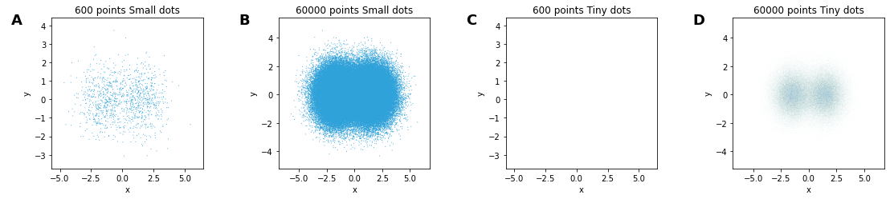
```

- The "small dots" setting (size = 0.1, alpha = 1) has serious overplotting with 60K points
- The "tiny dots" setting (size 0.01, alpha = 0.1) makes the 600 points disappear

::: {.notes}

- as panel **A** shows, the shape of an undersampled distribution can be very difficult or impossible to make out, leading to incorrect conclusions about the distribution.
-  examining sparsely populated regions of the space, which will approximate panel **A** for some plot settings and panel **C** for others.

:::

## Remember this one?

:::: {.columns}
::: {.column width="50%"}

```{r}
#| eval: true
#| echo: false
knitr::include_url("img/uber2.html")
```

:::
::: {.column width="49%"}

When we zoom in, we see the strategy we'll explore from here on

:::
::::

# Rasterization


## Rasterization

> Derived from the German _Raster_ (Framework, schema), from the Latin _rastrum_, "scraper" -- Wikipedia

Rasterization (or rasterisation) is the task of taking an image described in a vector graphics format (shapes) and converting it into a raster image (a series of pixels, dots or lines, which, when displayed together, create the image which was represented via shapes)

. . .

We don't just rasterise typically in data visualization, but also summarise or aggregate the data.


## Resolving overplotting and undersampling: heatmaps

- These are 2D histograms visualized as heatmaps
- Provides a fixed-size grid regardless of data size
- The chosen grid determines the resolution you can see
    - Coarser heatmaps average out noise to reveal signal
    - Finer heatmaps can show more structure

```{python}
#| echo: false
#| eval: false
def heatmap(coords,bins=10,offset=0.0,transform=lambda d,m:d, label=None):
    """
    Given a set of coordinates, bins them into a 2d histogram grid
    of the specified size, and optionally transforms the counts
    and/or compresses them into a visible range starting at a
    specified offset between 0 and 1.0.
    """
    hist,xs,ys  = np.histogram2d(coords[0], coords[1], bins=bins)
    counts      = hist[:,::-1].T
    transformed = transform(counts,counts!=0)
    span        = transformed.max()-transformed.min()
    compressed  = np.where(counts!=0,offset+(1.0-offset)*transformed/span,0)
    args        = dict(label=label) if label else {}
    return hv.Image(compressed,bounds=(xs[-1],ys[-1],xs[1],ys[1]),**args)

hv.save(hv.Layout([heatmap(gaussians(num=60000),bins) for bins in [8,20,200]]), 'img/heatmaps.png', fmt='png')

```

```{r}
#| echo: false
#| out-width: "100%"
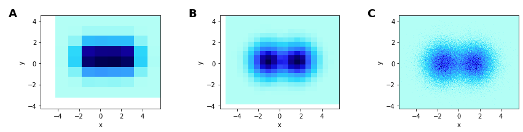
```

. . .

- **A** is too coarse
- **B** is able to show the distributions (2 circular Gaussians)
- **C** can approximate a scatter plot

::: {.notes}

The idea is to look at different grid resolutions to see which resolution gives the
most insight.

This is an example of the bin-summarise idea from Wickham's paper
:::

## Breaking the heatmap: undersaturation

Both heatmaps and alpha-based scatterplots can suffer from **undersaturation**


```{python}
#| eval: false
#| echo: false
dist = gaussians(specs=[(2,2,0.03), (2,-2,0.1), (-2,-2,0.5), (-2,2,1.0), (0,0,3)],num=10000)
hv.save(hv.Points(dist) + hv.Points(dist).opts(s=0.03) + hv.Points(dist).opts(s=0.01, alpha=0.3),'img/undersat.png', fmt='png')
```
```{r}
#| echo: false
#| out-width: "100%"
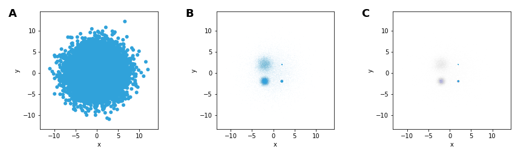
```

Plotting a composite of 5 Gaussian distributions (n = 10K, each) with different centers and spreads

- In **A**, the large spread of one dominates
- In **B** and **C**, we can start seeing the structure
    - **B** has the medium spread Gaussian dominate, despite identical sample sizes
    - **C** makes the grid size smaller & adds transparency, making the large spread Gaussian disappear (undersaturation)

## Breaking the heatmap: undersaturation

Using heatmaps isn't much help.

```{python}
#| echo: false
#| eval: false
hv.save(hv.Layout([heatmap(dist,bins) for bins in [8,20,100]]), 'img/undersat-hm.png', fmt='png')
```
```{r}
#| echo: false
#| out-width: "100%"
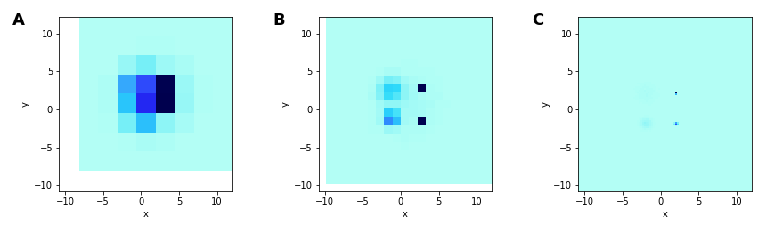
```

- Narrow-spread distributions lead to pixels with very high count, which now dominates
- Wide-spread distribution disappear

## Breaking the heatmap: undersaturation

A possible solution: Add an offset, so that all points are represented and distinguished from background

```{python}
#| eval: false
#| echo: false
hv.save(hv.Layout([heatmap(dist,bins,offset=0.2) for bins in [8,20,100]]).cols(4),'img/undersat-offset.png', fmt='png')
```
```{r}
#| echo: false
#| out-width: "100%"
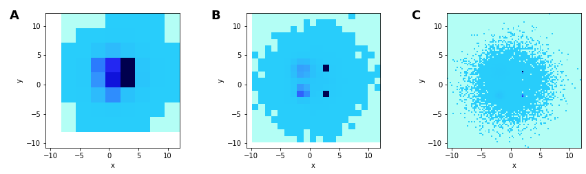
```

::: {.notes}
This is an example of how going too fine or light can make structure disappear,
and actually reduce insight
:::

## Not using the full range

The distribution of the counts is strongly skew, with some points having very large
values. When this is converted to a color- or gray-scale, the entire range
is not fully utilized.

One way to deal with this is to make the distribution less skew. One way of doing this
is using a log-transform (among many other choices)

```{r}
#| echo: false
#| out-height: "300px"
theme_set(hrbrthemes::theme_ipsum())
x <- rgamma(5000, 0.5)
plt1 <- qplot(x, geometry = "density") + ylim(0, 2000) + theme(axis.text.x = element_blank())
plt2 <- qplot(x, geometry = "density") + scale_x_log10("Log-transformed") + ylim(0, 2000) + theme(axis.text.x = element_blank())
cowplot::plot_grid(plt1, plt2, labels = c("A", "B"))
```

## Not using the full range

```{python}
#| echo: false
#| eval: false
hv.save(
  hv.Layout([heatmap(dist,bins,offset=0.2,transform=lambda d,m: np.where(m,np.log1p(d),0)) for bins in [8,20,100]]),
  'img/undersat-log.png', fmt='png')
```
```{r}
#| echo: false
#| out-width: "100%"
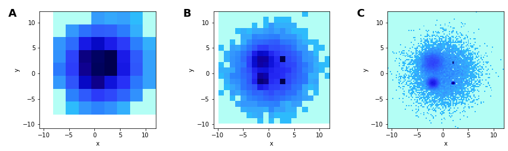
```

We can now see the structure of all 5 Gaussians, in **B** and **C**, and relative spreads in **C**.


## Further improvements: histogram equalization

Instead of binning and determining colors based on the actual value, one can
select the color based on percentile of the counts. If you have 100 gray values, you map the lowest 1%
of the data values to the first color, and the largest 1% of the data to the last color, and so on

This then creates a rank-order plot, preserving the **order** but not the *magnitudes* of the counts

```{python}
#| echo: false
#| eval: false
try:
    from skimage.exposure import equalize_hist
    eq_hist = lambda d,m: equalize_hist(1000*d,nbins=100000,mask=m)
except ImportError:
    eq_hist = lambda d,m: d
    print("scikit-image not installed; skipping histogram equalization")

hv.save(hv.Layout([heatmap(dist,bins,transform=eq_hist) for bins in [8,20,100]]), 'img/undersat-hist.png', fmt='png')
```

Now things **pop**

Note that you can't reconstruct the original data from this anymore.

```{r}
#| echo: false
#| out-width: "100%"
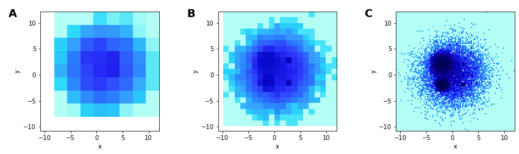
```


## One more piece: colormaps

One problem with many colormaps is that they are perceptually non-uniform, so that
you can't visually distinguish colors over a large range of values. A prototypical example
is the _jet_ colormap, once the default in matplotlib and Matlab.

```{python}
#| echo: false
#| eval: false
hv.save(
  hv.Layout([heatmap(dist,100,transform=eq_hist,label=cmap).opts(cmap=cmap) for cmap in ["hot","fire"]]).cols(2),
  'img/colormaps.png', fmt='png')
```


```{r}
#| echo: false
#| out-width: "100%"
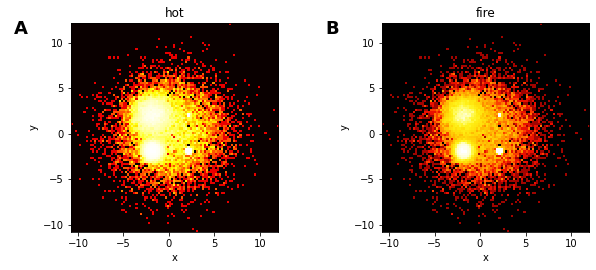
```

The figure **B** allows more detail to be shown, than in the **A** figure, which uses a non-uniform colormap.

There are several perceptually uniform colormaps available

- viridis and friends in R and Python
- the Python **colorcet** package and the R **cetcolor** package

::: {.notes}
We should see structure, since this is based on the previously equalized data.
:::

# Summarizing the pitfalls

##

```{python}
#| echo: false
#| eval: false
layout = (hv.Points(dist,label="1. Overplotting") +
          hv.Points(dist,label="2. Oversaturation").opts(s=0.1,alpha=0.5) +
          hv.Points((dist[0][::200],dist[1][::200]),label="3. Undersampling").opts(s=2,alpha=0.5) +
          hv.Points(dist,label="4. Undersaturation").opts(s=0.01,alpha=0.05) +
          heatmap(dist,200,offset=0.2,label="5. Underutilized dynamic range") +
          heatmap(dist,200,transform=eq_hist,label="6. Nonuniform colormapping").opts(cmap="hot"))

hv.save(layout.opts(
    opts.Points(axiswise=False),
    opts.Layout(sublabel_format="", tight=True)).cols(3),
    'img/pitfalls.png', fmt='png')
```

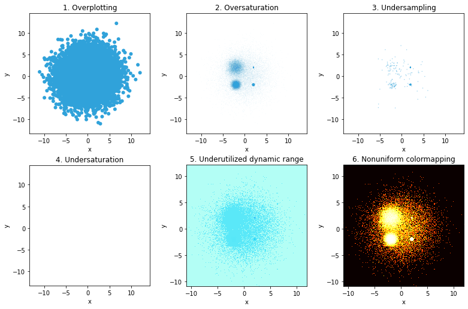</img>


# datashader

## Introduction

Datashader is a Python package for analyzing and visualizing large datasets

:::: {.columns}
::: {.column width="47%"}
- The basic strategy is to use the bin-summarize paradigm to _rasterize_ or _aggregate_ datasets into regular grids
- These grids are essentially a data reduction/compression method, reducing millions of points into a 400x400 grid, say
- Some good default choices to avoid the pitfalls described earlier allows visual analysis of large data sets **quickly**
- **datashader** produces an **image**, that can then be embedded within other plotting tools like **matplotlib**, **plotly**, and **bokeh**
:::
::: {.column width="47%"}
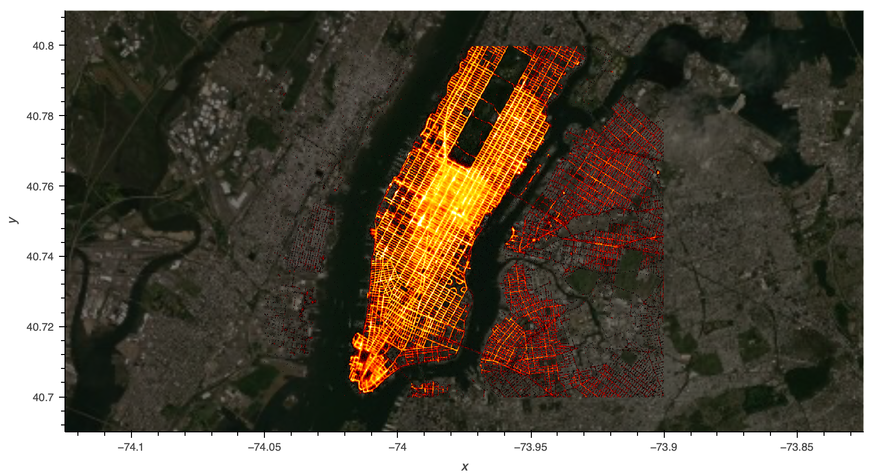</img>

Taxi trips in New York City, 2014. 12 million pickup/dropoff locations with passenger counts
:::
::::


## Introduction


**datashader** basically runs an analytic pipeline to transform data into a rasterized image.

The ultimate deliverable for the **datashader** package is the **image**, which
can then be plotted by embedding it into a plotting system.

We will also look at **rasterly**, which essentially does the same thing in the R ecosystem

## Example: Flight delays (Kaggle)


This dataset comprises 5.8 million rows

```{python}
#| code-fold: false
#| label: read-flights
#| eval: false
import plotly.express as px
import pandas as pd
import numpy as np
import datashader as ds
from pyhere import here
#df = pd.read_parquet('https://github.com/plotly/datasets/raw/refs/heads/master/2015_flights.parquet')
df = pd.read_parquet(here('slides','topics','big-data-challenges','data/2015_flights.parquet'))
df.shape
```

## Example: Flight delays (Kaggle)

Interest is in whether whether departure delays are dependent on when flights are scheduled to leave.

```{python}
#| eval: false
df_sub = df[::200] # take 200th row, so 29K rows
fig = px.scatter(data_frame = df_sub, x = "SCHEDULED_DEPARTURE", y = "DEPARTURE_DELAY")
fig.show()
```
```{r}
#| echo: false
knitr::include_url("img/corr1.html")
```

::: {.notes}
This is already pretty muddy with only 0.5% of the points
:::

## Example: Flight delays (Kaggle)

```{python}
#| eval: false
#| code-fold: false
import datashader as ds

cvs = ds.Canvas(plot_width=100, plot_height=100)
agg = cvs.points(df, 'SCHEDULED_DEPARTURE', 'DEPARTURE_DELAY')
zero_mask = agg.values == 0
agg.values = np.log10(agg.values, where=np.logical_not(zero_mask))
agg.values[zero_mask] = np.nan
```

This is the basic **datashader** process

- Create a canvas (which will define the grid)
- Aggregate within each pixel (default is `count()`, but others possible)
- If a pixel has 0 counts (or no data), make it a missing value (`np.nan`) and mask it

Optionally, we have also

- log-transformed the counts so that we make better use of the dynamic range of values

::: {.callout-note appearance="simple" icon=true}
There are other aggregates that you can plot using datashader. Several examples are provided [here](https://datashader.org/user_guide/Inspection_Reductions.html){target=_blank}, including maximum and minimum values for data represented in each pixel.
:::
## Example: Flight delays (Kaggle)


```{python}
#| eval: false
fig = px.imshow(agg, origin='lower', labels={'color':'Log10(count)'})
fig.show()
```

```{r}
#| echo: false
knitr::include_url("img/corr.html")
```


All **datashader** is enabling is reducing this large dataset into an aggregated
dataset over a smaller, manageable grid of points, which is stored as a matrix (technically an `xarray`)

This matrix is then rendered as an image

## Example: Flight delays (Kaggle)


```{python}
#| eval: false
#| code-fold: false
fig.update_traces(hoverongaps=False)
fig.update_layout(coloraxis_colorbar=dict(title='Count', tickprefix='1.e'))
fig.show()
```

This is now **plotly** magic that adds a legend and spiffies things up

```{r}
#| echo: false
knitr::include_url("img/corr1-ds.html")
```


# rasterly


## rasterly


**rasterly** does for R what **datashader** does for Python.

(well, not exactly, but it's aspirational)

Let's look at the same Kaggle flights data

## rasterly

```{r}
#| code-fold: false
pacman::p_load(tidyverse, arrow, rasterly)
df <- read_parquet(here::here("slides/topics/big-data-challenges/data/2015_flights.parquet")) %>%
  janitor::clean_names() %>%
  filter(complete.cases(.))
dim(df)
```

## rasterly

We will first make a static visualization using **ggplot2**

```{r, out.height=350, fig.asp=1/1.618}
theme_set(hrbrthemes::theme_ipsum())
ggplot(
  df %>% filter(row_number() %% 200 == 1),
  aes(x = scheduled_departure, y = departure_delay)
) +
  geom_point()
```

::: {.notes}
Note that we're taking 1 in 200 rows so that ggplot doesn't crash
:::

## rasterly

We will now put **rasterly** to use

```{r}
#| eval: false
#| code-fold: false
ggRasterly(df, aes(x = scheduled_departure, y = departure_delay),
  color = viridis_map
)
```

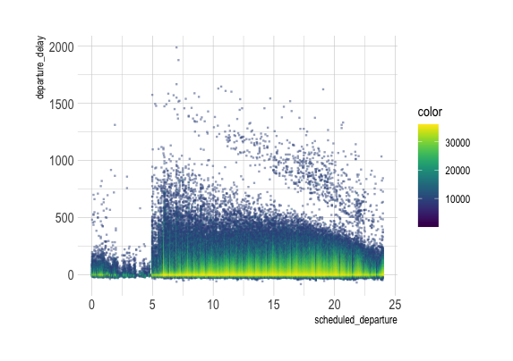</img>

## rasterly

We can also make it interactive using **plotly**

```{r}
#| eval: false
#| code-fold: false
plt <- plotRasterly(df,
  aes(
    x = scheduled_departure,
    y = departure_delay
  ),
  color = viridis_map
)
```

```{r}
#| echo: false
knitr::include_url("img/rasterly2.html")
```
