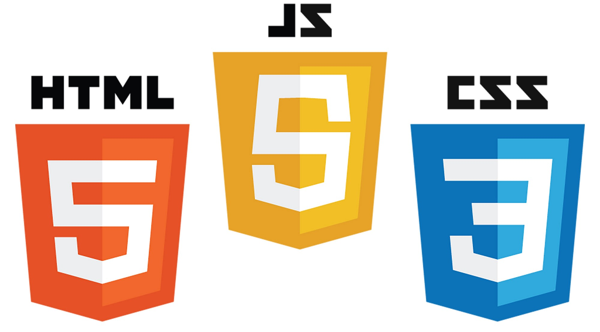

# A change of canvas {background-color="#131516"}

## The web page, mouse clicks, swipes and movement

The internet, digital paper, mobile phones have completely transformed how we consume information in the last 30 years.

:::: {.columns}
::: {.column width="60%"}
### Traditional media
* Journals, Magazines, academic articles, Billboards
* Inherently **passive** consumption of static content
:::
::: {.column width="40%"}
{width=300}
:::
::::

:::: {.columns}
::: {.column width="70%"}
### Modern media
* web pages, videos digital paper, electronic billboards
* Inherently **active** consumption of content with increased user engagement
* Allows for data updates, modifications, interaction, animation, real-time visualization
* Allows personalized, customizable data-driven visualization
:::
::: {.column width="30%"}
{width=400}
:::
::::

##


:::: {.bg-washed-blue .b--dark-blue .ba .bw2 .br3 .ph4 .mt4 .shadow-5 .f1}
Overview first, zoom & filter, then details on demand

::: {.tr .f2 }
-- Ben Schneiderman, 1996
:::
::::

##

:::: {.f3 .ba .bw3 .br4 .mt3 .ph3  .dark-blue}
Interactive graphics allows you to add dimensions to your graph, while keeping the information organized and
accessible
::::

::: {.f4}
Of course you can still implement all the graphical principles we've already learned
for making good visual encodings of data
:::

:::: {.columns}
::: {.column width="50%"}
+ Colors
+ Shapes/markers
+ Ink ratio
+ Size

:::
::: {.column width="50%" .blue}
+ Tooltips
+ On/off mechanisms
+ Panels (of time, for example)
+ Facets
+ Control mechanisms (buttons, menus, sliders)
:::
::::

## Kinds of interactions

:::: {.ba .bg-washed-blue .b--dark-blue .bw2 .pa2 .w-60}
1. Scroll and pan
1. Zoom
1. Open and close
1. Sort and re-arrange
1. Search and filter

::: {.tr}
*Jennifer Tidwell*
:::
::::

::: {.fragment}
One can also consider increasing dimensions through interaction

+ Time
+ Location
+ Meta-data
:::

##

::: {.small}
This treemap is created using `plotly`, one of the toolkits we'll explore in this class. It is an interactive toolkit 
that has wrappers/APIs in R, Python, Julia and other programming languages. It is written in **Javascript** on top of a 
base graphical toolkit called `d3.js`. We'll explore these toolkits over the next few weeks.
:::

```{python}
#| echo: true
#| code-fold: true
#| eval: true
#| out-width: "100%"
#| out-height: "80%"
#| label: "treemap"
import plotly.express as px
import plotly.io as pio
import numpy as np
df = px.data.gapminder().query("year == 2007")
df["world"] = "world" # in order to have a single root node
fig = px.treemap(df, path=['world', 'continent', 'country'], values='pop',
                  color='lifeExp',
                  color_continuous_scale='RdBu',
                  color_continuous_midpoint=np.average(df['lifeExp'], weights=df['pop']),
                  title = 'Treemap of life expectancy in the 2007 Gapminder dataset',
                  labels = {'world':'World', 'lifeExp':'Life expectancy',
                  'gdpPercap': 'GDP ($)'}
                  )
fig.update_traces(customdata=df,hovertemplate="Life Expectancy: %{color:.1f}<br>Population: %{customdata[4]:,}<br>GDP($): %{customdata[5]:.0f}");
fig.update_layout(width=1000, height=650);
fig.show()
```

## Where do we see the advantages?

- Being able to look at complex data in a targeted manner
- Being able to contextualize complex data
- Being able to clearly see patterns over time or over geographies
- Being able to look at the full data while concentrating on a part

# Toolsets {background-color="#131516"}

## Web technologies to the fore

::: {.tc}

:::

##

::: {.columns .pt5}
::: {.column width="33%" .br .b--light-blue .ph3}
### **HTML** {.tc}

The markup language used to **structure** web content, e.g.  paragraphs, headings, and data tables, or embedding images and videos in the page.
:::
::: {.column width="33%" .br .b--light-blue .ph3 }
### **CSS** {.tc}

The language of style rules for **customizing** our HTML content, e.g. setting background colors, fonts, and laying content.
:::
::: {.column width="34%" .ph3 }
### **Javascript** {.tc}

The scripting language that enables **programmatic modification** of content, control multimedia, animate images, and pretty much everything else.
:::
::::

::::: {.fragment}
<hr/>

:::: {.columns}

::: {.column width="47%"}
**Static content (no interactivity)**

- HTML + CSS: Formatting and theming, but no user feedback or updating
:::

::: {.column width="47%"}
**Dynamic content (interactivity)**

- Javascript (JS) allows the browser to _programmatically_ update the HTML content
:::

::::
:::::


::: {.aside}
Source: <https://developer.mozilla.org/en-US/docs/Learn/JavaScript/First_steps/What_is_JavaScript>
:::

## Javascript

- HTML can be dynamically and programmatically updated based on its Document Object Model (DOM)
- Javascript (JS) can programmatically modify different components of the document
    - create/add
    - remove/delete
    - modify the content (HTML) or theme/look (CSS)
- JS runs after the webpage is loaded and facilitates interactivity
- Almost all the advanced visualization libraries we'll describe in this class are JS libraries, that create dynamic data visualizations in the web browser

# A quick word about the HTML DOM

## The DOM

::: {.ba .pa3}
The Document Object Model (DOM) is the programming interface (API) to represent and interact with an HTML (or XML) document.
:::


:::: {.columns}
::: {.column width="50%"}
- The fundamental building block of HTML is the _element_
    - This is defined by a start tag, some content, and an end tag
    - It is a form of text markup that can be translated into visual elements by the web browser
:::
::: {.column width="50%"}
::: {.center .pt5 .pb3 .f2}

```
<p class="foo"> This is a paragraph </p>
```
:::


- `<p` is the _start tag_
- `class="foo"` is an example of an _attribute: value_ pair
- `</p>` is the _end tag_
- Anything between the start and end tags is the _content_
:::
::::

## The DOM

::: aside
Source: <https://cs.wellesley.edu/~cs110/lectures/L11/dom.html>
:::

The DOM represents the HTML document as a **tree of nodes**, where each node represents a part of the _structure_ and _content_ of the document

:::: {.columns}

::: {.column width="47%"}
```
<!doctype html>
<html lang="en">
<head>
  <title>My blog</title>
  <meta charset="utf-8">
  <script src="blog.js"></script>
</head>
<body>
  <h1>My blog</h1>
  <div id="entry1">
    <h2>Great day bird watching</h2>
    <p>
      Today I saw three ducks!
      I named them
      Huey, Louie, and Dewey.
    </p>
    <p>
      I took a couple of photos ...
    </p>
  </div>
</body>
</html>
```
:::

::: {.column width="47%"}

:::
::::

## The DOM

::: aside
**Source:** [What is the HTML DOM?](https://www.w3schools.com/whatis/whatis_htmldom.asp)
:::

The DOM serves as the **API (Programming Interface)** for **Javascript**

- JavaScript can add/change/remove HTML elements
- JavaScript can add/change/remove HTML attributes
- JavaScript can add/change/remove CSS styles
- JavaScript can react to HTML events (like mouse clicks, mouse-overs, etc)
- JavaScript can add/change/remove HTML events

## The DOM {.smaller}


::: {.aside}
**Source:** [JavaScript HTML DOM Document](https://www.w3schools.com/js/js_htmldom_document.asp){target=_blank}
:::

### In Javascript, you can

<table style="width: 100%">
<tr>
    <td style="width: 30%">Finding HTML elements by id </td>
    <td>`document.getElementByID("intro")` finds elements with `id="intro"`
</tr>
<tr>
<td>Finding HTML elements by tag name</td><td>`document.getElementsByTagName("p")` returns a list of all  `<p>` elements</td>
</tr>
<tr>
<td>Finding HTML elements by class name</td><td>`document.getElementsByClassName("intro")` returns a list of all elements with `class="intro"`</td>
</tr>
<tr>
<td>Finding HTML elements by CSS selectors</td><td>`document.querySelectorAll("p.intro")` returns a list of  all `<p>` elements with `class="intro"`</td>
</tr>
</table>

### Javascript can then manipulate these elements {.pt4}

:::: {.columns}

::: {.column width="47%"}
#### Change elements

- `element.innerHTML`= _new content_
- `element.attribute` = _new value_
- `element.style.property` = _new style_
- `element.setAttribute`(_attribute_,_value_)
:::

::: {.column width="47%"}
#### Add and delete elements

- `document.createElement(element)`
- `document.removeChild(element)`
- `document.appendChild(element)`
- `document.replaceChild(new, old)`
:::

::::

## The DOM

::: {.panel-tabset}
## HTML Elements


## HTML Attributes


## CSS styles

CSS (Cascading style sheets) represents a very rich language to style HTML elements. This language can provide very granular control over how each element in a page is displayed.

Javascript can manipulate the CSS specification of HTML elements, so inputs provided on a web page can change how elements look.

A couple of rich resources that can act as examples and reference for CSS are

- [W3 Schools CSS Tutorial](https://www.w3schools.com/css/default.asp)
- [CSS Zen Garden](https://csszengarden.com)


:::

# An Opinionated Introduction to JavaScript
Enough to be dangerous

## JavaScript is the programming language of the Web

- One of the most popular and in-demand programming languages
- Primary use by _web developers_ to develop web servers and applications
    - JS is **native** to every modern web browser
        - which means every computer has it available and it can be used with _no special installation requirements_
    - JS can also run outside the browser using [Node.js](https://www.nodejs.org), a JavaScript runtime environment based on Google Chrome
- For **data scientists**, JavaScript provides a powerful computer language for _interactive data visualizations_ as well as _general data science workflows_ that run in the browser
    - Practically all modern dynamic data visualization toolkits run on JavaScript
    - Toolkits for [statistical analyses](https://simple-statistics.github.io), [data munging](https://uwdata.github.io/arquero/), and [machine learning](https://www.tensorflow.org/js) exist
    - An idea: [JavaScript for Data Science](https://third-bit.com/js4ds/) by Gans, Hodges and Wilson (2020)

## JavaScript for Data Scientists

::: {.aside}
**Source:** [Machine Learning in JavaScript](https://www.w3schools.com/ai/ai_javascript.asp)
:::

There is an ever increasing case for using JavaScript for ML/AI

- JavaScript is well known. All developers can use it.
- Security is built in. JavaScript cannot access your files.
- JavaScript is faster than Python.
- JavaScript can use hardware acceleration.
- JavaScript runs in the browser
- JavaScript is easy to use, with nothing to install
- JavaScript runs on more platforms, including mobile devices

:::{.ba .b--light-blue}
[The Tensorflow.js Playground](https://playground.tensorflow.org/#activation=sigmoid&regularization=L2&batchSize=10&dataset=circle&regDataset=reg-plane&learningRate=0.03&regularizationRate=0.01&noise=0&networkShape=4,2&seed=0.87922&showTestData=false&discretize=false&percTrainData=50&x=true&y=true&xTimesY=false&xSquared=false&ySquared=false&cosX=false&sinX=false&cosY=false&sinY=false&collectStats=false&problem=regression&initZero=false&hideText=false)

:::

## Using JavaScript

- We can write JavaScript directly in HTML files using the `<script></script>` element.
- We can also separate the JavaScript from the HTML by writing JavaScript functions in a file  
(call it `app.js`, for example), and then load it into our HTML file using  
`<script src="app.js"></script>`

- Much as we can separate the CSS from the HTML and load it using  
`<link rel="stylesheet" href="mystyle.css">`

## Using Javascript

- JavaScript packages (like d3.js, plotly.js, arquero.js, and others) can be loaded into a HTML file. The specification is placed within the `<head></head>` tags in the HTML
    - Load a local copy of the package
        - `<script src="plotly-2.27.0.min.js" charset="utf-8"></script>`
    - Load the package from an online _Content Delivery Network (CDN)_
        - [`<script src="https://cdn.plot.ly/plotly-202.7.0.min.js" charset="utf-8"></script>`]{.bg-light-yellow}
        - This requires that we are _actually connected_ to the Internet

:::: {.ba .bg-washed-blue .b--dark-blue .bw2 .pa2 }
This is Javascript's way of "loading" packages from online repositories. 
Since Javascript is operating in the browser, this code snippet loads the package 
on-demand whenever and wherever the web page is opened. This is one advantage of _client-side technologies_.
:::

## Using Javascript

- You can also run Javascript directly in the browser. Most browsers have a Javascript console (usually within a Developer menu)
- Javascript is pretty much like other programming languages, with variables, data structures, functions and loops. 


```{ojs}
//| echo: false
//| 
dataTypes = [
  {"Type":"Number","Description":"A numeric value","Example":5.1},
  {"Type":"Boolean","Description":"A true or false value","Example":true},
  {"Type":"String","Description":"A set of characters in single or double quotes","Example":`"hello"`},
  {"Type":"Null","Description":"A value represent the intentional absence of a value","Example":"null"},
  {"Type":"Array","Description":"A collection of elements","Example":"[1, 2, 3]"},
  {"Type":"Object","Description":"An element with key-value pairs","Example":"{weight:165, height: 66}"},
  {"Type":"Date","Description":"A special object for representing dates","Example":`new Date("2021-01-22")`}]
  
Inputs.table(dataTypes, {
  format:{
    Example:d => md`~~~js
${d}
~~~`
  }
})
```

You can assign values to variables using 2 keywords, `let` and `const`

```js
let a=5; \\ mutable variable, can be changed
const b=3.14; \\ immutable variable, cannot be changed
```
_In vanilla Javascript, you need to end statements with semi-colons_

## Using Javascript

Note that there is no DataFrame-like type in . So how do we deal with this? Rectangular data gets parsed into an Object in JSON format. There are of course two choices here.

-   Parse by columns, so the key-value pairs are the column name and the data in the column

-   Parse by rows, so data is parsed into an *Array* of objects, each object specifying 1 row, with key-value pairs being the column name and the corresponding data for that row.


::: callout-note
The default in JS is row-dominant, and many JS graphics libraries require this format.
:::

## Using Javascript

- We would like you to use JS where needed or when you are interested
- There is a laboratory where you'll dive more into Javascript.
- Fortunately, for popular JavaScript visualization packages, there are very good _wrappers_ and _ports_ to  and 
- For this class, we will also be using a _Quarto-based workflow_.
    - Recall that you can use raw HTML code and CSS within Quarto documents, as long as you render to a HTML document
    - We can also incorporate JavaScript using OJS chunks, in addition to using the `<script></script>` elements.
    - OJS chunks call [Observable.js](https://www.observablehq.com), which isn't quite vanilla Javascript.
        - Variable assignment doesn't require `let`, is the most basic difference
        - More details around relevant differences might be found [here](https://observablehq.com/@travismichaelwise/observables-not-javascript)


## Toolkits {.smaller}

:::: {.columns}

::: {.column width="33%"  .pa3}
### Static graphics

- R
    - base graphics
    - [**ggplot2**](https://ggplot2.tidyverse.org) and [extensions](https://exts.ggplot2.tidyverse.org)
- Python
    - [matplotlib](https://www.matplotlib.org)
    - [seaborn](https://seaborn.pydata.org)
    - [plotnine](https://plotnine.readthedocs.io/en/v0.12.4/)
    - [HoloViz ecosystem](https://holoviz.org)

These output to PDF, PNG, TIFF, etc.

:::

::: {.column width="33%" .br .bl .bw2 .b--light-blue .bg-lightest-blue .pa3}
### Client-side: interactive graphics

**JavaScript libraries/wrappers**
Typical output: HTML+CSS+JS

- [D3.js](https://d3js.org)

and derivatives:

- [Plotly](https://plotly.com)
- [Observable Plot](https://observablehq.com/plot/)
- [Vega-lite](https://vega.github.io)
- [bokeh](https://bokeh.org)

wrapped in:

- [htmlwidgets](http://www.htmlwidgets.org) in 
- **plotly** in  and 
- Vega-lite in **altair** (  and ) and [vegabrite](https://vegawidget.github.io/vegabrite/index.html) ()
- bokeh in **bokeh** ( ) and **rbokeh** ( )

:::

::: {.column width="33%" .pa3}
### Server-side: Web apps

- Shiny ( )
- Dash ( )
- Streamlit ( )

These require a server running R/Python with appropriate packages

### Webassembly

This is actually a *client-side* infrastructure to run, among other languages, R and Python in the browser

- [webR](https://docs.r-wasm.org/webr/latest/) for 
- [shinylive](https://github.com/posit-dev/shinylive?tab=readme-ov-file) for  and 
- [Pyodide](https://pyodide.org/en/stable/?utm_source=thenewstack&utm_medium=website&utm_content=inline-mention&utm_campaign=platform) for 
:::
::::

## {background-image="img/d3.png" background-size="contain"}

## D3.js {.smaller}

D3 is a JavaScript library for visualizing data. It is a low-level language and is very granular in terms of flexibility and control.

- It was developed by Mike Bostock in 2011 as his PhD work under Jeff Heer at Stanford, and proved transformative in the field of data visualization
- It is not a charting library _per se_, in that it can create and manipulate primitive graphical elements in a SVG or WebGL canvas (that lives in a HTML document) driven by data (D3 = Data Driven Documents)

:::: {.columns}

::: {.column width="65%" .bg-lightest-blue .pa2}

To make a stacked area chart, you might use

- a CSV parser to load data,
- a time scale for horizontal position (x),
- a linear scale for vertical position (y),
- an ordinal scale and categorical scheme for color,
- a stack layout for arranging values,
- an area shape with a linear curve for generating SVG path data,
- axes for documenting the position encodings, and
- selections for creating SVG elements.

**Source:** [What is D3?](https://d3js.org/what-is-d3)

:::


::: {.column width="35%"}
- Each of these elements needs to be specified separately
- It appears to be aligned with the Grammar of Graphics model, but with more granularity
:::

::::


##

:::: {.bl .bw3 .pa3 .b--blue  .f2 .calisto}
Use D3 if you think it's perfectly normal to write a hundred lines of code for a bar chart

::: {.tr .f3}
-- Amanda Cox
:::
::::

::: {.pt6}
- "D3 is overkill for throwing together a private dashboard or a one-off analysis. Don’t get seduced by whizbang examples: many of them took an immense effort to implement!" -- <https://d3js.org/what-is-d3>
:::

:::{.aside}
We'll see more d3.js and JavaScript next week
<!-- This is true in Spring 2024 -->
:::

## Interactive visualization toolkits

+ d3.js is granular and complicated for starting out
+ Fortunately there are several alternatives built upon d3.js to make life easier for people

:::{.fragment}
[It's better to have programs that are human-readable]{.ba .br4 .f3 .b--dark-blue .bw2 .mt4 .ph4}
:::

::: fragment

### Candidates

::: {.fl .w-50}
+ Vega and [Vega-lite](https://vega.github.io/vega-lite/)
    - Interfaced in Python using [**Altair**](https://altair-viz.github.io/)
        - which is interfaced in R using [**altair**](https://vegawidget.github.io/altair/)
+ [bokeh.js](https://bokeh.org)
    - Python package
    - Interfaced in R using **rbokeh**

:::
::: {.fl .w-50}
+ [plotly.js](https://www.plotly.com)
    - Interfaces in both R (**plotly**) and Python (**plotly**)
    - Good [documentation](https://plotly.com/graphing-libraries/)
+ [highcharts.js](https://www.highcharts.com/)
    - Interfaced in R using [**highcharter**](https://jkunst.com/highcharter/)
    - Not free for commercial use
:::
:::

## Interactive visualization toolkits

+ d3.js is granular and complicated for starting out

[It's better to have programs that are human-readable]{.ba .br4 .f3 .b--dark-blue .bw2 .mt4 .ph4}

### Candidates


::: {.fl .w-100 .ba .br4 .bw3 .mt3 .ph3 .b--dark-blue}

#### [plotly.js](https://www.plotly.com)

 - Interfaces in both R (**plotly**) and Python (**plotly**)
 - Good [documentation](https://plotly.com/graphing-libraries/)
:::
