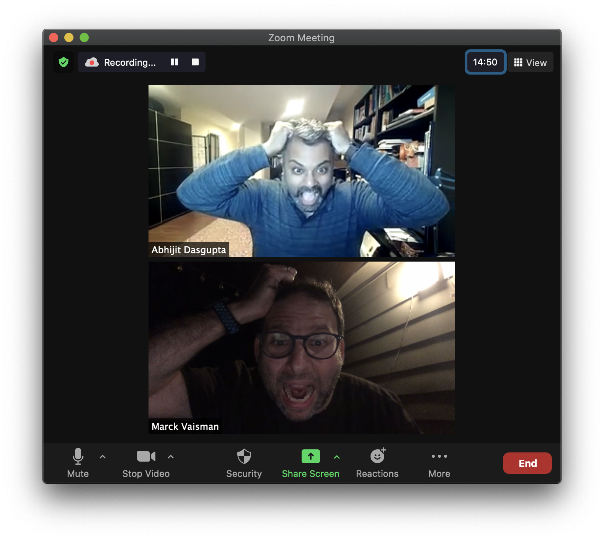

# About the Course

## Course description

- An introduction to data science
    - We will explore the principles, methods, and tools that drive modern data-driven inquiry, inference, prediction and decision-making. 
    - A strong foundation in the core elements of the field, including data wrangling, exploratory analysis, statistical modeling, machine learning, and effective data visualization. 
    - A conceptual and practical understanding of uncertainty, association and causality.
    - Using R and JASP to ingest, manipulate, visualize, infer and predict 

## Learning objectives

- Develop a foundational understanding of how to translate data into insights, inference and predictions
- Understand the central role of uncertainty and how it influences how we interpret data
- Think critically about data, including the appropriateness of study design, representativeness, and what you can really answer from a particular data set.
- Appreciate issues like bias and confounding that can affect our inferences from data
- Use high-quality data visualizations to tell your story
- Effectively use statistical software to ingest, transform, analyze, visualize and report on data in the appropriate context
- Communicate findings effectively using compelling visualizations and clear, audience-appropriate narratives.
- Collaborate on data-centric projects, developing teamwork and project management skills essential in professional data science environments.

## Software

* [](https://www.r-project.org)
  * In particular, we will make heavy use of the [tidyverse](https://www.tidyverse.org) group of packages and its philosophy
* [JASP](https://www.jasp-stat.org)
  * A -driven GUI-based teaching and analysis tool. 

## You'll think a lot and participate a lot in this course

- Readings and pre-work
- Emphasis on conceptual understanding
- In class discussion (we may cold call so you need to be ready)
- Case studies and laboratory work

# Expectations

## We have [**high**]{.dark-red} expectations and [**strong**]{.dark-red} opinions!. This is a professional, graduate level program.

* You [**must**]{.dark-red} do excellent work. This is a high quality program and you are all great learners
* You [**must**]{.dark-red} develop and use excellent analytical and critical thinking skills.
* Your spelling and grammar [**must**]{.dark-red} be accurate.
* Your discussion contributions [**must**]{.dark-red} be thoughtful, perhaps even insightful.
* All work [**must**]{.dark-red} look professional, and have requisite titles, labels, source references, annotations and other textual elements in regular English

## {background-image="https://i.giphy.com/media/v1.Y2lkPTc5MGI3NjExbGFtcjl3MjVoa2h5bGoxcnFxOWpldzZsMDhqZGtrZmt3NGY4ejhxdCZlcD12MV9pbnRlcm5hbF9naWZfYnlfaWQmY3Q9Zw/Zsx8ZwmX3ajny/giphy.gif"}

## Let's avoid this

{fig-align="center" height=550}

## Bookmark these links!

* Course website: 
* [Syllabus, especially course policies](site-page-contents/syllabus.html)
* Slack Workspace: 
* Instructors only email: [](mailto::)
* : []()

## Grades 

- Attendance: 10%
- Engagement and active learning: 20%
- Assignments: 30%
- Lab completions and quizzes: 10%
- Project: 30%

## What the heck is "engagement and active learning"?

- Participation during class, asking questions, clarifying doubts, and even answering your classmate's questions
- We will do a "Muddied waters" exercise as a discussion/survey on Canvas after every class. You have to answer 3 questions briefly:
  - What was one thing that clicked for you during class?
  - What was one thing that you're most confused about after class?
  - What is one thing that could improve your experience during class in understanding the concepts?

- We will have a shared Google Doc open during class for shared note-taking, so we can co-learn and learn from each other
- We will use Slack channels to discuss weekly readings and concepts before, during and after class. 

##  [We're gonna have an awesome time!]{.white}{background-image="https://i.giphy.com/media/v1.Y2lkPTc5MGI3NjExMXVvcDcxaXQ1dmlzcjVha2M4aGkyazMxcXRhNDN0YmEwd3Y2Y2owciZlcD12MV9pbnRlcm5hbF9naWZfYnlfaWQmY3Q9Zw/lmv5aDvwOgTmby3a13/giphy.gif"}

# Let's take a break

Next, R and JASP
