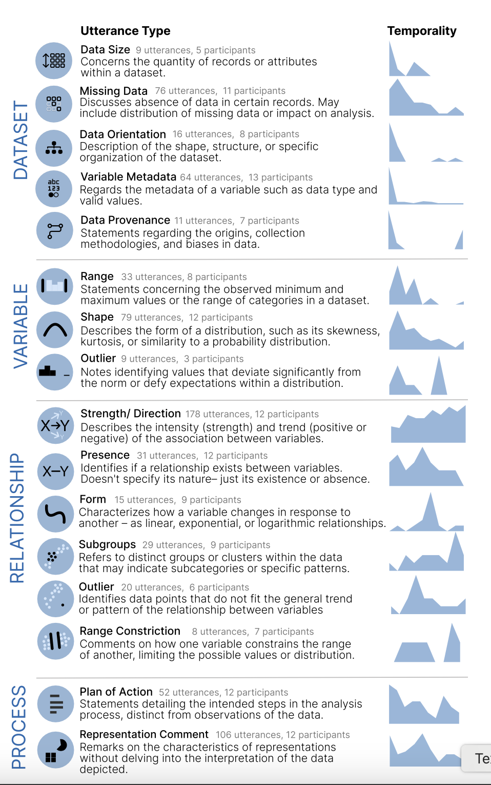
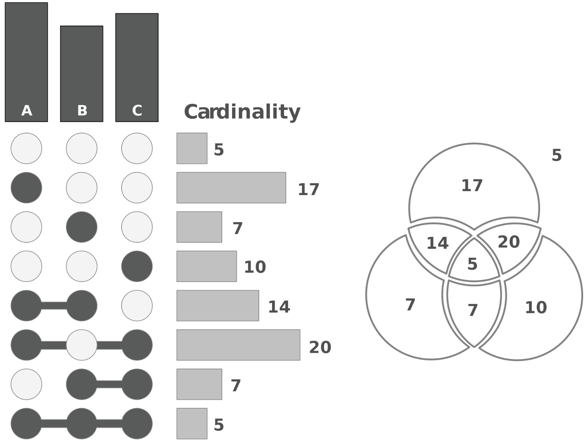
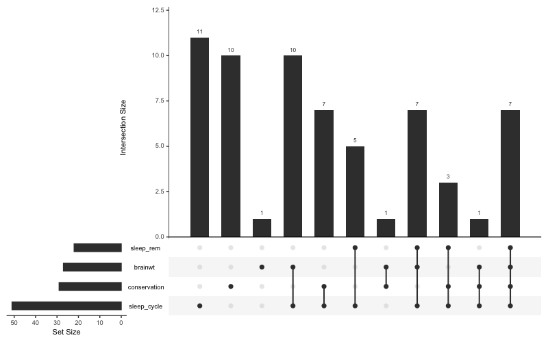
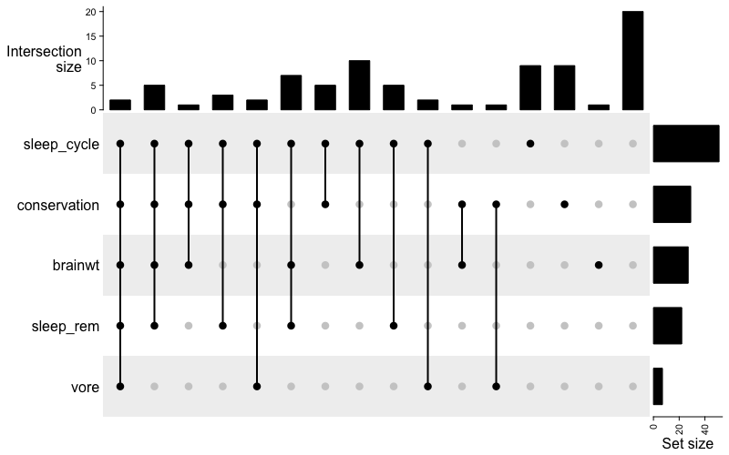

# Visual exploratory analysis (EDA)

## History

The ideas behind visual EDA dates back over 100 years

- Arthur Lyon Bowley, one of the early statisticians, used precursors of the stemplot and the five-number summary, using instead a _seven-number summary_ (maximum, minimum, median, quartiles and two deciles)
- The modern concept of EDA traces back to John Tukey's seminal book _Exploratory Data Analysis_ (1977), based on his work at the famous Bell Labs. 

::: {.f3 .b--blue .tl .ba .bw2 .br3 .shadow-5 .ph4 .mt5 .avenir}
_Exploratory data analysis can never be the whole story, but nothing else can serve as the foundation stone –- as the first step_

John Tukey, 1977
:::

[Bowley, A.L (1920). _Elementary Manual of Statistics_, 3rd Edition]{.aside}

## A more modern description

::: { .b--blue .tl .ba .bw2 .br3 .shadow-5 .ph4 .mt5 .f3 .avenir}

_An approach/philosophy for data analysis that employs a variety of techniques (mostly graphical) to <b>maximize insight</b> into a data set, uncover underlying structure, extract important variables, detect outliers and anomalies, test underlying assumptions, develop parsimonious models and determine optimal factor settings._

U.S. National Institute of Standards and Technology
:::

::: {.fragment}
 Being able to **interpret** what you see in question-agnostic visualizations  
 Using visualizations to **ask particular questions** of the data (but beware of [biases](#bias) in your questions and approach)  
 **Synthesize** what you find into confirmatory approaches (expository figures, models, hypotheses, validation)  
 Gain **awareness** of data characteristics that may modify or bias your interpretations or inferences (informative missingness, collinearity, pattern changes)
:::

::: {.notes .smaller}
EDA is the first process (not just a step) to go through after receiving a data set

- Allows us to understand univariate, bivariate and multivariate patterns
- Allows us to quickly catch issues and mistakes in the data
- Allows us to **start to** hypothesize about potential analyses
- Allows us to ensure that the data aligns with the context (the science or the business case)
- Hopefully prevents us from going down unreasonable analytic paths

Almost entirely graphical

- People catch graphical anomalies much faster than textual anomalies
- We inherently can recognize patterns

:::

## Industry views {visibility="hidden"}

::: {.panel-tabset}
  
### IBM

1. Get a look at data before making any assumptions
1. Screen data and identify obvious errors
1. Better understand patterns within the data
1. Detect outliers or anomalous events
1. Ask questions and check/validate your assumptions
1. Find interesting relations among the variables

::: {aside}
Source: <https://www.ibm.com/cloud/learn/exploratory-data-analysis>
:::

### NIST

_Maximize the analyst's insight into a data set and into the underlying structure of a data set, while providing all of the specific items that an analyst would want to extract from a data set_

1. a good-fitting, parsimonious model
1. a list of outliers
1. a sense of robustness of conclusions
1. estimates for parameters
1. uncertainties for those estimates
1. a ranked list of important factors
1. conclusions as to whether individual factors are statistically significant
1. optimal settings

::: {aside}
Source: <https://www.itl.nist.gov/div898/handbook/eda/section1/eda14.htm>
:::
:::

::: {.notes}
The NIST list is much more in line with figuring out models and modeling characteristics.

The IBM list is much closer to what is generally understood by EDA. Once again there is the 
emphasis on ascertaining errors, outliers and general "issues" with the data, while starting
to think about what insights can be learned

:::


## EDA is used in many contexts

::: {.column width="45%"}
### Data profiling<br>(graphical and non-graphical)

-  Determine if there are any problems with your dataset
  * Data structure
  * Missing data and remedies
  * Simple counts
  * Checking for duplicate entries

:::
::: {.column width="10%"}
:::
::: {.column width="43%"}

### Data explorations and insights

- Determine whether the question you are asking can be answered by the data that you have
  * Assess hypothesis
- Understand underlying patterns and trends
  * Univariate distributions and summaries for numeric and categorical data
  * Data transformations. 
  * Bivariate relationships
    * numeric-numeric
    * numeric-categorical
    * categorical-categorical
- Feature engineering
- How to best present your data visually

:::

## Food for thought 

Think about each data type or pair of data types, and consider

- The kinds of visualizations you can create
- What you will **get out** of each type of visualization, i.e., what will that visualization teach you about the data
- Choices you make to get the most out of the visualization


::::: {.columns}
:::: {.column width = "60%"}
::: {.fragment .b--blue .tl .ba .bw2 .br3 .shadow-5 .ph4 .mt5 .f4}
 How many bins should I use in a histogram?  
 What span should I use for a smoother?  
 What would help me discern outliers better, a histogram, density plot or boxplot?  
 How can I visualize missing value patterns?
:::
::::
:::: {.column width="40%"}
::: {.fragment .tl .bn .bw2 .br3 .shadow-5 .ph4 .mt5 .f2 .b}
These choices can make the _process_ of EDA more effective
:::
::::
:::::

::: {.notes}
These questions are prompts for the students to think about these. These are choices they don't think about and are important so as not to **miss** patterns. Typically you start with 100-200 bins and then ramp back (ask for a vote about whether you should go low or high on bin number). Similar issue with span. And not all viz's can reveal what you want to ask of it. 

:::

# The process

##



[Aspects of data]{.absolute top=0 left=150 style="font-weight: bold;font-size:30px; font-variant: small-caps;"}
[When it is realized in the process]{.absolute top=0 right=0 style="font-weight: bold;font-size:30px; font-variant: small-caps;"}

## What are we looking for?

::: {.columns}
::: {.column width="47%"}
### Start by looking at ...

- Distributions & relationships
- Anomalies / Outliers
- Groupings
- Missing data patterns

:::{.fragment}
### to figure out...

- Patterns and correlations
  - Modeling
  - Feature engineering
    - Transformations
    - Dimension reduction
- Presentation (expository) graphics
- Context and narrative (along with domain knowledge)
:::
:::

::: {.column width="47%"}
:::: {.fragment}
### How do we approach this task?
- Visual analytics
  - Quick prototyping and iteration
- Broad approaches
  - Univariate visualizations for distribution, outliers
  - Bivariate and multivariate visualizations for relationships
:::
::::
:::


::: {.notes}
Your EDA should be thorough enough that you have a pretty good sense of the final
story you want to tell from the data even before doing anything more fancy

The next steps of modeling, presentation visualization and storytelling are basically
validating, strengthening, emphasizing and embellishing what you figure out using EDA

If the story isn't evident here, further torturing the data will most likely not make it appear
:::

#  You cannot typically infer _causality_ just from EDA work. It needs to be contextualized and meet certain characteristics, including correlation/dependence, which _can_ be inferred from EDA

## Visual summaries of data

There is of course a lot of univariate and bivariate visualizations you can 
do to understand you data, including histograms, density plots, scatter plots and the like. 

- This is looking through a magnifying glass

:::{.fragment}

### Not mistaking the forest for the trees

Our first steps should be to get an overall view of the dataset to see if

- we see what we expect to see
- are there any early surprises
  - incomplete data
  - patterns & associations
  - outliers

We'll look at some tools that summarize the whole data

:::

# Data profiling

## Automated EDA: A first (and NOT last) pass through the data

There are several packages that go through a data set and do templated (standard) EDA for univariate and bivariate characteristics and missing data patterns. 

:::: {.columns}
::: {.column width="55%"}
- 
  - [[`DataExplorer`](https://cran.r-project.org/web/packages/DataExplorer/vignettes/dataexplorer-intro.html#feature-engineering)]{.blue}
  - [`dlookr`](https://choonghyunryu.github.io/dlookr/index.html)
  - [`smartEDA`](https://daya6489.github.io/SmartEDA/)
:::

::: {.column width="40%"}
R

```r
library(DataExplorer)
library(readr)
d <- read_csv('adult.csv')
create_report(d)
```

:::
::::

**Remember, every visualization has to earn its place**. This can give you a quick first pass through the data, but it isn't what you'd want to report. This report would need to be curated to advance insights and narratives, and personalized to your brand. 

## A side note: Data Validation

Data validation isn't the same as EDA. Here we're confirming that data meets a **known schema and properties** and look for errors in the data.  

- This is often a first step in proceeding to EDA
- There are several packages to do data validation:

- 
  - [`validate`](https://cran.r-project.org/web/packages/validate/vignettes/cookbook.html#22_Missingness)
  - [`pointblank`](https://rstudio.github.io/pointblank/articles/VALID-I.html)

# Bias

## Cognitive biases can affect our EDA

::: {.b--blue .tl .ba .bw2 .br3 .shadow-5 .ph4 .mt5 .f3}
EDA is about interpreting what is evident in the data and seeing how the data answers questions we ask of it. 
:::

Several known cognitive biases can affect how we understand the results of an EDA:

Confirmation bias
: We look for and find what we want to see. This is especially insidious. One way to handle this is to look at question-agnostic visualizations and make honest interpretations of what we see

Selection bias
: Selecting a particular subset of the data to look at, rather than all the data

Anchoring bias
: The tendency to rely on the first piece of information we see

Framing bias
: The tendency to be influenced by how the information is presented rather than the actual information itself (applicable to white hat/black hat)

[Other biases](https://thedecisionlab.com/biases)

## Combating confirmation bias

### Question Formulation

Frame neutral, open-ended questions instead of leading ones that validate existing beliefs. For example, ask "How are ticket sales distributed across the week?" rather than "Are sales higher on weekends?"

### Structured Approach
**Clear Objectives**: Define specific, achievable goals at the project's outset to maintain focus and avoid selectively interpreting data to fit predetermined narratives

**Multiple Hypotheses**: Test multiple competing hypotheses rather than seeking to prove a single assumption. Structure hypotheses to test if your assumptions are wrong, not that they are correct

### Analysis Methods
**Diverse Data Sources**: Seek out multiple data sources that can complement, contrast, or challenge your initial findings

**Systematic Tools**: Utilize analytical tools and statistical methods to process data objectively, making the analysis more transparent and reproducible

### Collaborative Practices
**Peer Review**: Engage colleagues with impartial views to review your data, methods, and conclusions

**Fresh Perspectives**: Consider having a different team examine the data and results with fresh eyes to identify potential biases the original team might have missed[8].

### Documentation
**Record Keeping**: Document your analysis steps, assumptions, and decisions throughout the exploration phase

**Transparent Limitations**: Explicitly identify the strengths and limitations of your analysis before starting, and be clear about any potential conflicts of interest[6].

### Best Practices
**Active Search**: Deliberately look for evidence that contradicts your initial hypotheses rather than just supporting data

**Early Feedback**: Debrief with stakeholders to avoid misinterpretation of results and preempt biased follow-up requests

# Missing data
## Why are missing data patterns important

1. From a completeness perspective, it gives a sense of the amount of usable data on hand
1. From an analytic perspective, there's actually a bit more
    - A fundamental idea in handling missing data is that the missingness happens **at random**
    - If the missingness is at random, we can **ignore it** for the purposes of analysis and modeling
    - If it isn't at random, it's considered _informative_ or _non-ignorable_ missingness and has to be dealt with analytically, either via imputation or as an explicit component in any modeling strategy
    - If some variables tend to be missing together, it points to flaws in the data collection process as well as an issue with correlated missingness.
    - If some variables have "too much" missing, should we consider tossing them?
    
::: {.notes}

Informative missingness:
basically, can the missing status predict other characteristics of the individuals to some degree of certainty

- Pregnant (Y/N) and males are coded as missing
- data from particular labs are missing, or much more likely to be missing
- Sicker people miss hospital visits


Tossing a variable needs to be very carefully considered. It is a last resort

We think about possible imputation strategies if we have 10-30% missing, especially 
if another variable is well-correlated with it

Sometimes we still keep it in and do a subgroup analysis, because that variable is important to 
understanding but hard to collect

- Some kinds of non-standard blood components
- expensive PET scans
- differences in facilities across countries

Still we need to think about whether the missingness is informative and account for it 
:::

## A missing data typography

Missing Completely at Random (MCAR)
: The fact that data are missing is independent of the observed and unobserved data, i.e. no systematic difference exist between subject with and without missing data

Missing at Random (MAR)
: The fact that the data are missing is systematically related to data we observe but not to the underlying values of the unobserved data

Missing Not at Random (MNAR)
: The fact that the data are missing is systematically related to the values of the unobserved data. In other words, you are in neither the MCAR or MAR situations


Consider a dataset with the following three variables: disease status, level of exposure, and age. Suppose, for some individuals, exposure is missing.

- **MCAR:** Any two individuals, regardless of their values of disease status, level of exposure, and age, have the same probability of having a missing value for exposure.
- **MAR:** Any two individuals with the same disease status and age have the same chance of having a missing exposure value, regardless of how large or small their actual level of exposure.
- **MNAR:** Even among individuals with the same disease status and age, the chance of having a missing exposure value depends on the level of exposure.


## A closer look at missing data patterns

```{r -slides-7}
#| code-fold: false
library(ggplot2)
data(msleep)
visdat::vis_miss(msleep)
```

This visualization provides both missing data patterns and summary statistics 
about the missing data


## A closer look at missing data patterns

The `naniar` package by Nicholas Tierney provides more detailed looks at missing data patterns

::: {.column width="47%"}
```{r -slides-8}
library(naniar)
ggplot(msleep, aes(sleep_rem, awake)) + 
  naniar::geom_miss_point() + 
  labs(x = "REM sleep (hours)",
       y = "Time awake (hours)",
       title = "Is missing data in REM sleep associated with time awake")+
  theme_bw()
```
:::
::: {.column width="47%"}
```{r -slides-9}
ggplot(airquality, 
       aes(x = Solar.R, 
           y = Ozone)) + 
  naniar::geom_miss_point() +
  labs(x = "Solar radiation (Langleys)",
       y = "Mean ozone (ppb)",
       title = "Are there missing data patterns",
       caption = "Data obtained from `datasets::airquality`")+
  theme_bw()
```
:::

This is a clever use of a standard visualization where the red dots show the 
values of one variable when the other variable is missing. This can show

- particular patterns in missingness, or a lack of pattern :white_check_mark:

::: {.notes}
This needs a bit of careful explanation. 

For the left plot, there are observations which are missing REM sleep but not the time awake. We're
plotting those points off-axis in red, to see if there is any pattern among the time awake values

Similarly for the right one, 

- the red points on the left are values of the ozone for which solar radiation is missing, 
- red dots on the bottom are values of solar radiation for observations where ozone measurements are missing. 
- There are 2 observations (bottom left) where both are missing

We can see that solar radiation measurements tend to be missing on days where the ozone measurements are relatively low
:::


:::


# UpSet plots
Looking at multivariate relationships among categorical variables<br/>
applied to missing data

## UpSet plots

The UpSet plot was originally developed at Harvard in 2014.

The main purpose was to solve the problem of set visualizations when you 
have more than one set (so an extension of Venn Diagrams), in an intuitive manner

::: {.fragment}
It tries to solve the problem created by the following visualization looking at the intersection of 6 sets

{width=600, height=370}
:::

::: {.notes}
We can use Venn diagrams to understand co-occurrences or common elements in 2 or 3 sets. But what do we do if we want
to compare more than 3 sets. 

There are solutions like Euler diagrams, but they tend to take a bit of contortion to understand, much like the banana figure. 

UpSet plots offer a more intuitive solution
:::

## Example


## UpSet plots

Let's look at this from a missing data perspective. Each "set" is the missing/non-missing annotation of each variable in a data set, and we're interested in when the missing data co-occur. 

::: {.column width="70%"}
```{r -slides-12}
#| fig-cap: The msleep data
gg_miss_upset(msleep) 
```

:::
::: {.column width="28%"}
- The left barplot gives the number of missing data for each variable (here showing the top 5)
- The "barbells" show the different co-occurrence patterns
- The top barplot gives the frequencies of each co-occurrence pattern
:::

## UpSet plots (R)

::: {.column width="47%"}
### Using the `UpSetR` package

```{r -slides-13}
#| eval: false
library(UpSetR)
d <- msleep |> 
  select(vore, sleep_rem, brainwt, conservation, sleep_cycle)
d <- as.data.frame(is.na(d)*1)
upset(d, nsets=4)
```



:::
::: {.column width="47%"}
### Using the `ComplexHeatMap` package

```{r -slides-14}
#| eval: false
library(ComplexHeatmap)
m <- make_comb_mat(d)
UpSet(m)
```



:::


