# Coordinate Reference Systems (CRS)

## Some immediate gotcha's when working with geospatial data and trying to create visualizations

:::: {.columns}
::: {.column}
* Layers won't match up
* Points will not show up on the right location on the grid
* Distances won't be correct
* Circles turn to ellipses for no apparent reason
* Geographic elements look weird
:::

::: {.column}

:::
::::

## Layers


```{webr}
#| message: false
#| warning: false
library(rnaturalearth)
library(rnaturalearthdata)
theme_set(theme_bw())
france <- ne_countries(country='France', scale=50)
# seine1 <- st_transform(seine, crs =st_crs(france))
# world_cities = read_csv("worldcities.csv")
# cities = st_as_sf(world_cities, coords = c('lng','lat'), crs = st_crs(france))
ggplot() + 
 geom_sf(data=france) + 
#  geom_sf(data = seine1) + 
#  geom_sf(data = filter(cities, city=="Paris"), color = 'red', size=4) +
 coord_sf(xlim = c(-10,10), ylim = c(40,52))


```

## Converting from 3D to a 2D map is not so straightforward

The culprit: the earth is not a perfect sphere. It's a spheroid/ellipsoid!

:::: {.columns}
::: {.column}
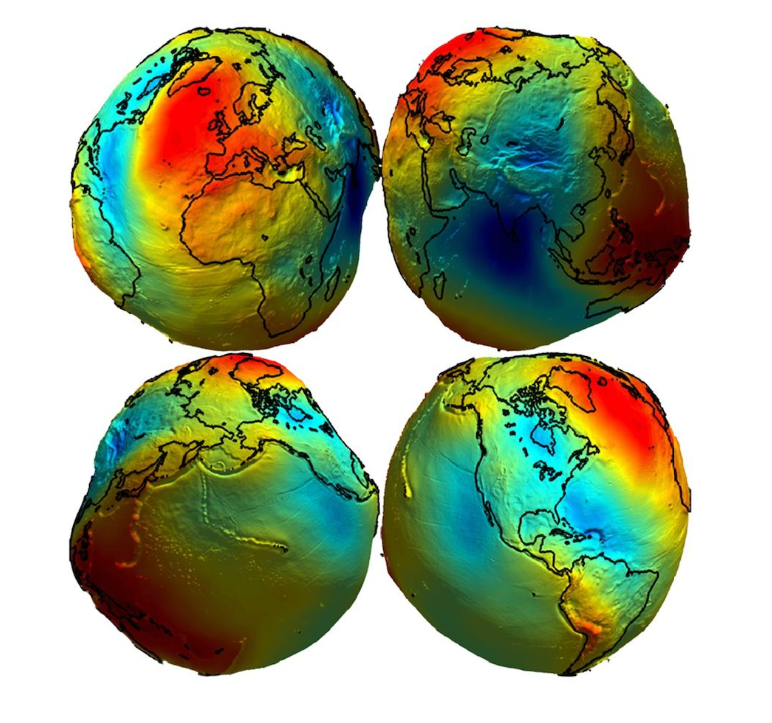{fig-align="center"}
:::
::: {.column}
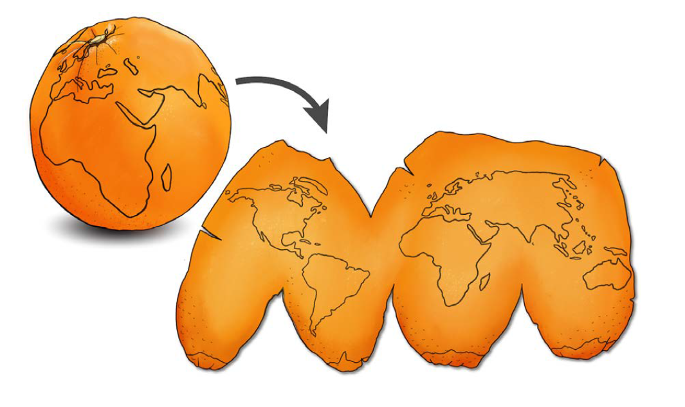
:::
:::: 


## Spherical Coordinate system

* We exist in 3D space, which is mathematically represented with coordinate systems
* Not surprisingly, spherical coordinates are particularly useful for geo-data
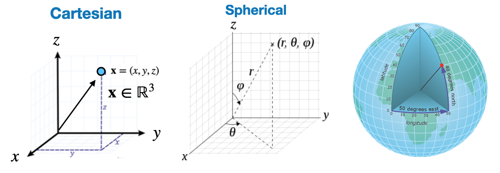{width=900}
* **Aside**: You can "re-map" coordinates from one space to another with the following:  
<sup> 
$\begin{aligned} & r=\sqrt{x^2+y^2+z^2} \,\,\,\,\,\,\,\,\,\,\,\,\,\,\,\,\,\, \theta=\arccos \frac{z}{\sqrt{x^2+y^2+z^2}}=\arccos \frac{z}{r}=\arctan \frac{\sqrt{x^2+y^2}}{z} \\ & \varphi= \begin{cases}\arctan (y / x) & \text { if } x>0 \\ \arctan (y / x)+\pi & \text { if } x<0 \\ \frac{\pi}{2} & \text { else }\end{cases} \end{aligned}$
</sup> 


## Overview 

* Coordinate reference systems (CRS) are ways to represent the 3D spatial data of earth on a 2-dimensional surface. 
*  A spatial reference system defines a specific map projection, as well as transformations between different spatial reference systems.
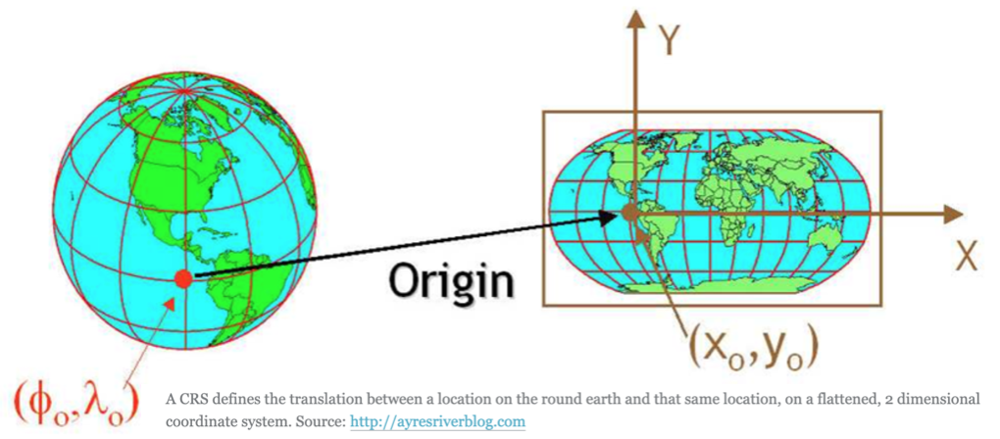

## CRS: Components 

* The CRS is a very important aspect of spatial data. For example, a location of (140, 12) on earth is useless without units (meters, KM, miles, degrees) and an origin point. 
* **The coordinate reference system is made up of several key components:**
  - **Coordinate system:** The X, Y grid upon which your data is overlayed and how you define where a point is located in space.
  - **Horizontal and vertical units**: The units to define the grid along the $x, y$ (and $z$ ) axis.
  - **Datum**: A modeled version of the shape of the Earth  which defines the origin used to place the coordinate system in space. 
  - **Projection Information**: The mathematical equation used to flatten objects that are on a round surface(e.g. the Earth) so you can view them on a flat surface (e.g. your computer screens or a paper map). 
    * Different planar coordinate reference systems are referred to as `projections`. Examples are ‘Mercator’, ‘UTM’, ‘Robinson’, ‘Lambert’, and ‘Albers’.

<sup> Good resource: [click here](https://www.earthdatascience.org/courses/earth-analytics/spatial-data-r/intro-to-coordinate-reference-systems/)

## CRS: Examples:

* There are MANY CRS and components of CRS 
* They are typically tagged with EPSG tags to identify them 
  * **Note**: EPSG="European Petroleum Survey Group"
* CRS definitions will typically consist of a "stack" of dependent specifications, as exemplified in the following table:
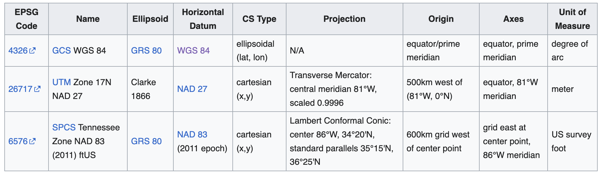
* This is a vast field of study, if you specialize in geo-spatial data, then you would need to learn more, however, for now this is enough.

## CRS Units: longitude & latitude 
* Geo-spatial data is often represented in spherical coordinates, with the radius constant 
* A common choice of units in a CRS is degree's (longitude & latitude)
    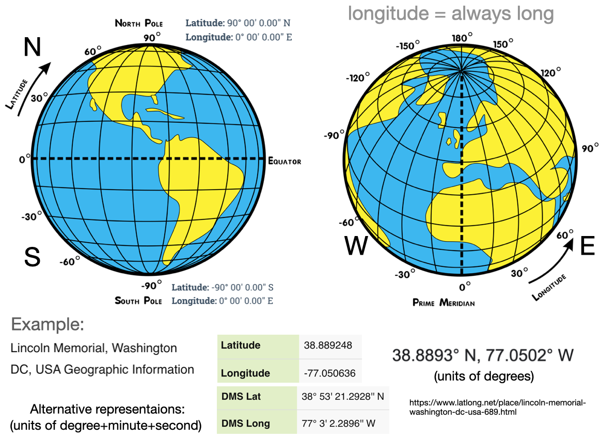{width=750}

## Exercise 

It's good to be able to estimate locations on earth from longitude & latitude. For example:

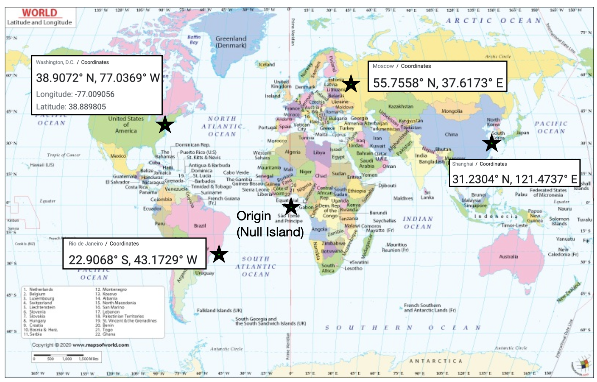

## CRS Units: Minutes to degrees 

**London**: latitude 51.509865, and longitude -0.118092. (degrees)

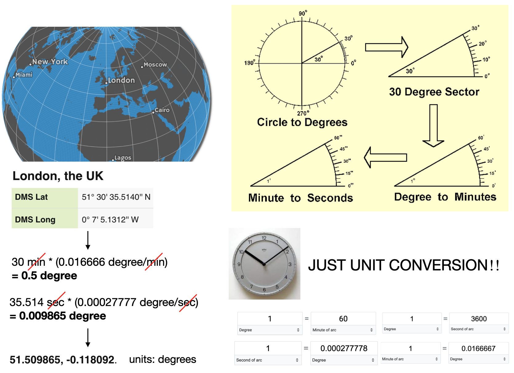

## CRS Units: Length

* Units can also be distance measured from some point (e.g. meters)
* When using a CRS, it is good to look it up to determine the units and other details 

:::: {.columns}
::: {.column width="50%"}
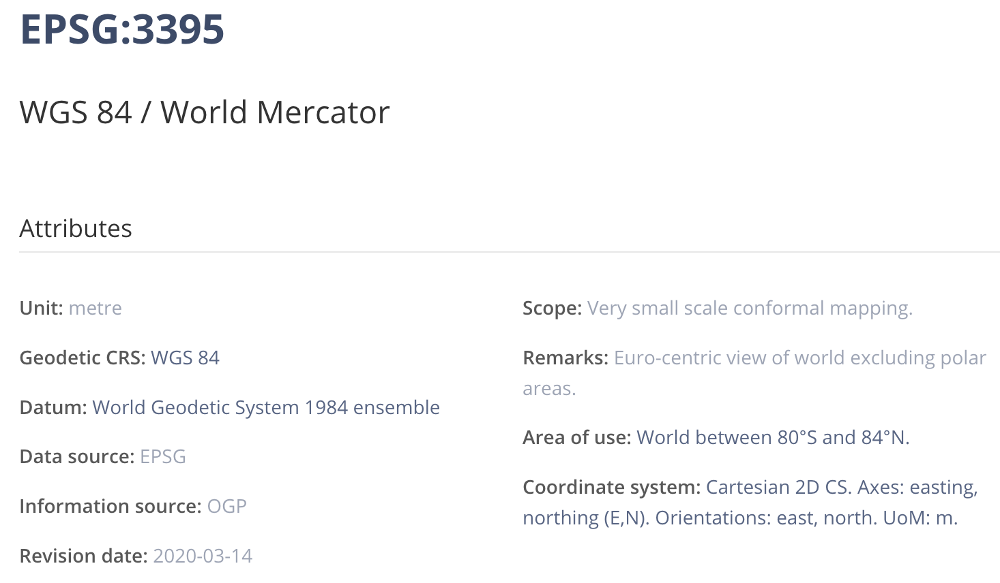
:::
::: {.column width="50%"}
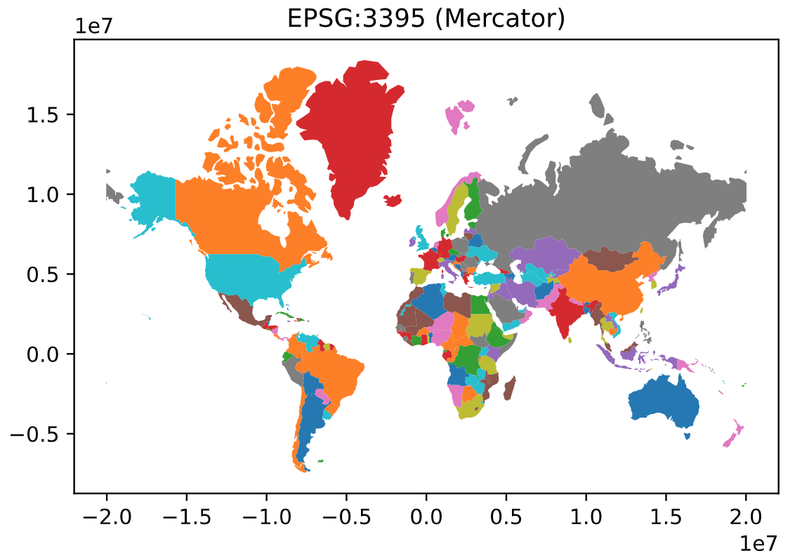
:::
::::

* **Attention to detail with units is always important**, e.g. measuring area in "degrees squared" doesn't make a lot of sense.
* **Sanity check:** Earth/Circumference 40.075 million meters


## CRS: Map projections 

- **Projection**: The mathematics used to flatten objects that are on a round surface
- This is a specialized form of `dimensionality reduction`
- map projection are either “equal area” (the scale of the map is constant) or “conformal” (the shapes of the geographic features are as they are seen on a globe)
- Map projects have to be one or the other, they can't be both

[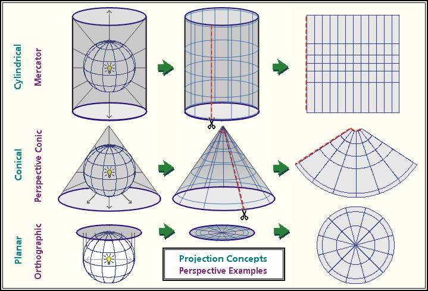](img/2023-03-26-15-40-44.png)


## CRS: Map projections distortions 

Mappings from 3D to 2D always leave artifacts and distortions. 
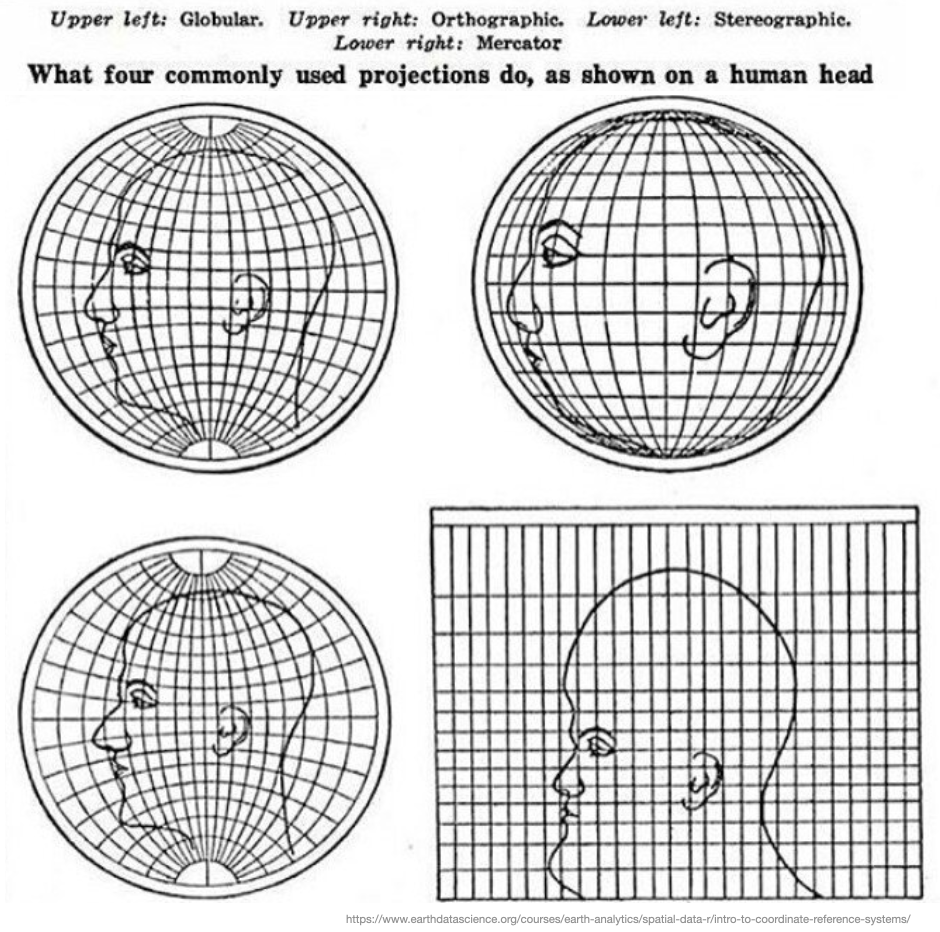{width=600}

## Why are there so many projections? {.smaller}

:::: {.columns}

::: {.column width="47%"}
Each projection has its strengths and weaknesses:

- **conformal projections** preserve angles and local shape,
- **equal-area projections** preserve area (use these for choropleths),
- **equidistant projections** preserve distance from one (or two) points,
- **azimuthal projections** expand radially from a central feature,
- **cylindrical projections** have symmetry around the axis of rotation,
- **stereographic projection** preserve circles, and
- **gnomonic projections** display all great circles as straight lines!

:::

::: {.column width="47%"}
<iframe width="100%" height="439.671875" frameborder="0"
  src="https://observablehq.com/embed/919302e25a22595e@27?cells=viewof+projection%2Cmap"></iframe>
:::

::::

[This section is taken from the [Projections](https://observablehq.com/plot/features/projections) page of Plot.js documentation, which has a lot of additional information as well]{.aside}

## Comparing projections

<iframe width="100%" height="600" frameborder="0"
  src="https://observablehq.com/embed/@d3/projection-comparison?cells=viewof+red%2Cviewof+blue%2Cmap"></iframe>
 
## Map projections: Size comparison



## CRS: Useful links

* <https://en.wikipedia.org/wiki/Spatial_reference_system>
* <https://observablehq.com/plot/features/projections>
* <https://epsg.io/map#srs=4326&x=0.000000&y=0.000000&z=1&layer=streets>
* <https://geopandas.org/en/stable/docs/user_guide/projections.html>
* <https://epsg.io/3395>
