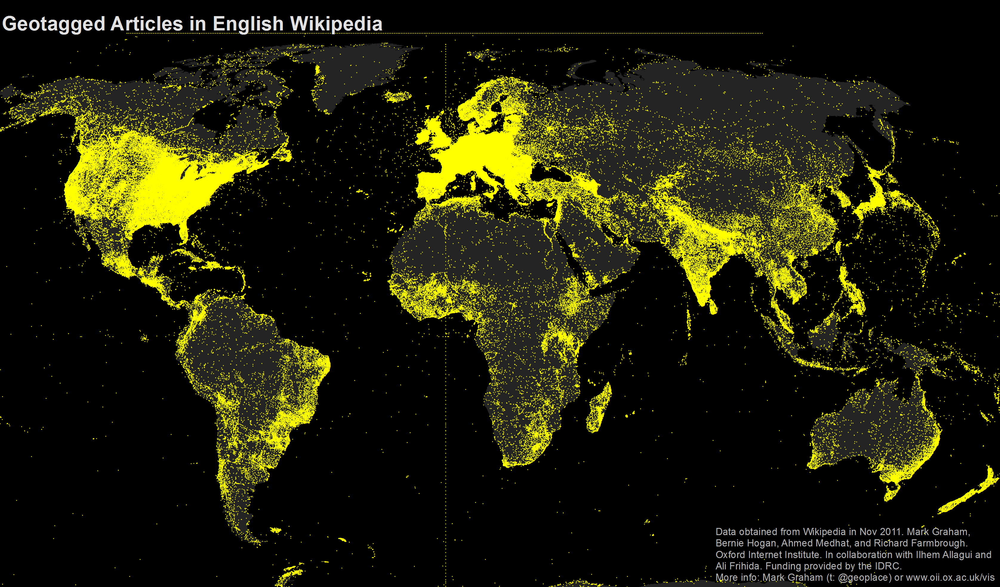
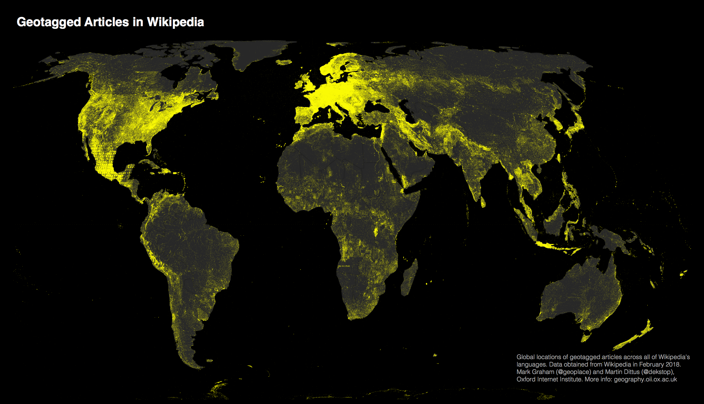
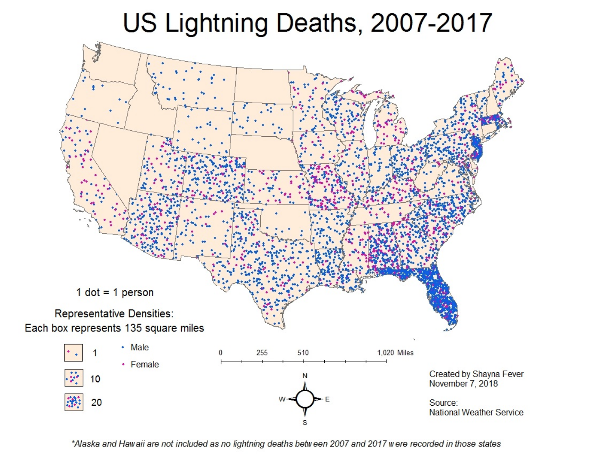

# Popular types of spatial visualizations

## Choropleth

:::: {.columns}

::: {.column}
A __choropleth map__ displays divided geographical areas or regions that are coloured in relation to a numeric variable.

* Use a choroplth when the main task is to undersand spatial relationships with one quantitative attribute per region
* The data is usually a table in the form of `geo`,`value`
* This is essentially a heatmap by geographic region
* Very familiar
:::

::: {.column}

:::
::::

## Creating choropleths (Observable Plot)

<iframe width="100%" height="550" frameborder="0"
  src="https://observablehq.com/embed/@observablehq/build-your-first-choropleth-map-with-observable-plot?cells=firstChoroplethPreview%2Ccounties%2Cus_broadband_2018%2Cvizofyear"></iframe>

## Creating choropleths (Vega-Lite)

<iframe width="100%" height="500" frameborder="0"
  src="https://observablehq.com/embed/@aborruso/vega-lite-choropleth-map-example?cell=*"></iframe>

## Creating choropleths (R/Python)

- There are approaches using `ggplot2`, `tmap` and `matplotlib`
  - Leverages the `sf` package (R) and the `geopandas` package (Python)

::: {.callout-tip}
There are a couple of really good references for developing maps in R and Python, by the same group of authors. These resources are more generally looking at geographic analysis (GIS-like) but has substantial information around making maps. 

- [Geocomputation using R](https://r.geocompx.org)
- [Geocomputation using Python](https://py.geocompx.org)

Some other good resources include

- [Spatial Data Science](https://r-spatial.org/book/) with applications in R.
- The [geospatial chapter](https://clauswilke.com/dataviz/geospatial-data.html) of Claus Wilke's Fundamentals of Data visualization

:::

## A bivariate choropleth (using a two-level color scale)

{fig-align="center" height="500"}

::: aside
This was created in R!, [click here for source](https://timogrossenbacher.ch/bivariate-maps-with-ggplot2-and-sf/)
:::

## Another bivariate choropleth example

<iframe width="100%" height="550" frameborder="0"
  src="https://observablehq.com/embed/@joewdavies/bivariate-map-with-plot?cells=viewof+location%2Cmap"></iframe>

## Cartogram

:::: {.columns}
::: {.column}
A __cartogram__ is a map in which the geometry of regions is distorted in order to convey the information of an alternate variable. The region area will be inflated or deflated according to its numeric value.

How to make a cartogram?
1. Start with the geography 
:::
::: {.column}

:::
::::

## Cartogram (continued)

:::: {.columns}
::: {.column}
A __cartogram__ is a map in which the geometry of regions is distorted in order to convey the information of an alternate variable. The region area will be inflated or deflated according to its numeric value.

How to make a cartogram?

1. Start with the geography 
2. Distort the geography based on the variable being displayed
:::
::: {.column}

:::
::::

## Cartogram (continued)

:::: {.columns}
::: {.column}
A __cartogram__ is a map in which the geometry of regions is distorted in order to convey the information of an alternate variable. The region area will be inflated or deflated according to its numeric value.

How to make a cartogram?

1. Start with the geography 
2. Distort the geography based on the variable being displayed
3. Add color and now you have both a __choropleth__ and a __cartogram__

:::
::: {.column}

:::
::::

## Heat maps

:::: {.columns}
::: {.column}
__Heat maps__ are useful when you have to represent large sets of continuous data on a map using a color spectrum. A __heat map__ is different from a chloropleth map in that the colors in a heat map **do not** correspond to geographical boundaries.

This map of India shows the average annual rainfall using different shades of blue. The darker the shade of blue, the higher the rainfall.
:::

::: {.column}

:::
::::

## Dot map

:::: {.columns}
::: {.column}
A dot map (also called dot distribution map or dot density map) uses a dot to indicate the presence of a variable. Dot maps are essentially scatterplots on a map and are useful for showing spatial patterns.

This is a dot map of the world showing nearly 700,000 geotagged Wikipedia articles, each represented by a yellow dot, in 2011.
:::

::: {.column}

:::
::::

## 

The same dataset, in 2018. More articles, different projections. Would you change anything?

## Use dot maps carefully. This is a _dot density_ plot.

:::: {.columns}
::: {.column}
Dots are often used in graphs, charts, and maps to accurately locate individual observations and phenomena, but that's _not_ the case here. If you read a dot density map that way, it'll look like there were fatalities everywhere in Florida, and that lightning strikes become much less deadly as soon as you cross the border with Georgia or Alabama.

In a dot density map, though, each dot represents one observation, but dots aren't located where those observations were made; instead, dots are distributed to maximize coverage and, if the placement algorithm is well designed and manually tweaked, it'll avoid absurd placement —such as dots over lakes, rivers, or unpopulated regions.
:::

::: {.column}

:::
::::

