<!---
## Reviewing data types

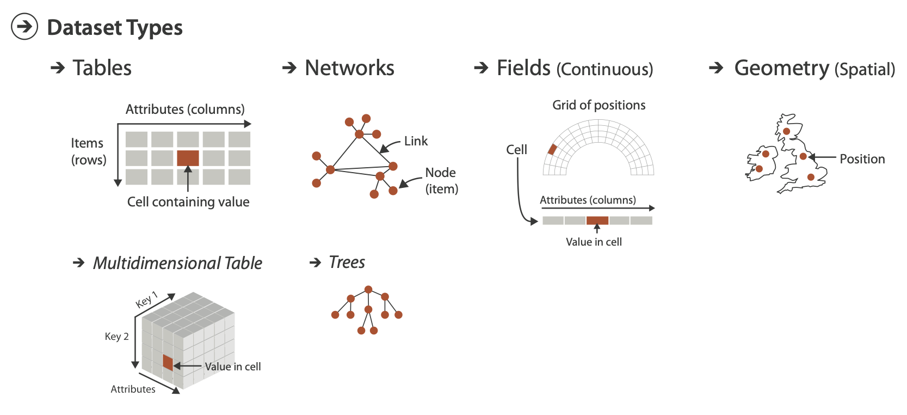{fig-align="center"}

## Let's focus on Spatial data

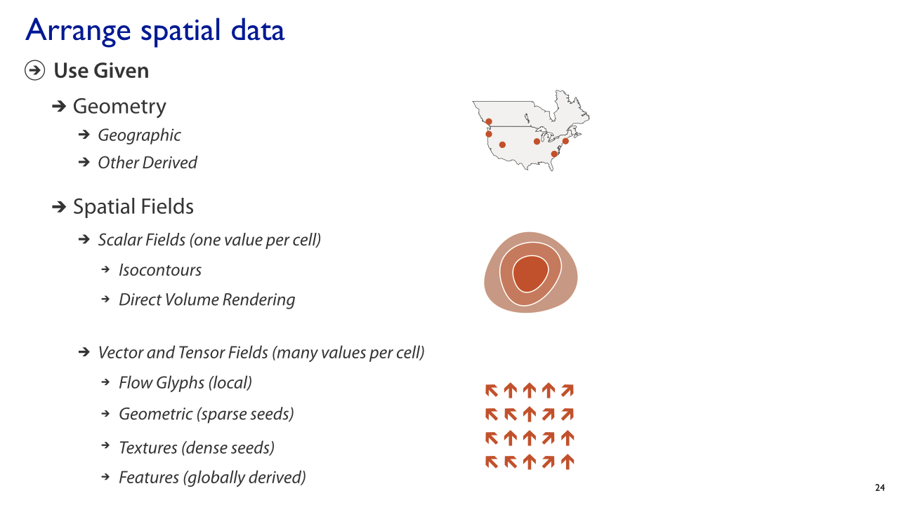{fig-align="center"}


# Maps

## Spatial data has been around for a long time...

Edmund Halley’s New and Correct Chart Shewing the Variations of the Compass (1701) was the first map to show lines of equal magnetic variation.

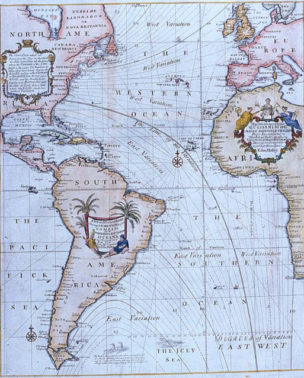{fig-align="center" height="500"}


## The first known instance of a choropleth

In 1826, Charles Dupin published a thematic map of France showing illiteracy levels using shadings from white to black.

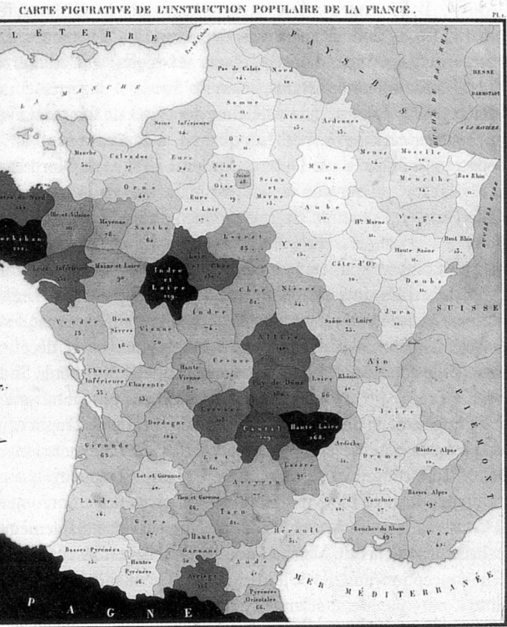{fig-align="center" height="500"}


## A really _interesting_ map

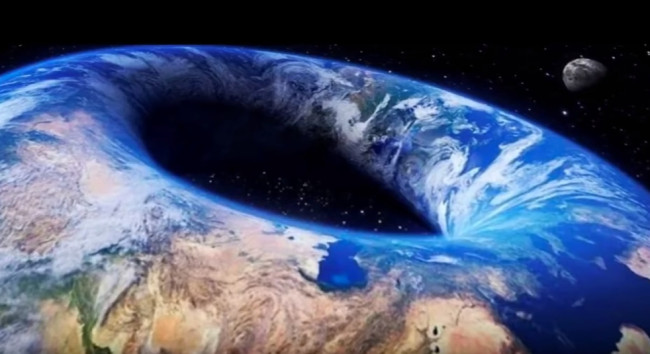{fig-align="center"}

--->

# Spatial Data


## Spatial Data

Spatial data is information about a physical object that can be represented by numerical values in a _geographic coordinate system_.

:::: {.columns}
::: {.column}
### Spatial data represents
- Location, size and shape of an object on planet Earth such as a building, lake, mountain or township
- Spatial data may also include attributes that provide more information about the entity that is being represented 
- Geographic Information Systems (GIS) or other specialized software applications can be used to access, visualize, manipulate and analyze geospatial data
- Can be another attribute in a standard tabular dataset
:::
::: {.column}
### Latitude and longitude are not enough!

- Coordinate pairs are pairs, and lose much of their meaning when treated independently
- In addition to having point locations, observations may often be associated with spatial lines, areas, or grid cells
- Spatial distances between observations are often not well represented by straight-line distances, but by great-circle distances, distances through networks, or by measuring the effort it takes in getting from A to B

:::
:::: 


## Vector Data

The geographic vector model is based on points located within a coordinate reference system (CRS). Points can represent self-standing features (e.g., the location of a bus stop) or they can be linked together to form more complex geometries such as lines and polygons. Most point geometries contain only two dimensions.

:::{layout-ncol="2"}
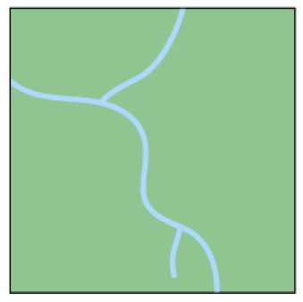

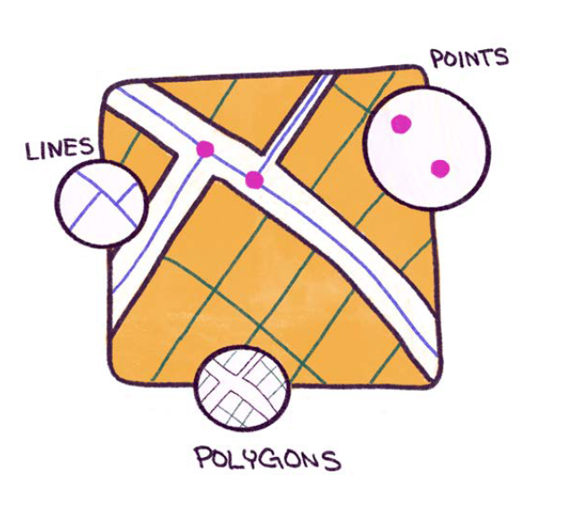
:::


## Raster Data

The geographic raster data model usually consists of a raster header and a matrix (with rows and columns) representing equally spaced cells (often called pixels).

:::{layout-ncol="2"}
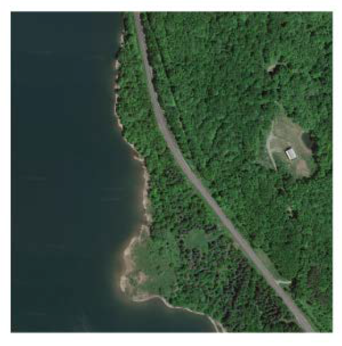

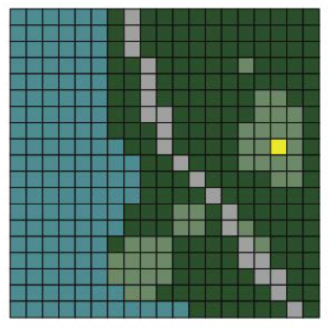
:::


## Multi-layer Raster

In addition to raster and vector data, there is also LiDAR data (also known as point clouds) and 3D data. LiDAR data is data that is collected via satellites, drones, or other aerial devices. 3D data is data that extends the typical latitude and longitude 2-D coordinates and incorporates elevation and or depth into the data. While complex, this data is rich with information and can be used to solve a variety of problems pertaining to the Earth’s surface.

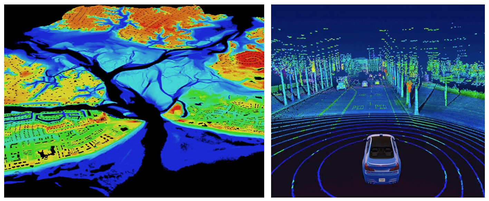{fig-align="center"}

# Structure of geospatial data

## Open Souce Libraries for GIS

:::: {.columns}
::: {.column width="33%"}
### GEOS (Geometry Engine - Open Source)

<https://libgeos.org/>

GEOS is a powerful geometry engine that provides functions for performing geometric operations on spatial data.

- It handles geometric objects such as points, lines, and polygons.
- Supports operations like intersection, union, buffer, and distance calculations.
- Used extensively in GIS (Geographic Information Systems) applications.
:::
::: {.column width="33%"}
### GDAL (Geospatial Data Abstraction Library)

<https://gdal.org/>

GDAL is a versatile library for reading, writing, and transforming geospatial data.

- Handles various raster and vector formats (e.g., GeoTIFF, Shapefiles, NetCDF).
- Provides tools for data manipulation, reprojection, and format conversion.
- Supports both reading and writing of geospatial datasets.

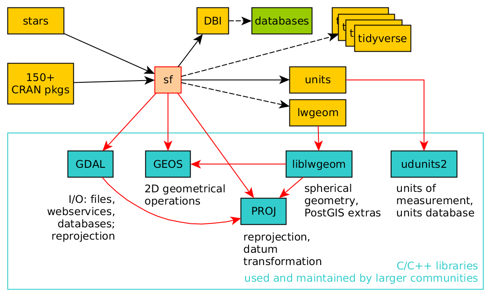
:::

::: {.column width="33%"}
### PROJ (Cartographic Projections Library)

<https://proj.org/en/9.3/>

PROJ is a library for cartographic transformations and coordinate system conversions.

- Handles coordinate reference systems (CRS) and transformations between different CRS.
- Performs accurate conversions between geographic and projected coordinates.
- Supports various map projections (e.g., Mercator, Lambert, Azimuthal).
:::
::::


## Simple Features (ISO 19125-1:2004)
</img>

## Simple Features (ISO 19125-1:2004)

Simple Features Geometries (often referred to as SF Geometries) are a fundamental concept in geospatial data modeling. They provide a standardized way to represent geometric shapes and their spatial relationships. Let's explore the key aspects:

:::: {.columns}
::: {.column}
### Geometry Types

SF Geometries include various types that allow us to model real-world features like cities, rivers, buildings, and land parcels:

- Point: Represents a single location in space (e.g., latitude and longitude).
- LineString: A sequence of connected points forming a line or curve.
- Polygon: A closed shape with an outer boundary and optional inner holes.
- MultiPoint, MultiLineString, and MultiPolygon: Collections of points, line strings, or polygons.
- GeometryCollection: A heterogeneous collection of any geometry type.

:::
::: {.column}
### Coordinate System:

- SF Geometries are defined in a specific coordinate reference system (CRS).
- The CRS provides a framework for mapping coordinates to real-world locations.
- Common CRS include WGS 84 (EPSG:4326) for latitude and longitude, and various projected CRS for accurate measurements.

:::
::::

## Simple Features
```{r}
#| echo: false
tibble::tribble(
~type,  ~description, 
"POINT", "zero-dimensional geometry containing a single point",
"LINESTRING","sequence of points connected by straight, non-self intersecting line pieces; one-dimensional geometry",
"POLYGON","geometry with a positive area (two-dimensional); sequence of points form a closed, non-self intersecting ring; the first ring denotes the exterior ring, zero or more subsequent rings denote holes in this exterior ring",
"MULTIPOINT","set of points; a MULTIPOINT is simple if no two Points in the MULTIPOINT are equal",
"MULTILINESTRING","set of linestrings",
"MULTIPOLYGON","set of polygons",
"GEOMETRYCOLLECTION","set of geometries of any type except GEOMETRYCOLLECTION") |>
  gt::gt()
```
## Plain ol' CSV

:::: {.columns}
::: {.column}
Typical delimited text file with latitude and longitude:

```
id,name,amount,city,lon,lat
1,Kevin,2.1,Rapperswil,8.8249,47.2274
2,Eva,2.2,Zürich,8.5435,47.3768
3,"Jimmy,Muff",2.3,,7.4397,46.9487
```
:::

::: {.column}
Another CSV with a `POINT` definition (we'll talk about this shortly)

```
id,name,amount,city,geom
1,Kevin,2.1,Rapperswil,POINT(8.8249 47.2274)
2,Eva,2.2,Zürich,POINT(8.5435 47.3768)
3,"Jimmy,Muff",2.3,,POINT(7.4397 46.9487)
```
:::
::::

{height=4in}

## Data with a `geometry` attribute

```{webr}
library(spData)
library(sf)
us_states

```

## Data with a `geometry` attribute

```{python}
import geopandas
from geodatasets import get_path

path_to_data = get_path("nybb")
gdf = geopandas.read_file(path_to_data)

gdf
```
## Shapefiles

:::: {.columns}
::: {.column}
The shapefile format is a __digital vector__ storage format for storing geometric location and associated attribute information. It has existed since the early 90's. It is possible to read and write geographical datasets using the shapefile format with a wide variety of software.

The term "shapefile" is quite common, but the format consists of a collection of files with a common filename prefix, **stored in the same directory.**
:::

::: {.column}
### Mandatory files

* `shp`: the feature geometry file
* `shx`: the shape index position
* `dbf`: the attribute data

**You will most likely only use the `shp` file with special libraries for visualization purposes.**

### Optional files

* `prj`: the projection metadata
* `xml`: other assiated metadata
* `sbn`
* `sbx`
:::
:::: 


## GeoJSON

:::: {.columns}

::: {.column width="60%"}

```
{
  "type": "FeatureCollection",
  "features": [
    {
      "type": "Feature",
      "geometry": {
        "type": "Point",
        "coordinates": [ -90.0715, 29.9510 ]
      },
      "properties": {
        "name": "Fred",
   		"gender": "Male"
      }
    },
    {
      "type": "Feature",
      "geometry": {
        "type": "Point",
        "coordinates": [ -92.7298, 30.7373 ]
      },
      "properties": {
        "name": "Martha",
   		"gender": "Female"
      }
    },
    {
      "type": "Feature",
      "geometry": {
        "type": "Point",
        "coordinates": [ -91.1473, 30.4711 ]
      },
      "properties": {
        "name": "Zelda",
	    "gender": "Female"
      }
    }
  ]
}
```
:::

::: {.column width="40%"}
GeoJSON consists of the following different parts:

* *Geometry object:* This is the [Simple Features geometry primitives](https://en.wikipedia.org/wiki/Well-known_text_representation_of_geometry)
* *Feature object:* May contain additional metadata associated with the geometry object
* *FeatureCollection:* Basically just a list of feature objects.

Typically one GeoJSON file (or dataset) will consist of a FeatureCollection containing a list of your data.
:::

::::

::: aside
Learn about other GIS formats at <https://gisgeography.com/gis-formats/>
:::


## Augmenting/Wrangling spatial data

:::: {.columns}
::: {.column}
* **Geocoding:** the process of converting an address or a name of a place into its coordinates

* **Reverse geocoding:** the process of transforming a set of coodrinates into an address or a description of a place 
:::

::: {.column}

:::
::::


<!----
## Spatial data operations

:::: {.columns}
::: {.column}
### Spatial relationship

- Equals
- Intersects
- Planar Near (planar distance)
- Geodesic Near (geodesic distance)
- Contains
- Within
- Touches
- Crosses
- Overlaps
:::

::: {.column}
### Temporal relationship

- Meets
- Met by
- Overlaps
- Overlapped by
- During
- Contains
- Equals
- Finishes
- Finished by
- Starts
- Started by
- Intersects
- Near
- Near Before
- Near After
:::
:::: 

## Spatial relationships

n a spatial relationships between features, each type of geometry (point, polyline, and polygon) has an interior and a boundary. How the interiors and boundaries of two geometries compare determines the spatial relationship they exhibit. The following image outlines the geometries, boundaries, and interiors of points, polylines, and polygons.

{fig-align="center"}


::: aside
Source: <https://pro.arcgis.com/en/pro-app/latest/tool-reference/geoanalytics-desktop/spatial-relationships-gapro.htm>
:::

## Spatial operations

:::: {.columns}
::: {.column}
### Equals
A target feature is equal to a join feature if their interiors are identical and the geometry types are the same.


:::
::: {.column}
### Planar or Geodesic Near
A target feature is within a specified distance.


:::
::::

::: aside
Source: <https://pro.arcgis.com/en/pro-app/latest/tool-reference/geoanalytics-desktop/spatial-relationships-gapro.htm>
:::


## Spatial operations

::: {layout="[[1,1, 1], [1,1, 1]]"}


:::

--->
