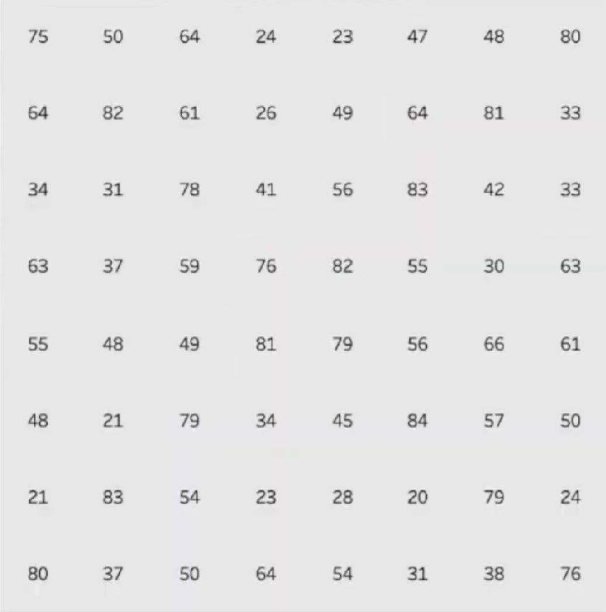
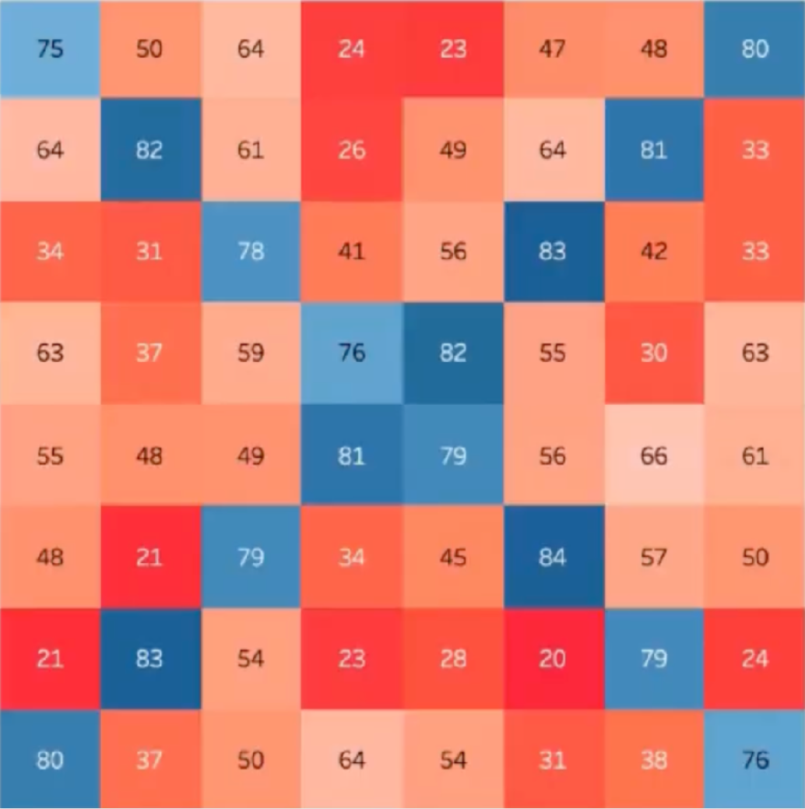
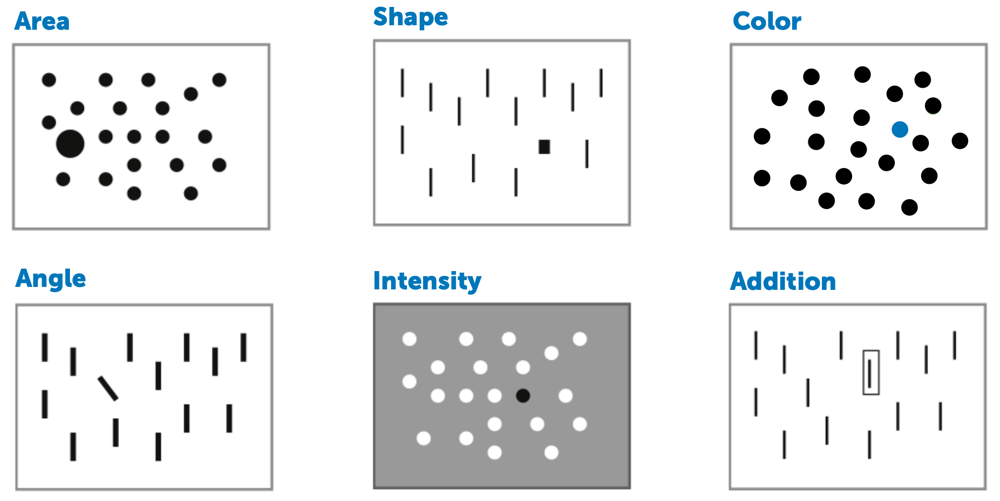
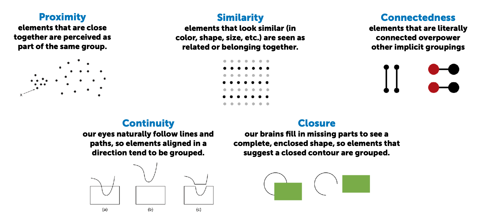

# Some foundational research and concepts rooted in cognitive science

## Humans are hardwired to quickly process visual information for _aggreggate statistics._ As visualizers we want to take advantage of this.

:::: {.columns}
::: {.column}

:::{.fragment}
How many berries are in this picture?
:::

:::{.fragment}
How many are ripe?
:::

:::{.fragment}
Without even having to focus, your brain has turned on a powerful parallel processing engine to analyze the photo on the right.
:::

:::{.fragment}
You can quickly and automatically identify clusters, relative sizes, and the overall number of objects.
:::

:::{.fragment}
We want to _hijack the visual system_ which evolved to aviod predators and forage for food to instead identify abstract relationships in complex data
:::

:::

::: {.column}

:::
::::

## Let's help our friend Homer find a donut that looks different!

{fig-align="center" height="500"}

:::{.fragment}
[What stands out? This is pre-attentive processing in action!]{.small}
:::

## The _language center_ of our brain isn't as fast as the visual processing center and presents a _bottleneck_ to data interpretation

:::: {.columns}

::: {.column}

{height="300"}

Identifying a _pattern_ in a table of numbers is difficult on its own, and requires the language processing center of the brain, which is slower than the visual processing center.

:::

::: {.column}

::: {.fragment}
{height="300"}

Applying conditional formatting makes the pattern jump out immediately.
:::

:::

::::

##

::: {.ba .bw2 .br3 .ph4 .mt4 .b--dark-blue .bg-washed-blue}
**Preattentive processing:** the ability of the low-level human visual system to effortlessly identify certain basic visual properties.
:::

## Preattentive processing

The _set of filters_ we apply to our visual inputs before we pass it to our brain to interpret.

## Gestalt Principles

The _principles_ that codify how we reduce cognitive effort by percieving and organzied whole rather than a collection of parts.

