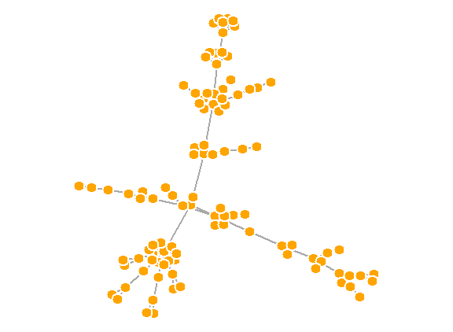
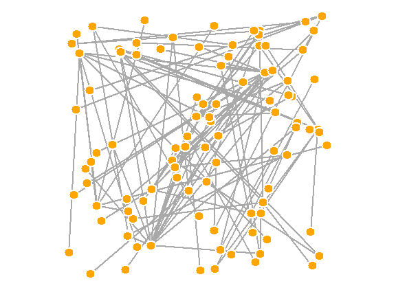
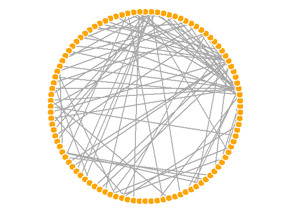
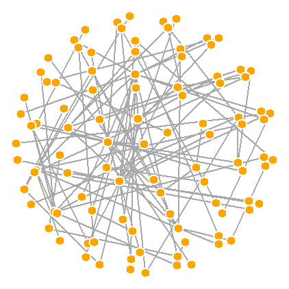
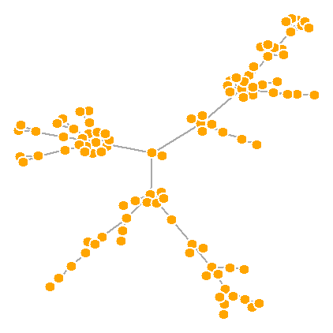
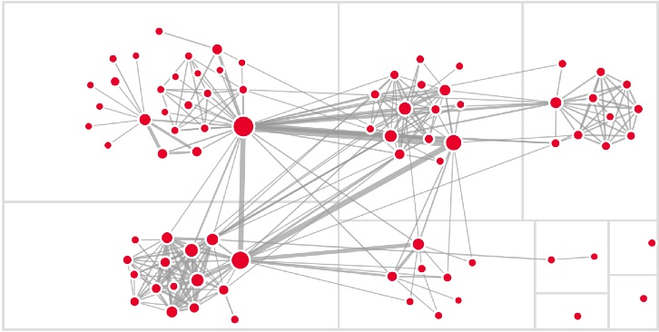
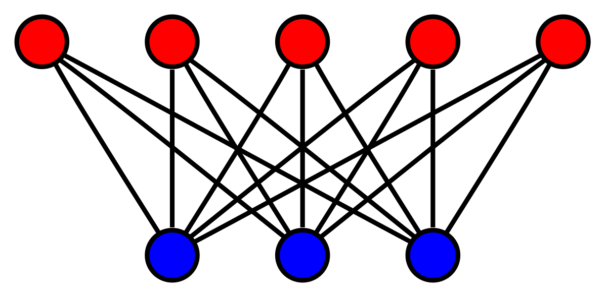
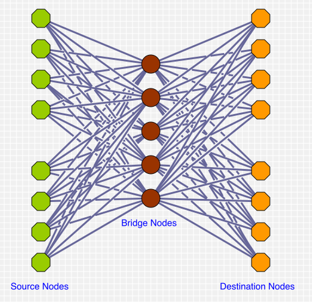

# Thinking about complexity 

## Nature is complex 

- Nature is an interplay of many different factors that result in things we experience
  - Weather today
  - The biosystem we live in
  - Predator-prey interactions
  - Climate 
- Human society and interactions are also complex
  - Many aspects at a macro level (economics, society) are interplays of many different inputs
    and interactions. 
  - Many aspects at a micro level (inside us) are an interplay of many different inputs and interactions
  - Social interactions, cliques and networks
  - The supply chain that gets food to the grocery
  - Your Instagram/X/Facebook network

## Sense-making complexity

Visualization is one road to making sense of complexity

:::: columns
::: {.column width="50%"}
- Finding patterns of similarity or anomaly
- Finding structures in relationships
- Taking a multivariate view
  - Are some relationships related by other factors?


:::
::: {.column width="50%"}

:::
::::

# A visual representation of relationships

## Relationships are one of the basic things we investigate

:::: columns
::: {.column width="50%"}

- Family trees and lineages
- Social networks
- Imports and exports and trade flows
- Immigration flows
- Criminal networks 
- Telecommuncation networks
- Traffic networks 
- Supply chain management

:::
::: {.column width = "50%"}

:::
::::

## We tend to be simplistic

- We get stuck on relationships with one singular outcome that is what we want to understand and/or predict
  - Think of most of machine learning, where we're looking at a single target
- We also often take a myopic view to seeing how one particular feature (time, location) affects one or more outcomes of interest

. . .

[Reality is MUCH MORE COMPLICATED]{.f1 .red .tc}

## An unsupervised view of complexity 

- Are two variables related? (_for every pair of variables you observe_)
- Are some related more strongly to each other than others?
- Are lots of things related to one thing, forming a cluster? (_centrality_)


<!--- [Can we find patterns??]{.absolute right=100 top=100 width="30%" height="80%"} -->


## An unsupervised view of complexity 

- Often we are structuring the data quite simply:
  - Are two variables related? (_for every pair of variables you observe_)
  - Are some related more strongly to each other than others?
  - Are lots of things related to one thing, forming a cluster? (_centrality_)


## Connecting the dots

A relationship can be seen as a connection (**edge**) between two entities (**nodes**)

- Each node can have many edges
- These relationships can be 

:::{layout-ncol=2}

{width="50%"}

{width="80%"}

:::

This is the basic unit of a network visualization: two nodes connected (or not) by an edge

##

<iframe width="100%" height="80%" frameborder="0"
  src="https://observablehq.com/embed/@d3/force-directed-graph/2?cells=chart&banner=false"></iframe>
A network of co-occurrences of characters in _Les Miserables_


## Making sense of complexity through visualization

- One of the main objectives is to try and find "patterns" that can be explained
- Network visualizations take the help of  a multivariate view, adding data encodings that
  might reveal patterns in the relationships 

. . .

::::: {.callout-note icon=false}
###  Manuel Lima's principles

:::: columns 
::: {.column width="50%"}

1. Start with a question
1. Look for relevancy
1. Enable multivariate analysis
1. Embrace time 

:::
::: {.column width="50%"}

5. Enrich you vocabulary
6. Expose grouping
7. Maximize scaling
8. Manage intricacy

:::
::::
:::::


## Network visualizations are hard!!

Until now you've seen plots on _cartesian coordinates_, where each axis encodes values of a variable in the dataset

For networks, there is no such anchor

- All that matters is that the right nodes are connected with edges
- The orientation of the nodes and edges don't have to be specified, nor are they standard

So, how does one plot networks?

- Use optimization to determine the "best" relative positions of each node
- Use some anchoring mechanism (grids, circles, etc) to place nodes

## There are many positioning algorithms

::: {layout="[[1,1,1], [1,1]]"}









:::

## Plotting as an optimization problem

There are many layouts that are used for network visualizations. These layouts determine **where** each node will be located on the canvas.

> The central goal is to minimize the number of edges that cross 

There are different choices one can make given this goal. We'll look through a few common ones.

## Force-directed layout

The force-directed method is the most common layout method used. In this method, the edges are treated as _springs_ and 
optimization is done so that the total foce exerted by the nodes on the springs is _minimized_. This forces some
nodes closer together, especially nodes that have more ties in common, and other nodes further apart. This promotes
the presentation of **clusters** present in the network. 


```{r}
#| echo: true
#| fig-height: 3
#| fig-width: 4
#| fig-caption: "High school friends network"
#| code-fold: true
library(ggraph)
library(tidygraph)
graph <- as_tbl_graph(highschool)
ggraph(graph, layout= 'fr') + 
  geom_edge_link(aes(color = factor(year)), show.legend=FALSE)+
  geom_node_point() +
  theme_graph()
```

## Grouped Clusters

{fig-align="center"}

## Force-directed layout

Two very popular layouts are **Fruchterman-Reingold** and **Kamada Kawai**. 

A really nice example slowing down the process and seeing the effect of changing the spring characteristics is [here](https://observablehq.com/@enjalot/deconstructed-force-directed-graph)

These algorithms usually produce an aesthetically pleasing layout, enabling clusters and symmetries to be seen 

The optimization process does take time, and so these layouts are usually best for graphs with less than 1000 nodes

## Circular layouts

Circular layouts constrain the nodes to lie on a circle, arranging the nodes to minimize edge crossings. (This is the same data as the previous graph)


```{r}
#| echo: true
#| fig-height: 3
#| fig-width: 4
#| fig-caption: "High school friends network"
#| code-fold: true
ggraph(graph, layout = "circle") + 
  geom_edge_link(aes(color = factor(year)), show.legend=F) + 
  geom_node_point() + 
  theme_graph()
```

## Grid layout 

Another possible way of constraining the nodes is to put them on a regular grid

```{r}
#| echo: true
#| fig-height: 3
#| fig-width: 4
#| fig-caption: "High school friends network"
#| code-fold: true
ggraph(graph, layout = "grid") + 
  geom_edge_link(aes(color = factor(year)), show.legend=F) + 
  geom_node_point() + 
  theme_graph()
```

## Arc diagrams

Arc diagrams anchor the nodes on a single axis, and then arrange the nodes to minimize edge crossings


```{r}
#| echo: true
#| fig-height: 3
#| fig-width: 4
#| fig-caption: "High school friends network"
#| code-fold: true
ggraph(graph, layout = "linear") + 
  geom_edge_arc(aes(color = factor(year)), show.legend=F)
```

## Chord diagrams

```{r}
#| echo: true
#| fig-height: 3
#| fig-width: 4
#| fig-caption: "High school friends network"
#| code-fold: true
ggraph(graph, layout = "linear", circular = TRUE) + 
  geom_edge_arc(aes(color = factor(year)), show.legend=F) + 
  coord_fixed()
```

# Hierarchical layouts

If the nature of the relationships between entities is hierarchical (think genealogies, for example), you can choose a hierarchical layout

## Circle packing


```{r}
#| echo: true
#| fig-height: 3
#| fig-width: 4
#| fig-caption: "High school friends network"
#| code-fold: true
graph <- tbl_graph(flare$vertices, flare$edges)
set.seed(1)
ggraph(graph, 'circlepack', weight=size) + 
  geom_node_circle(aes(fill = depth), size = 0.25, n = 50) + 
  coord_fixed()
```

## Multimodal graphs

:::{layout-ncol="2"}



:::

## Trees 

```{r}
#| echo: true
#| fig-height: 3
#| fig-width: 4
#| fig-caption: "High school friends network"
#| code-fold: true
set.seed(1)
ggraph(graph, 'tree') + 
  geom_edge_diagonal()
```

# Relationships as matrices

## Adjacency matrix

If you think about a correlation matrix, you are basically quantifying the degree of a particular kind of relationship between all pairs of entities in a matrix. This concept can be generalized in quite a straightforward manner.

See [this example](https://bost.ocks.org/mike/miserables) from Mike Bostock as a lovely demonstration of what's possible


