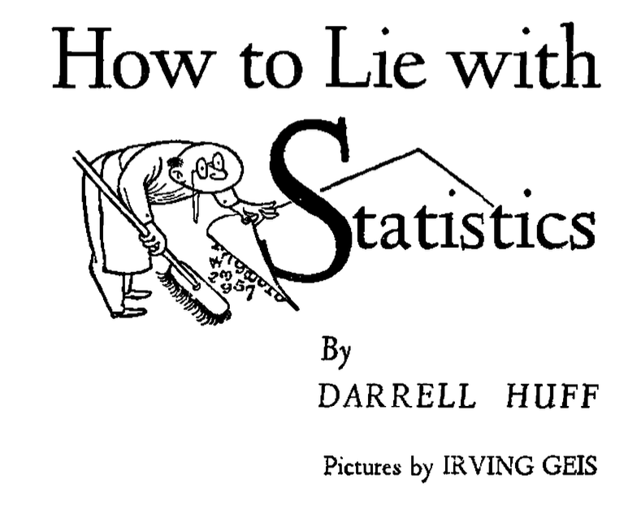
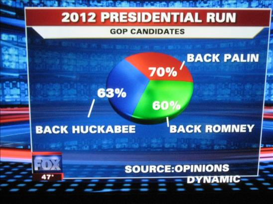
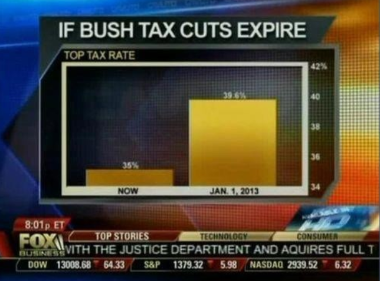
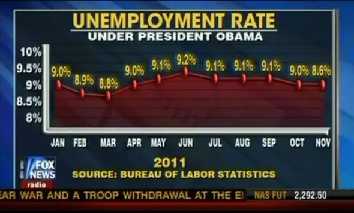
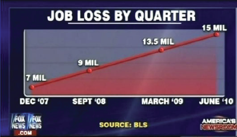
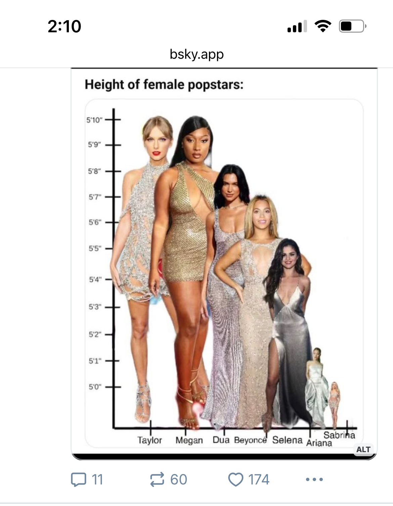

# Be honest!

## Lying with data has been around for a while (1954)

{fig-align="center" height="550"}

## You need to incorporate broad thinking

## Black-Hat visualizations {.smaller}

Term taken from the cyber-security field.

> _Black hats_ are attackers with malicious intent. _Black hat visualization_ is the blanket term we use to describe all of the actions that malicious visualization designers can take to meet their goals.

:::: {.columns}

::: {.column width=25%}
### Intentional breaks of convention

Visualizations may be technically _correct_, however

- Pie chart components may not add up to 100%
- Y-axis may be truncated
- Time scale may be written from right-to-left
- There may be no relation between data to marks/channels
:::

::: {.column width="25%"}
### Data manipulation

- Arbitrarily changing the data and representing false values
- Data is not altered but arbitrarily aggregated, summarized, or filtered
- Simpson's paradox
:::

::: {.column width="25%"}
### Obfuscation

- Make the process of visually extracting particular data values as difficult as possible
- Intentionally complicate the presentation/visualization
- Hide relevant information in a sea of extraneous information
:::

::: {.column width="25%"}
### Nudging

- The viewer is _nudged_ towards or away from a particular intepretation of the data
- Intentionally playing with pre-attentive and gestalt principles
:::
::::

# A gallery

##

{fig-align="center"}

##

{fig-align="center"}

##

{fig-align="center"}

##

{fig-align="center"}

##

{fig-align="center"}

##

{fig-align="center"}
