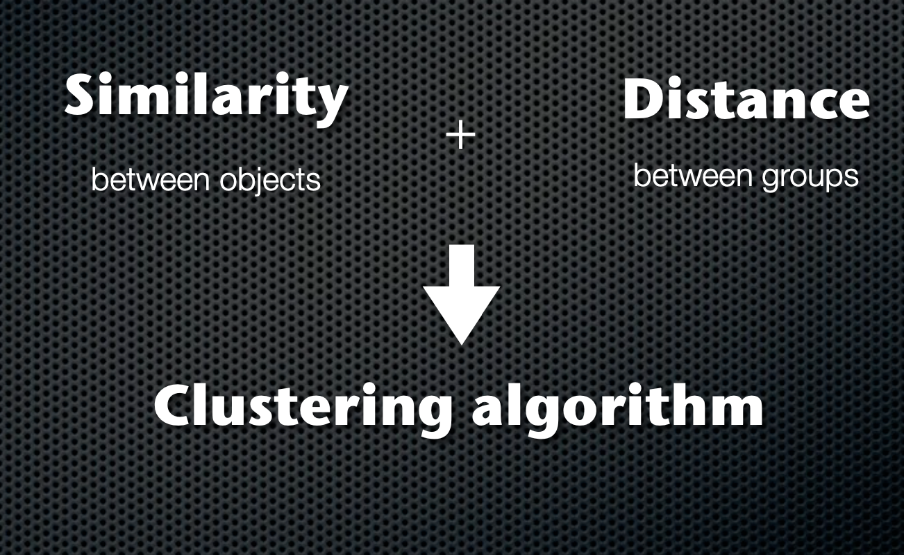
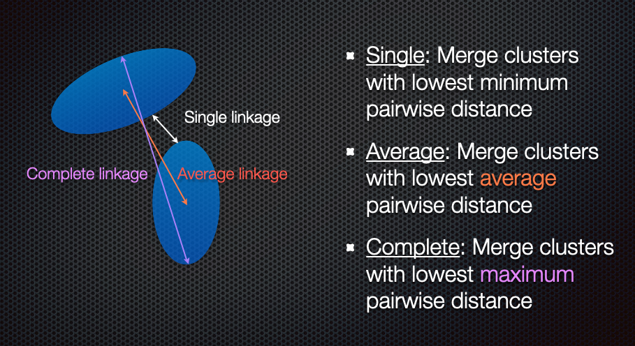
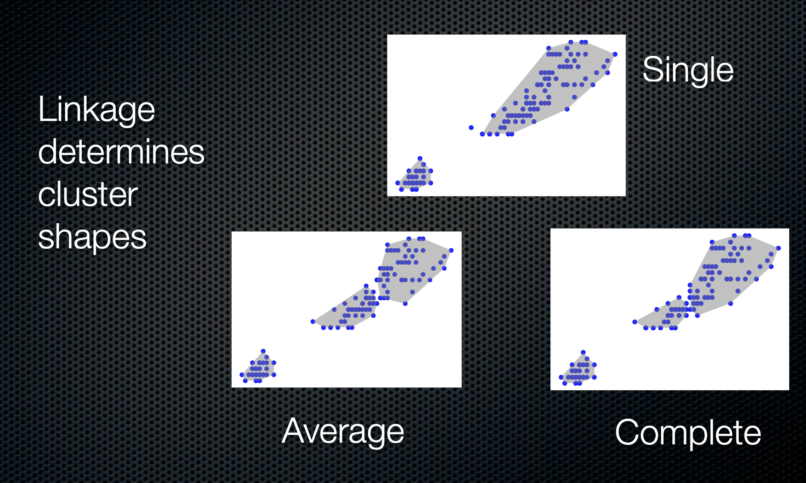
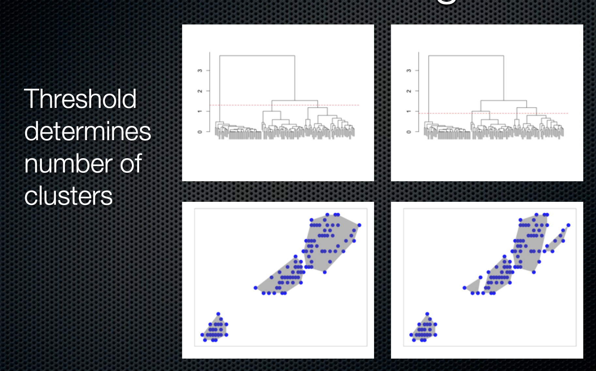
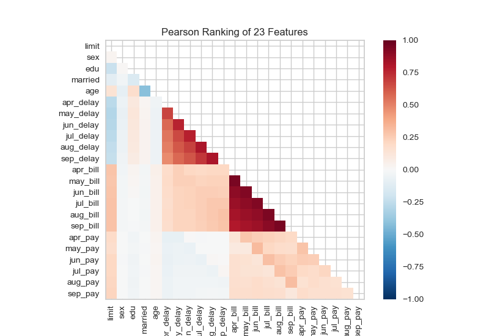
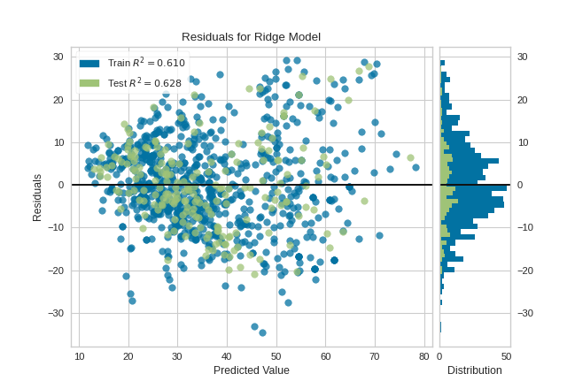
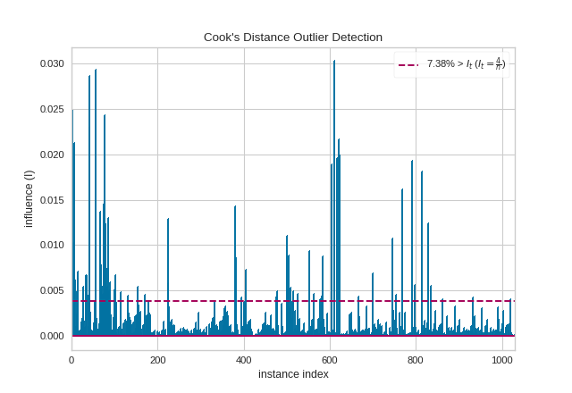

```{r}
#| echo: false
conflicted::conflicts_prefer(dplyr::filter)
```
## Unsupervised learning models

Unsupervised learning are machine learning models where we're looking to
discover patterns within *unlabeled* data.

This can be considered a form of *clustering* or *pattern recognition*

Unsupervised learning can be used

-   to find groups in data where
    -   members within a group are more similar to each other
    -   than with members of another group
-   to detect anomalies/outliers

## Unsupervised learning models

Unsupervised learning can be used to

-   detect subgroups of cancer patients based on biology and biomarkers
-   detect abnormal packets on the internet
-   characterize different customer profiles
-   identify subtle problems on x-rays and medical images
-   characterize different kinds of galaxies

## Unsupervised learning models

Some common methods in unsupervised learning

-   Cluster analysis
    -   Hierarchical clustering
    -   k-means clustering
    -   Density estimation / mixture models
    -   Self-organizing maps
    -   Voronoi diagrams

<p>

-   Data transformations for pattern recognition
    -   PCA
    -   tSNE
    -   UMAP

## Correlograms

::: columns
::: {.column width="50%"}
```{r ML-4ALSE, fig.height=4}
library(ggcorrplot)
library(mlbench)
data("PimaIndiansDiabetes2")
d <- PimaIndiansDiabetes2 %>%
  select(glucose:triceps, mass:age)
cormat <- cor(d, use='pair')
ggcorrplot(cormat, method='circle')
```
:::

::: {.column width="50%"}
```{r ML-5ALSE, fig.height=4}
library(corrgram)
corrgram(d, order=TRUE,
lower.panel=panel.shade,
upper.panel=panel.ellipse,
text.panel=panel.txt)
```
:::
:::

[Using Pima diabetes data]{.aside}

## Correlograms

:::: {.columns}
::: {.column width="50%"}
```{r ML-6ALSE, fig.height=5}
library(ellipse)
library(RColorBrewer)
my_colors <- brewer.pal(5, "Spectral")
my_colors <- colorRampPalette(my_colors)(100)

ord <- order(cormat[1,])
d_ord <- cormat[ord,ord]
plotcorr(d_ord, mar=c(1,1,1,1), col=my_colors[d_ord*50+50])
```
:::

::::

[Using Pima diabetes data]{.aside}

## Hierarchical clustering

### Agglomerative clustering

::: columns
::: {.column width="50%"}
1.  Start with each member in its own cluster
2.  Join clusters based on distance between (linkage)
3.  Visualize using trees
:::

::: {.column width="50%"}

:::
:::

## Hierarchical clustering

### Agglomerative clustering

::: columns
::: {.column width="50%"}
1.  Start with each member in its own cluster
2.  Join clusters based on distance between (linkage)
3.  Visualize using trees

---

-   Euclidean distance (root mean square distance)
-   Correlation distance (1 - correlation)
-   Many other choices
:::

::: {.column width="50%"}

:::
:::

## Hierarchical clustering

### Agglomerative clustering

::: columns
::: {.column width="50%"}
1.  Start with each member in its own cluster
2.  Join clusters based on distance between (linkage)
3.  Visualize using trees
:::

::: {.column width="50%"}

:::
:::

## Hierarchical clustering

### Agglomerative clustering

::: columns
::: {.column width="50%"}
1.  Start with each member in its own cluster
2.  Join clusters based on distance between (linkage)
3.  Visualize using trees
:::

::: {.column width="50%"}

:::
:::

[More details
[here](https://www.dropbox.com/s/okp3t58zu9vfs49/ClusteringDSDC.pdf?dl=0)]{.aside}

## Hierarchical clustering ()

::: columns
::: {.column width="50%"}
```{r ML-7, fig.height=5}
iris %>% janitor::clean_names() %>%
  select(-species) %>%
  dist() %>%
  hclust(method='complete') -> iris_cl
  as.dendrogram(iris_cl) -> dend
plot(dend)
```
:::

::: {.column width="50%"}
```{r ML-8, fig.height=5}
library(dendextend)
dend %>%
  set('branches_col', 'grey') %>%
  set('branches_lwd', 3) %>%
  set('labels_col','orange') %>%
  set('labels_cex', 0.8) %>%
  plot()
```
:::
:::

## Hierarchical clustering ()

::: columns
::: {.column width="50%"}
```{r ML-9ALSE, fig.height=5}
dend %>%
  set("labels_col", value = c("skyblue", "orange", "grey"), k=3) %>%
  set("branches_k_color", value = c("skyblue", "orange", "grey"), k = 3) %>%
  plot(axes=FALSE)

rect.dendrogram( dend, k=3, lty = 5, lwd = 0, which=3, col=rgb(0.1, 0.2, 0.4, 0.1) )
```
:::

::: {.column width="50%"}
```{r ML-10ALSE, fig.height=6}
dend %>%
  set("labels_col", value = c("skyblue", "orange", "grey"), k=3) %>%
  set("branches_k_color", value = c("skyblue", "orange", "grey"), k = 3) %>%
  plot(horiz=TRUE, axes=FALSE)
abline(v = 350, lty = 2)
```
:::
:::

::: {.aside}
The `rgb` function specifies color as `rgb(red, green, blue, alpha)`
:::

## Hierarchical clustering ()

::: columns
::: {.column width="50%"}
```{python ML-11,  fig.height=5}
import pandas as pd
from matplotlib import pyplot as plt
from scipy.cluster import hierarchy
import numpy as np
import seaborn as sns

# Data set
iris = sns.load_dataset('iris')


df = iris.iloc[:,:4]

# Calculate the distance between each sample
Z = hierarchy.linkage(df, 'average')
ind = hierarchy.cut_tree(Z,3)

# Plot with Custom leaves
hierarchy.set_link_color_palette(['m','b','g'])
hierarchy.dendrogram(Z, leaf_rotation=90, leaf_font_size=8, color_threshold=1.8, above_threshold_color='grey');
plt.show()

```
:::

::: {.column width="50%"}
```{python ML-12, fig.height=5, eval=T}
hierarchy.set_link_color_palette(['m','b','g'])
hierarchy.dendrogram(Z, orientation="left", color_threshold=1.8, above_threshold_color='grey' );
plt.show()
```
:::
:::

## Comparing linkages

```{r ML-13, out.height=400, out.width=600}
d = iris %>% janitor::clean_names() %>% select(-species) %>% dist()
cl1 <- hclust(d, method='single')
cl2 = hclust(d, method='average')
cl3 = hclust(d, method='complete')

iris1 <- iris %>% janitor::clean_names() %>% mutate(ind1=factor(cutree(cl1, 3)), ind2=factor(cutree(cl2,3)),
                         ind3=factor(cutree(cl3,3)))
plt1 <- ggplot(iris1, aes(x=sepal_length,y=sepal_width, color=ind1))+geom_point()+
  stat_ellipse() + labs(x = 'sepal length',y='sepal width', title='Linkage: single')+
  theme(legend.position='none')
plt2 <- ggplot(iris1, aes(x=sepal_length,y=sepal_width, color=ind2))+geom_point()+
  stat_ellipse()+ labs(x = 'sepal length',y='sepal width', title='Linkage: average')+
  theme(legend.position='none')
plt3 <- ggplot(iris1, aes(x=sepal_length,y=sepal_width, color=ind3))+geom_point()+
  stat_ellipse()+ labs(x = 'sepal length',y='sepal width', title='Linkage: complete')+
  theme(legend.position='none')
library(cowplot)
plot_grid(plt1, plt2, plt3, ncol=2)
```

## k-means clustering

::: columns
::: {.column width="50%"}
-   Choose number of clusters **first**
-   Optimize clusters so that
    -   Within cluster variability is minimized
    -   Between cluster variability is maximized

Typically k-means clustering looks at spherical clusters
:::

::: {.column width="50%"}
```{r ML-14}
iris %>% janitor::clean_names() %>%
  select(-species) %>%
  as.matrix() %>%
  kmeans(centers=3)-> cl
iris %>% janitor::clean_names() %>%
  select(-species) %>%
  mutate(cl = as.factor(cl$cluster)) %>%
  ggplot(aes(sepal_length, sepal_width, color=cl))+
    geom_point() +
    stat_ellipse() +
    labs(x = 'Sepal length', y = 'Sepal Width')+
    theme(legend.position='none')
```
:::
:::

## Evaluating cluster analysis: Silhouette plots

::: {.callout-note}
### Silhouette statistic
The silhouette value is a measure of how similar an object is to its own cluster (cohesion) compared to other clusters (separation). The silhouette ranges from −1 to +1, where a high value indicates that the object is well matched to its own cluster and poorly matched to neighboring clusters. If most objects have a high value, then the clustering configuration is appropriate. If many points have a low or negative value, then the clustering configuration may have too many or too few clusters. ([Wikipedia](https://en.wikipedia.org/wiki/Silhouette_(clustering)))
:::

```{python}
#| output-location: column
#| code-fold: false
from sklearn.cluster import KMeans

from yellowbrick.cluster import silhouette_visualizer
from yellowbrick.datasets import load_credit

# Load a clustering dataset
X, y = load_credit()

# Specify rows to cluster: under 40 y/o and have either graduate or university education
X = X[(X['age'] <= 40) & (X['edu'].isin([1,2]))]

# Use the quick method and immediately show the figure
silhouette_visualizer(KMeans(5, random_state=42), X, colors='yellowbrick')
```

```{python}
#| eval: false
#| code-summary: "More granular code (different data)"
from sklearn.cluster import KMeans

from yellowbrick.cluster import SilhouetteVisualizer
from yellowbrick.datasets import load_nfl

# Load a clustering dataset
X, y = load_nfl()

# Specify the features to use for clustering
features = ['Rec', 'Yds', 'TD', 'Fmb', 'Ctch_Rate']
X = X.query('Tgt >= 20')[features]

# Instantiate the clustering model and visualizer
model = KMeans(5, random_state=42)
visualizer = SilhouetteVisualizer(model, colors='yellowbrick')

visualizer.fit(X)        # Fit the data to the visualizer
visualizer.show()        # Finalize and render the figure
```

## Evaluating cluster analysis: Elbow plot

```{python}
#| output-location: column
#| code-fold: false

from sklearn.cluster import KMeans
from yellowbrick.cluster.elbow import kelbow_visualizer
from yellowbrick.datasets.loaders import load_nfl

X, y = load_nfl()

# Use the quick method and immediately show the figure
kelbow_visualizer(KMeans(random_state=4), X, k=(2,10))
```

```{python}
#| code-fold: true
#| eval: false
#| code-summary: "More granular code"
from sklearn.cluster import KMeans
from sklearn.datasets import make_blobs

from yellowbrick.cluster import KElbowVisualizer

# Generate synthetic dataset with 8 random clusters
X, y = load_nfl()

# Instantiate the clustering model and visualizer
model = KMeans()
visualizer = KElbowVisualizer(
    model, k=(2,10), metric='calinski_harabasz', timings=False
)

visualizer.fit(X)        # Fit the data to the visualizer
visualizer.show()        # Finalize and render the figure
```

## Heatmaps

```{r ML-15 , out.height=400, out.width=600}
data <- as.matrix(mtcars)
library(RColorBrewer)
heatmap(data, scale='column', cexRow=1, col=colorRampPalette(brewer.pal(8,'Blues'))(25))

```

## Heatmaps

::: columns
::: {.column width="50%"}
Using a complex heatmap to understand the prevalence of measles in the US over
time and the effect of introducing the vaccine.
:::

::: {.column width="50%"}
```{r ML-16, fig.height=6}
source('topics/ml/_complexhm.R')
```
:::
:::

::: {.aside}
- Available in [complexhm.R](slides/topics/ml/lides/topics/ml/complexhm.R)
- ComplexHeatmap is quite feature complete, and we can see all the available features [here](https://jokergoo.github.io/ComplexHeatmap-reference/book/index.html)
:::

## Heatmaps ()

```{python}
#| code-line-numbers: "12-13"
#| out-height: "500px"
#| out-width: "800px"
# Libraries
import seaborn as sns
import pandas as pd
from matplotlib import pyplot as plt

# Data set
url = 'https://raw.githubusercontent.com/holtzy/The-Python-Graph-Gallery/master/static/data/mtcars.csv'
df = pd.read_csv(url)
df = df.set_index('model')

# Prepare a vector of color mapped to the 'cyl' column
my_palette = dict(zip(df.cyl.unique(), ["orange","yellow","brown"]))
row_colors = df.cyl.map(my_palette)

# plot
sns.clustermap(df, metric="correlation", method="single", cmap="Blues", standard_scale=1, row_colors=row_colors);
```

## PCA

PCA (principal components analysis) is a method to "rotate" the data based on
variability of the data cloud, resulting in fewer variables that capture the
information in the data cloud. It's a popular method of **dimension reduction**

:::: columns
::: {.column width="50%"}
PCA first finds the direction in which there is maximum variance

Then finds the directional orthogonal (uncorrelated) to the first direction with
the most variance

And so on

In this case, these two new variables capture 99.7% of the variability in the
iris measurements

It's not uncommon that PCA separates groups along one of the axes
:::

::: {.column width="50%"}

```{r ML-17, fig.height=4}
iris <- iris %>% janitor::clean_names()
iris = iris[!duplicated(iris),]
df <- iris %>% select(-species) %>% t()
pr = prcomp(df)
d <- as.data.frame(pr$rotation) %>% mutate(species = iris$species)
ggplot(d, aes(PC1, PC2, color=species)) + geom_point(size=5)
```
:::
::::

## tSNE

tSNE (t-distributed stochastic neighbor embedding) is a machine learning
algorithm to visualize high-dimensional data.

:::: columns
::: {.column width="50%"}
It is a **non-linear** dimension reduction technique, as opposed to PCA, which
is a **linear** technique

tSNE is also probabilistic, so unless you fix the seed of the random number
generator, you will get different results on different runs
:::

::: {.column width="50%"}
```{r ML-18, fig.height=4, eval=T}
set.seed(3457)
d <- as.data.frame(Rtsne::Rtsne(t(df), perplex=3)$Y) %>%
  mutate(species = iris$species)
ggplot(d, aes(V1, V2, color=species))+geom_point(size=5)
```
:::
::::

[Using iris]{.aside}

## UMAP

UMAP (uniform manifold approximation and projection) is another non-linear
dimension-reduction technique that is increasingly used in bioinformatics to
cluster high-dimensional data. It is believed to preserve both local and global
structure and give a "fair" represenation of the data.

```{r ML-19, eval=T}
bl <- umap::umap(t(df))
out <- as.data.frame(bl$layout) %>% mutate(species=iris$species)
ggplot(out, aes(x = V1, y=V2, color=species)) + geom_point()
```


[Using iris]{.aside}

## in Python

```{python}
#| label: ML-20
#| eval: false
import seaborn as sns
from sklearn.decomposition import PCA
pca = PCA()
iris = sns.load_dataset('iris')
df = iris.iloc[:,:4]

prcomp = pca.fit_transform(df)

out = pd.DataFrame(prcomp, columns = ['PCA1','PCA2','PCA3','PCA4'])
out = pd.concat((out, iris.species), axis=1)

fig,ax = plt.subplots(1,3, sharex=False, sharey=False)
sns.scatterplot(data=out, x='PCA1',y='PCA2', hue='species', ax=ax[0])
ax[0].set_ylabel('')
ax[0].set_xlabel('')
ax[0].set_title('PCA')

from sklearn.manifold import TSNE

tsne = TSNE(n_components=2, perplexity=5, n_iter=300)
out = pd.DataFrame(tsne.fit_transform(df), columns = ['TSNE1','TSNE2'])
out = pd.concat((out, iris.species), axis=1)

sns.scatterplot(data = out, x = 'TSNE1', y = 'TSNE2', hue='species', ax=ax[1])
ax[1].set_ylabel('')
ax[1].set_xlabel('')
ax[1].set_title('t-SNE')

from umap import UMAP
u = UMAP()
embedding = pd.DataFrame(u.fit_transform(df), columns = ['UMAP1','UMAP2'])
embedding = pd.concat((embedding, iris.species), axis=1)
sns.scatterplot(data=embedding, x='UMAP1', y='UMAP2', hue='species', ax=ax[2])
ax[2].set_ylabel('')
ax[2].set_xlabel('')
ax[2].set_title('UMAP')

plt.show()

```


## Using yellowbrick ()

:::: {.columns}

::: {.column width="47%"}
### PCA

```{python}
#| label: "ybpca"
#| code-line-numbers: "|8"
from yellowbrick.datasets import load_credit
from yellowbrick.features import PCA

# Specify the features of interest and the target
X, y = load_credit();
classes = ['account in default', 'current with bills']

visualizer = PCA(scale=True, classes=classes);
visualizer.fit_transform(X, y);
visualizer.show()
```
:::

::: {.column width="47%"}
### T-SNE
```{python}
#| code-line-numbers: "|8"
#| label: "ybtsne"
from yellowbrick.datasets import load_credit
from yellowbrick.features import Manifold

# Specify the features of interest and the target
X, y = load_credit();
classes = ['account in default', 'current with bills']

visualizer = Manifold(manifold='tsne', classes = classes);
visualizer.fit_transform(X, y);
visualizer.show()
```
:::

::::

## Voronoi diagrams

::: columns
::: {.column width="50%"}
A Voronoi diagram splits up a plane based on a set of original points. Each
polygon, or Voronoi cell, contains an original point and all areas that are
closer to that point than any other.

This can be used in different contexts, but especially with geospatial data

Here, we're plotting the locations of airports in the USA
:::

::: {.column width="50%"}
```{r ML-21}
airports <- read.csv("topics/ml/data/airport-locations.tsv", sep="\t", stringsAsFactors=FALSE)
source("topics/ml/_latlong2state.R")
airports$state <- latlong2state(airports[,c("longitude", "latitude")])
airports_contig <- na.omit(airports)
# Projection
library(mapproj)
airports_projected <- mapproject(airports_contig$longitude, airports_contig$latitude, "albers", param=c(39,45))
par(mar=c(0,0,0,0))
plot(airports_projected, asp=1, type="n", bty="n", xlab="", ylab="", axes=FALSE)
points(airports_projected, pch=20, cex=0.1, col="red")
```
:::
:::

::: notes
Add in JS voronoi from big data slides
:::

## Voronoi diagrams

::: columns
::: {.column width="50%"}
A Voronoi diagram splits up a plane based on a set of original points. Each
polygon, or Voronoi cell, contains an original point and all areas that are
closer to that point than any other.

This can be used in different contexts, but especially with geospatial data
:::

::: {.column width="50%"}
```{r ML-22}
library(deldir)
par(mar=c(0,0,0,0))
plot(airports_projected, asp=1, type="n", bty="n", xlab="", ylab="", axes=FALSE)
points(airports_projected, pch=20, cex=0.1, col="red")
vtess <- deldir(airports_projected$x, airports_projected$y)
plot(vtess, wlines="tess", wpoints="none", labelPts=FALSE, add=TRUE, lty=1)

```
:::
:::

[Credit: Nathan Yau]{.aside}

Also, see [here](https://observablehq.com/d/21f8266868bdd676) for a D3 version

# Regression models

## Feature understanding

One of the things we need to understand (beyond patterns we may see in PCA and other
dimension reduction methods) is whether we have sets of correlated features that
are either explanatory or serendipitious. One way of visualizing this is using
a two-dimensional ranking of features.

```{python}
#| eval: false
from yellowbrick.datasets import load_credit
from yellowbrick.features import Rank2D

# Load the credit dataset
X, y = load_credit()

# Instantiate the visualizer with the Pearson ranking algorithm
visualizer = Rank2D()

visualizer.fit(X, y)           # Fit the data to the visualizer
visualizer.transform(X)        # Transform the data
visualizer.show()              # Finalize and render the figure
```



Something quite similar is seen in genetics in a _linkage disequilibrium_ or _LD_ plot.


## Regression models

We will use the diamonds dataset for the supervised learning section. This data
is available in R by `library(ggplot2); data(diamonds)` and in Python by
`import seaborn as sns; diamonds = sns.load_dataset("diamonds")`.

Our initial regression model will look at price as a function of carat, cut,
color, clarity and depth.

::: panel-tabset
### R

```{r ML-23}
#| code-fold: false
diamonds <- diamonds %>%
  mutate(across(c(cut, color, clarity), ~factor(., ordered=F)))
model <- lm(log(price) ~ log(carat) + cut + color + clarity + depth,
            data=diamonds)
```

### Python

```{python ML-24}
#| code-fold: false
import statsmodels.api as sm
import statsmodels.formula.api as smf
import seaborn as sns
import numpy as np
diamonds = sns.load_dataset('diamonds')
model = smf.ols('np.log(price) ~ np.log(carat)+ C(cut, Treatment("Fair")) + C(color, Treatment("D")) + C(clarity, Treatment("I1")) + depth', data=diamonds)
result = model.fit()

```
:::

## Model results

```{r ML-25ALSE}
#| code-fold: false
library(gtsummary)
theme_gtsummary_compact()
gtsummary::tbl_regression(model) %>% as_gt()
```

## Model results

This is a large model, so it would be nice to make the representation a bit more
compact using graphics.

We'll use a tidy representation of the results using **broom** in R

```{r ML-26}
#| code-fold: false
mod_tidy <- broom::tidy(model)
mod_aug <- broom::augment(model)
```

```{r ML-27}
#| echo: false
library(extrafont)
theme_set(theme_classic()+
            theme(axis.title=element_text(size=18, family = 'Avenir'),
                  axis.text = element_text(size=16, family='Avenir'),
                  title = element_text(size=24, family='Avenir'),
                  plot.margin = unit(c(0.05,0.05,0.05,0.05), 'npc')))
```

## Coefficient plots

```{r a2}
#| output-location: column
#| code-fold: false
library(coefplot)
coefplot::coefplot.lm(model) +
  labs(x='Coefficient', y = 'Predictor')
```

**coefplot** produces a **ggplot2** graphic, so we could add to this using what
we know about ggplot

## Coefficient plots

```{r a3}
#| output-location: column
#| code-fold: false

ggplot(mod_tidy %>% filter(term != '(Intercept)'),
       aes(x = term, y = estimate,
           ymin = estimate - 2*std.error,
           ymax = estimate + 2*std.error))+
  geom_pointrange(color='blue')+
  labs(x = 'Predictor', y = 'Coefficient',
       title='Coefficient Plot')+
  geom_hline(yintercept=0, linetype=2)+
  coord_flip()
```

There is actually a confidence interval being drawn, but it's too small to see
compared to the dot representing the estimate

## Coefficient plots

Here, I'm taking a 1% sample of the diamonds data for modeling. This increases
the magnitude of the standard errors of the coefficients

```{r a5}
#| output-location: column
#| code-fold: false
set.seed(2405)
diamonds2 <- slice_sample(diamonds, prop=0.01) #<<
model2 <- lm(log(price) ~ log(carat) + cut + color + clarity + depth,
            data=diamonds2)
model2_tidy <- broom::tidy(model2)
ggplot(model2_tidy %>% filter(term!= '(Intercept)'),
       aes(x =term, y = estimate,
           ymin = estimate - 2*std.error,
           ymax = estimate + 2*std.error))+
  geom_pointrange(color='blue')+
  labs(x = 'Predictor', y = 'Coefficient',
       title = 'Coefficient Plot')+
  geom_hline(yintercept = 0, linetype=2)+
  coord_flip()
```

## Coefficient plots

We can get a nicer, better formatted coefficient plot using `ggstats`

```{r}
library(ggstats)
ggcoef_model(model2)
```

## Marginal effects plots

```{r b1}
#| output-location: column
#| code-fold: false
library(ggeffects)
pr <- ggpredict(model, 'carat', condition = c(color = 'F'))
ggplot(as.data.frame(pr),
       aes(x = x, y = predicted))+
  geom_line()+
  geom_ribbon(aes(ymin = conf.low,
                  ymax = conf.high))+
  scale_y_continuous('Predicted price',
                     labels = scales::label_dollar())+
  labs(x='Carat')

```

The other variables are held at the following values:

```{r ML-31}
library(ggeffects)
pr <- ggpredict(model, 'carat')
knitr::kable(as.data.frame(attr(pr, 'constant.values')))
```

## Marginal effects plots

```{r}
#| output-location: column
#| code-fold: false

pr <- ggpredict(model, 'cut')
ggplot(as.data.frame(pr),
       aes(x = x, y = predicted,
           ymin=conf.low,ymax=conf.high))+
  geom_point()+
  geom_errorbar(width=.2)+
  scale_y_continuous('Predicted price',
                     labels = scales::label_dollar())+
  labs(x='Cut')
```

You can also draw marginal effects for categorical predictors

## Marginal effect plots

```{r }
#| output-location: column
#| code-fold: false
pr <- ggpredict(model, c('carat','color'))
ggplot(as.data.frame(pr),
       aes(x=x, y =predicted,
           ymin=conf.low, ymax=conf.high))+
  geom_line(aes(color = group))+
  scale_x_continuous('Carat')+
  scale_y_continuous('Predicted price',
                     labels = scales::label_dollar())+
  scale_color_viridis_d('Color')

```

You can also look at marginal effects for one variable conditional on one or
more other variables

# Model diagnostics

## Residual plots


```{r c1}
#| output-location: column
#| code-fold: false
ggplot(mod_aug,
       aes(x=.fitted, y = .std.resid))+
  geom_point()+
  geom_hline(yintercept=0,
             linetype=2,
             color='blue')+
  geom_smooth(color='red')+
  labs(x='Predicted values',
       y = 'Standardized residuals')
```

We expect, in well-fitting models, that the residuals are on average 0, and that
they have no pattern with the predicted/fitted values

## Q-Q plots for residuals

::: columns
::: {.column width="50%"}
An assumption of linear (OLS) regression is that the errors are distributed as a
Gaussian (normal) distribution.

This can be visually checked using a quantile-quantile (Q-Q) plot.

If the residuals follow a Gaussian distribution, this plot should be close to
the diagonal line
:::

::: {.column width="50%"}
```{r ML-36, fig.height=5}
ggplot(mod_aug, aes(sample=.std.resid))+stat_qq()+
  geom_abline(linetype=2)+
  labs(title = 'Residual Q-Q plot', y = 'Standardized residuals')
```
:::
:::

## Residual plots (yellowbrick)

We can see both the pattern and histogram of residuals

```{python}
#| eval: false
from sklearn.linear_model import LinearRegression
from sklearn.model_selection import train_test_split

from yellowbrick.datasets import load_concrete
from yellowbrick.regressor import ResidualsPlot

# Load a regression dataset
X, y = load_concrete()

# Create the train and test data
X_train, X_test, y_train, y_test = train_test_split(X, y, test_size=0.2, random_state=42)

# Instantiate the linear model and visualizer
model = LinearRegression()
visualizer = ResidualsPlot(model, hist=False, qqplot=True)

visualizer.fit(X_train, y_train)  # Fit the training data to the visualizer
visualizer.score(X_test, y_test)  # Evaluate the model on the test data
visualizer.show()                 # Finalize and render the figure
```



## Cook's distance

**Cook's distance** or Cook's D is a commonly used estimate of the influence of
a data point when performing a least-squares regression analysis

Cook's distance measures the effect of deleting a given observation. Points with
a large Cook's distance are considered to merit closer examination in the
analysis.

::: {.panel-tabset}

### R

```{r ML-37, fig.height=5}
ggplot(mod_aug, aes(x = seq_along(.cooksd), .cooksd))+
  geom_col(fill = 'red') +
  labs(x='Obs number', y = "Cook's distance")
```

### Python

```{python}
#| eval: false
from yellowbrick.regressor import CooksDistance
from yellowbrick.datasets import load_concrete

# Load the regression dataset
X, y = load_concrete()

# Instantiate and fit the visualizer
visualizer = CooksDistance()
visualizer.fit(X, y)
visualizer.show()
```


:::


::: {.notes}
There is an issue with yellowbrick, so some plots aren't rendering. I've taken plots from the website
:::

## Leverage

::: columns
::: {.column width="50%"}
Leverage is a measure of how far away the independent variable values of an
observation are from those of the other observations.

High-leverage points are those observations, if any, made at extreme or outlying
values of the independent variables such that the lack of neighboring
observations means that the fitted regression model will pass close to that
particular observation.
:::

::: {.column width="50%"}
```{r ML-38,fig.height=5}
ggplot(mod_aug, aes(.hat, .std.resid))+
  geom_point(aes(size=.cooksd))+
  geom_smooth(se=F) +
  labs(x = 'Leverage', y = 'Residuals', size="Cook's D")
```
:::
:::

# Machine learning models

## Describing ML models

In this section, we will consider a classification machine learning model to
predict breast cancer from various pathological variables, which is available as
`BreastCancer` in the **mlbench** package in R

We will fit a Random Forest model to this data

```{python}
import pandas as pd
import numpy as np
import matplotlib.pyplot as plt
import seaborn as sns
from sklearn.ensemble import RandomForestClassifier
from sklearn.model_selection import train_test_split
from sklearn.metrics import ConfusionMatrixDisplay, PrecisionRecallDisplay, RocCurveDisplay
from sklearn.inspection import PartialDependenceDisplay
from sklearn.calibration import calibration_curve
from yellowbrick.model_selection import FeatureImportances

brca = pd.read_csv('topics/ml/data/brca.csv').dropna()
y = brca.pop('Class').astype('category').cat.codes.values
X = brca.values

rfc = RandomForestClassifier();
X_train, X_test, y_train, y_test = train_test_split(X, y, test_size=0.3, random_state=44)
rfc.fit(X_train, y_train);

```

# Model description

## Decision trees

```{r ML-40}
library(partykit)
library(mlbench)
data("BreastCancer")
BreastCancer %>% select(-Id) %>%
  rpart(Class~., data=.) %>% partykit::as.party()->bl
plot(bl)

```

[Uses `partykit` package]{.aside}

# Model introspection

## Feature importances

::: columns
::: {.column width="50%"}
Feature importances are typically a measure of how much a predictive performance
metric is reduced when the values of the a variable is scrambled (permuted).
They represent the predictive power of a variable

::: {.callout-caution }
Feature importances and p-values aren't necessarily related; a variable can be
predictive and not statistically significant and vice versa. The former depends
on the size of the effect, and the latter depends on the signal-to-noise ratio
:::
:::

::: {.column width="50%"}
```{python ML-41}
#| fig-height: 5
fi = pd.DataFrame({'features': brca.columns, 'importance': rfc.feature_importances_})
sns.barplot(data = fi, x = 'importance', y = 'features', color='blue')
plt.show()
```
:::
:::

## Feature importances

```{python ML-42}
#| fig-height: 5
viz = FeatureImportances(RandomForestClassifier());
viz.fit(brca,y);
viz.show();
```

## Regularization (lasso/ridge/elastic net)

::: columns
::: {.column width="50%"}
Lasso regression fits a penalized regression with $L_1$ penalties on the
coefficients. This model minimizes

$$
||y-X\beta||^2_2 + \lambda ||\beta||_1
$$ where $||x||_1 = \sum |x_i|/n$ and $||x||_2 = \sqrt{\sum x_i^2/n}$

This forces slope coefficients to 0 as the value of $\lambda$ changes.

The plot shows the values of the slope coefficients for different values of
$\log(\lambda)$
:::

::: {.column width="50%"}
```{r ML-43ALSE, fig.height=5}
library(mlbench)
library(glmnet)
data("BreastCancer")
X = BreastCancer %>%
  filter(complete.cases(.)) %>%
  select(-Id, -Class) %>%
  mutate(across(everything(), ~as.numeric(as.character(.)))) %>%
  as.matrix()
y <- BreastCancer %>%
  filter(complete.cases(.)) %>%
  pull(Class) %>% as.numeric()
fit <- glmnet(X, y, family='binomial')
plot(fit, 'lambda', main = 'Lasso regression', label = T)

```
:::
:::

## Regularization (lasso/ridge/elastic net)

::: columns
::: {.column width="50%"}
The elastic net regression (ELR) minimizes the penalized objective function

$$
||y-X\beta||^2_2 + \alpha\lambda ||\beta||_1 + \frac{(1-\alpha)\lambda}{2} ||\beta||_2^2
$$ Notice that in ELR, the coefficients move to 0 at a slower rate than for
lasso regression

-   $\alpha=1$: Lasso regression
-   $\alpha=0$: Ridge regression

Regularized regression is typically used for variable selection in regression
models, where $\lambda$ is estimated via cross-validation

Note that the actual coefficients are provably biased, so they are not
interpreted.
:::

::: {.column width="50%"}
```{r ML-44ALSE, fig.height=5}
library(mlbench)
data("BreastCancer")
X = BreastCancer %>%
  filter(complete.cases(.)) %>%
  select(-Id, -Class) %>%
  mutate(across(everything(), ~as.numeric(as.character(.)))) %>%
  as.matrix()
y <- BreastCancer %>%
  filter(complete.cases(.)) %>%
  pull(Class) %>% as.numeric()
fit <- glmnet(X, y, family='binomial', alpha = 0.5)
plot(fit, 'lambda', main = 'ELR (alpha=0.5)', label = T)

```
:::
:::

# Model prediction

## ROC curves

::: columns
::: {.column width="50%"}
A receiver operating characteristic (ROC) curve is a graphical plot that
illustrates the diagnostic ability of a binary classifier system as its
discrimination threshold is varied.

The ROC curve is created by plotting the true positive rate (TPR) against the
false positive rate (FPR) at various threshold settings. The true-positive rate
is also known as sensitivity, recall or probability of detection in machine
learning. The false-positive rate is also known as probability of false alarm
and can be calculated as (1 − specificity).

A classifier no better than chance will have a ROC curve along the unit diagonal
:::

::: {.column width="50%"}
```{python ML-45, fig.height=5}
RocCurveDisplay.from_estimator(rfc, X_test, y_test);
plt.plot([0,1],[0,1], '--')
plt.show()
```
:::
:::

## Precision-recall curves

::: columns
::: {.column width="50%"}
-   Precision = positive predictive value = P(True + \| prediction +)
-   Recall = sensitivity = P(prediction + \| True +)

The precision-recall curve is used for evaluating the performance of binary
classification algorithms. It is often used in situations where classes are
heavily imbalanced.

A "good" classifier will have high precision and high recall throughout the
graph, to be close to the upper right corner
:::

::: {.column width="50%"}
```{python ML-46, fig.height=5}
PrecisionRecallDisplay.from_estimator(rfc, X_test, y_test);
plt.show()
```
:::
:::

## Classification report

```{python ML-47, message=F, warnings=F, fig.height=3}
from yellowbrick.classifier import ClassificationReport

classes = ['benign','malignant']
viz = ClassificationReport(RandomForestClassifier(), classes=classes, support=True);
viz.fit(X_train, y_train);
viz.score(X_test,y_test);
viz.show()

```

## Confusion matrix

```{python ML-48, message=F, warnings=F, fig.height=3}
ConfusionMatrixDisplay.from_estimator(rfc, X_test, y_test);
plt.show()

```

## Calibration curves

::: columns
::: {.column width="50%"}
We can predict the **probability** that an individual is a member of a class,
rather than the predicted class. One property of the learning methods we can
then assess is **calibration**.

Calibration curves are used to evaluate how calibrated a classifier is i.e., how
the probabilities of predicting each class label differ. We bin the data, and
for each bin we compute the average predicted probability (x-axis) and the
proportion of positives (y-axis).

We expect bins with low proportion of positives to also have low average
probability of being in the positive class, and vice versa
:::

::: {.column width="50%"}
```{python ML-49, fig.height=5}
from sklearn.calibration import calibration_curve
c1,c2 = calibration_curve(y_test, rfc.predict_proba(X_test)[:,1])
plt.plot(c1,c2, 's-')
plt.plot([0,1],[0,1],'--')
plt.xlabel('Mean predicted value')
plt.ylabel('Fraction of positives')
plt.show()
```
:::
:::

## Prediction vs actual

::: columns
::: {.column width="50%"}
This plot works well for continuous outcomes

We can see how well our predictions match the actual data
:::

::: {.column width="50%"}
```{r ML-50, fig.height=5}
ggplot(mod_aug, aes(x = `log(price)`, y = .fitted))+
  geom_point(alpha=0.2)+
  geom_abline(color='blue', linetype=2)+
  geom_smooth(color='red')+
  labs(y = 'Predicted log(price)')
```
:::
:::

# Survival/reliability models

## Lifetime plots

::: columns
::: {.column width="50%"}
Survival analysis methods can be applied to a variety of domains:

-   Difference in death rate between two treatments
-   Failure rate of machines
-   Customer churn

Survival data is characterized by **censoring**, i.e. when an individual is lost
to followup while still "alive", and is assumed to be independent of "failure"
(violations of this assumption requires different methods)

This plot looks at how long we followed each individual and whether they failed
(red) or were censored (white) the last time we saw them
:::

::: {.column width="50%"}
```{r ML-51ALSE, fig.height=5}
library(survival)
pbc$status2 = factor(ifelse(pbc$status==2, 'Dead', 'Alive'))
pbc <- pbc %>%
  mutate(id = factor(id)) %>%
  mutate(id = fct_reorder(id, time))
ggplot(pbc, aes(x = time,y=id))+
  geom_point( aes(color=factor(status2)), size=2)+
  geom_segment(aes(x=time, xend=0, y=id, yend=id, color=factor(status2)))+
  scale_color_manual(values = c('white','red'))+
  labs(x = 'Time (days)', title = 'PBC study', color='Status')+
  theme(axis.text.y=element_blank(),
        axis.title.y=element_blank())
```
:::
:::

## Kaplan-Meier plots

::: columns
::: {.column width="50%"}
The Kaplan-Meier estimator is used to estimate the survival function
$\Pr(T > t)$, where $T$ is the time to failure.

The visual representation of this function is usually called the Kaplan-Meier
curve, and it shows what the probability of failure is at a certain point of
time.

From the plot, at 1000 days, about 75% of patients are expected to survive.
:::

::: {.column width="50%"}
```{r ML-52, fig.height=5}
fit <- survfit(Surv(time, status==2)~trt, data=pbc)
survminer::ggsurvplot(
  fit,
  data=pbc,
  pval = T,
  risk.table=T
)
```
:::
:::


## Kaplan-Meier plots (`ggsurvfit`)

```{r}
#| label: km-gg
library(ggsurvfit)
fit <- survfit2(Surv(time, status == 2) ~ trt, data = pbc)
ggsurvfit(fit) +
  add_censor_mark() + 
  add_confidence_interval()+
  add_risktable() + 
  add_pvalue('annotation') + 
  scale_ggsurvfit() + 
  labs(y = 'Probability of survival')
```

## Kaplan-Meier plots ()

```{python}
import pandas as pd
import numpy as np
import kaplanmeier as km
pbc = r.pbc 
pbc['event'] = np.where(pbc['status']==2, 1, 0)
results = km.fit(pbc['time'], pbc['event'], pbc['trt'])
km.plot(results)
```

## Kaplan-Meier plot (Javascript)

<div id="observablehq-plot-13182672"></div>
<p>Credit: <a href="https://observablehq.com/d/e74319f62e80f105">Example of generating stratified Kaplan-Meier curves by Abhijit Dasgupta</a></p>

<link rel="stylesheet" href="https://cdn.jsdelivr.net/npm/@observablehq/inspector@5/dist/inspector.css">
<script type="module">
import {Runtime, Inspector} from "https://cdn.jsdelivr.net/npm/@observablehq/runtime@5/dist/runtime.js";
import define from "https://api.observablehq.com/d/e74319f62e80f105.js?v=4";
new Runtime().module(define, name => {
  if (name === "plot") return new Inspector(document.querySelector("#observablehq-plot-13182672"));
});
</script>
