## Tamara Munzner

[Computer scientist, information visualization expert, and professor at University of British Columbia.]{.smaller}

:::{layout-ncol="2"}

:::

## Matthew and Tamara proposed a nested model analysis framework for visualization {.smaller}

Four levels, three questions:

:::: columns
::: {.column width="50%"}
### Domain
- Characterize the problems and data of a particular domain
- Who are the target users?
:::

::: {.column width="50%"}
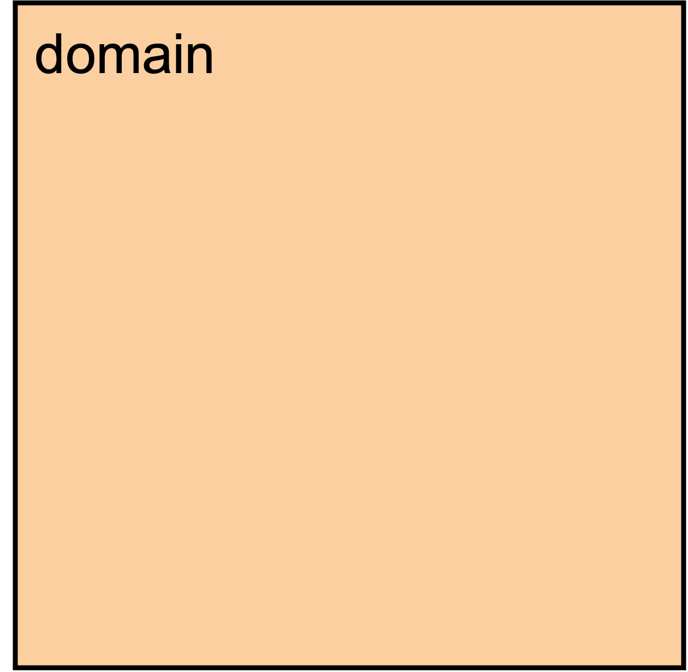
:::
::::

## Matthew and Tamara proposed a nested model analysis framework for visualization {.smaller}

Four levels, three questions:

:::: columns
::: {.column width="50%"}
### Domain

- Characterize the problems and data of a particular domain
- Who are the target users?

### Abstraction
- Translate from the domain specifics to the visualization vocabulary
  - [What]{.red} is shown?  data abstraction
  - [Why]{.yellow} is the user looking at it?  task abstraction
:::

::: {.column width="50%"}
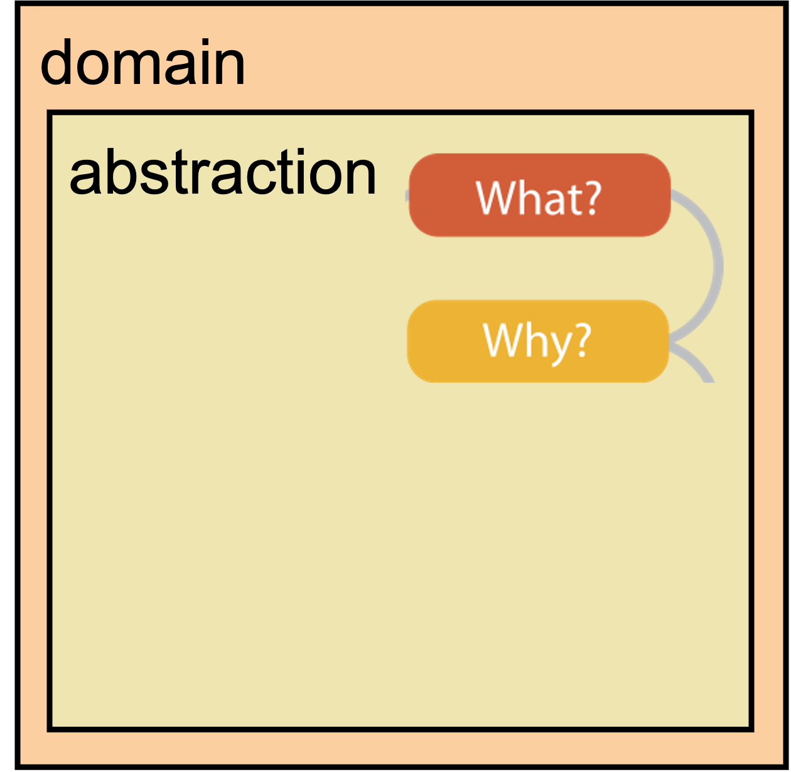
:::
::::

## Matthew and Tamara proposed a nested model analysis framework for visualization {.smaller}

Four levels, three questions:

:::: columns
::: {.column width="50%"}
### Domain
- Characterize the problems and data of a particular domain
- Who are the target users?

### Abstraction
- Translate from the domain specifics to the visualization vocabulary
  - [What]{.red} is shown?  data abstraction
  - [Why]{.yellow} is the user looking at it?  task abstraction

### Idiom
- [How]{.green} is it shown?
  - Visual encoding idiom  how to draw
  - Interaction idiom  how to manipulate
:::

::: {.column width="50%"}
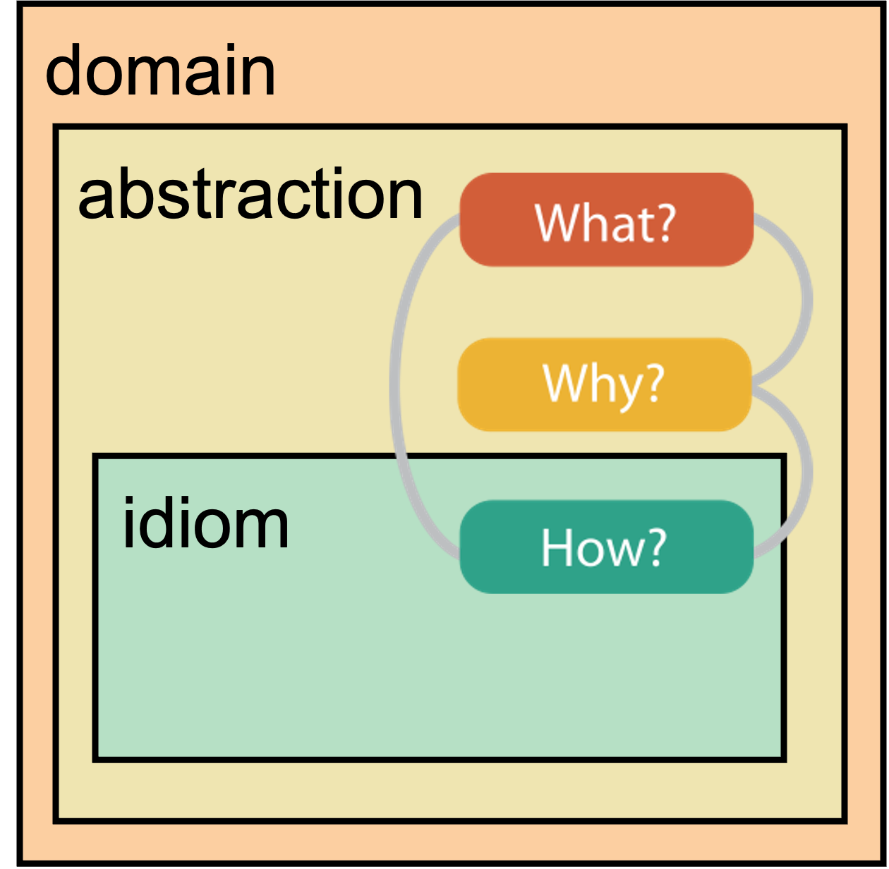
:::
::::

## Matthew and Tamara proposed a nested model analysis framework for visualization {.smaller}

Four levels, three questions:

:::: columns
::: {.column width="50%"}
### Domain
- Characterize the problems and data of a particular domain
- Who are the target users?

### Abstraction
- Translate from the domain specifics to the visualization vocabulary
  - [What]{.red} is shown?  data abstraction
  - [Why]{.yellow} is the user looking at it?  task abstraction

### Idiom
- [How]{.green} is it shown?
  - Visual encoding idiom  how to draw
  - Interaction idiom  how to manipulate

### Algorithm {#tmmodel}
- Efficient computation
:::

::: {.column width="50%"}
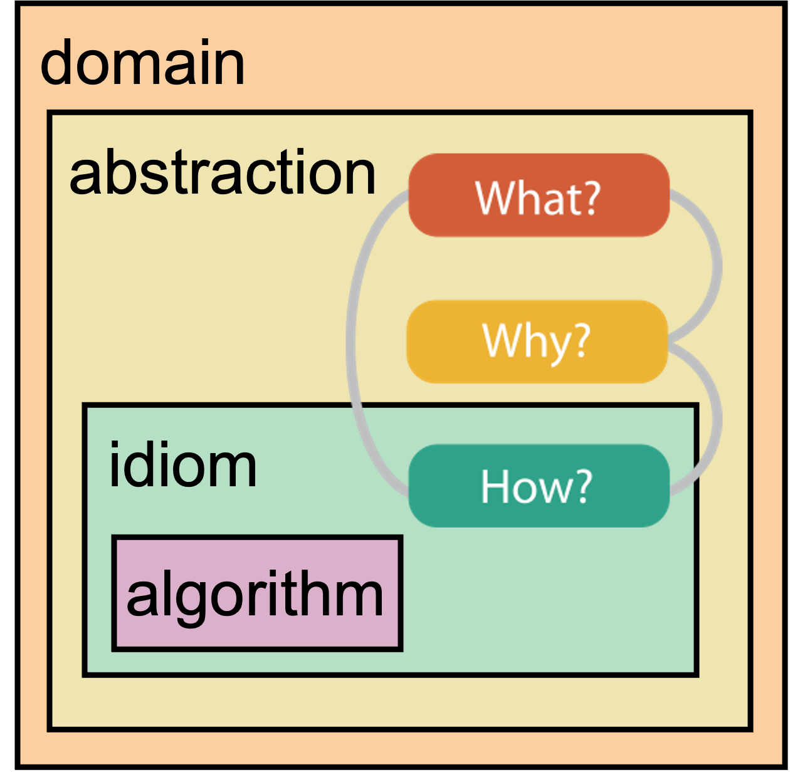
:::
::::

## The [What]{.red}: Abstracting the Data

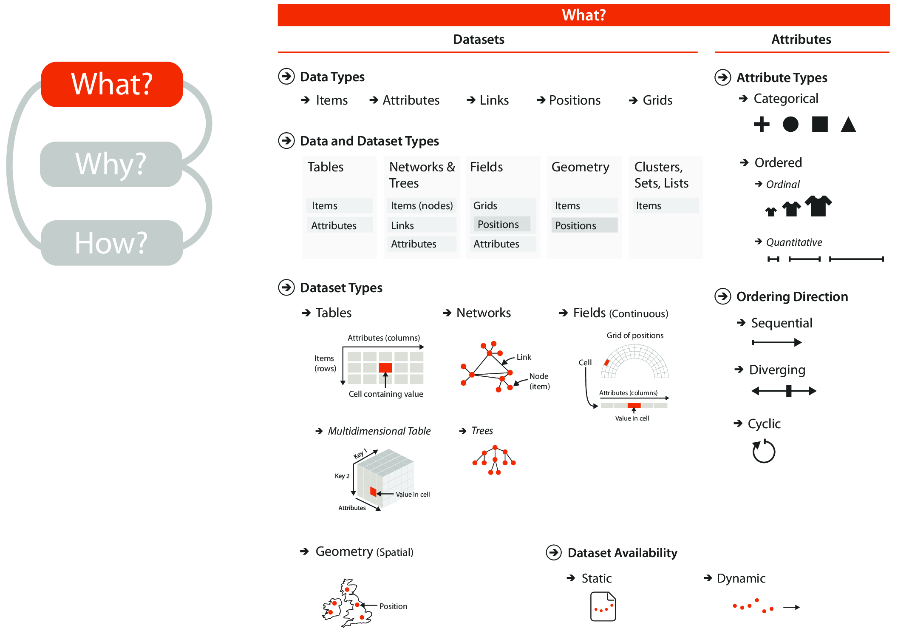{fig-align="center" height="500"}

::: {.notes}
The point here is data abstraction, i.e figuring out what we're working with.
What are the types of data, the units of observation, attributes of the data
etc.

:::

##

:::: {.columns}
::: {.column width="50%"}
### Why abstract the data?
- Different attribute types  different representations
- Different dataset types  different idioms available

:::

::: {.column width="50%"}
### What do you need to abstract?
- **Dataset type:** (e.g. table, network, temporal, etc.)
- **Attribute types:** (e.g. categorical, ordinal, quantitative)
- **Ordering direction:** (e.g. sequential, diverging, cyclical)
- **Data availability:** (e.g. dynamic, static)
:::
::::

::: {.notes}
_Idioms_ refers to the visual representation or encoding of the data, or how
it's represented and interacted with.
:::

## Types of datasets

::: {.center}

[ temporal!]{.center}
:::

## Tables

- Typically a flat **Tidy Data** table (by analysis unit)
- Observations are rows, one item per row
- Attributes are columns
- May or may not have an identifier

{.center height="350"}

::: {.notes}
Tidy data is a conceptual framework that makes it easier to do some ananalysis.
Generally speaking, tidy data is in long format, but this is not necessary. The
format of the data is not dependent on tidyness.

Tidyness also depends on the unit of observation you want to use in your
analysis. It may be that you'd end up with a wide but tidy dataset. Most
traditional ML methods require wide format data (since parallelization requires
the data to be split by rows, which are the unit of observation), which may or
may not be tidy depending on the content of the columns.
:::

## Types of attributes {.smaller}

:::: {.columns}
::: {.column width="50%"}
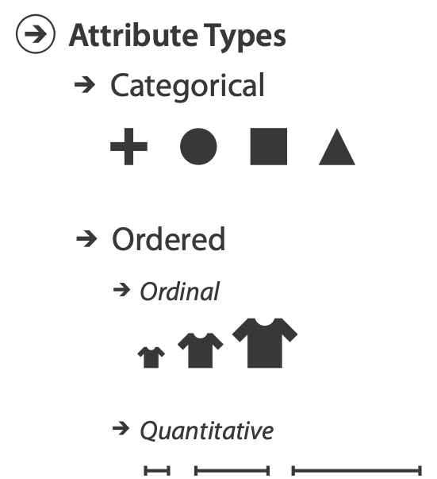{height=500}
:::

::: {.column width="50%"}
### Categorical
- No order
- Example: names, countries, types
- Must be represented with visual channels that **don't** convey order

### Ordered

#### Ordinal
- Has implicit order
- But, you **can't** do arithmetic
- Can be numerical (but should be treated as categorical)
- Example: t-shirt sizes, grade in school, rankings

#### Quantitative
- Also ordered
- You **can** do arithmetic
- Can be _divergent_ or _sequential_
- Example: age, temperature, earnings

:::
::::

## Types of attributes {.smaller}

:::: {.columns}
::: {.column width="50%"}
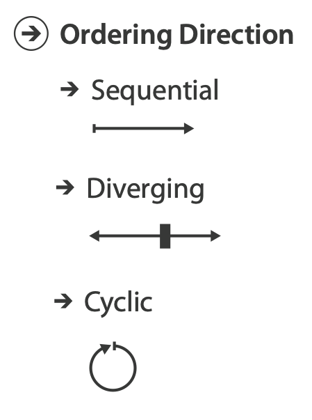{height=500}
:::

::: {.column width="50%"}
### Sequential
- There is an infinite range with a clear minimum
- You **can** perform arithmetic
- Example: age, number of goals, price
- Must be represented with visual channels that **do** convey order

### Diverging
- There is a middle point
- And two opposite directions
- Many times the middle point **is not zero**
- Example: temperature, earnings, political affiliation index

### Cyclic
- There is a cycle in the values
- Starting point may or may not be obvious
- Can be represented with cyclical channels
- Example: days of the week, hours in the day

:::
::::

::: {.notes}
These concepts really come to the fore in heatmaps and cholopleths, where we're
representing some quantity by color and the attributes (which depend on the
question we're trying to answer) emphasize and de-emphasize certain points with
neutral or lower intensity colors.
:::

## The [Why?]{.yellow} (more on that next week)

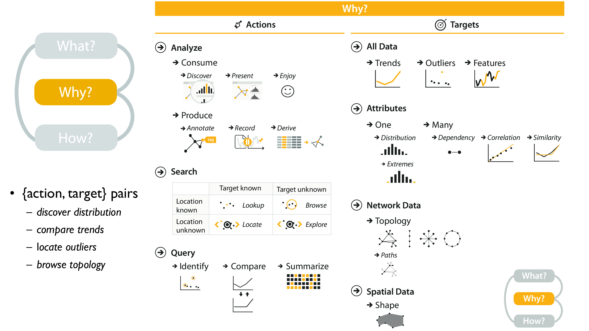{fig-align="center" height="500"}

Reminder of [model](#tmmodel)

::: {.notes}
This reflects the **intent** or **purpose** of our visualization; what is the
punchline or message we're trying to communicate.
:::

## Constructing the tasks combines actions and targets

:::: {.columns}
::: {.column width="50%"}
### Action (verb)

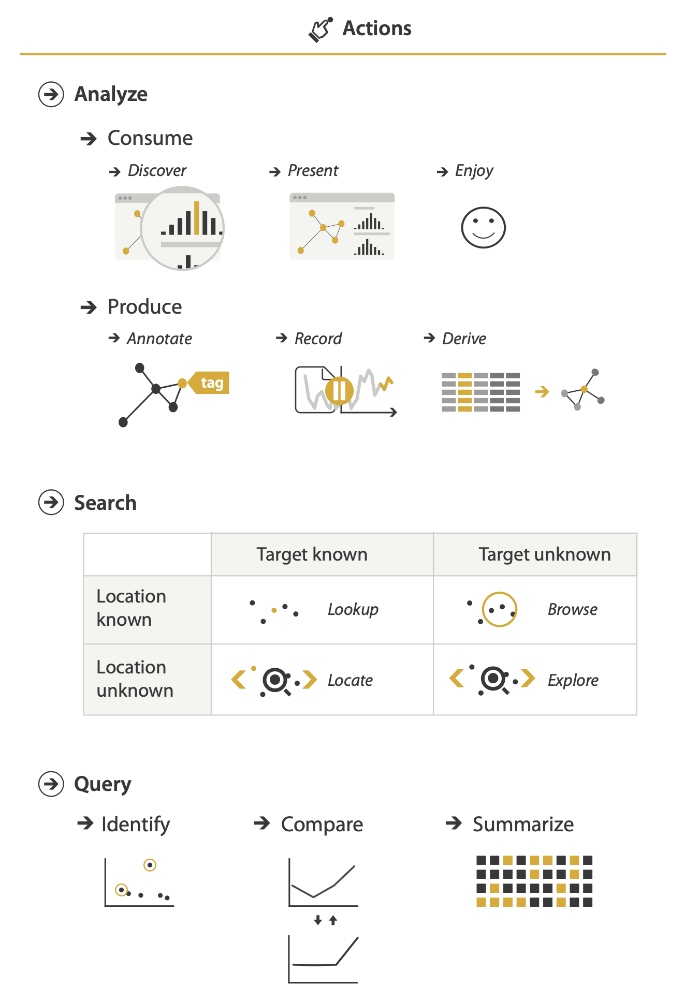{height="500"}
:::

::: {.column width="50%"}
### Target (noun)

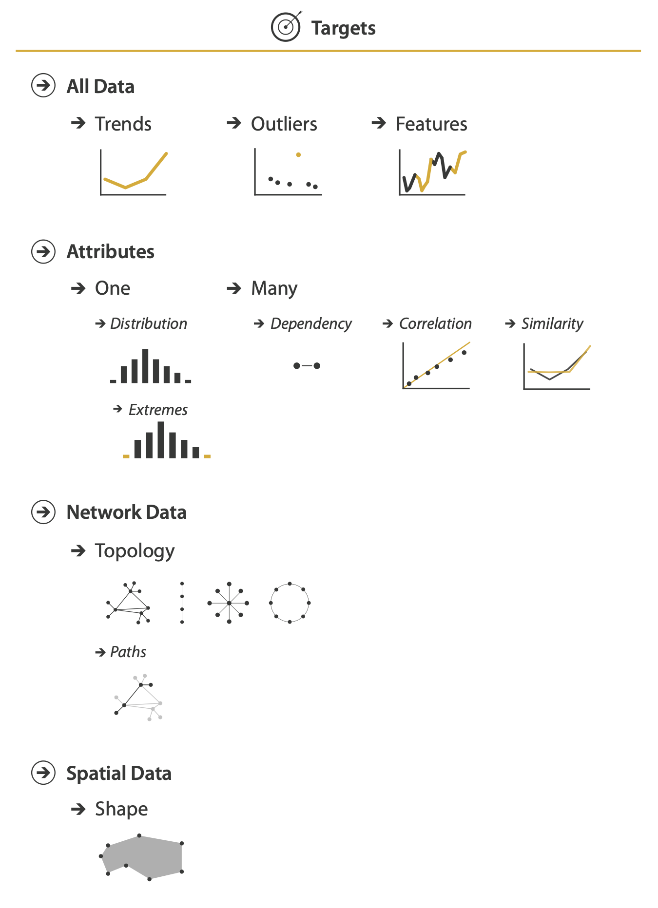{height="500"}
:::
::::

## The [How?:]{.green}

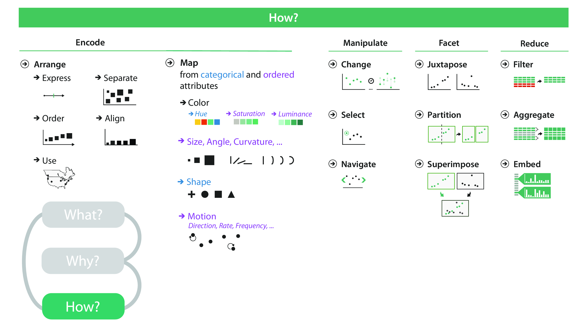{.center height="500"}

Reminder of [model](#tmmodel)

::: {.notes}
This is how we represent or encode our data in the visualization, and other
aspects that we have to code to make the visualization. This is the **idiom** of
Munzner's model; the language and implementation of the data visualization.
:::

## Marks and Channels

### Marks are geometric primitives

### Channels (encodings) control the appearance of marks

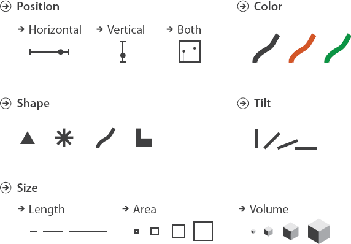{height="300"}

## Some channels are more effective than others (linking back to perception)

:::: {.columns}

::: {.column}

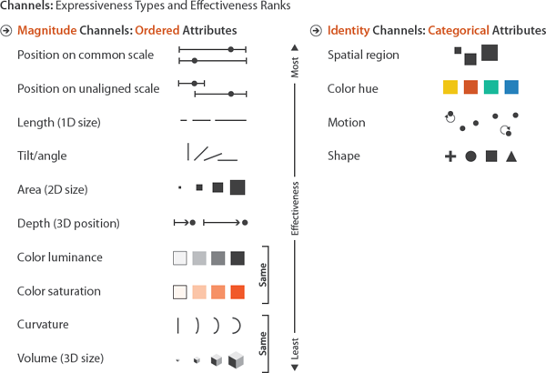

:::

::: {.column}

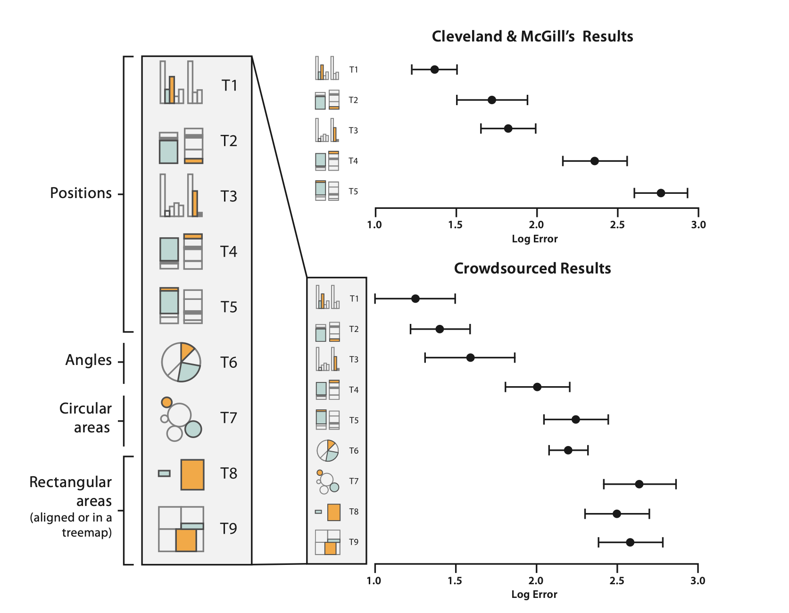

:::

::::

## A _visualization instance_ is created by combining all three questions

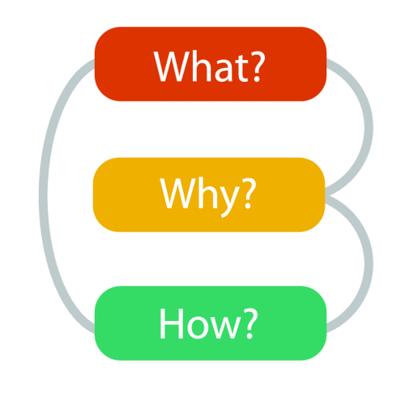{fig-align="center"}
