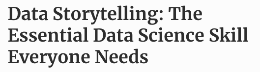
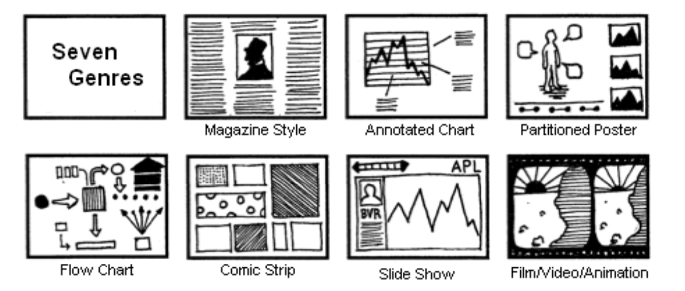
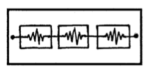
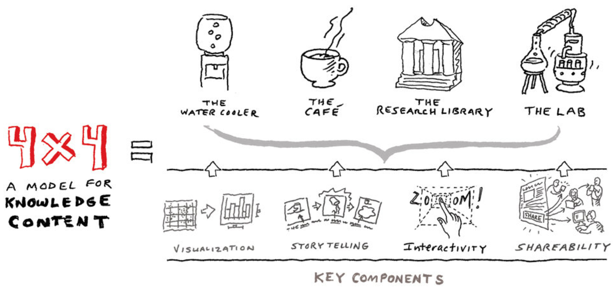
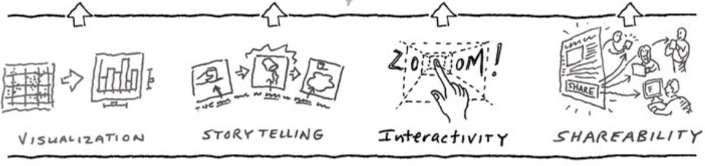

# Visual Narratives and Data Storytelling

##

{fig-align="center" height="500"}

::: {.aside}
[Forbes Article](https://www.forbes.com/sites/brentdykes/2016/03/31/data-storytelling-the-essential-data-science-skill-everyone-needs/?sh=57934db852ad)
:::

## Inspiration for today's topic

:::: {.columns}

::: {.column width="33%"}
### [Cole Nussbaumer Knaflic](https://www.storytellingwithdata.com)

{height="250"}

:::

::: {.column width="33%"}
### [Bill Shander](https://billshander.com/)

{height="250"}

:::

::: {.column width="33%"}
### [Ilia Blinderman](http://iliablinderman.com/)

{height="250"}

:::

::::

## First, theoretical frameworks for Visual Narratives

* [Segel & Heer, 2010: Narrative Visualization: Telling Stories with Data](https://ieeexplore.ieee.org/stamp/stamp.jsp?arnumber=5613452&casa_token=OT5pv-ENUFEAAAAA:RW7tD7uNwzcsDanplx3hC_BYr8Lln5AiGlJqYjkk45cYz4iz32X_rQPRxIfYpmNU-5ea1sOJAcc&tag=1)

* [McKenna et.al, 2017: Visual Narrative Flow: Exploring Factors Shaping Data
Visualization Story Reading Experiences](https://onlinelibrary.wiley.com/doi/pdf/10.1111/cgf.13195?casa_token=LKzIjfpbHm4AAAAA%3A08iMn3-CKRKfqtfMFTO6d8EKgHfuv3GmBVLk4bOhr0pCx6LmU5txoU2hI349rdLHl_5yhZMbCXKQZv95)

## Genres of Narrative Visualization

{fig-align="center"}

## Genres of Narrative Visualization (descriptions)

* **Magazine Style:** A single-frame format where images are embedded within text, often used for static visualizations.
* **Annotated Chart:** Charts with annotations highlighting key data points, offering insights directly within the visualization.
* **Partitioned Poster:** Multi-view visualizations presenting multiple images simultaneously, often with a loose order.
* **Flow Chart:** Linear sequences that guide viewers through a narrative path using connected elements.
* **Comic Strip:** Multi-frame visualizations with strict linear order, resembling a comic narrative.
* **Slide Show:** Sequential frames presented interactively, often used for step-by-step storytelling.
* **Film/Video/Animation:** Dynamic visualizations combining motion and narrative for an immersive experience.

These genres can function independently or be combined to create complex narratives, balancing author-driven storytelling with reader-driven exploration.

## Author-driven vs. reader-driven narratives {.smaller}

:::: {.columns}
::: {.column}
### Author-Driven

* Characterized by a strict linear path through the visualization.
* Relies heavily on messaging (e.g., text annotations, headlines) to convey the story.
* Includes little to no interactivity, making it effective for storytelling and efficient communication.

_Examples include_ non-interactive slideshows, films, and educational videos.
Reader-Driven Approach:

:::

::: {.column}
### Reader-Driven

* Offers no prescribed ordering of images and minimal messaging.
* Emphasizes interactivity, enabling tasks like data diagnostics, pattern discovery, and hypothesis formation.

_Examples include_ tools like Tableau or Spotfire for exploratory analysis.
:::
::::

Most visualizations fall between these extremes, blending author-driven narratives with reader-driven interactivity. This balance allows for structured storytelling while giving users room for exploration. Common hybrid models include structures like the Martini Glass, Interactive Slideshow, and Drill-Down Story, which mix elements of both approaches to enhance narrative engagement.

## Hybrid model (combining author and reader driven narratives) {.smaller}

:::: {.columns}
::: {.column width="33%"}
### Martini Glass Structure

* Begins with an author-driven approach, where the visualization follows a linear narrative path, often supported by text, annotations, or an interesting default view to introduce the topic.
* Once the initial narrative is complete, the visualization transitions to a reader-driven stage, enabling users to explore the data interactively (e.g., filtering, highlighting, or choosing paths).
* The structure resembles a martini glass, with the stem representing the linear narrative and the wide mouth symbolizing the interactive exploration phase.
:::

::: {.column width="33%"}
### Interactive Slideshow

* Combines sequential storytelling with interactive elements, allowing users to move through slides at their own pace.
* Each slide may contain interactive visualizations, enabling limited exploration while maintaining narrative control.

:::

::: {.column width="33%"}
### Drill-Down Story

* Starts with an overview of the data and gradually allows users to explore detailed layers or subsets of information interactively.
* This approach fosters a dialogue between author-driven and reader-driven techniques, enabling users to delve deeper into specific aspects of the story.
:::
::::

These hybrid models illustrate the flexibility of narrative visualizations to cater to diverse storytelling and analytical needs. They effectively bridge the gap between guiding users and empowering them to interact with and explore data.

# Cole Nussbaum Knaflic

## Storytelling with Data Princples

* **Clarity and Simplicity:** Advocating for clear and simple visualizations that avoid unnecessary complexity
* **Context and Narrative:** Emphasizing the importance of context and narrative to make data relatable and actionable.
* **Effective Communication:** Teaching a straightforward process to communicate data effectively, including choosing the right chart types and focusing on key messages.
* **Engagement and Influence**: Using data stories to engage audiences and influence decision-making.

## "Stories resonate and stick with us in ways that data alone cannot"

Humans are visual and are wired for stories!

{fig-align="center" height="350"}

::: {.fragment}
Stories are a survival mechanism across generations
:::

## The Magic of Storytelling

* Stories have a **clear structure**: beginning, middle, and end.
* Good storytelling creates **emotional connections**, which make the data memorable.

### Why It Matters

* Stories provide narrative flow and structure to data communication.
* They help audiences process and retain complex data more effectively.

## Constructing the Story

### The Beginning

* Set the stage: Contextualize the data and outline its purpose.
* Answer: Why should the audience care?

### The Middle

* Develop the narrative: Highlight key insights and findings using well-crafted visuals.
* Build tension or excitement by showing trends, comparisons, or anomalies.

### The End

* Deliver the conclusion: Provide actionable takeaways or recommendations.
* Make the message clear and impactful.

::: {.aside}
Tip: Always ensure the narrative ties back to the audience's needs or goals.
:::

## Narrative Flow and Logic

### Narrative Flow

* Order your story logically, so it builds naturally from one point to the next.
* Ensure smooth transitions between visuals and concepts.

### Horizontal and Vertical Logic

* **Horizontal Logic**: Ensure consistency and cohesion across slides or visuals.
* **Vertical Logic**: Structure the story so it is clear when read top-to-bottom or front-to-back.

### Reverse Storyboarding

* Start with the desired outcome (what you want the audience to take away) and work backward to craft the narrative.

## The Power of Repetition

:::: {.columns}
::: {.column}
### Repetition Reinforces Retention
* Reiterate key points throughout the story to ensure they stick with the audience.
* Use consistent phrasing, visuals, or themes to emphasize critical messages.

### Tactics to Ensure Clarity
* Simplify complex data.
* Use annotations, labels, and consistent design elements to guide the audience's focus.
:::

::: {.column}
### The old adage on how to present anything

::: {.incremental}
* Tell them what you are going to tell them
* Tell them
* Then tell them what you just told them
:::
:::

::::

## Strategies to Enhance Storytelling

### Tactics

* A Fresh Perspective: Step back and view your story from the audience's perspective.
* Reverse Storyboarding: Start with your conclusion and build the story backward.
* Use Visual Hierarchies: Highlight the most important data points through design choices such as color, size, or positioning.

### Spoken vs. Written Narratives

Customize your story for the medium:

* Spoken: Use visuals that complement your verbal explanation.
* Written: Ensure the story is self-explanatory and concise.

# Bill Shander

## Bill's principles

* **4X4 Model for Knowledge Content:** Shander suggests creating content for different levels of audience engagement. For example, using short, enticing content like headlines or tweets to draw people in, followed by more detailed content like blog posts or videos for those who want to dive deeper.
* **Maximizing Sensory Activation:** He emphasizes using words and visuals that stimulate multiple senses. For instance, describing data in a way that evokes sensory experiences can make the story more memorable.
* **Humanizing Data:** Shander recommends making data relatable by focusing on individual stories rather than just numbers. For example, instead of presenting statistics about a population, tell the story of one person within that population.
* **Emotional Connection:** He advises finding the emotional angle in data to make it more impactful. For example, highlighting the human impact of data trends can create a stronger connection with the audience.

## Developing Knowlege Content

{fig-align="center"}

* The top four represent the levels of content engagement
* The bottom four are methods to include in all four levels

## Engagement Level 1: Water Cooler

**This is the most important stage!** This is where the audience decides whether the content interests them or not and if they want to engage with it. _These are headlines or short form content._

:::: {.columns}
::: {.column}

:::
::: {.column}
* Talk about subjects that interest you (but others might not be interested)
* Use headlines/blurbs to grab attention
* Typical interaction: [30 seconds]( https://www.youtube.com/watch?v=BZP1rYjoBgI)
* Think of a New York Times version of a headline but also come up with the NY Post version (more creative, more loose) you can think differently about your content.

:::
::::

## Engagement Level 2: The Cafe

At this stage, the point of interest is at a short period of time. It is a 3-5 minute experience such as a short article, blog or video.

:::: {.columns}
::: {.column}

:::

::: {.column}
* Audience will self-select
:::
::::

## Engagement Level 3: The Research Library

Where the audience is committed and more invested in the content. They spend 1-2 hours investigating and researching additional materials about a content.

:::: {.columns}
::: {.column}

:::
::: {.column}
* At this point, your content is very rich but if the audience hasn't been setup in the proper way you will lose them.
:::
::::

## Engagement Level 4: The Lab

It is the interactive experience where the audience can filter, sort, and play with the data directly. This allows the audience to find the content that is more relatable to them.

:::: {.columns}
::: {.column}

:::
::: {.column}
Example: [Bloomberg Billionaires](https://www.bloomberg.com/billionaires/compare-individuals/)
:::
::::

## The Key Components

{fig-align="center"}

* **Visualisation:** Communicating the content in a visual, quick and concise way that is straight to the point. This is so people can understand the content quicker.
* **Storytelling:** Create the content in forms of stories to communicate. For example, the headline is the beginning of the story and the subheading is the climax/challenge of the story.
* **Interactivity:** This is the tangible experience of the content. This allows the audience to learn and connect with the content.
* **Shareability:** It is important to have shareable content that has share ability functions. Where people can attract other people to the content though what has been shared.

## KWY (KWY rhymes with WHY)

:::: {.columns}

::: {.column width="33%"}
### KWYRWTS (ker-witz)

**K**NOW

**W**HAT

**Y**OU

**R**EALLY

**W**ANT

**T**O

**S**AY

:::

::: {.column width="33%"}
### KWYDIS (kwhy-this)

**K**NOW

**W**HAT

**Y**OUR

**D**ATA

**I**S

**S**AYING
:::

::: {.column width="33%"}
### KWYANTH (kwhy-anth)

**K**NOW

**W**HAT

**Y**OUR

**A**UDIENCE

**N**EEDS

**T**O

**H**EAR

::: {.fragment}
Not necessarily what they **want** to hear!
:::

:::
::::

## Bill's resources

* <https://medium.com/nightingale/the-past-present-and-future-of-scrollytelling-10dd37dc1003>
* <https://medium.com/nightingale/from-storytelling-to-scrollytelling-a-short-introduction-and-beyond-fbda32066964>
* <https://medium.com/@billshander/how-to-tell-stories-and-weave-a-cohesive-narrative-with-data-a56dea3d1d67>

# Think like a journalist

## Awesome examples of data driven visual narratives

- The New York Times
- Wall Stree Journal
- The Washington Post
- FiveThirtyEight
- The Economist
- [Financial Times](https://www.ft.com/visual-and-data-journalism)
- [The Pudding](https://pudding.cool/)

# Ilia Blinderman

## The Pudding

### Their process:

1. Storytelling is complicated
2. Who is your audience
3. Focus broadly or narrowly
4. Complexity of the finding after analysis
5. Progressing through the arguments
6. Arriving at the conclusion

### Resources

* <https://pudding.cool/process/how-to-make-dope-shit-part-1/>
* <https://pudding.cool/process/how-to-make-dope-shit-part-2/>
* <https://pudding.cool/process/how-to-make-dope-shit-part-3/>

## Other resources and examples

* <https://www.apexgloballearning.com/blog/22-powerful-data-storytelling-examples/#22_Powerful_data_storytelling_examples_to_find_your_inspiration>
* <https://www.juiceanalytics.com/writing/20-best-data-storytelling-examples>
* <https://opensourcelibs.com/lib/rolldown>
* <https://elementor.com/blog/guide-to-scrollytelling/>
* <https://www.visualstorytell.com/blog/what-is-visual-storytelling>
* <https://mathisonian.github.io/idyll/scaffolding-interactives/>
* <https://idl.cs.washington.edu/>
* <https://distill.pub/2020/communicating-with-interactive-articles/>

## Kurt Vonnegut



# Demo: Scrollytelling
