<!-- #  -->

## Motivation

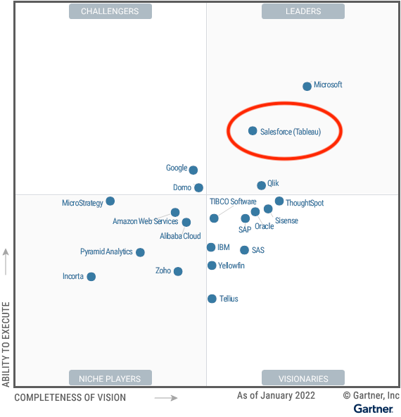{width="50%" height="50%" fig-align="center"}

::: {.notes}
Tableau (now part of Salesforce) has been up there as one of the leaders in analytics and BI for over 10 years. It is a very popular BI and dashboard product due to its relative ease of use, ability to handle largish data and having essentially good defaults to create good visualizations. 

It is a point-and-click software and hence reproducibility is a real challenge (much like Excel). But it can get a one-off
visualization and dashboard out very quickly. So it is good for interactive exploration and quick deep dives. 

:::

## Pros and cons
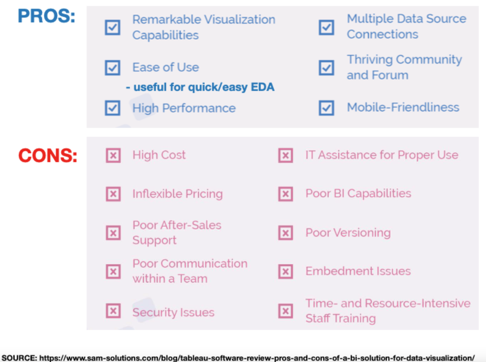{width=800}
<!-- ## {background-image="img/tableau-pros-cons.png" background-size="contain"} -->

::: {.notes}
Tableau can access data from almost any local or cloud data store or database

It also creates responsive, mobile friendly graphics and dashboards
:::

## Getting access

* [https://www.tableau.com/academic/students](https://www.tableau.com/academic/students)

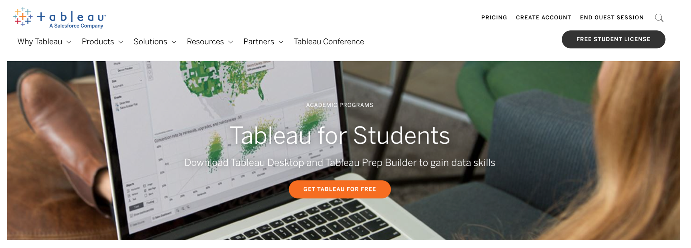

::: {.notes}
We'll start of with these definitions that relate to things we already know about, quantitative and qualitative (categorical) variables. But of course Tableau uses its own nomenclature. 

Let's come back from break and see how Tableau works.

:::

# Hands-on 
On to the lab


## Start Page


1 - Connecting to a File: This section on your start page indicates where you can connect to your data files saved on your computer

## Start Page


2 - Connecting to a Server: You'll usually use this section if you're working for a company that uses specific servers. Tableau can connect to multiple different servers such as Oracle, PostgreSQL, Azure, Dropbox, and more.

## Start Page


3 - Saved Data Sources: These are sample data sets that Tableau provides. When you download the software, Tableau also provides you a repository folder which also holds these clean sample data sets as excel files. When you click the samples, they will automatically load without you needing to find the files.

## Start Page


4 - Open a Workbook: This area is where you can find recent workbooks opened and quickly load them in if you want to work on them.

## Start Page


5 - Sample Workbooks: This section provides you with sample workbooks that you can open to play around in and see how they were built. Clicking on "More Samples" will lead you to a gallery of downloadable sample workbooks.

## Start Page


6 - Discover: The Discover side bar provides you with links to the Tableau training videos, blog, forums, and Tableau Prep (a data cleaning and prepping software).

## Data Source and Page and Workspace


1 - This shows you the data file you loaded. Here you can rename your data source or edit your connection to the source.

## Data Source and Page and Workspace


2 - The Data Interpreter is a built-in data cleaner that Tableau provides. If you choose to use it, it can identify potential areas to clean and will re-format them and provide a log of the changes they made.

## Data Source and Page and Workspace


3 - This area shows the "sheets/tabs" that are in your data source

## Data Source and Page and Workspace


4 - If you want to use multiple sheets, you can drag them into the main space here to make a join or union connection.

## Data Source and Page and Workspace


5 - Here you can choose the data connection you want your workbook to have. In the simplest terms, *live* connections have real-time updates when you're connected to the database while an *extract* provides a snapshot of the data which can be refreshed at will.

## Data Source and Page and Workspace


6 - Here is where you can view your data which needs be in a tabular format, with clean headers. Tableau will analyze your data and automatically assign data types to them. You can change the data types. **Tableau does not change you original data source!**

## 


1.  This little Tableau icon will bring you back to the start page.
2.  The holy grail of Tableau and probably the most used part of Tableau. These are unlimited undo and redo buttons!
3.  These icons here are the flip and sort buttons. The flip button will switch your columns and rows back and forth. The sort buttons will quickly sort your view (like a bar chart) in ascending or descending order
4.  This will fit your charts to either standard size, fit width, fit height, or fit entire view
5.  Show Me is a handy tool for beginners to help you build quick charts and graphs

## 


6 - In the *data* tab you can find all *measures*. In the *analytics* tab you can supplement your views with reference bands, forecasts, trend lines, and more.

## 


7 - This is a very handy little button that shows you a quick look into your data table. Instead of switching back and forth from your workspace to the Data Source page to look at your data, you can just click that button to quickly see your data.

## 


8 - The Dimensions tab is where you can find all your categorical fields

## 


9 - The Measures tab is where you can find all your numerical measures

## 


10 - You can click these little tabs to open a new Sheet, Dashboard, or Story.

## 


11 - The Filters card is where you can drag various fields to filter your view.

## 


12 - This bar in the marks card is a drop down menu of different chart and graph types you can use, like bar, area, gantt, pie chart and more.

## 


13 - These cards in the marks card is used if you want to add color, sizes, text, tooltips, or more to your visualizations.

## 


14 - The Columns and Rows section is how you build your views. You can drag various fields to this area to make your visualizations.

## 


15 - This is where your visualizations will appear. You can also drop fields there to let Tableau automatically choose how to visualize it.

## Measures, Dimensions and Attributes

Tableau uses these definitions:

-   A **measure** is a field that is a dependent variable; that is, its value is a function of one or more dimensions. Tableau treats any field containing numeric (quantitative) information as a **measure**. Measures can be aggregated.
-   A **dimension** is a field that can be considered an independent variable. By default, Tableau treats any field containing qualitative, categorical information as a **dimension**.
-   Another way to view a dimension is to treat it as an **Attribute**. Do this by choosing Attribute from the context menu for the dimension. The Attribute aggregation has several uses:
    -   It can ensure a consistent level of detail when blending multiple data sources.
    -   It can provide a way to aggregate dimensions when computing table calculations, which require an aggregate expression.
    -   It can improve query performance because it is computed locally.

## Measures and Dimensions

In simpler terms

-   Dimension role

    -   Qualitative fields
    -   Categorical variables
    -   Come out into view as themselves

-   Measure role

    -   Quantitative fields
    -   Come out into view as aggregates

Also, Tableau assumes that columns are fields, so it assumes **tidy data**

# Play around with data visualizations in Tableau


::: {.f4 .w-30 .black  .b--blue  .ba .bw2 .br3 .shadow-5 .ph4 .mt5 .avenir}
:::

<!-- * [click here to download example](airbnb.twb.zip) -->

# Connecting Tableau to R & Python

## Connecting to analytic back ends {.smaller}

::: {.column width="47%"}
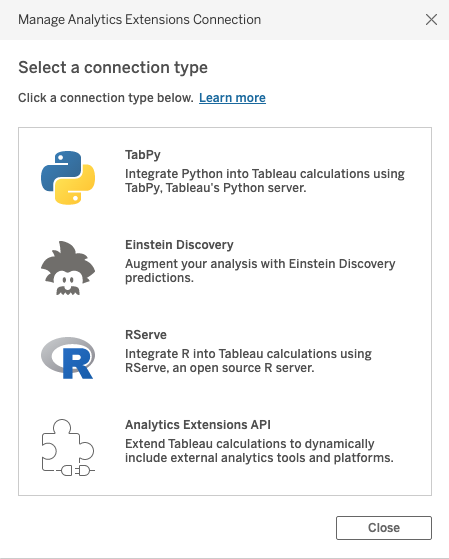{height="400"}

::: {.callout-note collapse="true" icon="false"}
### Einstein Discovery

[Einstein Discovery](https://www.tableau.com/products/einstein-discovery) is a no-code ML product for predictive analytics that is a sister product to Tableau (under the Salesforce umbrella)
:::
:::

::: {.column width="47%"}
-   Tableau provides an [open-source API](https://tableau.github.io/analytics-extensions-api/) that can be used to extend Tableau. Default services that connect are R, Python and MATLAB
    -   The  connection is through the `Rserve` package and service
    -   The  connection is through the [`TabPy`](https://tableau.github.io/TabPy/) package and service
        -   The  connection through the `TabPy` package can serve as middleware to connect with other services like AWS Sagemaker ([link](https://tableau.github.io/analytics-extensions-api/docs/ae_summary.html))
-   Tableau actually connects with these back ends using [`SCRIPT` functions](https://help.tableau.com/current/pro/desktop/en-us/r_connection_manage.htm?source=productlink#script-functions-for-expressions)
:::

[[Tableau resource page](https://help.tableau.com/current/pro/desktop/en-us/r_connection_manage.htm?source=productlink)]{.aside}

## Where do you find the Extensions Manager?

::: {.r-stack}
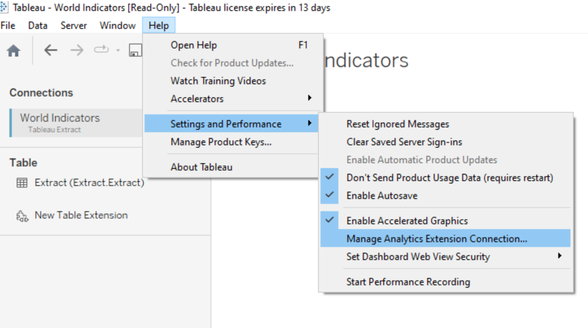{width=600 top=100 left=0 .absolute}
{.fragment top=120 left=600 width=400 .fade-right .absolute}
:::


## Configure R and Rserve for Tableau use

1.  Install the `Rserve` package in your installation

``` r
install.packages("Rserve")
```

2.  Start the Rserve server

``` r
Rserve::Rserve(args="--no-save")
```

For running on your own machine, this is served on `localhost:6311`. However the Rserve instance can be deployed on a remote server, with or without SSL-encryption.

:::: { .absolute .bottom-2}
::: {.callout-warning appearance="simple"}
If you don't include the `args` above, you **may** get an error from R

`Fatal error: you must specify ‘--save’, ‘--no-save’ or ‘--vanilla’`
:::
::::

## Configure R and Rserve for Tableau use {.smaller}

3\. Now, create the connection in Tableau

::: {.r-stack}

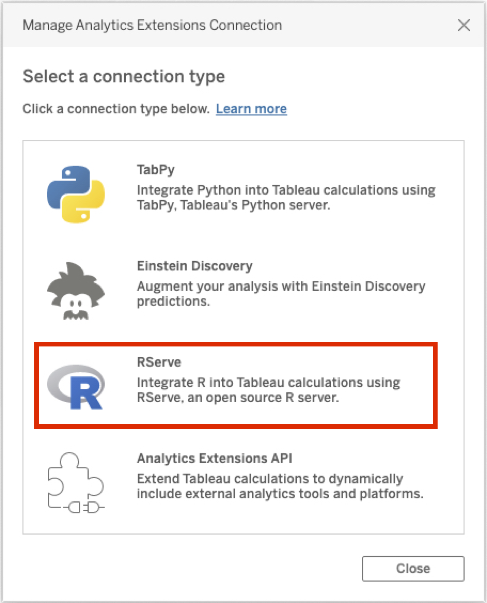{.absolute top=150 left=100 width=300}
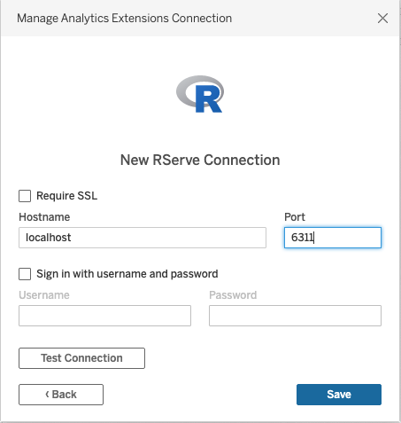{width=300 top=180 left=130 .absolute .fragment}
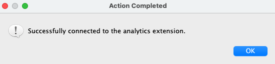{width="400" .fragment}

:::

## Configure Python and TabPy for Tableau use

Install `TabPy`. This is best done using `pip` and not `conda`. 

::: {.callout-caution icon=true appearance="simple"}
This can cause a bit of a problem down the line, so I'm actually going to set this up in a separate virtualenv so that my conda environment isn't damaged.

```bash
python3 -m venv ~/python-envs/tabpy_env
source ~/python-envs/tabpy_env/bin/activate
pip install tabpy
```
:::


This sets up `tabpy` as a service that can start at the command line

```bash
tabpy
```

and can be connected at `localhost:9004`.

## Configure Python and TabPy for Tableau use

In Tableau, we can configure this from the same dialog we used for Rserve, except we'll choose the TabPy option

::: {.r-stack}
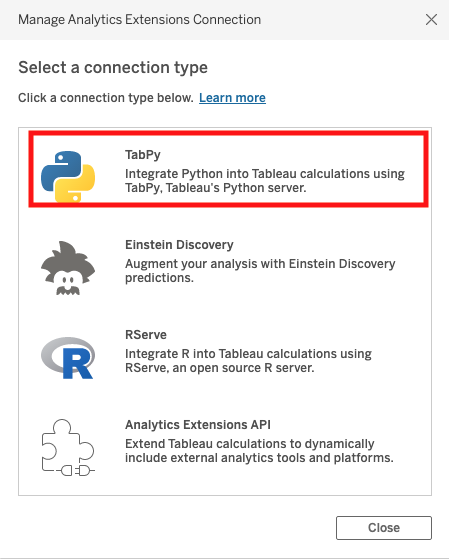{width=400 top=150 left=100 .absolute}
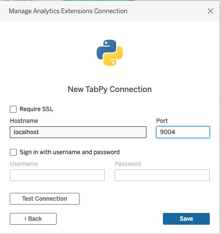{width=400 top=180 left=130 .absolute .fragment .fade-in }
:::

# Updating a Tableau visualization with clustering
Download workbooks: [   ](topics/tableau/anly503-r.twbx) | [  ](topics/tableau/anly503-python.twbx)


## A basic visualization

We'll use an AirBNB dataset composed of all AirBNB properties in New York City that were listed on 1 September, 2015. 

::: {.tr}
[ Data](https://github.com/anly503/datasets/raw/main/airbnb.xlsx)
:::

- We will do a geospatial visualization by ZIP code
   - including summary information on price, number of beds and reviews ratings


## Creating a Parameter

:::: {.columns}
::: {.column width="50%"}
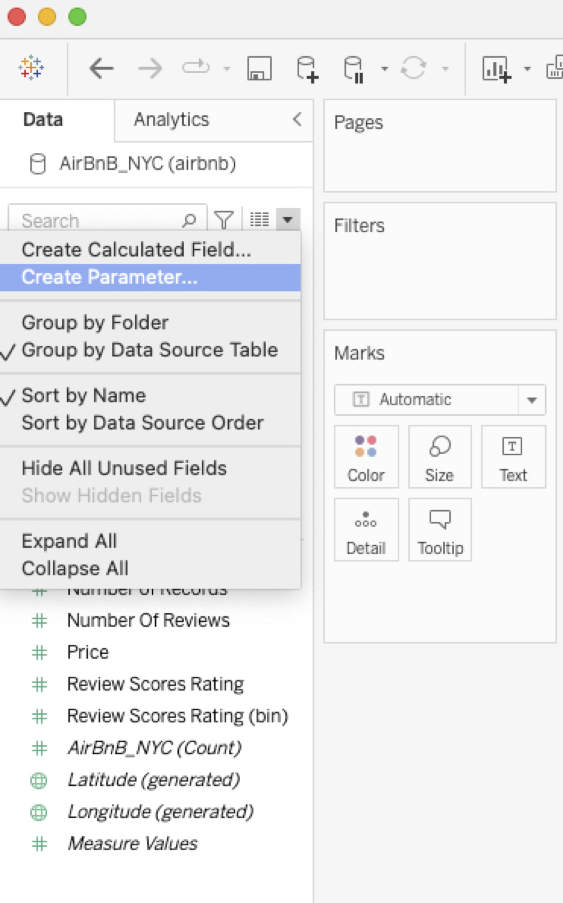
:::
::: {.column width="40%"}
:::{.fragment}

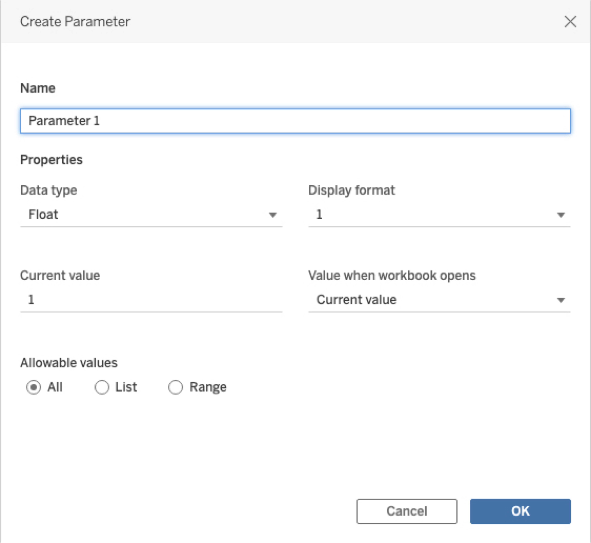
:::
:::
::::

## Create parameters for the cluster analysis

:::: {.columns}
::: {.column width="47%"}
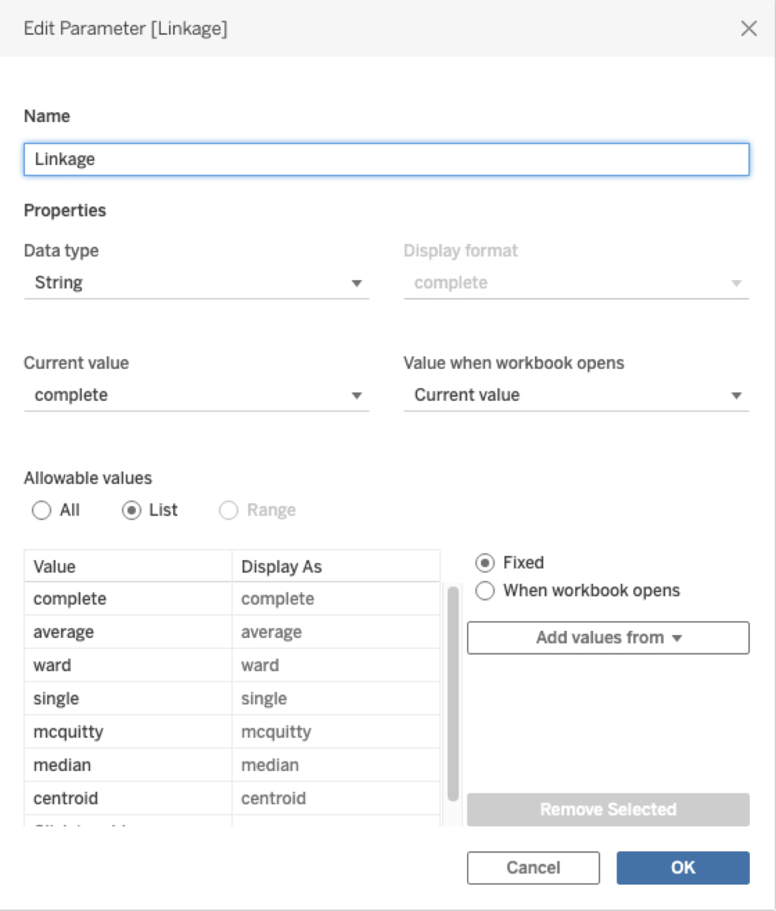
:::
::: {.column width="47%"}
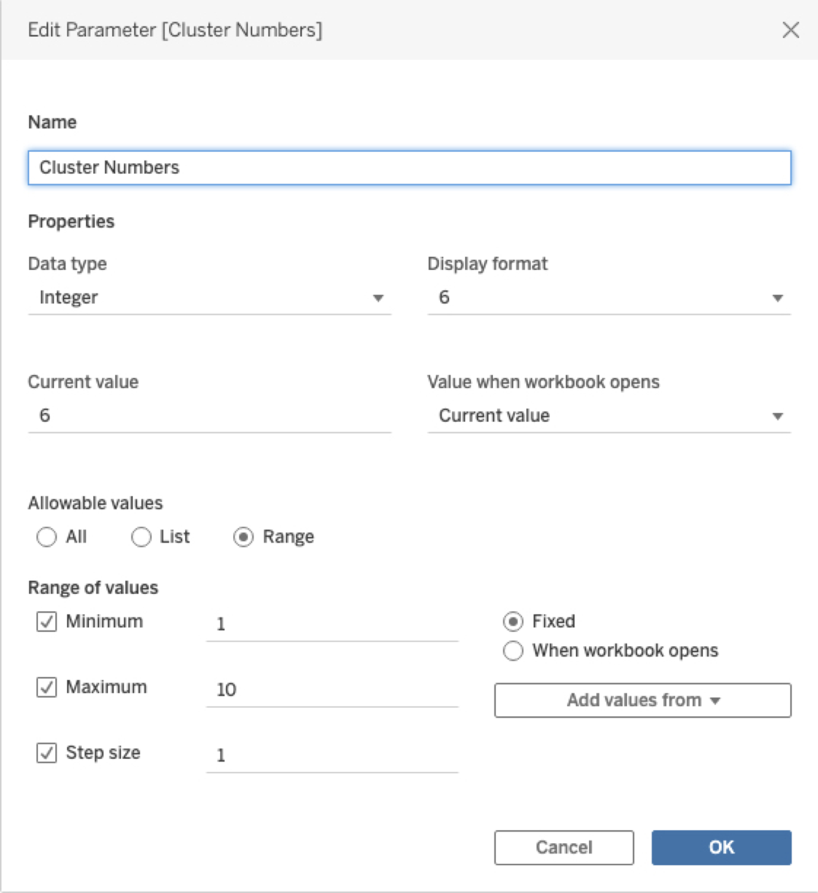
:::
::::

## Creating a Calculated Field

::: {.column width="40%"}
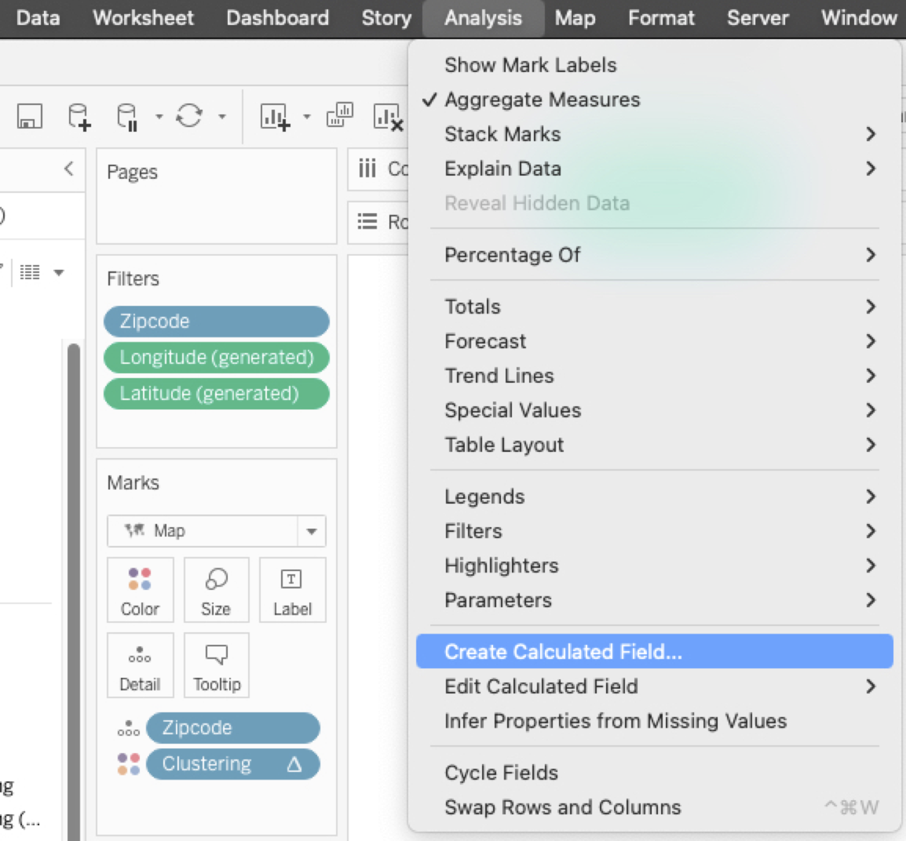
:::
::: {.column width="25%"}
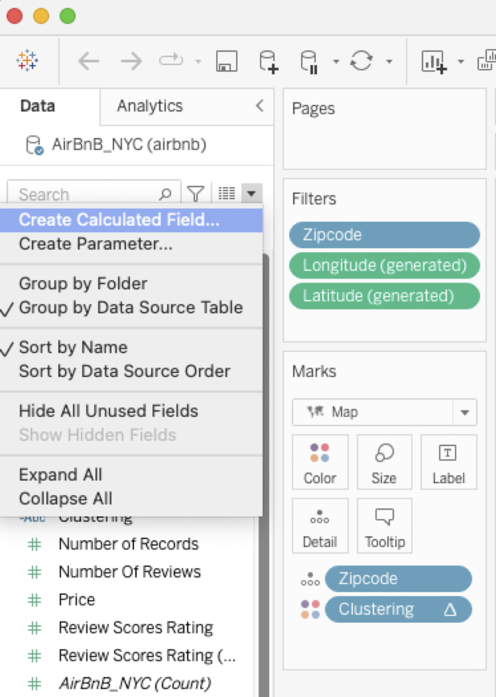
:::
::: {.column width="30%"}
:::{.fragment}
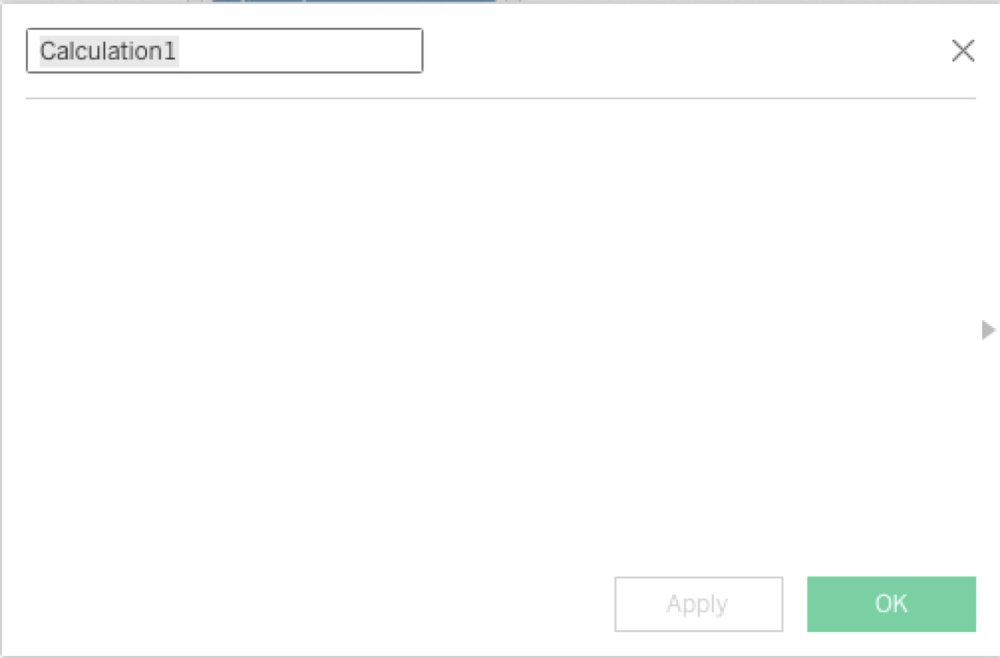
:::
:::

## Connecting with R{.smaller}

- Make sure `Rserve` is running!!

We're going to create a Calculated Field, where the calculation will be in 

:::: {.columns}
::: {.column width="47%"}
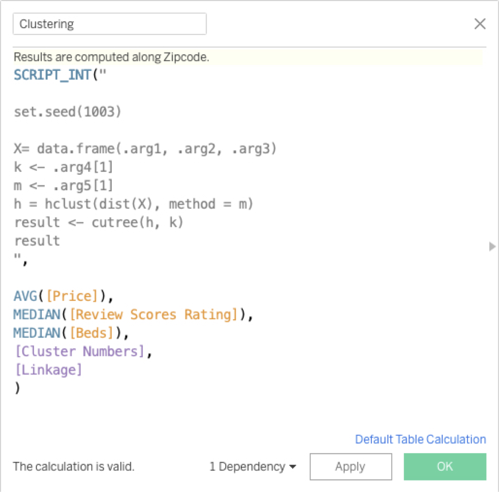
:::
::: {.column width="47%"}
- We write R code directly in the Calculated Field window
- We wrap it in `SCRIPT_INT`
    - The output of the R script is an array of integers (cluster ids)
- In `SCRIPT_INT`, we specify the inputs from the Worksheet
    - If an input is a **measure** or continuous variable, it has to be input as an **aggregate**
    - The inputs are denoted in the R script as `.arg1`, `.arg2`, etc

#### [Useful resource!](https://www.tableau.com/sites/default/files/media/using-r-and-tableau-software_1.pdf){align="right"}
:::
::::


## Using R {.smaller}

You can now select the linkage and number of clusters in a hierarchical clustering (`hclust`) in Tableau and see the visualization update


## Using Python {.smaller}

::: {.callout-warning appearance="simple"}
Make sure that `tabpy` is running!!
:::


We create a new Parameter, called "Clustering Algorithm"

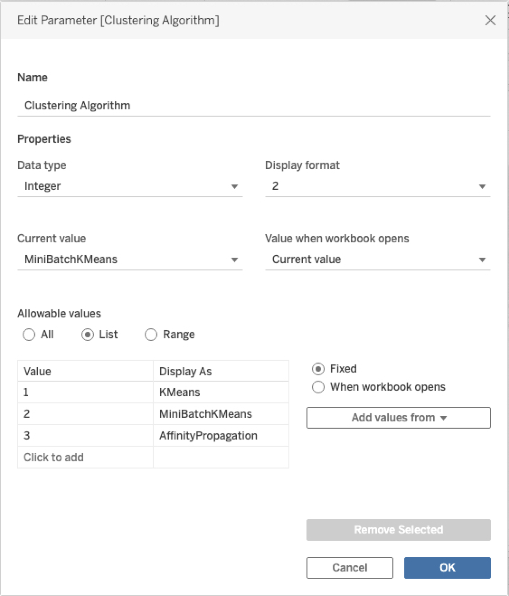

## Using Python {.smaller}

We create a Calculated Field called "Clustering" here, too

:::: {.columns}
::: {.column width="47%"}

:::
::: {.column width="47%"}
- Note that for Python, the arguments are entered as `_arg1`, `_arg2`, etc
:::
::::

## Using Python


## A video walkthrough



## Other resources

### R

<https://towardsdatascience.com/integrating-tableau-and-r-for-regression-analyses-c3cac7e199cf>

<https://www.tableau.com/learn/tutorials/on-demand/using-r-within-tableau>

<https://help.tableau.com/current/pro/desktop/en-us/r_connection_manage.htm>

### Python

<https://www.tableau.com/blog/building-advanced-analytics-applications-tabpy-64916>

<https://tableau.github.io/TabPy/>

<https://tableau.github.io/analytics-extensions-api/docs/ae_example_tabpy.html>


