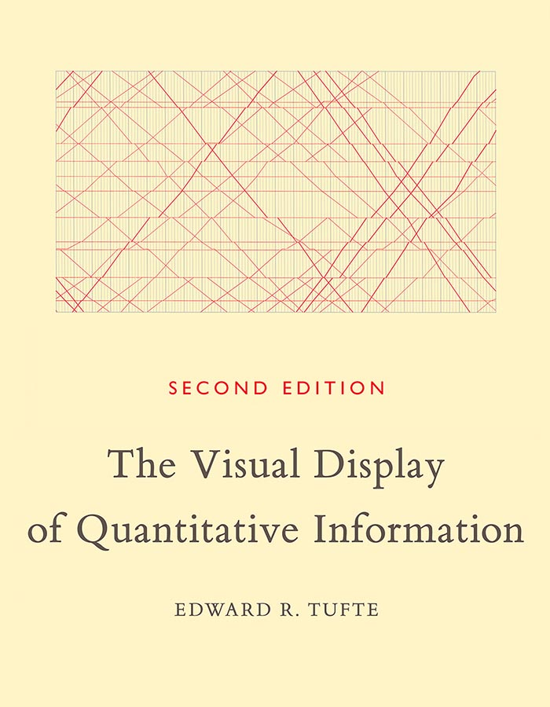
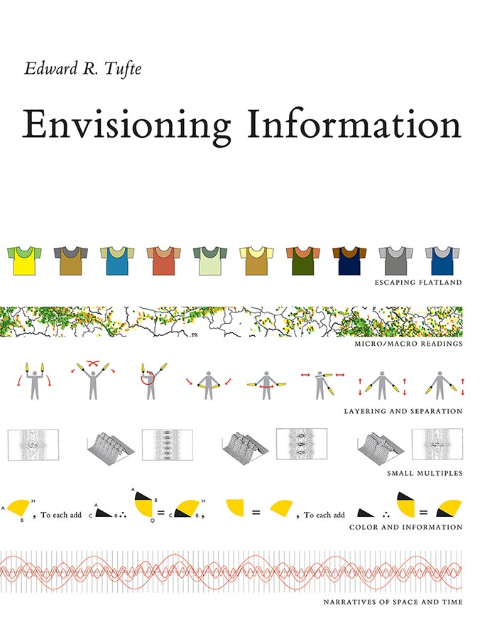
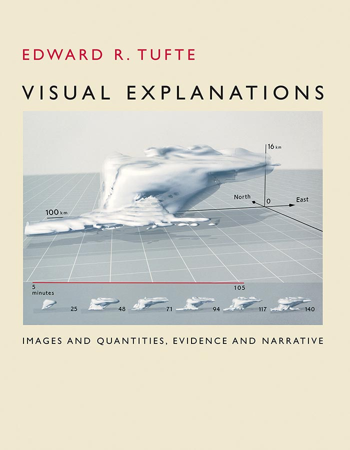
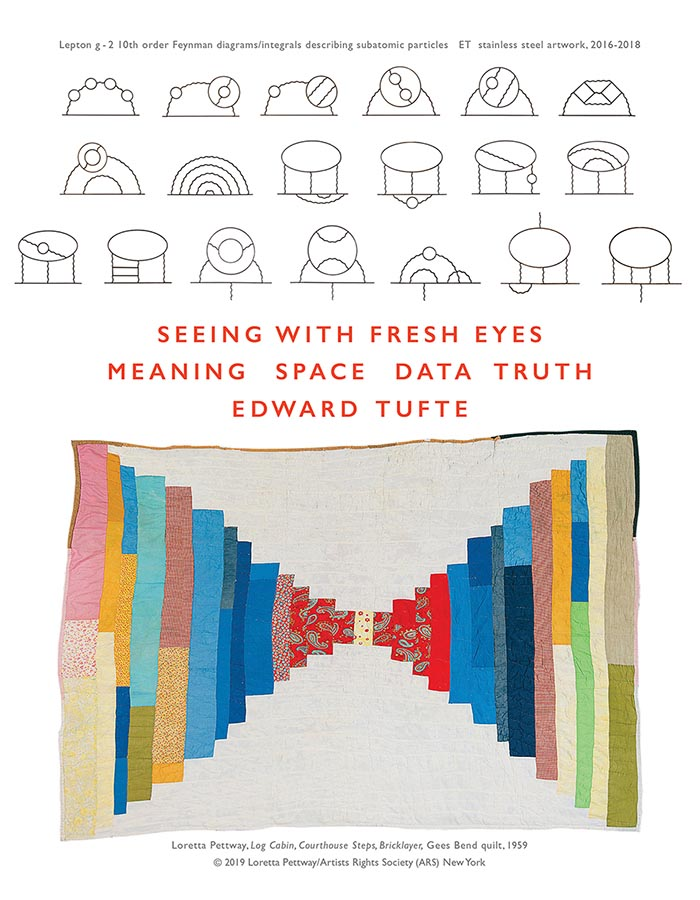

# Edward Tufte

## Books

::: {layout-ncol=5}

:::

## Summary of principles

:::: {.columns}

::: {.column width="70%"}
### Graphical integrity

- The representation of numbers, as physically measured on the surface of the graphic itself, should be directly proportional to the numerical quantities measured.
- Clear, detailed, and thorough labeling should be used to defeat graphical distortion and ambiguity. Write out explanations of the data on the graphic itself. Label important events in the data.
- Show data variation, not design variation.
- In time-series displays of money, deflated and standardized units of monetary measurement are nearly always better than nominal units.
- The number of information-carrying (variable) dimensions depicted should not exceed the number of dimensions in the data.
- Graphics must not quote data out of context.
:::

::: {.column width="30%"}
### Design

- Show comparisons
- Show causality
- Use multivariate data
- Completely integrate modes (like text, images, numbers)
- Establish credibility
- Focus on content
:::

::::
