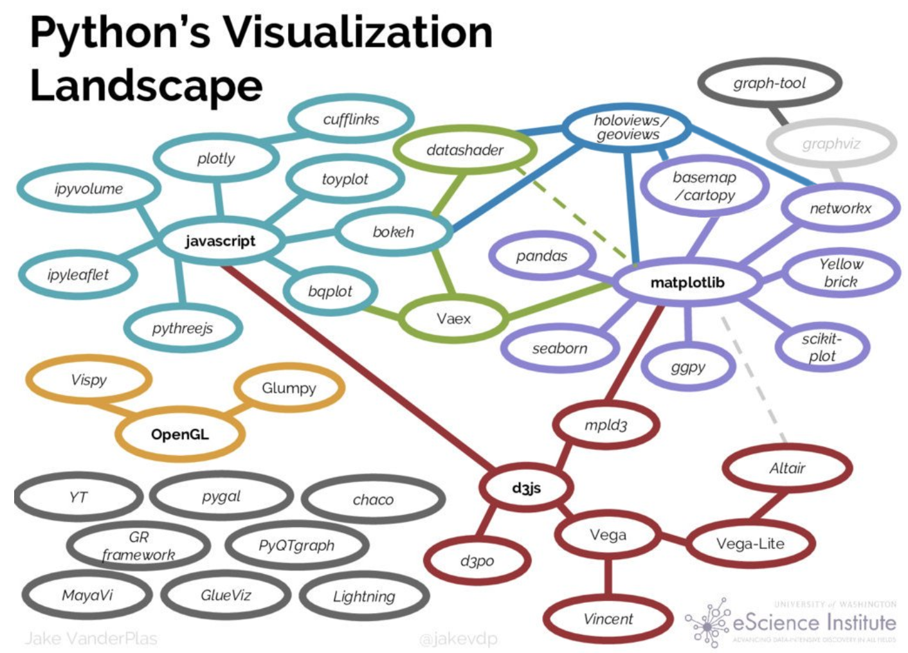
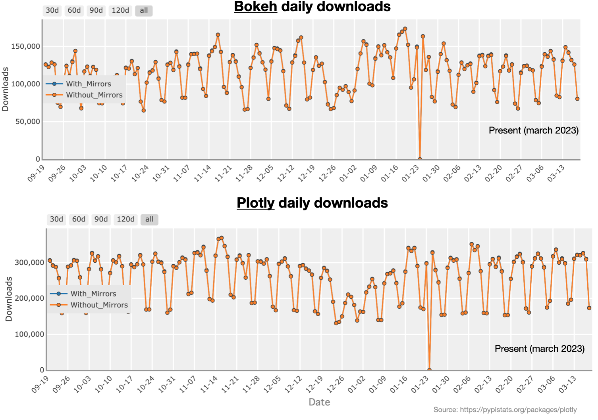
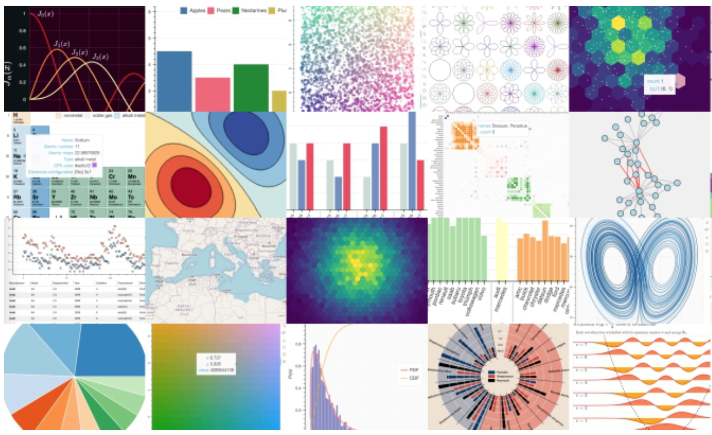

# Bokeh
A quick introduction.   
{width=100}

## What is Bokeh?

* Bokeh is an open-source Python library for creating interactive visualizations and data-driven multi-panel dashboards. 
* It provides a simple interface for creating a wide range of visualization types. 
* Supports a variety of data sources, including NumPy arrays, Pandas data frames, and streaming data sources.
* One of the key features of Bokeh is its ability to create `interactive visualizations`. 
  * Users can add widgets, allowing viewers to interact with and explore the data 
* Overall, Bokeh is a powerful tool for creating interactive, data-driven visualizations and applications in Python. 
* **Installation**: 
  * `conda install bokeh`  
  * or `python -m pip install bokeh`

## Where do we stand 
* With `Bokeh` you can create `client side` visualizations in a `Pythonic` manner
* It doesn't wrap `D3`, instead uses its own `Bokeh.js` 
* Just like with plotly, JavaScript-powered visualizations without writing any JavaScript
* You can also build interactive web applications (`Bokeh server`), similar to `Dash` 
    {width=600}

## Bokeh vs Plotly

* Ultimately `Bokeh` is a `python` native alternative to `Plotly` and `Dash`
* From the graph we can see that Plotly is around `2.5X more popular` 
    {width=775}

## Example: Hello world line plot

* We can see that the syntax is similar to other libraries we have worked with. 
  * e.g. (1) initialize figure, (2) add data, (3) render 

```{python}
# | label: "Buggy"
# | eval: false

# Source: https://buggyprogrammer.com/bokeh-vs-plotly-which-one-is-better-in-2022/

# IMPORT LIBARAY
from bokeh.plotting import figure, output_file, save, show

# GENERATE SOME DATA
x = [0.1, 0.5, 1.0, 1.5, 2.0, 2.5, 3.0]
y = [i**2 for i in x]

# INITIALIZE FIGURE
fig = figure(
    tools="pan,box_zoom,wheel_zoom,zoom_in,zoom_out,reset,save",
    title="Example Bokeh plot",
    y_axis_type="log",
    y_range=[0.001, 10**3],
    x_axis_label="Sections",
    y_axis_label="Particles (log)",
    height=400,
    width=600,
)

# ADD DATA TO FIGURE
fig.circle(x, x, legend_label="y=x", fill_color="white", size=8)
fig.line(x, y, legend_label="y=x^2", line_width=3, line_color="red")

# SAVE FIGURE
file_name = "./images/boken-1.html"
output_file(file_name)
save(fig)
# from IPython.display import IFrame
#
# IFrame(src=file_name, width=600, height=600)
```

<iframe src="images/boken-1.html" width="100%" height="70%"></iframe>

## Example: Slider and dropdown

```{python}
# | label: fig-2
# | eval: false
from bokeh.layouts import layout
from bokeh.models import Div, RangeSlider, Spinner
from bokeh.plotting import figure, show

# prepare some data
x = [1, 2, 3, 4, 5, 6, 7, 8, 9, 10]
y = [4, 5, 5, 7, 2, 6, 4, 9, 1, 3]

# create plot with circle glyphs
p = figure(
    x_range=(1, 9),
    width=500,
    height=250,
)
points = p.circle(
    x=x,
    y=y,
    size=30,
    fill_color="#21a7df",
)

# set up textarea (div)
div = Div(
    text="""
            <p>Select the circle's size using this control element:</p>
            """,
    width=200,
    height=30,
)

# set up spinner
spinner = Spinner(
    title="Circle size",
    low=0,
    high=60,
    step=5,
    value=points.glyph.size,
    width=200,
)
spinner.js_link("value", points.glyph, "size")

# set up RangeSlider
range_slider = RangeSlider(
    title="Adjust x-axis range",
    start=0,
    end=10,
    step=1,
    value=(p.x_range.start, p.x_range.end),
)
range_slider.js_link(
    "value",
    p.x_range,
    "start",
    attr_selector=0,
)
range_slider.js_link(
    "value",
    p.x_range,
    "end",
    attr_selector=1,
)

# create layout
layout = layout(
    [
        [div, spinner],
        [range_slider],
        [p],
    ]
)

# show result
# show(layout)

file_name = "./images/boken-2.html"
output_file(file_name)
save(layout)
from IPython.display import IFrame

IFrame(src=file_name, width=1000, height=1000)
```

<iframe src="images/boken-2.html" width="100%" height="70%"></iframe>

## Histogram (optional)

* Here we show a more involved example, please look over the code outside of class

```{python}
# | eval: false
# SOURCE: https://docs.bokeh.org/en/latest/docs/gallery/histogram.html

import numpy as np
import scipy.special

from bokeh.layouts import gridplot
from bokeh.plotting import figure, show


def make_plot(
    title,
    hist,
    edges,
    x,
    pdf,
    cdf,
):
    p = figure(
        title=title,
        tools="",
        background_fill_color="#fafafa",
    )
    p.quad(
        top=hist,
        bottom=0,
        left=edges[:-1],
        right=edges[1:],
        fill_color="navy",
        line_color="white",
        alpha=0.5,
    )
    p.line(
        x,
        pdf,
        line_color="#ff8888",
        line_width=4,
        alpha=0.7,
        legend_label="PDF",
    )
    p.line(
        x,
        cdf,
        line_color="orange",
        line_width=2,
        alpha=0.7,
        legend_label="CDF",
    )

    p.y_range.start = 0
    p.legend.location = "center_right"
    p.legend.background_fill_color = "#fefefe"
    p.xaxis.axis_label = "x"
    p.yaxis.axis_label = "Pr(x)"
    p.grid.grid_line_color = "white"
    return p


# Normal Distribution

mu, sigma = 0, 0.5

measured = np.random.normal(mu, sigma, 1000)
hist, edges = np.histogram(measured, density=True, bins=50)

x = np.linspace(-2, 2, 1000)
pdf = 1 / (sigma * np.sqrt(2 * np.pi)) * np.exp(-((x - mu) ** 2) / (2 * sigma**2))
cdf = (1 + scipy.special.erf((x - mu) / np.sqrt(2 * sigma**2))) / 2

p1 = make_plot("Normal Distribution (μ=0, σ=0.5)", hist, edges, x, pdf, cdf)

# Log-Normal Distribution

mu, sigma = 0, 0.5

measured = np.random.lognormal(mu, sigma, 1000)
hist, edges = np.histogram(
    measured,
    density=True,
    bins=50,
)

x = np.linspace(0.0001, 8.0, 1000)
pdf = (
    1
    / (x * sigma * np.sqrt(2 * np.pi))
    * np.exp(-((np.log(x) - mu) ** 2) / (2 * sigma**2))
)
cdf = (1 + scipy.special.erf((np.log(x) - mu) / (np.sqrt(2) * sigma))) / 2

p2 = make_plot("Log Normal Distribution (μ=0, σ=0.5)", hist, edges, x, pdf, cdf)

# Gamma Distribution

k, theta = 7.5, 1.0

measured = np.random.gamma(k, theta, 1000)
hist, edges = np.histogram(measured, density=True, bins=50)

x = np.linspace(0.0001, 20.0, 1000)
pdf = x ** (k - 1) * np.exp(-x / theta) / (theta**k * scipy.special.gamma(k))
cdf = scipy.special.gammainc(k, x / theta)

p3 = make_plot("Gamma Distribution (k=7.5, θ=1)", hist, edges, x, pdf, cdf)

# Weibull Distribution

lam, k = 1, 1.25
measured = lam * (-np.log(np.random.uniform(0, 1, 1000))) ** (1 / k)
hist, edges = np.histogram(measured, density=True, bins=50)

x = np.linspace(0.0001, 8, 1000)
pdf = (k / lam) * (x / lam) ** (k - 1) * np.exp(-((x / lam) ** k))
cdf = 1 - np.exp(-((x / lam) ** k))

p4 = make_plot("Weibull Distribution (λ=1, k=1.25)", hist, edges, x, pdf, cdf)

# show(
#     gridplot(
#         [p1, p2, p3, p4], ncols=2, width=400, height=400, toolbar_location=None
#     )
# )


file_name = "./images/boken-3.html"
output_file(file_name)
from IPython.display import IFrame

IFrame(src=file_name, width=800, height=800)
```

<iframe src="images/boken-3.html" width="100%" height="70%"></iframe>

## Bokeh gallery 

* These examples just "scratch the surface" 
* Bokeh is not a major focus of the course, however we feel it should be "on your radar"
* If you are interested, the following link has a large collection of `Bokeh examples`
  * [https://docs.bokeh.org/en/latest/docs/gallery.html](https://docs.bokeh.org/en/latest/docs/gallery.html).  
    {width=700}

# Break
Lets take a 10 minute break before moving onto the lab


{width=600}
