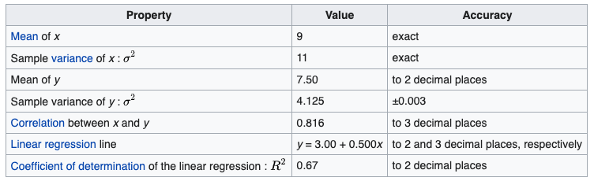
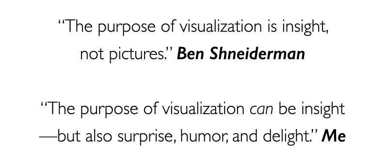

# What is visualization?

## Depends on who you ask

- **Engineer/data geek:** the intersection of computer graphics and user interface design concerned with presenting data to users by means of images. (Translation: a tool or method for generating images from complex multi-dimenstional data fed into a computational processor.)

- **Psychologist:** The formation of mental visual images. (Translation: the act or process of interpreting in visual terms.)

- **Designer:** The process of putting something into visual form. (Translation: the art of assigning representational 'codes' and techniques to data attributes and convey meaning.)

:::{.fragment}
- **Data scientist:** `ggplot` and `matplotlib`, duh!
:::


## Some definitions

The ability to take data --to be able to **understand** it, to **process** it, to **extract value** from it, to **visualize** it, to **communicate** it—- that’s going to be a hugely important skill in the next decades, because now we really do have essentially free and ubiquitous data. So the complimentary scarce factor is the ability to understand that data and extract value from it.

> Hal Varian, Google’s Chief Economist, The McKinsey Quarterly, Jan 2009

Transformation of the symbolic into the geometric

> McCormick et al. 1987


... finding the artificial memory that best supports our natural means of perception.

> Bertin 1967

The use of computer-generated, interactive, visual representations of data to amplify cognition.

> Card, Mackinlay, & Shneiderman 1999


## The value of visualization[^1]

:::: {.columns}
::: {.column width="33%"}
### Record information

[Leverage human visual cortex]{.blue}

- We can compress a huge amount of information into a condensed visual representation(e.g., blueprints, photographs, seismographs, maps)
:::

::: {.column width="33%"}
### Analyze and explore

[Exploratory visualization]{.blue}

- Helps to develop and assess hypotheses
- Identifying a good model for the data
- Find patterns and spot trends, discover errors
:::

::: {.column width="33%"}
### Communicate

[Explanatory visualization]{.blue}

-   Tell stories, share, inform, persuade
-   Collaborate and revise
:::

::::

[^1]: Source: http://vis.mit.edu/classes/6.859/lectures/01-ValueOfVisualization.pdf


## Why create visualizations?

- Answer questions (or discover them)
- Make decisions
- See data in context
- Expand memory
- Support graphical calculation
- Find patterns
- Present argument or tell a story
- Inspire

## We visualize to tell a story



<sup> Note: We will re-create this visualization later in the class <sup>


## [We visualize because numbers can lie!]{.white}{background-image="https://media.giphy.com/media/3o85gdhlpxVz8TjsTC/giphy.gif"}


## Typical summaries

-   Averages
-   Variances
-   Correlations
-   Regression lines

. . .

-   These are examples of **data compression**, where we're "squeezing" the data into a few numbers
    -   Unfortunately these are typically lossy compression methods
    -   You can't recover the data from these because
    -   Several data sets can give you the same summaries

## Summaries don't differentiate

::: columns
::: {.column width="47%"}
-   Anscombe (1973) created these toy examples
-   Averages of x and y are the same
-   Correlation between x and y are the same
-   Relationships are **VERY** different


:::

::: {.column width="47%"}
{width="400"}
:::
:::

::: aside
This data is available in R as `datasets::anscombe`
:::


## A modern take: the datasaurus

{fig-align="center" width="80%"}

Regardless of pattern, the points have the same marginal means and variances and the same Pearson correlation!!

::: notes
These data are avaailable in the R package `datasauRus`
:::


## Our choice of visualization determines what is revealed

::: notes
We see that we can keep the 5-number summary the same, but have a wide variety of distributions, from continuous to almost discrete.
:::

### Three varying 1D distributions of data, all with the same boxplot representation.

[{fig-align="center"}](https://www.autodesk.com/research/publications/same-stats-different-graphs)

::: {.callout-caution appearance="simple"}
Note that as the data changes, both the histogram and strip plot reflects the changes, but the boxplot doesn't
:::

## Our choice of visualization determines what is revealed

###  Seven distributions of data, shown as raw data points (of strip-plots), as box plots, and as violin plots

[{fig-align="center"}](https://www.autodesk.com/research/publications/same-stats-different-graphs)

::: {.callout-caution appearance="simple"}
You see something similar here. The violin plot can show distributional changes while the boxplot can't
:::

::: fragment
Is this really a problem for using boxplots?

Not really. Most of the time we're trying to show differences in location (mean,median) rather than differences in distribution. The boxplot does perfectly well showing those differences
:::

::: notes
Most of the time, what we're interested in is a shift in location, i.e. did the average or median change or differ between different conditions.

-   Did we see a difference in gene expression between normal and tumor cells

This kind of location shift is very well captured by boxplots and, in fact, by most visualizations.
:::

## Simpson's paradox

::: notes
Simpson's paradox is a common situation where subgroup behavior appeas different from aggregate behavior.

-   It is something we always have to be aware of
-   It is something that can lead to wrong inference if the group-level behavior is not accounted for
:::

```{r}
#| echo: true
#| layout-ncol: 2
#| code-fold: true
suppressPackageStartupMessages(library(tidyverse, quietly = T, warn.conflicts = F))
suppressPackageStartupMessages(library(MASS, quietly = T, warn.conflicts = F))
set.seed(5)
d <- list()
d[['Group 1']] <- as.data.frame(
  mvrnorm(n=1000, mu = c(0,0), Sigma=matrix(c(2,-0.7,-0.7,2), ncol=2))
)
d[['Group 2']] <- as.data.frame(
  mvrnorm(n = 1000, mu = c(3,3), Sigma = matrix(c(2,-0.7,-0.7,2), ncol=2))
)
d[['Group 3']] <- as.data.frame(
  mvrnorm(n=1000, mu = c(6,6), Sigma = matrix(c(2,-0.7, -0.7,2), ncol=2))
)
D <- bind_rows(d, .id = 'Group')

theme_set(theme_bw())
ggplot(D, aes(V1, V2)) + geom_point() + geom_smooth(method='lm', color ='red')
ggplot(D, aes(V1, V2)) + geom_point(aes(color = Group), show.label=F) +
  geom_smooth(aes(color = Group), se=F, method='lm')
```


> A trend or result that is present when the data is put into groups that reverses or disappears when the data is combined

::: aside
See a nice example [here](https://towardsdatascience.com/simpsons-paradox-and-interpreting-data-6a0443516765).
:::

## We visualize to understand our models and their performance

::: notes
We use things like residual plots, ROC curves, prediction curves and others to understand how well our models perform and behave.
:::

::: columns
::: {.column width="50%"}

:::

::: {.column width="50%"}

:::
:::


## We visualize to help with communicating our work to our stakeholders!

:::: columns
::: {.column width="47%"}
### Data **alone** is not **insight**
-   Humans can tell a better story than data can by itself
-   Numbers rarely speak for themeselves and need context

### Data scientists with storytelling skills have greater business impact:
-   Influencing for impact comes down to conveying a compelling narrative around data and what it means
-   Data scientists who develop this skill typically have an endge in getting their work noticed and acted upon
:::

::: {.column width="47%"}
In your work as data scientists, in addition to doing *modeling* and *machine learning* work, you will be responsible -either individually or as part of a team- for providing the following as part of a project:

-   **Findings:** what does the data say?
-   **Conclusions:** what is your interpretation of the data?
-   **Recommendations:** what can be done as a result of the *findings* and *conclusions*?
:::
::::

## Our purpose

{fig-align="center"}

