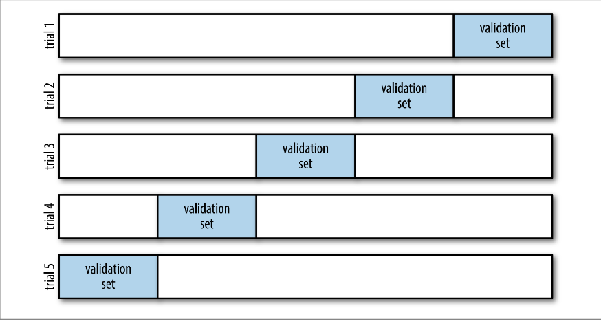
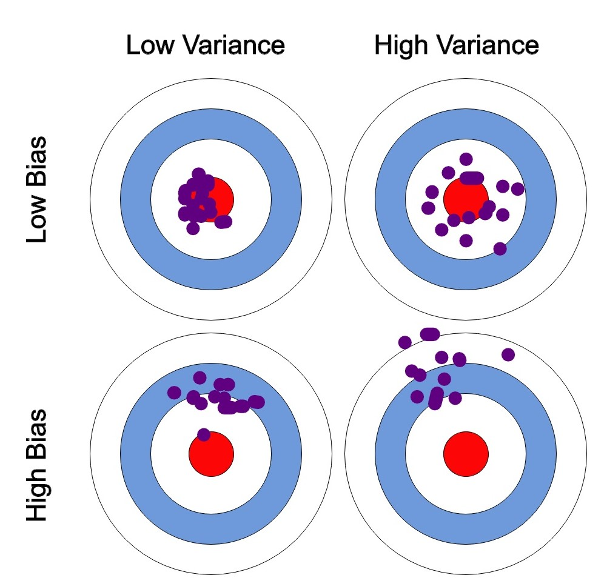
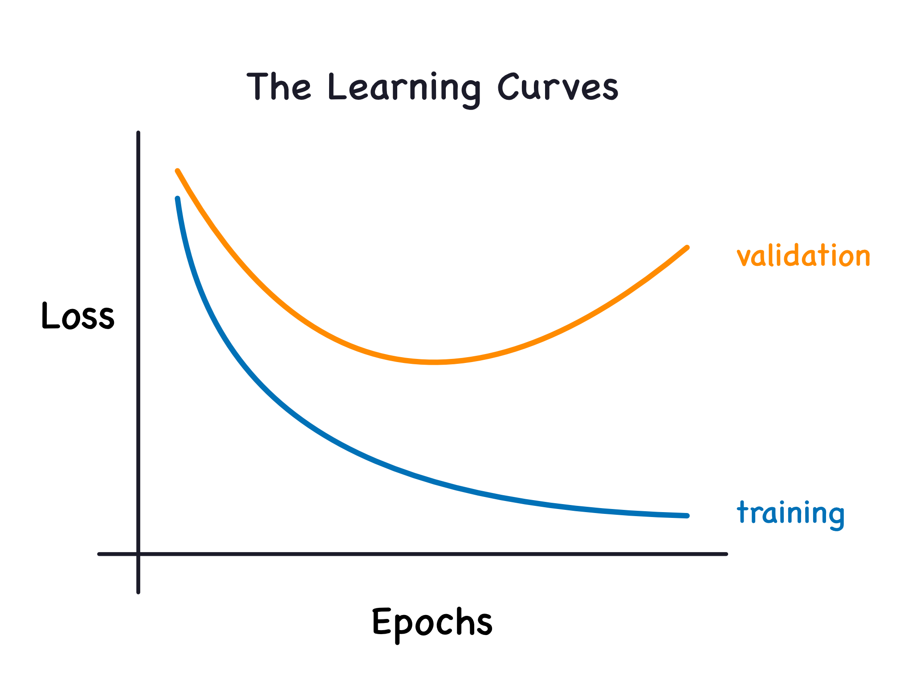
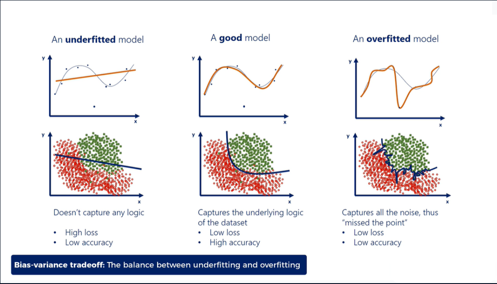
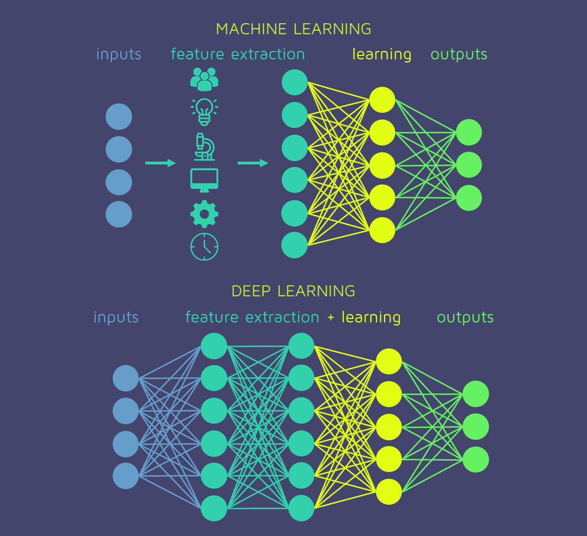

## What is Pattern Recognition?

-   A branch of machine learning focused on **classifying data** or **detecting structures** in datasets.\
-   Rooted in **statistics** and mathematical models.\
-   Goal: Build models to identify trends, predict outcomes, or group data meaningfully.


## Major Approaches

-   **Supervised Learning**: Model learns from labeled examples.\
-   **Unsupervised Learning**: Model detects hidden structures without labels.\
-   Often blends statistical modeling (probability theory) with computational optimization.

## The goal is to find patterns in the data

-   The idea here is to use potentially complex models to reflect underlying patterns in the data

-   Which of the paradigms do you think this falls into, predictive or inferential?

## Let's talk about the two worlds

-   Breiman is a bit strident in his condemnation of the data model in favor of machine learning

-   ISLR has a more balanced view

-   Two main objectives, and you need to decide going in which one you want to hit

    -   Prediction - can I understand this data in hand well enough to get a handle on what will happen with new data

    -   Inference - can I understand why the patterns in the data are the way they are

. . .

-   Inferential approaches lead to causal approaches, predictive approaches do not in general

## Statistical models vs machine learning

We will be using both statistical models and machine learning models in this class

-   Statistical models like linear regression, logistic regression etc are also used for machine learning purposes

    -   So you may be a bit confused. Always understand the purpose of the model to understand the analytic approach

## A general paradigm

-   Training on **input-output pairs**:
    -   Input: feature vector $x$
    -   Output: label $y$
-   Goal: Learn mapping $$f(x) \approx y$$
-   We play around with the *functional form* of $f$
    -   In statistical models we specify the functional form of $f$
    -   In machine learning the machine *learns* the functional form of $f$ within some imposed constraints

::: callout-tip
## What are the implications of this?

Especially in terms of data volume and signal to noise ratios
:::

## The linear model

Here we model

$$
y = b_0 + b_1x_1 + b_2x_2 +...+error
$$

::: callout-important
## Linear in parameters, not shape

The linear model is a linear function of $b_0, b_1, b_2, ..$. The predictors can basically be anything, including transformations of the original data

For example,

$$
y = b_0 + b_1x_1 + error
$$

$$
y = b_0 + b_1x_1 + b_2 x_1^2 + error
$$

$$
y = b_0 + b_1x_1 + b_2x_2 + b_3 x_1x_2
$$

are all linear models
:::

```{r}
#| include: false
#| echo: false
#| cache: false
library(tidyverse) |> suppressMessages()
theme_set(theme_bw())
```

## Let's look at some data {auto-animate="true"}

**EDA helps us figure out the kind of statistical model we might fit**

```{r}
#| fig-height: 1
#| fig-asp: 0.6

ggplot(airquality, aes(Temp, Ozone)) +
  geom_point() +
  theme_bw()
```

## Let's look at some data

**EDA helps us figure out the kind of statistical model we might fit**

```{r}
#| fig-height: 1
#| fig-asp: 0.6
ggplot(airquality, aes(Temp, Ozone)) +
  geom_point() +
  geom_smooth(se = F) +
  theme_bw()
```

## Let's look at some data

**EDA helps us figure out the kind of statistical model we might fit**

```{r}
#| fig-height: 1
#| fig-asp: 0.6
ggplot(airquality, aes(Temp, Ozone)) +
  geom_point() +
  geom_smooth(se = F) +
  annotate(
    'text',
    x = 65,
    y = 125,
    label = "Not linear",
    size = 10,
    color = 'red'
  ) +
  theme_bw()
```

## Fitting a linear model in R

```{r}
#| code-fold: false
model <- lm(Ozone ~ Temp, data = airquality)
summary(model)
```

## Fitting a linear model in R

```{r}
library(broom)
add_model <- augment(model)
ggplot(add_model, aes(x = Temp)) +
  geom_point(aes(y = Ozone)) +
  geom_line(aes(y = .fitted), color = 'blue')
```

## Fitting a linear model in R

```{r}
library(broom)
add_model <- augment(model)
ggplot(add_model, aes(x = Temp)) +
  geom_point(aes(y = Ozone)) +
  geom_line(aes(y = .fitted), color = 'blue') +
  annotate(
    'text',
    x = 65,
    y = 125,
    label = 'Not a great fit',
    size = 8,
    color = 'red'
  )
```

## Residuals can help figure out functional forms

Residuals are what's left after you subtract the fitted (predicted) values of the model from the actual data (for each value of the predictors, you have a value in the data and a value from the model. Subtract the latter from the former)

See [here](http://www.feat.engineering/numeric-one-to-one) for more details

```{r}
ggplot(add_model, aes(.fitted, .resid)) +
  geom_point() +
  geom_smooth(se = F) +
  geom_hline(yintercept = 0, linetype = 2) +
  labs(x = 'Fitted values', y = 'Residual values')
```

## Trying a new model (still linear)

```{r}
model2 <- lm(Ozone ~ Temp + I(Temp^2), data = airquality)
add_model2 <- augment(model2)
ggplot(model2, aes(x = Temp)) +
  geom_point(aes(y = Ozone)) +
  geom_line(aes(y = .fitted), color = 'blue') +
  geom_smooth(aes(y = Ozone), se = F, color = 'green')
```

## Residuals

```{r}
ggplot(add_model2, aes(.fitted, .resid)) +
  geom_point() +
  geom_smooth(se = F) +
  geom_hline(yintercept = 0, linetype = 2) +
  labs(x = 'Fitted values', y = 'Residual values')
```

## Fitting statistical models

-   You're going for good enough, not perfect

-   You don't want a model that goes through all the data points (why?)

-   This process is iterative and is influenced by

    -   domain knowledge (mechanistic models)

    -   study design

## Where's the inference bit?

```{r}
library(gtsummary)
tbl_regression(model2)
```

The p-value is indicative of how much that parameter is statistically different from 0. We'll return to p-values in 3 weeks to see how they can be computed, what they mean and how we interpret them (or not)

::: callout-caution
A small p-value **does not mean** that the variable is "important". We'll come back to this later
:::

## So what's going on with `geom_smooth`?

`geom_smooth` uses machine learning to fit a locally representative curve to the data

-   It creates windows on the x-axis and finds the best estimate of y (typically the mean)

-   As the window moves, it computes the mean of y for each window and then joins them in a curve

## Supervised Learning

-   Training on **input-output pairs**:
    -   Input: feature vector $x$
    -   Output: label $y$
-   Goal: Learn mapping $$f(x) \approx y$$
-   Applications:
    -   Spam detection\
    -   Medical diagnosis\
    -   Weather forecasting\
    -   Predicting customers

## But...

Now, instead of finding the best-fitting curve, it finds the curve that best **predicts** on new data.

. . .

</img>

## Judging different models

-   Statistical models are typically judged by the quality of the **fit** on the **current data**

    -   Using the mean-square error $$\sum(y - f(x))^2$$

-   Predictive models are judged by how well it predicts on **data it hasn't seen yet**.

    -   Still using mean-square error, but using new data

## The supervised learning approach

-   Split your data up into 2 parts

-   Fit your model to one part (called the *training data*)

-   Now judge your model on the other part (called the *test* or *validation* data)

    -   Or you can get new data that is similar to the training data

## More generally, we use cross-validation



We'll then average the performance over all the validation sets to judge the model

## What's the point?

-   Finding better models in a predictive sense

-   Trying to minimize the **generalizability error**

-   Getting to a model you can hopefully trust to understand the world

## The supervised learning model universe

[An close-to-exhaustive list](https://www.tidymodels.org/find/parsnip/)

We'll primarily focus on

-   LInear/logistic models

-   Decision trees (**rpart**)

-   Random forests (**randomForest**)

-   Boosted trees (**xgboost**)

-   k-nearest neighbors (**kknn**)

Use them for now, understand them later

## Unsupervised Learning

-   Training on **unlabeled data**:
    -   Only input vector $x$, no predefined labels.\
-   Goal: Discover structure or patterns.\
-   Applications:
    -   Clustering customers by purchasing behavior\
    -   Gene expression grouping in bioinformatics\
    -   Topic modeling in text datasets

## Examples of Methods

-   k-means clustering
-   Principal Component Analysis (PCA)
-   Hierarchical clustering

## Application in R

```{r}
data(iris)
clust <- kmeans(iris |> select(-Species), centers = 3)
ggplot(iris, aes(x = Petal.Length, y = Petal.Width)) +
  geom_point(color = clust$cluster, show.legend = F)
```

## Application in R (2)

```{r}
d = dist(iris |> select(-Species))
clust2 <- hclust(d)
clust_ids <- cutree(clust2, k = 3)

ggplot(iris, aes(x = Petal.Length, y = Petal.Width)) +
  geom_point(color = clust_ids, show.legend = F)
```

## Bias-Variance Tradeoff

-   A central concept in statistical learning.\
-   **Bias**: Error due to overly simple models (underfitting).\
-   **Variance**: Error due to overly complex models reacting to noise (overfitting).\
-   Goal: Find the **sweet spot** minimizing total error.

## Bias-Variance Tradeoff



## Bias-Variance Visualization

-   Underfitting: High bias, low variance\
-   Overfitting: Low bias, high variance\
-   Best models balance the two for optimal generalization.

If we are in the train-test paradigm, we can look at



## Bias-Variance Visualization



## Which models work (in this sense)?

-   Linear models (as in a straight line model) will often underfit

-   Neural networks will often overfit if not careful

-   Hybrid methods that fit a lot of simple models together seem to work well

    -   Random Forests

    -   Boosted Trees

## And what about deep learning?!!

Deep learning is a class of neural networks

They have many layers that can capture minute patterns in the data



## Statistical Pattern Recognition in Practice

-   Requires:
    -   Clear problem definition\
    -   Choice of features or dimensionality reduction\
    -   Model selection (based on complexity and interpretability)\
    -   Evaluation with test/train splits or cross-validation

## Key Takeaways

-   Pattern recognition blends **statistics** with **machine learning**.\
-   **Supervised learning** uses labels; **unsupervised learning** finds structure.\
-   The **bias-variance tradeoff** is crucial for balancing model complexity and predictive accuracy.