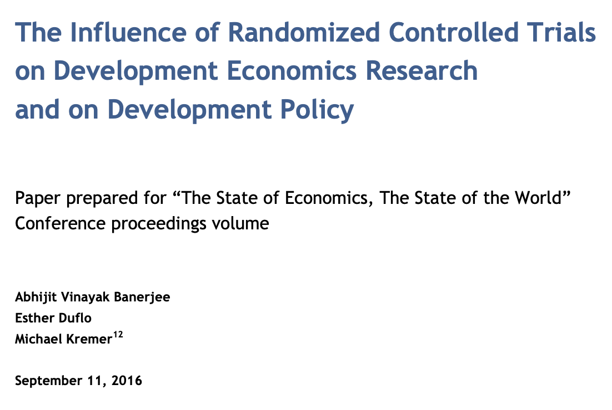

## A look back

-   Last week, we started thinking about models as a way to identify patterns in data
-   We distinguished between explanatory and predictive modeling
-   We also distinguished between unsupervised and supervised learning
-   We introduced linear regression as a way to model relationships between variables
-   We also introduced classification as a way to predict categorical outcomes
-   We introduced the concept of overfitting and the bias-variance tradeoff

::: aside
```{r}
#| code-fold: true
#| code-summary: "Setup code"
#| eval: true
#| cache: false
library(tidyverse)
library(janitor)
theme_set(theme_minimal() +
    theme(axis.text = element_text(size = 14),
          axis.title = element_text(size = 16),
          plot.title = element_text(size = 18, face = "bold"),
          plot.subtitle = element_text(size = 14),
          legend.text = element_text(size = 12),
          legend.title = element_text(size = 14)))
```
:::

## Noise in the system

::::: columns
::: column
```{r}
airquality |> 
    clean_names() |>
    ggplot(aes(x = wind, y = ozone)) +
    geom_point() +
    geom_smooth() +
    annotate("text", x = 12, y = 125, label = "Data rarely fits patterns exactly", color = "blue", size = 6) 

```
:::

::: column
-   There is always noise in the system (irreducible error)
-   We usually are dealing with a **sample** of the population, and different samples will yield different results (sampling error)
-   We often have **measurement error** in our variables
:::
:::::

## Games of chance

{width="35%"}

{.absolute .nolightbox left="500" top="50" width="50%"}

{.absolute .nolightbox left="30" top="350" width="450"}

::: {.absolute .fragment bottom="20" right="0" width="45%" style="border: 2px solid #131516;padding: 10px;"}
We use randomness and independence of events to select subjects in a "fair" manner. This idea of fairness is inextricably linked with randomness and independence, which also will lead us to be able to make causal inferences

Randomness and independence are concepts from the language of **probability**
:::

## Making inferences

-   Questions we might ask:
    -   How likely is it that a new policy reduces crime? How **confident** are we in that estimate?
    -   How confident are we that a new drug for cancer improves survival? Is the improvement sufficient to justify the cost and side effects?
    -   How likely is it that a new marketing campaign increases sales? How confident are we in that estimate?

::: {.fragment .fade-in}
-   We often want to make inferences about a population based on a sample, preferably in a way that is generalizable
    -   The key word here is **generalizable**, which often depends on the sample being selected in a random manner
    -   If we could, we would measure the entire population, but this is usually infeasible. But different samples will yield different results
    -   Probability theory gives us a language to think about this uncertainty, quantify it and make decisions in the face of it
:::

## Today

-   Today, we will introduce probability as a language for thinking about uncertainty
-   We will introduce some basic concepts in probability theory
-   We will also introduce some basic probability distributions
-   We will also introduce some basic concepts in statistical inference

## But first, a question

::::: columns
::: column
```{r}
#| echo: false
expand.grid(x = 0:10, y = 0:10) |> 
    ggplot(aes(x = x, y = y)) +
    geom_point() +
    theme_minimal() +
    theme(axis.title = element_blank(),
          axis.text = element_blank(),
          axis.ticks = element_blank())
```
:::

::: column
```{r}
#| echo: false
set.seed(2395)
x <- runif(50, 0, 10)
y <- runif(50, 0, 10)
tibble(x, y) |>
    ggplot(aes(x = x, y = y)) +
    geom_point(size=3) +
    theme_minimal() +
    theme(axis.title = element_blank(),
          axis.text = element_blank(),
          axis.ticks = element_blank())
```
:::
:::::

::: r-fit-text
Which of these two plots is more likely to have been generated by random sampling?
:::

::: {.fragment style="color: gray; border: 2px solid black; padding: 10px"}
A common misconception is that random data is **uniform**.

Uniformity is the **opposite** of randomness. It is perfectly predictable, while random data is **not**
:::

## A starting definition

-   Probability assigns a number between 0 and 1 reflecting how likely an event is
-   Formalized with a **sample space** (all possible outcomes) and events based on some experiment
-   The probability of an event A: $P(A)$

::: {.fragment style="color: gray; border: 2px solid black; padding: 10px"}
### What's an event?

An event is a realization of an experiment. We start with elemental events, the actual results of the experiment. For example, tossing a single coin once can generate the events $\{H, T\}$. Tossing two coins can result in the possible events $\{HH, HT, TH, TT\}$. The full collection of possible elemental events is the **sample space** for the experiment.

We can then *compose* more complex events like, seeing 1 head in 2 tosses; we would write this as $A = \{HT, TH\}$.
:::

## Sample Space and Events

-   **Sample Space (S):** Set of all possible outcomes.
-   **Event:** Any subset of S, e.g., "coin lands Heads".
-   Example: Tossing two dice
    -   S = all possible ordered pairs (1,1), (1,2), ..., (6,6)
    -   Event: Sum is 7

## Probability Axioms

1.  $0 \leq P(A) \leq 1$ for any event A.
2.  $P(S) = 1$ (something in the sample space must occur).
3.  If A and B are mutually exclusive, $P(A \cup B) = P(A) + P(B)$

::: callout-note
## Mutually exclusive

Two events are mutually exclusive if they cannot occur together. For example, if the experiment is drawing a single card from a playing deck, the events {the card is a heart} and {the card is black} are mutually exclusive
:::

## Thinking about probability

The axioms we stated are quite straightforward and simple, but we often interpret probability in a more real-world manner

$P(A)$ = the **relative frequency** of seeing the event $A$ if we repeated the experiment a bunch of times

```{webr}
x <- sample(c("H", "T"), size = 10, replace = TRUE)
mean(x == "H")
```

::: fragment
```{r}
#| echo: false
#| fig-height: 2
n = c(1,5,10,50, 100, 500, 1000, 5000, 10000)
set.seed(205)
p = map_dbl(n, \(x) mean(rbinom(n = x, size = 1, p = 0.5)))
tibble(n, p) |>
  ggplot(aes(n, p)) +
    geom_line() + 
    labs(x = "Number of coin tosses", y = "Chance that you get a head") + 
    geom_hline(yintercept = 0.5, lty = 2, color = "red") +
ylim(0,1) 
```
:::

## Thinking about probability

The view of probability as a **long-term relative frequency** is what is generally called a frequentist approach

But you can also just state what you think the probability of an event is, as long as it follows the axioms

::: callout-note
## Weather forecasts

We all see the forecast that the chance of rain tomorrow is 45%. This probability can't be from repeating the experiment many many times, since we can ever see only one realization of the experiment, i.e., what actually happens tomorrow. In fact it is based on predictive models, but the probabilistic interpretation can't be in terms of relative frequencies.
:::

## Nate Silver and the 2016 US presidential race

Nate Silver and his team at 538 had been doing presidential predictions for a few cycles. In 2016 his prediction was that Hilary Clinton had a 70% chance of winning the presidency. This of course did not pass, leading to plenty of hand-wringing in data circles.

What did Silver's team do?

-   Simulate the election many thousands if not millions of times based on the best polling data available

    -   In a sense he repeated the experiment many times, though we'd only see one experiment and one result from Nov, 2016.

-   See how often each candidate came out ahead

-   But there was uncertainty in the result (Trump won in 30% of the simulations, so not a small chance)

-   And there were several assumptions around independence of polls and between states that came into play

## Nate Silver and the 2016 US presidential election

> One is that I don’t think people have a good intuitive sense for how to translate polls to probabilities. In theory, that’s the benefit of a model. But I think people thought “Well, Clinton’s ahead in most of the polls in most states, and I remember that seems similar to Obama four years ago, and therefore I’m very confident that she’ll win.” It’s ad hoc and not really very rigorous, that thought process.

[Nate Silver, Harvard Gazette, 2017]{style="float:right;"}

::: aside
<https://news.harvard.edu/gazette/story/2017/03/nate-silver-says-conventional-wisdom-not-data-killed-2016-election-forecasts/>
:::

## Where are probabilities coming from?

:::::: columns
:::: {.column width="60%"}
Suppose we toss a coin. If we know everything about the coin, the toss, the air resistance, etc., we could in theory predict the outcome. It could be a deterministic system, exactly predictable

-   We don't know all that information
-   The information we don't have affects the outcomes in small ways, leading to uncertainty of unknown origin
-   We can model this uncertainty with probabilities
-   This is called an **epistemic** uncertainty, i.e., uncertainty due to lack of knowledge

::: aside
-   This is different from a **stochastic** uncertainty, i.e., uncertainty due to inherent randomness in the system
:::
::::

::: {.column width="40%"}

:::
::::::

::: {.fragment .r-fit-text}
This uncertainty gets modeled as a **probability distribution**, which is a mathematical function that describes the likelihood of different outcomes
:::

## The sample space and probability distributions

There are two main types of sample spaces: **continuous** and **discrete**

-   This depends on the nature of the sample space $S$
    -   A continuous sample space has an infinite number of possible outcomes, e.g., the height of a person, the time it takes to run a mile
    -   A discrete sample space has a finite or countably infinite number of possible outcomes, e.g., the number of heads in 10 coin tosses, the number of cars passing through an intersection in an hour

## Discrete probability distributions

-   A discrete probability distribution assigns probabilities to each possible outcome in a discrete sample space
-   The probabilities must satisfy the axioms of probability
-   We can list the probabilities of each outcome using the *probability mass function* (pmf)

::: callout-note
## The binomial distribution

This distribution is generated by the prototype experiment of tossing *n* coins, each of which has a probability *p* of being a H, and counting the total number of heads.

::: {.columns}
::: {.column}

$$
P(X = k) = \binom{n}{k} p^k (1-p)^{n-k}, \text{ for } k = 0, 1, ..., n
$$

where $\binom{n}{k} = \frac{n!}{k!(n-k)!}$ is the binomial coefficient, i.e. the number of ways to choose k successes (heads) out of n trials (tosses).
:::
::: {.column}
```{r}
n <- 10; p <- 0.7
p = pbinom(0:n, size = n, prob = p)

tibble(k = 0:n, p) |>
  ggplot(aes(k, p)) +
    geom_bar(stat = "identity") + 
    labs(x = "Number of heads", y = "Probability") + 
    labs(title = "Binomial Distribution (n=10, p=0.7)")
```
:::
::: 
:::

## The binomial distribution

```{webr}
#| fig-height: 1
n <- 10; p <- 0.7
p = pbinom(0:n, size = n, prob = p)
tibble(k = 0:n, p) |>
  ggplot(aes(k, p)) +
    geom_bar(stat = "identity") + 
    labs(x = "Number of heads", y = "Probability") 

```

## The Poisson distribution

-   This distribution is often used to model the number of events occurring in a fixed interval of time or space
-   It is characterized by a single parameter $\lambda$, which is the average rate of occurrence of the event
-   It arose from the study of rare events, e.g., the number of phone calls received by a call center in an hour, the number of accidents at a traffic intersection in a day

::: callout-note
## The Poisson distribution

::: {.columns}
::: {.column}
$$
P(X = k) = \frac{\lambda^k e^{-\lambda}}{k!}, \text{ for } k = 0, 1, 2, ...
$$

where $\lambda$ is the average rate of occurrence of the event, and $e$ is the base of the natural logarithm (approximately 2.71828).
:::
::: {.column}
```{r}
lambda <- 3
p = dpois(0:15, lambda = lambda)
tibble(k = 0:15, p) |>
  ggplot(aes(k, p)) +
    geom_bar(stat = "identity") + 
    labs(x = "Number of events", y = "Probability") + 
    labs(title = "Poisson Distribution (lambda=3)")
```
:::
:::
:::

## The Poisson distribution

```{webr}
#| fig-height: 2
lambda <- 3
p = dpois(0:15, lambda = lambda)

tibble(k = 0:15, p) |>
  ggplot(aes(k, p)) +
    geom_bar(stat = "identity") + 
    labs(x = "Number of events", y = "Probability") 
```

# Continuous probability distributions

## Continuous probability distributions

-   A continuous probability distribution assigns probabilities to intervals of outcomes in a continuous sample space
-   The probabilities must satisfy the axioms of probability
-   We can describe the probabilities using the *probability density function* (pdf)

::: callout-note
## The normal distribution

This distribution is often used to model continuous variables that are symmetrically distributed around a mean. It is characterized by two parameters: the mean $\mu$ and the standard deviation $\sigma$.

:::: {.columns}
::: {.column}
$$
f(x) = \frac{1}{\sigma \sqrt{2\pi}} e^{-\frac{(x - \mu)^2}{2\sigma^2}}, \text{ for } -\infty < x < \infty
$$

This is popularly called the Bell Curve.

It is also called the Gaussian distribution, after Carl Friedrich Gauss, who first described it in the context of errors in astronomical observations.
:::

::: {.column}
```{r}
mu <- 0; sigma <- 1
x <- seq(-4, 4, length.out = 100)
y <- dnorm(x, mean = mu, sd = sigma)
tibble(x, y) |>
  ggplot(aes(x, y)) +
    geom_line() + 
    labs(x = "x", y = "Density") + 
    labs(title = "Normal Distribution (mu=0, sigma=1)")
```
:::
::::
:::

## The normal distribution

```{webr}
#| fig-height: 2
mu <- 0; sigma <- 1
x <- seq(-4, 4, length.out = 100)
y <- dnorm(x, mean = mu, sd = sigma)
tibble(x, y) |>
  ggplot(aes(x, y)) +
    geom_line() + 
    labs(x = "x", y = "Density") 
```

## The uniform distribution

-   This distribution is often used to model continuous variables that are uniformly distributed over a range
-   It is characterized by two parameters: the minimum value $a$ and the maximum value $b$
-   Every interval of the same length within the range has an equal probability of occurring

::: callout-note
## The uniform distribution
:::: {.columns}
::: {.column}
$$
f(x) = \frac{1}{b - a}, \text{ for } a \leq x \leq b
$$
:::
::: {.column}
```{r}
a <- 0; b <- 1
x <- seq(a, b, length.out = 100)
y <- dunif(x, min = a, max = b)
tibble(x, y) |>
  ggplot(aes(x, y)) +
    geom_line() + 
    labs(x = "x", y = "Density") + 
    labs(title = "Uniform Distribution (a=0, b=1)")
```
:::
::::
:::

## The exponential distribution
-   This distribution is often used to model the time between events in a Poisson process
-   It is characterized by a single parameter $\lambda$, which is the rate of occurrence of the event

::: callout-note
## The exponential distribution
:::: {.columns}
::: {.column}
$$
f(x) = \lambda e^{-\lambda x}, \text{ for } x \geq 0
$$

It is related to the Poisson distribution, as the time between events in a Poisson process follows an exponential distribution

- The rate parameter $\lambda$ is the reciprocal of the mean time between events, i.e., $\lambda = \frac{1}{\text{mean}}$. It is related to the Poisson distribution parameter $\lambda$ as well, since if events occur at an average rate of $\lambda$ per unit time, the time between events follows an exponential distribution with parameter $\lambda$.
:::
::: {.column}
```{r}
lambda <- 1
x <- seq(0, 5, length.out = 100)
y <- dexp(x, rate = lambda)
tibble(x, y) |>
  ggplot(aes(x, y)) +
    geom_line() + 
    labs(x = "x", y = "Density")  
```
:::
::::
:::

## The Poisson and exponential distributions

```{webr}
#| fig-height: 1
library(patchwork)
lambda <- 1

x <- seq(0, 5, length.out = 100)
y <- dexp(x, rate = lambda)
z <- dpois(0:20, lambda = lambda)
p1 <- tibble(x, y) |>
  ggplot(aes(x, y)) +
    geom_line() + 
    labs(x = "x", y = "Density") + 
    labs(title = "Exponential Distribution")
p2 <- tibble(x=0:20,z) |>
  ggplot(aes(x, z)) +
    geom_bar(stat = "identity") + 
    labs(x = "Number of events", y = "Probability") + 
    labs(title = "Poisson Distribution")
p1 + p2 + plot_layout(nrow = 1)
```

## Summary
-   Probability is a language for thinking about uncertainty
-   We can think of probability in terms of long-term relative frequencies
-   We introduced some basic concepts in probability theory
-   We introduced some basic probability distributions

## Thinking about continuous distributions

For continuous distributions, it makes no sense to talk about the probability of a single number

Events are defined as intervals, e.g., $a < X < b$

```{r}
ggplot() +
  # Add the full normal density curve
  stat_function(
    fun = dnorm,
    n = 1000,
    size = 1
  ) +
    geom_hline(yintercept = 0) + 
  # Add shaded region between -2 and 1
  stat_function(
    fun = dnorm,
    geom = "area",
    fill = "red",
    alpha = 0.7,
    xlim = c(-2, 1)
  ) +
  # Set x-axis limits for good visualization
  scale_x_continuous(limits = c(-4, 4), 
  breaks = seq(-4, 4, by = 1)) +
  labs(
    x = "",
    y = "Density",
    title = "Standard Normal Distribution",
    subtitle = "Shaded region: -2 < x < 1"
  ) + 
    theme(axis.text.y = element_blank(), 
    axis.title.y = element_blank())
```

## The Normal distribution
- The normal distribution is ubiquitous in statistics, and is often used to model continuous variables that are symmetrically distributed around a mean
- It has a special place in statistics due to the **Central Limit Theorem**, which states that the sum of a large number of independent random variables will be approximately normally distributed, regardless of the original distribution of the variables

- Many statistical methods, including linear regression, assume that the errors are normally distributed

## The Central Limit Theorem

-   The Central Limit Theorem (CLT) states that the sum (or average) of a large number of **independent** random variables, regardless of their individual distributions, will be approximately normally distributed
-   This is a powerful result, as it allows us to use the normal distribution to make inferences about the population mean, even if the underlying data is not normally distributed

:::: {.fragment}
::: callout-note
## Indepedent events

Two events A and B are independent if the occurrence of one does not affect the probability of the other. Mathematically, this is expressed as:

$$
P(A \cap B) = P(A) \cdot P(B)
$$
This means that the probability of both events occurring together is equal to the product of their individual probabilities.
:::
::::

## The Central Limit Theorem

```{webr}
#| fig-height: 2
set.seed(123)
n <- 1000
means <- replicate(n, mean(rexp(40, rate = 1)))
tibble(means) |>
  ggplot(aes(means)) +
    geom_histogram(aes(y = ..density..), bins = 30, fill = "lightblue", color = "black") +
    stat_function(fun = dnorm, args = list(mean = mean(means), sd = sd(means)), color = "red", linewidth = 1) +
    labs(x = "Sample Means", y = "Density") + 
    labs(title = "Central Limit Theorem: Distribution of Sample Means")
```

# Revisiting independence and lack thereof

## Independence

Recall that two events A and B are independent if the occurrence of one does not affect the probability of the other. Mathematically, this is expressed as:
$$
P(A \text{ and } B) = P(A) \cdot P(B)
$$

What happens when events are not independent?

-   If events are not independent, the occurrence of one event affects the probability of the other
-  This is called **dependence** or **correlation**
-  For example, if we know that it is raining, the probability of carrying an umbrella is higher than if we don't know the weather

## Dependence

When events are dependent, we need to use **conditional probabilities** to describe the relationship between them

::: callout-note
## Conditional Probability
The conditional probability of event A given event B is denoted as $P(A|B)$, and is defined as:

$$
P(A|B) = \frac{P(A \text{and} B)}{P(B)}
$$

This means that the probability of event A occurring given that event B has occurred is equal to the probability of both events occurring together divided by the probability of event B occurring
:::

## Calculating conditional probabilities

-   We can use the definition of conditional probability to calculate the probability of an event given another event
-   For example, if we know that it is raining, we can calculate the probability of carrying an umbrella as:

$$
P(U|R) = \frac{P(U \text{ and } R)}{P(R)}
$$

where U is the event of carrying an umbrella, and R is the event of it raining

Let's say that $P(U \text{ and } R) = 0.3$ and $P(R) = 0.5$, then:
$$
P(U|R) = \frac{0.3}{0.5} = 0.6
$$

## The law of total probability

-   The law of total probability allows us to calculate the probability of an event by considering all possible ways that event can occur
-   For example, if we want to calculate the probability of carrying an umbrella, we can consider the two possible scenarios: it is raining or it is not raining

$$
P(U) = P(U\text{ and } R) + P(U\text{ and } \neg R)
$$

::: {.fragment}

$$
P(U) = P(U|R)P(R) + P(U|\neg R)P(\neg R)
$$

:::

where $\neg R$ is the event of it not raining

::: {.aside}
Note here that if we have mutually exclusive events A and B, then $P(A \text{or} B) = P(A) + P(B)$
:::

## Bayes' theorem

-   Bayes' theorem allows us to update our beliefs about the probability of an event based on new evidence
-  It is often used in machine learning and data science to make predictions based on observed data
-   It is based on the concept of conditional probability

For two events A and B, Bayes' theorem states that:
$$
P(A|B) = \frac{P(B|A)P(A)}{P(B)} 
$$

which gives us a way of reversing the conditioning event, and tells us what we need to do it. 

::: callout-important
## Note

Generally, $P(A|B) \neq P(B|A)$, so you cannot just reverse the conditioning event without using Bayes' theorem. The roles of A and B are not symmetric in conditional probabilities
:::

## Conditional probabilities, revisited

- Conditional probabilities are central to our understanding of the world, as many events are dependent on each other
- We are often interested in how the probability of an event changes based on other (predictive) information. This is the essence of **Bayesian thinking**.
- It is used in **classical** statistics as well to understand relationships between variables, e.g., in regression models
- It is also used in **machine learning** to build predictive models, e.g., in Naive Bayes classifiers

## The Monty Hall problem

-   A classic problem in probability theory, based on a game show scenario
-   You are given the choice of three doors: Behind one door is a car; behind the others, goats
-   You pick a door, say No. 1, and the host, who knows what's behind the doors, opens another door, say No. 3, which has a goat
-   He then says to you, "Do you want to pick door No. 2?"

::: {.fragment}
::: callout-note
## Is it to your advantage to switch your choice?

-   Intuition says it doesn't matter, but in fact it does
-   If you stick with your original choice, you have a 1/3 chance of winning the car
-   If you switch, you have a 2/3 chance of winning the car

::: {.fragment}
-   This is because the host's action of opening a door provides information about where the car is
-   This is an example of how conditional probabilities can be counterintuitive
:::
:::
:::



## The Monty Hall problem

```{r}
set.seed(123)
n <- 1000

stick_wins <- sum(replicate(n, {
  doors <- c("car", "goat", "goat")
  choice <- sample(1:3, 1)
  monty_options <- setdiff(which(doors == "goat"), choice)
  monty_opens <- as.numeric(sample(as.character(monty_options), 1))
  final_choice <- choice
  doors[final_choice] == "car"
}))
set.seed(123)
switch_wins <- sum(replicate(n, {
  doors <- c("car", "goat", "goat")
  choice <- sample(1:3, 1)
  monty_options <- setdiff(which(doors == "goat"), choice)
  monty_opens <- as.numeric(sample(as.character(monty_options), 1))
  final_choice <- setdiff(1:3, c(choice, monty_opens))
  doors[final_choice] == "car"
}))
tibble(strategy = c("Stick", "Switch"),
       wins = c(stick_wins, switch_wins),
       losses = n - wins) |>
  pivot_longer(cols = c(wins, losses), names_to = "outcome", values_to = "count") |>
  ggplot(aes(strategy, count, fill = outcome)) +
    geom_bar(stat = "identity", position = "dodge") + 
    scale_color_manual(values = c("wins" = "lightgreen", "losses" = "salmon")) +
    labs(x = "Strategy", y = "Count") + 
    labs(title = "Monty Hall Problem: Stick vs Switch")
```

## Monty Hall problem

P(Win with Stick) = P(Win with Stick | Chose Car)P(Chose Car) + P(Win with Stick | Chose Goat)P(Chose Goat) = $1 \cdot \frac{1}{3} + 0 \cdot \frac{2}{3} = \frac{1}{3}$

P(Win with Switch) = P(Win with Switch | Chose Car)P(Chose Car) + P(Win with Switch | Chose Goat)P(Chose Goat) = $0 \cdot \frac{1}{3} + 1 \cdot \frac{2}{3} = \frac{2}{3}
$

::: {.aside}
We are using the law of total probability here, considering the two mutually exclusive scenarios of initially choosing the car or a goat
:::

## Monty Hall problem

```{mermaid}
graph LR
    %% Node styles
    classDef start fill:#lightblue,stroke:#333
    classDef door fill:#lightblue,stroke:#333
    classDef reveal fill:#yellow,stroke:#333
    classDef win fill:#green,stroke:#333
    classDef lose fill:#pink,stroke:#333

    %% Initial choice
    Start[Start<br>Pick a door]:::start
    Car1[Door 1:<br>Car 1/3]:::door
    Goat2[Door 2:<br>Goat 1/3]:::door
    Goat3[Door 3:<br>Goat 1/3]:::door

    %% Monty's reveals
    Rev2[Monty shows<br>Door 2]:::reveal
    Rev3[Monty shows<br>Door 3]:::reveal
    Rev3b[Monty shows<br>Door 3]:::reveal
    Rev2b[Monty shows<br>Door 2]:::reveal

    %% Outcomes
    Win1[Win<br>Stick]:::win
    Lose1[Lose<br>Switch]:::lose
    Lose2[Lose<br>Stick]:::lose
    Win2[Win<br>Switch]:::win
    Lose3[Lose<br>Stick]:::lose
    Win3[Win<br>Switch]:::win

    %% Connections
    Start --> |1/3| Car1
    Start --> |1/3| Goat2
    Start --> |1/3| Goat3
    Car1 --> |1/2| Rev2
    Car1 --> |1/2| Rev3
    Goat2 --> Rev3b
    Goat3 --> Rev2b
    Rev2 -->  Win1
    Rev2 --> Lose1
    Rev3 --> Win1
    Rev3 --> Lose1
    Rev3b --> Lose2
    Rev3b --> Win2
    Rev2b --> Lose3
    Rev2b --> Win3
```

## Randomness and probability

Randomness is a basic concept in statistics, where we typically want to use random sampling to select subjects in a fair manner. 

Randomness has a precise mathematical definition, and is closely related to the concept of independence of events.

Randomly selecting individual A means that the chance that A is selected does not depend on whether any other individual is selected (**independence**).

Furthermore, we will often (but now always) want the chance of selecting each individual to be the same (**uniformity**).

## Advantages of random sampling

-   Random sampling helps to ensure that our sample is representative of the population, which is crucial for making valid inferences
-   It helps to reduce bias in the selection process, as every individual has an equal chance of being selected
-   It allows us to use probability theory to quantify uncertainty and make decisions based on data
-   It helps to ensure that our results are generalizable to the broader population

# Simulations

##

```{mermaid}
%%| echo: false
flowchart LR

A[Screen patients] --63%--> B0[ctDNA evaluable]
A --37%--> B1[Not evaluable]
B0 --46%--> C0[ctDNA+]
B0 --54%--> C1[ctDNA-]
```

We need to get 50 patients who are ctDNA+ for our study. 

::: {.fragment}
::: {.r-fit-text style="color: red;"}
How many patients do we need to screen?
:::
:::

## Simulating an epidemic

```{r}
set.seed(100)
# Parameters
N <- 1000        # Total population
I0 <- 1          # Initial infected
R0 <- 0          # Initial recovered
S0 <- N - I0     # Initial susceptible
beta <- 0.25     # Transmission rate
gamma <- 0.08    # Recovery rate
n_days <- 160    # Simulation length

# Initialize compartments
S <- numeric(n_days); I <- numeric(n_days); R <- numeric(n_days)
S[1] <- S0; I[1] <- I0; R[1] <- R0

# Simulate epidemic spread
for (t in 2:n_days) {
  new_infections <- rbinom(1, S[t-1], 1 - exp(-beta * I[t-1] / N))
  new_recoveries <- rbinom(1, I[t-1], 1 - exp(-gamma))
  S[t] <- S[t-1] - new_infections
  I[t] <- I[t-1] + new_infections - new_recoveries
  R[t] <- R[t-1] + new_recoveries
}

# Visualize epidemic curves
days <- 1:n_days
matplot(days, cbind(S, I, R), type="l", lty=1, col=c("blue","red","green"),
        xlab="Day", ylab="Individuals", main="Stochastic SIR Epidemic Spread")
legend("right", legend=c("Susceptible","Infected","Recovered"),
       col=c("blue","red","green"), lty=1)

```

Model Details
	•	This simulation models a disease where infected individuals transmit the disease to susceptibles at rate  beta  and recover at rate  gamma .
	•	Each run incorporates random variation in transmissions and recoveries (Monte Carlo via  rbinom() ), capturing epidemic uncertainty.
Adaptations
	•	Vary  beta ,  gamma , or population size to explore interventions (e.g., reduced contacts, faster recovery).