

## Agenda and goals for the day

::::: columns
::: column
### Lecture

-   Visit bootstrapping as a way to estimate uncertainty (in last week's slides, now)

-   The two paradigms (frequentist and Bayesian)

-   Decisions from a Bayesian perspective

-   Usefulness and examples for statistical inference
:::

::: column
### Lab

-   Bootstrapping for uncertainty estimation

-   Basic Bayesian model fitting

-   Using posterior distributions to understand uncertainty
:::
:::::

## Bootstrapping, revisited

-   Bootstrapping is resampling your data, recomputing your statistic, and seeing the distribution of the statistic over the resampling

-   Plenty of theory work in the 90s showed that the bootstrap variance estimate is very close to what you would get if you could generate the sampling distribution

    -   What do I mean by this?

-   Getting a good estimate of the variability allows us to make good inferences and plan studies

## Using the bootstrap in machine learning

Let's look at linear regression

```{r}
#| label: week-08-01
library(rsample)
library(broom)
library(tidyverse) |> suppressPackageStartupMessages()
set.seed(8459)
boots <- bootstraps(iris, times = 1000)
boot_results <- boots |>
  mutate(
      models = map(splits, ~lm(Petal.Length ~Sepal.Length, data = analysis(.x))),
      coef = map(models, tidy)
  ) |>
unnest(coef)

boot_coefs <- boot_results |> select(id, term, estimate) |>
    pivot_wider(names_from = term, values_from = estimate) 

ggplot(data = iris, aes(y = Petal.Length, x = Sepal.Length))+
    geom_point() + 
    geom_abline(data = boot_coefs, aes(intercept = `(Intercept)`, slope = Sepal.Length), color = 'gray', alpha = 0.2) + 
    geom_smooth( method = 'lm', color = 'blue')
```

## Using bootstrap to look at uncertainty in prediction

```{r}
#| label: week-08-02
library(randomForest)
iris <- iris |> rownames_to_column('id')
boots <- bootstraps(iris, times = 50)

# For each split: train RF, predict assessment (OOB) set
oob_pred_tbl <- map_dfr(
  boots$splits,
  function(split) {
    train_data <- analysis(split)
    oob_data <- assessment(split)
    rf_fit <- randomForest(Sepal.Length ~ Sepal.Width + Petal.Length + Petal.Width, data = train_data)
    if (nrow(oob_data) > 0) {
      pred <- predict(rf_fit, newdata = oob_data)
      tibble(
        row_id = oob_data$id,
        oob_pred = pred
      )
    }
  }
)
iris |> full_join(oob_pred_tbl, by = c('id' = 'row_id')) |> 
    ggplot(aes(x = Petal.Length)) + 
        geom_point(aes(y = Sepal.Length), color = 'gray', alpha = 0.2) + 
        geom_point(aes(y = oob_pred), color = 'black')
```

# Bayesian approaches

## Frequentists see probability as long-term frequencies

The underlying idea in frequentist frameworks is that one can observe a phenomenon repeatedly over time and establish the distribution of the outcome of interest

-   In reality, we utilize idealized models (Binomial, Normal, etc) to model these "long term" probabilities

. . .

The practice is based on the concept of multiple repetitions of the same experiment and what might happen

## Tools of the trade

### The central limit theorem

This says that, as you take larger and larger samples, the *distribution* of the sample mean, over repeated identical experiments, will look like a **normal distribution**

::: {.callout-important icon="false" appearance="minimal"}
## Theorem

Let $X_1,\dots,X_n$ are independent and identically distributed with mean $\mu$ and variance $\sigma^2$, then

$$
\sqrt{n}(\bar{X_n} - \mu)/\sigma \rightarrow^d N(0,1)
$$
:::

## 

```{webr}
set.seed(1038)
N <- 10
nsim <- 1000

x <- matrix(rbinom(nsim * N, 1, 0.7), ncol = nsim)
means <- apply(x, 2, mean) # sample mean from N bernoulli trials

par(mfrow=c(1,2))
qqnorm(scale(means))
abline(0,1)
hist(means)
```

## Tools of the trade

### The weak law of large numbers (WLLN)

::: {.callout-important icon="false" appearance="minimal"}
## Theorem

Let $X_1,\dots,X_n$ be independent and identically distributed random variables with mean $\mu$ and variance $\sigma^2$. Then the sample mean $\bar{X_n}$ goes *in probability* to the population mean $\mu$ as $n \rightarrow \infty$.

$$
\Pr (|\bar{X_n} - \mu | > \epsilon) \rightarrow 0 \quad \text{as } n\rightarrow\infty
$$
:::

## Tools of the trade

### Null hypothesis significance testing (NHST)

We postulate a **null hypothesis** $H_0$ and an **alternative hypothesis** $H_1$. We devise a statistical test $\phi(X)$ that attempts to judge when the data provides sufficient evidence to favor $H_1$ over $H_0$ (which is often a strawman). This test can *only reject* $H_0$. The test $\phi(X)$ takes values 1 (reject $H_0$) and 0 (does not reject $H_0$).

The test $\phi(X)$ can incur two kinds of errors:

-   **Type I error:** P(\phi(X) = 1 \| $H_0$ is true)
-   **Type II error:** P(\phi(X) = 0 \| $H_0$ is false)

> We also will see another quantity, *statistical power* of a test, which is defined as 1 - Type II error, i.e., P(\phi(X) = 1 \| $H_0$ is false)

## Tools of the trade

### Null hypothesis significance testing (NHST)

The *Neymann-Pearson* paradigm of NHST states that we fix the Type I error at some number $\alpha$, and proceed to find that *optimal* test $\phi(X)$ that maximizes the statistical power, i.e., minimizes the Type II error, usually denoted by $\beta$.

For simple hypothesis, such a test is generally of the form

$$
\phi (X) = \left\{\begin{array}{ll}
1& T(X) \geq c\\
0 & T(X) < c
\end{array}
\right.
$$

for some *test statistic* **T(X)** and some number $c$, where $c$ is determined by the value of $\alpha$.

::: {.callout-note icon="false" appearance="minimal"}
## Example

The one-sample test for the mean, $H_0: \mu = \mu_0$ vs $H_1: \mu \neq \mu_0$ rejects the null hypotheses if

$$
|\sqrt{n}(\bar{X_n} - \mu_0)/s| > z_{1-\alpha/2}
$$
:::

## Tools of the trade

### Null hypothesis significance testing (NHST)

The **p-value** gives the probability, under $H_0$ of seeing an observation at least as extreme as the one we observed

> Note, this is based on the idea of repeated identical experiments

For most statistical tests, the observed value of the test statistic is compared to quantiles of the (idealized) sampling distribution (often the normal distribution due to the CLT) to get the p-value

```{r}
#| label: week-08-03
#| echo: false
#| fig-height: 2
library(infer)
# calculate the observed statistic
observed_statistic <- gss %>%
  specify(response = hours) %>%
  calculate(stat = "mean")
# generate the null distribution
null_dist_1_sample <- gss %>%
  specify(response = hours) %>%
  hypothesize(null = "point", mu = 40) %>%
  generate(reps = 1000, type = "bootstrap") %>%
  calculate(stat = "mean")
# visualize the null distribution and test statistic!
null_dist_1_sample %>%
  visualize() +
  shade_p_value(observed_statistic,
    direction = "two-sided"
  )
```

## Tools of the trade

### Confidence intervals

We assume that there is a true value of a parameter $\theta$.

We specify a number $0<\alpha<1$ and define a bivariate statistic (L(X), U(X)) so that, over *repeated random samples of the same size from the underlying population*, the computed interval from L(X) to U(X) will **miss** the true value of $\theta$ in $100\alpha$ % of the samples.

::: callout-warning
What is random in a confidence interval is the actual computed interval!!
:::

Confidence intervals are almost always misinterpreted to mean that "there is a 95% chance that the true parameter falls within the interval", rather than "95% of the time, intervals constructed in this manner will cover the true parameter"

## Tools of the trade

### Confidence intervals

```{r}
#| echo: false
library(tidyverse)
library(broom)
set.seed(1038)
nsim <- 100
N <- 100
d <- map_dfr(1:nsim, \(x) tidy(t.test(rnorm(N, 5, 1))), .id = "indx")
ggplot(d, aes(x = indx, ymin = conf.low, ymax = conf.high)) +
  geom_linerange() +
  geom_hline(yintercept = 5) +
  coord_flip() +
  theme_bw() +
  labs(x = "") +
  theme(
    axis.text.y = element_blank(),
    axis.ticks.y = element_blank()
  )
```

## Pitfalls of the frequentist approach

-   All arguments are based on non-observable "repeated experiments" rather than solely based on the data at hand
-   The p-value, which is the basis of much inference, is based on the **assumption** that $H_0$ is true, which is unverifiable. It is saying that, if we assume that, how unlikely are we to see what we're seeing. It also just says that, so we can't actually infer that the alternative $H_1$ is more plausible (ever!!) or "correct", or what kinds of $H_1$ would have the data at hand be more plausible.
-   The p-value by itself is not very useful without the domain context, and the corresponding effect size. Recall that the p-value is just an indication of the signal-to-noise ratio in the data, and so with very precise data, even a very small signal can have a small p-value
-   The need for preserving overall Type I error results in the need for *multiple comparisons corrections* (essentially reducing the p-value threshold on a per-test basis), but also results in significant loss of power and hence loss of detectable signals
-   The confidence interval is very frequently mis-interpreted as the chance that the true value of $\theta$ lies in the interval is $100(1-\alpha)$%. As we shall see, this is the interpretation of the **Bayesian credible interval**

# Bayesian statistics:<br/> A different approach

## What is Bayesian analysis?

::: {style="font-size:4rem;"}
A Bayesian analysis is a particular approach of using probabilities to answer statistical problems
:::

## What question should we ask our data to inform decision making?

::: {style="font-size:4rem;"}
"Given the data and everything I already know, what are the chances that my hypothesis is correct?"
:::

**This is the question that a Bayesian analysis answers**

## What question should we ask our data to inform decision making?

It is well-established and convenient to ask this question:

::: {.callout-note icon="false" appearance="minimal" style="font-size: 2rem;"}
"What is the chance of getting this data if my null hypothesis is true?" <br> (or "what is the p-value?")
:::

A Bayesian analysis asks and can answer the question:

::: {.callout-note icon="false" appearance="minimal" style="font-size: 2rem;"}
"Given the data and everything I already know, what are the chances that my hypothesis is correct?"
:::

There are many advantages to framing the question in a Bayesian way that can help us make faster and more robust decisions

## What is Bayesian analysis?

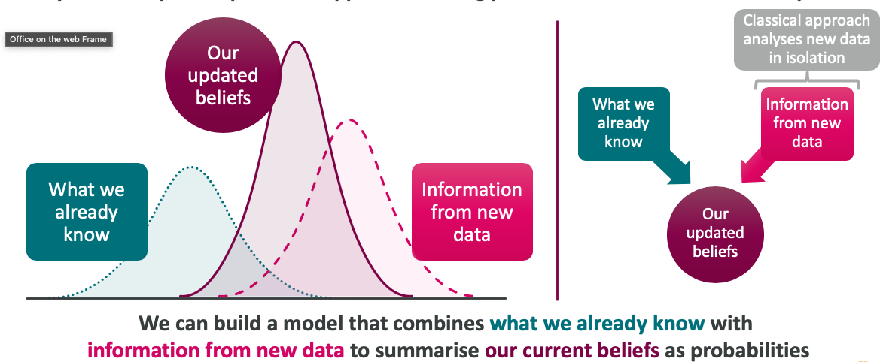

## Bayesian analysis answers our questions as fully as possible by incorporating everything we know

**An example:** I left my last piece of birthday cake in the fridge. I suspect this was a bad idea as my partner is working form home today. I am worried that she will eat my cake. I get back from work to discover icing, and a guilty look, on her face

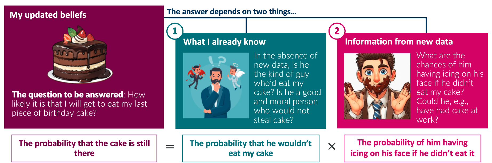

## Bayesian analysis answers our questions as fully as possible by incorporating everything we know

**Another example:** A stakeholder has a theory and has just acquired some new data that might support that theory -- they want to know the chances that their theory is correct in light of this new data.

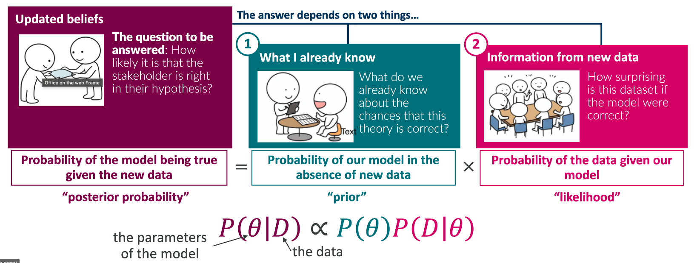

# When should we consdier a Bayesian approach?

## A Bayesian analysis can facilitate faster, more informed decision making with known risk profiles

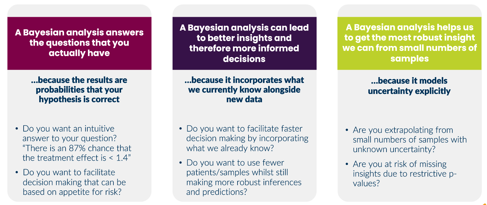

## A Bayesian approach can improve replicability

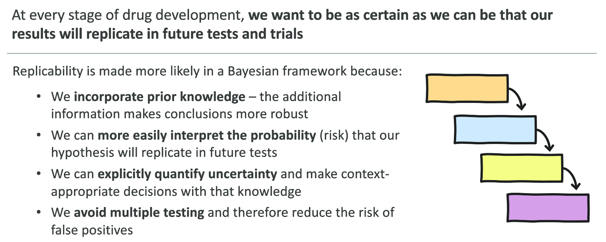

## Bayesian analysis allows us to update our beliefs over time

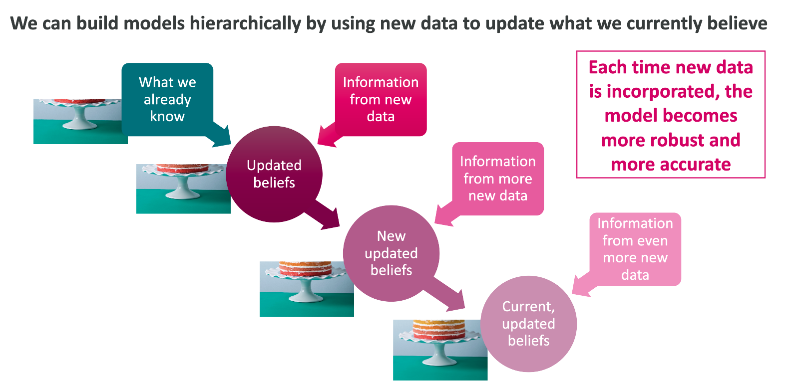

## How is a Bayesian analysis implemented?

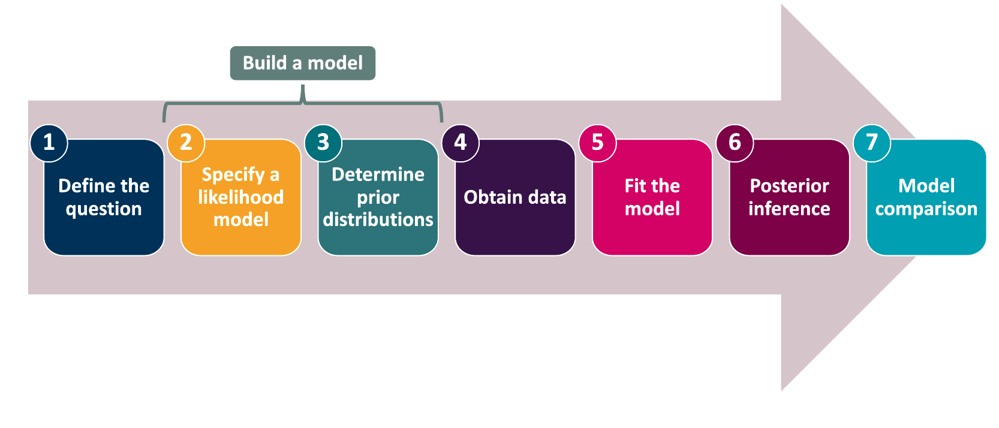

## 

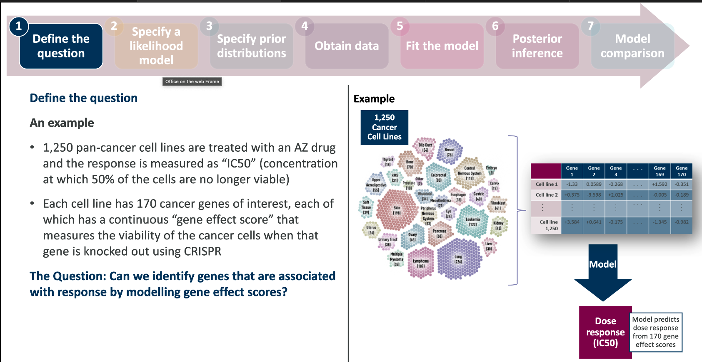

## 

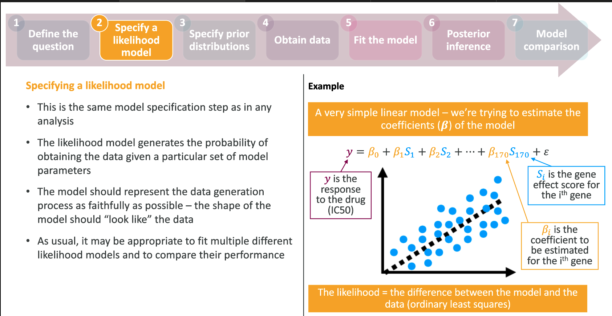

## 

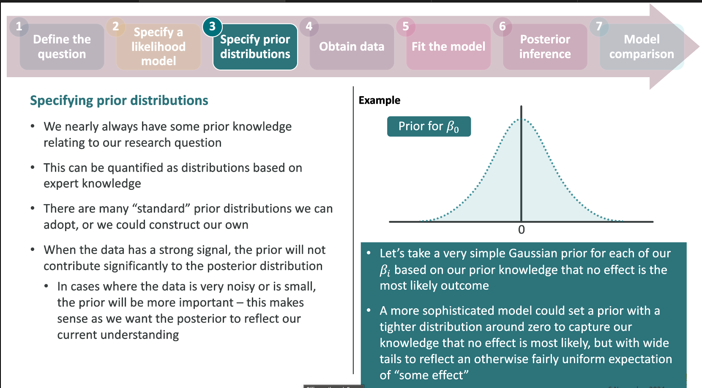

## 

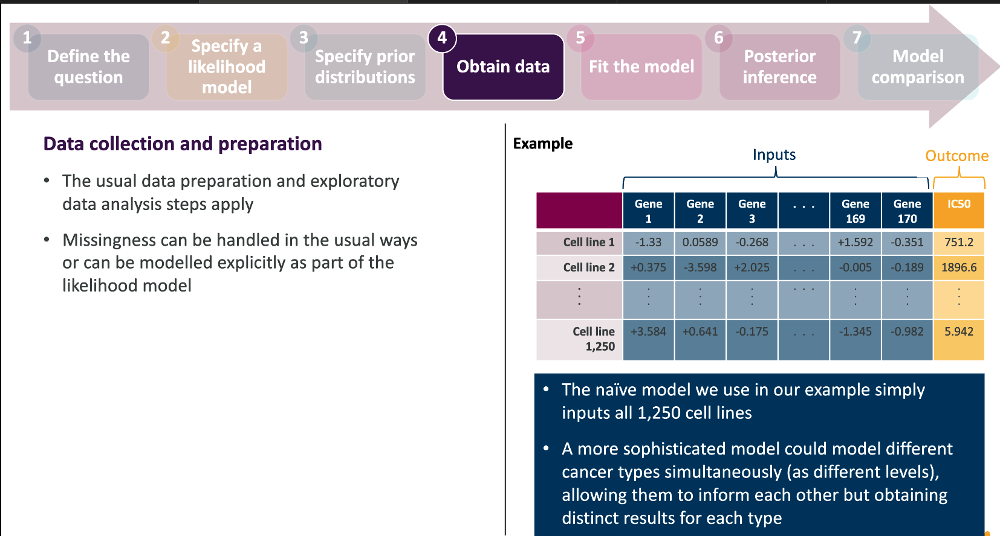

## 

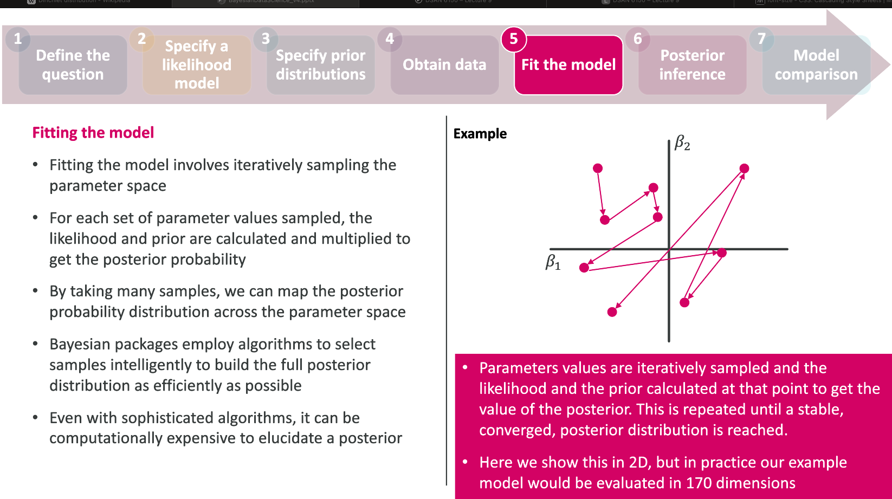

## 

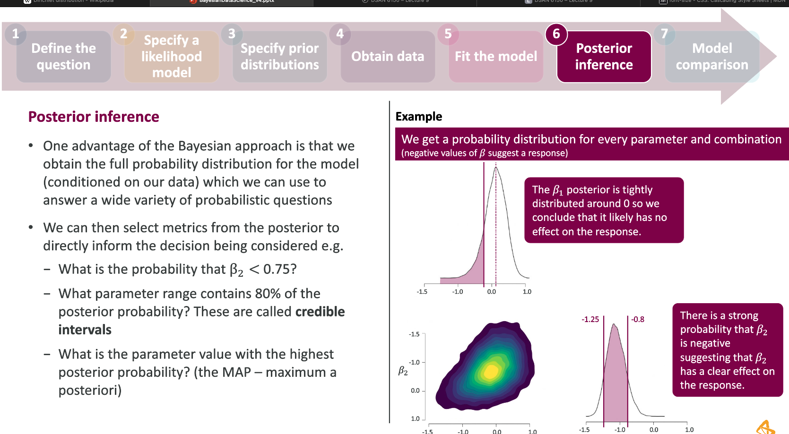

## The Bayesian framework

1.  The parameter of interest $\theta$ is treated as a **variable**, not a constant.
2.  $\theta$ is a random variable with a distribution denoted by $p(\theta)$, called the *prior distribution*

. . .

1.  The data $D = X_1,\dots,X_n$ comes as i.i.d. data from a data model defined by a probability distribution $p(D|\theta)$ dependent on $\theta$.
2.  The p.d.f./p.m.f of this distribution, defined as a function of the data, is called *the likelihood* $L(\theta | D)$.

. . .

The **posterior** distribution can be computed as

$$
p(\theta | D) \propto p(\theta) p(D | \theta)
$$

::: {.callout-important icon="false" appearance="simple"}
Why do we have the $\propto$?
:::

## Bayesian inference

Bayesian inference is entirely based on the posterior distribution $p(\theta | D)$

-   We can ask and quantify questions like $P(\theta \in (-1, 1) | D)$, $P(\theta > 2| D)$, ...
-   Inference becomes an **estimation** problem
-   We can compute *credible intervals (CR)* from $P(\theta \in CR | D) = 0.95$

We can actually quantify the chance that a hypothesis is true.

If $H_0: \theta \in\Theta_0$ vs $H_1: \theta \in \Theta_1$ then we can compute

$$
P(\theta \in \Theta_0 | D), \quad P(\theta\in\Theta_1 | D)
$$

:::: fragment
::: callout-important
## No longer a strawman

In NHST (frequentism), the $H_0$ is set up to be a strawman to **negate**.

In the Bayesian setup, $H_0$ can actually be a substantive hypothesis of interest, and we can actually evaluate the likelihood of it being true given the data, or see how much the data we see changes the likelihood of the hypothesis. $H_1$ is no longer the [*alternative*]{.underline} that we want to get evidence for, but just another hypothesis to contrast with $H_0$. This is **quite a philosophic difference**.
:::
::::

## CONTROVERSY: The prior distribution

To get to the posterior, one must first define a **prior distribution** $p(\theta)$ for the parameters of interest

-   This has been one of the most controversial parts of the Bayesian method
-   Critics have said that the specification of the prior makes the process subjective, which can bias our inference
    -   We "should be completely agnostic", which is what frequentist methods appear to be

<hr/>

. . .

-   We are rarely completely ignorant about values a parameter can take
-   Domain knowledge often dictates the prior distribution
-   "Priors are never arbitrary" but can be justified by domain knowledge (Richard McElreath, 2023)
-   The frequentist method corresponds often to the assumption of a *uniform distribution* as a prior. This too, is a choice.

## The prior distribution

The prior distribution theoretically can be elicited from expert opinion and knowledge as well as prior data. This is a process.

-   We will often choose prior distributions based on heuristic considerations of the constraints a parameter will be under

-   There is a choice of priors, called *conjugate priors*, for a particular data model (likelihood function), so that using those priors results in the posterior being in the same family as the prior

    -   One can get analytic solutions to the posterior

## Conjugate priors

If you have a binary (yes/no) variable that you are observing, and you're interested in the probabilty of a "yes", taking the prior as a Beta distribution results in a Beta posterior.

$$
\theta \sim Beta(\alpha,\beta)\\
X_1, \dots, X_n \sim Bin(1, \theta) 
$$ then $$
\theta | X \sim Beta(\alpha + \sum X, \beta + n - \sum X)
$$

The parameters $\alpha, \beta$ are called **hyperparameters**.

::: {.callout-tip appearance="simple"}
Hyperparameters can have priors, too
:::

## Conjugate priors

If our data comes from a $N(\mu, \sigma^2)$ distribution with known $\sigma$, then

$$
\mu \sim N(\mu_0, \sigma_0^2)\\
X_1,\dots,X_n \sim N(\mu,\sigma^2)
$$

then

$$
\mu | X_1,\dots,X_n 
\sim 
N\left(\frac{1}{\frac{1}{\sigma_0^2}+\frac{1}{\sigma^2}} \left( \frac{\mu_0}{\sigma_0^2} + \frac{\sum X}{\sigma^2}\right), \frac{1}{\sigma_0^2} + \frac{n}{\sigma^2}
\right)
$$

::: callout-tip
A list of conjugate priors is given [here](https://en.wikipedia.org/wiki/Conjugate_prior#Table_of_conjugate_distributions)
:::

## Fitting Bayesian models

Most tasks we face in data science are regression models. We'll start there.

```{r}
#| label: week-08-04
library(rstanarm)
library(easystats)
model_b <- stan_glm(Petal.Length ~ Sepal.Length, data = iris)
posteriors <- get_parameters(model_b)
describe_posterior(model_b)
ggplot(iris, aes(Sepal.Length, Petal.Length))+
    geom_point() + 
    geom_abline(data = posteriors, aes(intercept = `(Intercept)`, slope = Sepal.Length), color = 'gray') + 
    geom_abline(intercept = coef(model_b)[1], slope = coef(model_b)[2], color = 'blue') +
    geom_smooth(method='lm', color = 'orange')
```

## How much does the prior matter

Suppose we do a coin tossing experiment with a biased coin with P(heads) = 0.7. From a Bayesian approach, we'll put a prior distribution of Beta(1,1) on it.

Let's see how the posterior changes as we toss more coins

```{webr}
set.seed(4958)
x <- seq(0, 1, length.out = 50)
prior <- dbeta(x, 1,1)
n <- 50
obs <- rbinom(1, n, 0.7)
posterior <- dbeta(x, 1 + obs, 1 + n - obs)

d <- tibble(x, prior, posterior)
d |> ggplot(aes(x = x))+
    geom_line(aes(y = prior), linetype = 2) + 
    geom_line(aes(y = posterior))

```

## Prior predictive checks

We want to see if our choice of prior leads to data that is reasonably what we would expect. This is called a *prior predictive check*, and is achieved by generating data based on the prior choice.

```{webr}
set.seed(1038)
N <- 20
nsim <- 1000
# Sample the parameter
p <- rbeta(nsim,3,1)
X <- rbinom(nsim,N, p)

hist(X/N)
```

## Computing the posterior

With a conjugate prior, computing the posterior distribution is analytic.

Let us consider the beta-binomial conjugate family, with a $Beta(1,1)$ prior

```{webr}
set.seed(1038)
suppressPackageStartupMessages(library(tidyverse))
N <- 20

X <- rbinom(1, N, 0.7)
p_given_X <- rbeta(1000, 1 + X, 1 + N - X )
tibble(p_given_X) |>
    ggplot(aes(p_given_X))+
    geom_hline(yintercept = 1, color = 'blue')+
    geom_density() + 
    scale_x_continuous(limits=c(0,1)) +
    theme_bw()
```

> Play around with how much data is needed to move the ticker on our knowledge of $p$.

## Bayes factor

The Bayes factor is the relative evidence for different models (or different parameter sets under the same model) given the data

$$
 k = \frac{P(\Theta_1 | D)}{P(\Theta_2 | D)}
$$

Kass & Raftery (2005) provided a rule of thumb when evaluating Bayes factors

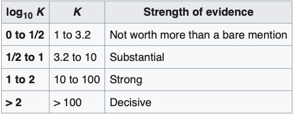

## An example

We're interested in evaluating an assay to see if it is sensitive enough for our purposes. We deem an assay to be acceptable if it has sensitivity of 95% or above. It is considered unacceptable if the sensitivity is below 90%.

We run the test on 100 sick people and get 95 positive tests.

### The model

$$
\theta \sim Beta(4,1)\\
X \sim Bin(100, \theta)
$$

Under this conjugate prior, the posterior distribution of $\theta$ is Beta(4 + X, 1 + 100 - X).

## An example

### Prior predictive checks

```{webr}
set.seed(1038)
nsim <- 1000
a <- 4; b <- 1
p <- rbeta(nsim, a, b)
X <- rbinom(nsim, 100, p)

tibble(X) |>
ggplot(aes(X))+geom_density() + 
scale_x_continuous(limits = c(0,100))
```

## An example

```{webr}
a <- 4; b <- 1
X <- 95; N <- 100

pbeta(0.9, a + X, b + N - X, lower.tail = F)
x <- seq(0, 1, by = 0.01)
plot(x, dbeta(x,a + X, b + N - X), type='l',xlab ="", ylab="")
lines(x, dbeta(x, a, b), col = 'blue')

```

## Resources

-   Statistical Rethinking by R. McElreath ([link](https://xcelab.net/rm/)
-   rstanarm ([link](https://mc-stan.org/rstanarm/))
-   brms ([link](http://paulbuerkner.com/brms/))
