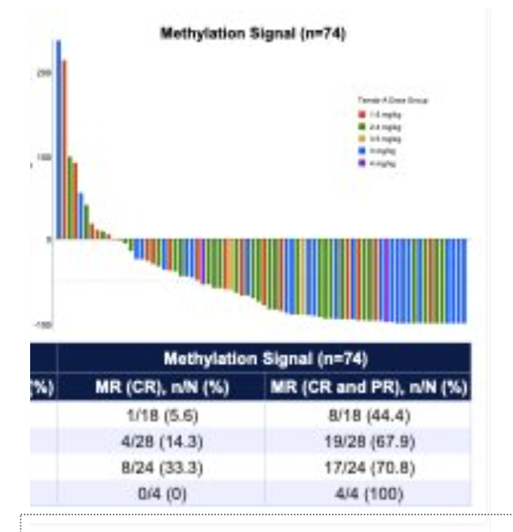
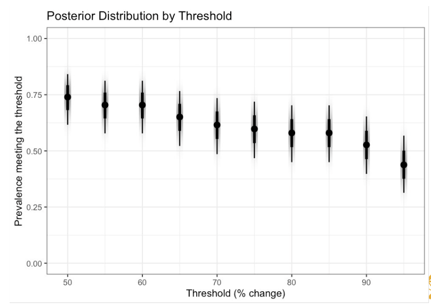
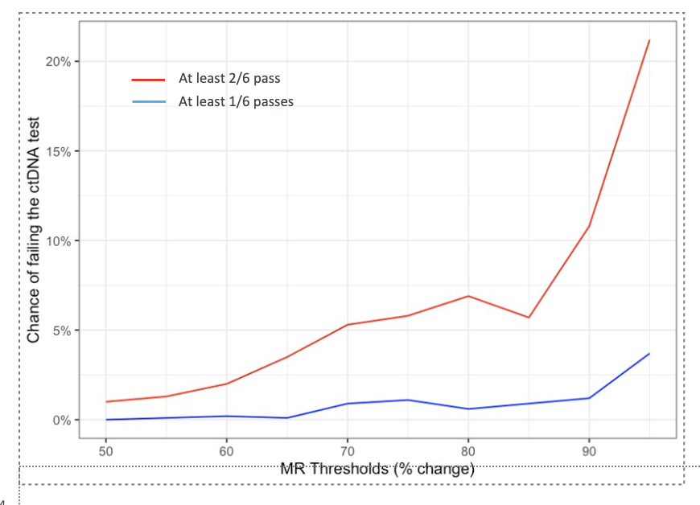

```{r}
#| include: false

library(tidyverse)
library(brms)
library(bayesplot)
library(tidybayes)
theme_set(theme_minimal())
```

## Learning Goals

-   Bayesian analyses continued
    -   Understand Bayesian generative models and using posterior simulation
    -   Apply posterior predictive checks (PPC) in R
-   A general prediction question
    -   Understand importance of prediction and uncertainty propagation
    -   Concepts of overfitting and out-of-sample evaluation
    -   Learning curves and cross-validation


## Outline

-   Bayesian models and generative simulation\
-   Posterior predictive distribution\
-   PPC in R\
-   Regression, uncertainty, and diagnostics\
-   General model evaluation in R

## Why Prediction?

-   Going back to Breiman's Two Worlds paper, prediction is the purview of the algorithmic approaches, generally
-   Evaluation is based not on hypothesis testing, but on predictive performance
-   The fundamental idea is, can we create models that can predict performance on the **next** data set.

. . .

This question is key to a variety of policy applications

-   Models are used to try and understand the impact of policy changes
-   Predictive performance is key to understanding how well a model will perform in these scenarios
    -   We can't see the future, but we need the model to predict well on future data
    -   The model can only learn from past data, so we need to evaluate how well it can generalize

## Bayesian models are fundamentally generative

-   Bayesian models are a description of how data are generated
    -   This is in contrast to frequentist models, which are often described as a set of fixed parameters to be estimated
-   Bayesian models include uncertainty in parameters, which allows us to simulate new data sets in a realistic way that can better model the uncertainty in predictions
-   Bayesian models give us a way to simulate data that reflects both our uncertainty about the parameters and the inherent variability in the data generation process

## What do we mean by "Generative"?

Let's take a simple example of coin tossing (again!!)

-   We have a 5 identical coins with unknown probability of heads, $p$.
-   We toss each coin 10 times and observe the number of heads.
-   A generative model would describe how the data (number of heads) are generated from the parameters (probability of heads).
-   In a Bayesian framework, we would treat $p$ as a random variable with a prior distribution. Let's be simple and use a conjugate prior, Beta(1,1) (uniform prior).
-   This gives us the posterior distribution for $p$ after observing the data, which is also a Beta distribution with parameters 1+x, 1+n-x, where x is the number of heads observed and n is the number of tosses.
-   We can generate data using this model by first sampling $p$ from its posterior distribution, and then simulating new coin tosses using this sampled $p$.

## Simulation

Let's simulate 10 coin tosses with probability of heads p = 0.7. This will be our observed data:

```{r}
set.seed(123)
n_tosses <- 10
p_true <- 0.7
observed_heads <- rbinom(1, n_tosses, p_true)
```

We observe `r observed_heads` heads out of `r n_tosses` tosses. This gives us a posterior distribution for $p$: Beta(1 + `r observed_heads`, 1 + `r n_tosses` - `r observed_heads`).

The posterior predictive distribution allows us to simulate new data based on this posterior distribution. We can do this by:

1.  Sampling $p$ from the posterior distribution.
2.  Simulating new coin tosses using the sampled $p$.

```{r}
n_simulations <- 1000
posterior_samples <- rbeta(n_simulations, 1 + observed_heads, 1 + n_tosses - observed_heads)
simulated_data <- rbinom(n_simulations, n_tosses, posterior_samples)
```

## Posterior simulations, continued

We can visualize the posterior predictive distribution of the number of heads in 10 tosses:

::: {.columns}
::: {.column}
```{r}
library(ggplot2)
ggplot(tibble::tibble(simulated_data), aes(x = simulated_data)) +
  geom_histogram(binwidth = 1, fill = "blue", alpha = 0.5) +
  labs(title = "Posterior Predictive Distribution of Heads in 10 Tosses",
       x = "Number of Heads",
       y = "Frequency")
```

This histogram shows the distribution of the number of heads we would expect to see in 10 tosses, given our observed data and the uncertainty in our estimate of $p$.
:::
::: {.column}
::: callout-note
This example illustrates the concept of generative models in a Bayesian framework. By treating parameters as random variables and using posterior distributions, we can simulate new data that reflects both our uncertainty about the parameters and the inherent variability in the data generation process. This gives us our best guess about future observations, given what we have already seen.
:::

:::
::: 

## A real example: Deciding on a clinical trial threshold

** Problem Context:** We are planning a clinical trial to evaluate a new treatment. We need to decide on a threshold for a key biomarker that will determine whether patients respond to the treatment. We have historical data from a competitor's trial that shows the distribution of this biomarker in their patient population. We want to use this data to inform our decision on the threshold, and understand how often we expect to meet this threshold in future patients.


-   The competitor's data shows the percentage change in a biomarker after treatment. We want to decide on a threshold for this percentage change that will determine whether we consider a patient to be a responder.



## Importing our data

-   We digitized this data and imported it into R.

```{r}
abbvie_data <- read_csv('data/cdln3_abbvie_data.csv') |>
    janitor::clean_names() |>
    select(1:3)
ggplot(abbvie_data, aes(y))+geom_histogram()
```

## Setting up our model

We're trying to model the percentage change in this metric. What we want to model is how we would make decisions at different thresholds of this percentage change, from 50% to 95%.

-   If we fix a threshold at , say, 60%, we can model whether an observation falls above or below this threshold as a *Binomial(1, p)*, where $p = P(X > 60\%)$. This is a binomial distribution, whose conjugate prior is a Beta distribution. We start with a *Beta(2,1)* distribution

-   We can get posterior distributions for *p*, which gives us how often we expect, in future data, to meet this threshold of 60%. We did this for several thresholds



## Using the predictive distribution

We want to make a decision of whether to recruit more patients by seeing whether a new patient meets a chosen threshold or not. A question was if we needed to see if at least 1 patient or at least 2 patients have to meet the threshold (out of a possible 6 patients to be investigated)



# Evaluating a Bayesian model: Posterior Predictive Checks (PPC)

## Posterior predictive checks (PPC)
-   Posterior predictive checks are a way to evaluate how well our Bayesian model fits the data
-   The idea is to simulate new data from the posterior predictive distribution and compare it to the observed data
-   If the model is a good fit, the simulated data should look similar to the observed data

## PPC in R with `brms`

-   The `brms` package has built-in functions for performing PPC
-   We can use the `pp_check()` function to visualize the PPC results

```{r}

# Fit a simple Bayesian model
data("mtcars")
fit <- brm(mpg ~ wt + cyl, data = mtcars, family = gaussian, silent = 2, refresh = 0)
# Perform posterior predictive check
pp_check(fit, ndraws = 100) + theme_bw()
```

-   The plot shows the distribution of the observed data (black line) and the distribution of the simulated data from the posterior predictive distribution (colored lines)
-   We can see how well the model captures the variability in the data