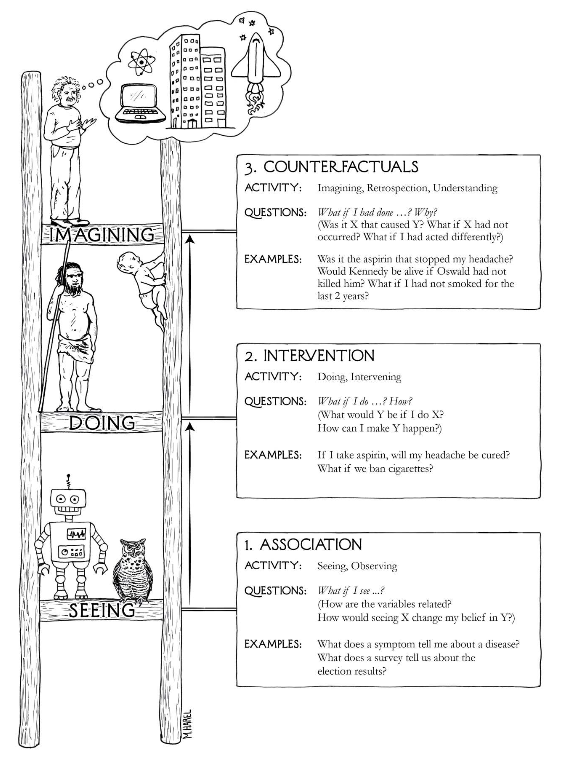

## Goals for today

-   Objectives of statistical analyses
-   Design of experiments and how we collect data
-   Causal reasoning and criteria
-   How other variables can interfere: confounding, mediation, moderation
-   Randomized controlled trials (RCTs)

## Thinking about [**how**]{.fatinline} we collect data

-   The way that the data is collected can affect the external validity of the model, i.e., how well the model can generalize to other data sets.
-   We have a innate idea that a good training dataset is, in some ways, representative of the population we want to run future predictions, in order to have a useful predictive model.
-   The way we collect the data can be important, and can certainly have downstream implications in how we analyze data and how we interpret our results.

## Data can be expensive!!

-   In many cases, collecting data can be expensive and time-consuming.
-   For example, clinical trials for new drugs can take years and cost millions of dollars.
-   Therefore, it is crucial to design experiments carefully to maximize the information gained from the data collected

:::: fragment
::: {.callout-caution appearance="default" icon="true"}
Data collection is expensive in many fields, though it doesn't seem so if you follow the AI hype. ML often assumes we have tons of data and so can do as well as possible with data-hungry methods. But when you have data limitations, you have to be more careful.
:::
::::

## Pharmaceutical clinical trials

Phase III clinical trials are funded by pharmaceutical companies to provide definitive evidence of a drug’s effectiveness. A phase III trial can cost [multiple billions of dollars]{.fatinline}, for testing the drug on perhaps several hundred subjects.

Given the costs per patient, pharmaceutical companies have a strong interest in [getting the strongest results possible from the fewest numbers of participants]{.fatinline}, and a lot of effort goes into designing the trial so that the “treatment effect” can be robustly ascertained, since this is the basis of drug approvals. The trial design goes through multiple iterations within the company, and then needs agreeement from the regulatory agencies like the FDA and EMA, before the trial can go to the field and the first subject enrolled.

With billions of dollars on the line, finding the right patients and the right study design are imperative

## Statistical efficiency

-   Statistical efficiency refers to the ability of a statistical method to make the most accurate inferences about a population using the least amount of data.
-   A statistically efficient method can achieve the same level of accuracy with fewer data points compared to a less efficient method.
-   Efficiency is often measured in terms of the variance of an estimator; a more efficient estimator has a lower variance.

Better experimental design can lead to more statistically efficient estimates, allowing researchers to draw more reliable conclusions from their data.

. . .

<hr/>

::: smaller
Recall we discussed that most statistical tests look at the signal-to-noise ratio

$$
\text{SNR} = \frac{\text{Signal}}{\text{Noise}} = \frac{\text{Effect Size}}{\text{Variability}}
$$

The signal is usually a given. What we'd like to do is [reduce the variability (noise) in our estimates]{.heatinline}, so that we can have a better chance of seeing the signal rise above the noise.
:::

## What are most studies trying to do?

Most studies are done to to see if an intervention of interest has an effect on some result of interest.

**Some Examples**

1.  Seeing if a new fertilizer can help improve yields of wheat ([link](https://icl-growingsolutions.com/en-us/agriculture/trials/winter-wheat-trial-with-polysulphate-in-the-uk/))
2.  Seeing if a non-narcotic drug can help reduce pain post-surgery ([link](https://www.cancer.gov/research/participate/clinical-trials-search/v?id=NCI-2020-00497))
3.  Seeing if a particular advertisement can improve sales of a product ([link](https://www.hotjar.com/ab-testing/examples/))
4.  Seeing if a GLP-1 inhibitor can help reduce a person’s weight ([link](https://www.nejm.org/doi/full/10.1056/NEJMoa2206038))

## How to collect data to get robust results?

There are several questions we might want to think about when we collect data for finding a result (fairly!!).

1.  Is the data we’re looking at representative of the population that we are interested in?
2.  Can we make fair comparisons within the data?
3.  Can we see robust results using less data?
4.  Is the data we’re using biased in any way?

::: {.callout-tip appearance="default" icon="true"}
## Food for thought

What other questions might we address that might guide our data collection?
:::

# Biases

## 

::: r-fit-text
The main point here is fairness.
:::

We want results that are not subject to intentional and unintentional biases.

## Common types of biases

### Observer bias

This can arise when there are systematic differences between true and recorded values, or this difference depends upon who is collecting the data. This can happen if, for example, a doctor knows the treatment a patient received. Another example might be in how a doctor measures pain levels depending on the race or ethnicity of a patient.

### Selection bias

This can arise when how subjects are selected can affect the final inference. For example, if you assign the first 100 patients who come to a hospital on a Friday to one group and a second 100 patients who come to the hospital on Monday to another group, there may be intrinsic differences that may explain any differences you might see that are not related to treatment.

## Common types of biases (contd.)

### Confirmation bias

This is the tendency to interpret information to support a pre-existing idea or notion

### Response bias

This occurs when the answers given by a patient are influenced by extraneous factors

### Non-response bias

This is seen when there are differences in characteristics of individuals who respond and don’t respond to a survey. This is particularly evident in ratings of products available at an online retailer, for example.

### Recall bias

This occurs in retrospective studies where subjects recall their experience depending on their condition. This issue is rampant in nutritional epidemiology where subjects are asked to recall everything they ate in the last week (a 7-day food frequency questionnaire). A simpler example might be where people diagnosed with lung cancer overestimate their tobacco use while healthy people underestimate it.

# Principles of experimental design

## Randomization

-   Randomly assign subjects to groups to minimize selection bias.
-   The act of randomization creates a natural balance between groups on average and should minimize biases and confounding

. . .

Randomization tries to ensure that each subject has an equal chance of being assigned to any group, which helps to create comparable groups and allows for valid statistical inferences.

-   It can help [minimize the effect of confounding variables]{.fatinline} by evenly distributing them across groups. This helps to isolate the effect of the treatment or intervention being studied.
    -   This helps minimize the effect of measured **and unmeasured** confounders. [This is really important!!]{.fragment .highlight-red}

## Local control

-   Control for effects due to factors other than ones of primary interest.
    -   This can be done be **blocking** and **stratification**, which are both ways of allocating treatment randomly within relatively homogeneous sub-populations.
    -   For example, if there are differences in soil fertility across a large field, you want to create smaller blocks where the fertility is relatively constant, and allocate treatments within those blocks.

The basic idea is to create relatively homogeneous groups so that the effect of the treatment can be more easily ascertained.

In practical terms, local control shows up in models as including covariates that help explain variability in the outcome that are not directly related to the treatment of interest.

::: {.callout-tip appearance="default" icon="true"}
## Difference between blocking and stratification:

Blocking is done before randomization, while stratification is done after randomization.
:::

## Replication

Repeat the experiment under identical conditions on multiple subjects.

The more subjects you include, the lower the variability of your estimates.

You can think of this as, **the more subjects that exhibit similar behavior, the more confident you are of the results**.

## Let's relate this back

Recall we discussed that most statistical tests look at the signal-to-noise ratio

$$
\text{SNR} = \frac{\text{Signal}}{\text{Noise}} = \frac{\text{Effect Size}}{\text{Variability}}
$$

For example, the t-statistic is given by

$$t = \frac{\bar{X}_1 - \bar{X}_2}{SE}$$

Statistical inference can be considered as a way of seeing if there is sufficient signal in the data to overcome the noise in the data, so the signal rises above the noise, so to speak.

So, to find a statistical difference we need to have (a) [the signal to be larger]{.fatinline}, or (b) [the noise to be smaller]{.saltinline}.

## Better design = more signal + less noise = more efficiency

If we can find ways to reduce variability then we have a chance of finding something more than just massive effects

-   What randomization gives us is minimizing bias, so our estimates are more likely to be unbiased.
-   What local control and replication give us are means to look at estimates within subgroups with lower variance, which in turn reduces the standard error of the estimate.

So we can be clever [with local control and replication]{.saltinline}, i.e., appropriate stratification and sufficient number of samples, we can reduce the variability of our estimate and so get more accurate estimates; [the randomization piece tries to ensure that the estimates are on target]{.fatinline}.

For problems of statistical association and causality, we still can use models that have good bias-variance properties, but the study design can help further to get better estimates, and we can account for the particulars of the study design in the models

# Types of study designs

## Observational studies

Observational studies are often the first look into a problem, to see if an intervention might be needed. They generally fall under the umbrella of **association studies**

-   Observational studies are just that – data is collected as it is observed.
-   The interest is not in seeing particular differences between groups, but in seeing a snapshot of reality that may be indicative of existing differences.
-   The purpose is to observe, not treat, and so what we’re looking for are **associations or correlations** between variables that we observe

. . .

A lot of pilot studies, or surveys, are observational in nature. They can be useful to see if there are any interesting patterns that might warrant further investigation.

## Case-control studies

-   A common type of observational study is a case-control study, often used in epidemiology to identify factors that may contribute to a medical condition by comparing subjects who have that condition (the "cases") with patients who do not have the condition (the "controls").
-   These are retrospective studies since we are looking back from a time when a disease was caught to see if some exposure or experience was more likely (associated) among people with the disease compared to people without the disease.

## Case-control studies (contd.)

-   Case-control studies are a great design if you’re invesigating an outcome that is **rare**.
    -   You start by finding people who already have the disease, match them with comparable people (think age, sex, ethnicity) who don’t have the disease (controls), and then see how often the exposure of interest happened in each group.
-   Study participants are often selected by random sampling from the population subgroups of cases and controls
-   If we’re including matched controls (a form of local control by having similar age, sex, race, for example), you randomly select, for each case, 1 or more matched controls

::: callout-tip
The main hurdle in creating good case-control studies is in getting a good group of controls that are comparable to the cases and don’t bias your results. Wacholder, et al wrote a [series](https://pubmed.ncbi.nlm.nih.gov/1595688/) [of](https://pubmed.ncbi.nlm.nih.gov/1595689/) [papers](https://pubmed.ncbi.nlm.nih.gov/1595690/) on this subject which form the basis of how controls are selected today.
:::

## Case-control studies (contd.)

1.  You cannot directly estimate incidence or prevalence of a disease from a case-control study, since you are selecting the number of cases and controls, and they have an artificial ratio.
2.  You cannot ascribe causality from a case-control study, since you are only looking at associations.
3.  Associations are usually measured using odds ratios (OR), which is the odds of exposure among cases divided by the odds of exposure among controls.
4.  Case-control studies can be prone to biases like recall bias and selection bias, which can affect the validity of the findings.

Case-control studies are a more structured form of an observational study compared to just making observations, and so inferences are often stronger.

## Cohort studies

-   Cohorts, as the name suggests, are groups of individuals collected at a point in time and followed forward in time.
-   For representativeness, cohorts are selected by random sampling from a particular study population
-   Baseline measurements are taken and then the individuals are followed to see what develops over time.
-   Cohort studies can be prospective (looking forward) or retrospective (looking back at existing data).
-   These studies enable us to understand the natural history and evolution of phenomena over time.

## Cohort studies (contd.)

-   Cohort studies are, by design, much longer in duration, since that time is required for the outcomes of interest to be observed
-   They are particularly useful for studying rare **exposures**, since you can select a cohort based on exposure status and then follow them to see what outcomes develop.
-   Some limited causality can be inferred from cohort studies, since you are looking forward in time and can see if exposure precedes outcome.

## Sample surveys

-   Sample surveys are a type of observational study where data is collected from a subset (sample) of a larger population to make inferences about the entire population.
-   Surveys can be cross-sectional (data collected at a single point in time) or longitudinal (data collected over multiple time points).
-   Surveys can be conducted using various methods, including face-to-face interviews, telephone interviews, online questionnaires, and mailed questionnaires.
-   The design of the survey, including question wording, order, and response options, can significantly impact the quality and reliability of the data collected
-   Sampling methods can include simple random sampling, stratified sampling, cluster sampling, and systematic sampling, each with its own advantages and disadvantages.

## Sample surveys (contd.)

-   Sample surveys are widely used in various fields, including social sciences, market research, public health, and political polling.
-   They provide valuable insights into population characteristics, behaviors, attitudes, and opinions, which can inform policy decisions, marketing strategies, and academic research.
-   However, surveys can be subject to various biases, including non-response bias, sampling bias, and measurement error, which can affect the validity of the findings.
-   Proper survey design, sampling techniques, and data analysis methods are crucial to ensure the reliability and validity of survey results.

The American Community Survey (ACS) is a large survey carried out by the US Census Bureau to collect detailed demographic, social, economic, and housing information about the US population. The ACS is conducted annually and samples approximately 3.5 million households each year (so about 1% of the population). Most countries have similar large-scale surveys to collect data about their populations between censuses.

## Randomized controlled trials (RCTs)

-   Randomized controlled studies are the gold standard for studies to ascertain causal relationships.
-   They are usually used to evaluate interventions and how they affect an outcome.
-   They use all the principles of good study design to allow definitive conclusions to be made. RCTs randomize individuals to groups, with each such group getting a different intervention.
-   The randomization allows us to balance measured and unmeasured confounders and minimize systematic biases, and allows us to attribute differences in outcomes between groups to differences in treatments.

# Causality and causal inference

## What are we trying to do?

We are primarily interested in causal statements and questions of the nature

-   Smoking causes lung cancer
-   How effective is a treatment in prolonging life among lung cancer patients?
-   What is the healthcare cost attributable to the increasing prevalence of obesity?
-   Can scheduling records and hospital interactions prove someone is guilty of medical malpractice?
-   Can a drug that targets the activity of a particular biological functional pathway cause a disease to be cured by the drug?

Data, particular Big Data, appear to be attractive means to evaluate such statements. Surely, as we collect more data, we should be able to ascertain whether a drug can cure disease, or whether using Ozempic will reduce weight, or that eating less red meat will prolong our lives.

### Example: Environmental science

-  Causal question: Does reducing upstream agricultural fertilizer application cause a reduction in downstream algal bloom frequency and severity?
-  Key considerations: temporality (fertilizer reduction must precede blooms), potential confounders (river flow, rainfall, point-source discharges, land-use changes), and feasible designs (natural experiments, difference-in-differences across watersheds, instrumental variables, or targeted interventions with before/after monitoring).

## Can modeling help us ascertain causality?

-   Statistical and machine learning models leverage [observed patterns]{.fatinline} of correlation or association between features (predictors/covariates) and outcomes (responses/labels) to make predictions on new data.

-   However, these models primarily capture correlations and associations, not causation.

-   A lot of effort also goes into improving predictions or modeled associations by (a) experimental design, (b) adding more independent features to improve the precision of the prediction or association.

-   This observed association is often subject to many other factors, including biases in subject selection and data collection, presence of related factors both observed and unobserved that can influence the observed association, and measurement error.

## What is an “association”?

We often use the term association in this text and other textbooks and papers. What do we mean as statisticians? The term is often used to say that two variables have a relationship, in that there is some pattern between the values of the two variables. What we often tacitly imply in using the term is correlation, in that high values of one variable appear to co-occur on average with high values of the other variable (positive correlation), or low values of the other variable (negative correlation). Note, I specifically use the term “co-occur”, because that’s really all we can determine in observational data.

Just because observational values co-occur doesn’t mean that one caused the other. There are plenty of examples of spurious correlations and ecological fallacies where there is no actual causal relationship between the variables, while we observe a high degree of association between them.

## Strengthening associations to imply causality<br/> Bradford Hill criteria {.smaller}

In 1965, Sir Austin Bradford Hill proposed a set of nine criteria to help determine whether an observed association is likely to be causal. These criteria are widely used in epidemiology and public health research to assess causality. The nine criteria are:

1.  **Strength of the association:** The stronger the association, the more likely it is to be causal.
2.  **Consistency:** The association is observed repeatedly in different studies and populations.
3.  **Specificity:** A specific cause leads to a specific effect.
4.  **Temporality:** The cause precedes the effect in time.
5.  **Biological gradient:** A dose-response relationship exists.
6.  **Plausibility:** The association is biologically plausible.
7.  **Coherence:** The association does not conflict with existing knowledge.
8.  **Experiment:** Evidence from experiments supports the association.
9.  **Analogy:** Similar factors have been shown to cause similar effects.

::: {.callout-tip appearance="default" icon="true"}
## Note

These criteria are not strict rules, but rather guidelines to help assess causality. Not all criteria need to be met for an association to be considered causal, and the absence of one or more criteria does not necessarily rule out causality.

This was an attempt to systematize thinking about causality in studies where we can only see **observed associations**. But, as we'll see, there are other ways to think about causality that can help us design better studies and analyze data better.
:::

## A hierarchy of causality {.smaller}

::: {.columns}
::: {.column}

:::
::: {.column}
- "... machine learning programs (including those with deep neural networks) operate almost entirely in an associational mode" (Pearl and Mackenzie (2018), pp. 30)
- Supervised learning models are entirely based on observable patterns and so can’t necessarily identify causal relationships, no matter how large the training data is

**Interventional causality**  

- Interventional causation cannot be assessed merely by collecting data
- Randomization allows balance in other factors and enables statistical estimation of the intervention effect

**Counterfactual causality**

- Links Pearl's ideas with Rubin's potential outcomes framework
- It asks what could have happened if a different (unobservable) action was experienced
- This idea cannot be directly evaluated using observable data
:::
::: 

## Concept 1: Counterfactuals, or potential outcomes

| Scenario | Outcome |
|---|---|
| Take ibuprofen | Headache resolves in 1 hour  |
| Don't take ibuprofen | Headache resolves in 6 hours |

-  The potential outcomes framework, also known as the Rubin Causal Model, is a framework for causal inference that focuses on the concept of potential outcomes.
-  The fundamental problem of causal inference is that we can never observe both potential outcomes for the same individual at the same time.

## A formulation of potential outcomes

-   Let Y(1) be the potential outcome if an individual receives the treatment, and Y(0) be the potential outcome if the individual does not receive the treatment.
-   The observed outcome Y can be expressed as:
$$
Y = T \cdot Y(1) + (1 - T) \cdot Y(0)
$$
where T is a binary indicator variable that equals 1 if the individual receives the treatment and 0 otherwise.
-   The average treatment effect (ATE) can be defined as:
$$
ATE = E[Y(1) - Y(0)]
$$
-   The goal of causal inference is to estimate the ATE using observed data, while accounting for confounding variables and other sources of bias.

## An example

Create a population where we look at all potential outcomes for individuals with and without treatment. Understand that the individual causal effects are unobservable. 
```{r}
#| label: week-13-01
set.seed(1020)
library(tidyverse)
library(gt)
dat <- tibble(
  id = 1:10,
  headache_ibf = c(1,3,5,3,1,1,2,3,1,2),
  headache_noibf = c(6,6,5,3,6,7,4,5,6,6)
)
dat <- dat |> 
  mutate(causal_effect = headache_ibf - headache_noibf)

gt(dat) |> 
  cols_label(headache_ibf = "{{Y_i}}(ibf)",
             headache_noibf = "{{Y_i}}(no ibf)",
             causal_effect = html("Y<sub>i</sub>(ibf) - Y<sub>i</sub>(no ibf)")
  ) |> 
  tab_spanner(label = "Potential outcomes", columns = 2:3) |> 
  tab_spanner(label = "Causal effect", columns = 4) |> 
  cols_align(align='center')
```

If we could actually see this, we see that the average causal effect was -3.2 hours (taking ibuprofen reduces headache duration by 3.2 hours on average).

## An example (contd.)

We can randomly assign individuals in this population to taking ibuprofen or not, and then see what happens.

```{r}
#| label: week-13-02
set.seed(1038)
data_observed <- dat |> 
  mutate(
    exposure = ifelse(rbinom(n(),1, 0.5) == 1, 'ibf','no_ibf'),
    observed_outcome = ifelse(exposure=='ibf', headache_ibf, headache_noibf)
  ) |> 
  select(id, exposure, observed_outcome)
output <- data_observed |> 
  group_by(exposure) |> 
  summarise(avg_outcome = mean(observed_outcome)) |> 
  pivot_wider(names_from = exposure, values_from = avg_outcome) |> 
  mutate(causal_effect = ibf - no_ibf)
output
```

From this randomized experiment, we see that the estimated causal effect is `r round(output$causal_effect,1)` hours, which is close to the true average causal effect of -3.2 hours.

```{r}
#| label: week-13-03
library(infer)
library(geomtextpath)
set.seed(384)
boot_dist = data_observed |> 
  specify(observed_outcome ~ exposure) |> 
  generate(reps = 1000, type='bootstrap') |> 
  calculate(stat = 'diff in means', order = c('ibf','no_ibf'))
visualize(boot_dist) + shade_confidence_interval(endpoints = get_ci(boot_dist)) +
  geom_textvline(xintercept = -3.2, color = 'red', label = 'true effect') +  labs(x = "Difference in means") + theme_minimal() + theme(axis.text.y = element_blank(), axis.title.y = element_blank())
```

## Other estimands

- **ATT** (Average Treatment Effect on Treated): $\mathbb{E}[Y(1) - Y(0) | A=1]$  
  Effect among those who actually received treatment
  
- **CATE** (Conditional ATE): $\mathbb{E}[Y(1) - Y(0) | X=x]$  
  Effect for a specific subgroup (e.g., swing voters, rural districts)

In political science, we often care most about **ATE** for universal policies or **ATT** for targeted interventions.

## Causal diagrams and directed acyclic graphs (DAGs)

-   Causal diagrams, often represented as directed acyclic graphs (DAGs), are graphical representations of causal relationships between variables.
-   In a DAG, nodes represent variables, and directed edges (arrows) represent causal relationships between those variables.
-   DAGs help visualize and understand the causal structure of a system, allowing researchers to identify potential [confounders]{.saltinline}, [mediators]{.acidinline}, [colliders]{.fatinline} and moderators.
-   They can also guide the selection of variables to include in statistical models to estimate causal effects accurately.

::: {.callout-important appearance="default" icon="true"}
## Note
Causal diagrams are not data driven per se, but depend on **domain knowledge** to construct the relationships between variables. They can then be used to guide data analysis, study design and modeling. They are a powerful tool to help think about causality. They are especially useful in observational studies where randomization is not possible, and so confounding and biases may be present.

:::

::: {.callout-tip appearance="default" icon="true"}
## Recommended reading

See [Chapter 6 of Hernan and Robins (2023)](https://static1.squarespace.com/static/675db8b0dd37046447128f5f/t/691fb7706ce66332f0b44467/1763686256720/hernanrobins_WhatIf_21nov25.pdf) and [Chapter 4](https://www.r-causal.org/chapters/04-dags) of  [Causal Inference in R](https://www.r-causal.org/) for great introductions to causal diagrams and DAGs.
:::


## Confounders

::::: columns
::: {.column width="45%"}
```{r}
#| label: week-13-04
#| echo: false
library(ggplot2)
library(ggdag)
dagify(
  Outcome ~ Exposure + Confounder,
  Exposure ~ Confounder,
  exposure = "Exposure", outcome = "Outcome"
) |> ggdag(size=2) +theme_dag()+
  coord_cartesian(clip='off')+
  theme(
    plot.margin = margin(1,1,1,1, "cm")
  ) 
```
:::

::: {.column .smaller width="55%"}
A confounder is a variable that influences both the dependent variable and independent variable, causing a spurious association. In the diagram, the confounder affects both the exposure and the outcome, creating a *backdoor path* that can bias the estimated effect of the exposure on the outcome.
:::
:::::

::: {.callout-tip appearance="default" icon="true"}
## Backdoor path
A backdoor path is a noncausal path between treatment and outcome that remains even if all arrows pointing from the treatment to other variables are removed. That is, the path has an arrow pointing into treatment. (Hernan and Robins (2023))
:::

::: {.notes} 
Confounders are one of the things we have to worry about when we're assessing associations. And its not just the confounders we measure, it's also confounders that we didn't measure. This requires thought, and some critical thinking. This is not necessary an analytic thing, but often requires domain knowledge. 
:::

## Examples of confounding

- The effect of aspirin on the risk of stroke may be confounded if the drug is more likely to be prescribed to individuals with heart disease that is both an indication for treatment and a risk factor for the disease. An unmeasured variable, atherosclerosis, is a causal factor for both heart disease and stroke. Such confounding is often called confounding by indication.
- The effect of a DNA sequence A on the risk of developing cancer will be confounded if there exists another DNA sequence B that has a causal effect on cancer and is more frequent among people carrying A. This phenomenon is often called linkage disequilibrium. A similar bias can occur if the particular causal sequence B is more prevalent in some ethnicities than others, and the study includes a mixture of individuals from different ethnic groups; this is often referred to as population stratification.
- Smoking and alcohol consumption are risk factors for several cancers, and they also tend to co-occur, resulting in confounding.

## Dealing with confounding

-   Randomization in experimental studies helps to balance both measured and unmeasured confounders across treatment groups.
-   In observational studies, statistical methods such as multivariable regression, propensity score matching, and instrumental variable analysis can be used to adjust for confounding.
-   Careful study design, including the selection of appropriate control groups and the use of stratification or matching, can help minimize confounding.

Analytically, the most common way to deal with confounding is to include the confounder as a covariate in a regression model. This helps to adjust for the effect of the confounder when estimating the effect of the exposure on the outcome. However, this only works for measured confounders. Unmeasured confounders remain a challenge in causal inference.

## Other forks in the road {.smaller}

::: {.panel-tabset}

### Mediators

A mediator is a variable that lies on the causal pathway between an exposure and an outcome. In the diagram, the exposure affects the mediator, which in turn affects the outcome. Mediators help explain the mechanism through which the exposure influences the outcome.


::: {.columns}
::: {.column}
```{r}
#| label: week-13-05
dagify(
  Z ~ X,
  Y ~ Z,
  Y ~ X
) |> 
  ggdag(layout='circle') + theme_dag()
```
:::
::: {.column}
Here the variable Z is a mediator of the effect of X on Y. 

- There is a direct effect of X on Y (the arrow from X to Y).
- There is also an indirect effect of X on Y through Z (the path X -> Z -> Y).
- The total effect of X on Y is the sum of the direct and indirect effects.


:::
::: 

Consider Fertilizer (X) applied upstream, Algal Bloom intensity (Z) in a downstream waterbody, and Fish Mortality (Y). Fertilizer increases nutrient runoff which increases algal biomass; algal biomass reduces dissolved oxygen (hypoxia) and thus increases fish mortality. Here Algal Bloom (Z) mediates the effect of Fertilizer on Fish Mortality. In some settings there may also be a residual direct effect of Fertilizer on Fish Mortality (e.g., through toxic contaminants), so both direct and indirect paths can coexist.


### Colliders

A collider is a variable that is influenced by two other variables. In the diagram, both the exposure and the outcome affect the collider. Conditioning on a collider can introduce bias in estimating the causal effect of the exposure on the outcome.

**Algal bloom as a collider**

- Suppose Fertilizer (F) and Sewage discharge (S) are two independent causes of Algal Bloom (B).
- AlgalBloom is therefore a collider (F -> B <- S). If an analysis conditions on B (for example, by restricting to sites where blooms were observed or by sampling only when a bloom is reported), this opens a noncausal association between F and S and can bias estimates of the effect of Fertilizer on downstream outcomes.

::: {.columns}
::: {.column}
```{r}
#| label: week-13-06
#| echo: false
library(ggdag)
dagify(
  AlgalBloom ~ Fertilizer + Sewage,
  exposure = "Fertilizer", outcome = "Sewage"
) |> 
  ggdag(layout = "circle", size=1.6) + theme_dag() +
  coord_cartesian(clip='off')
```
:::
::: {.column}
**Practical implication:** If monitoring or sampling is triggered by visible blooms (conditioning on B), then Fertilizer and Sewage become (spuriously) associated in the sampled data even if they are independent in the population. This can distort attempts to estimate the causal effect of Fertilizer on water quality or bloom severity.

:::
::: 


:::

## Concept 3: Principles to establish causality {.smaller}
This appears quite straightforward, but does have some underlying assumptions:

**No interference:**  
Unit i’s potential outcomes do not depend on the outcomes of the other units.

**Consistency:**  
There are no other versions of the treament, or that we need treatment levels to be well defined

These assumptions together are called the **Stable Unit Treatment Value Assumption (SUTVA)** (Rubin (1980))


**Exchangeability**  
We assume that within levels of relevant variables (confounders), exposed and unexposed individuals have the same chance of experiencing any outcome prior to being exposed. This can be interpreted to mean that there is no unmeasured confounding. It also means that once we control for confounders, treatment allocation is as good as random.  _This is the hardest assumption to verify in practice!!_ Causal diagrams help us think through it. 

**Positivity**  
Each individual has a positive chance of being exposed to every available exposure level. In our earlier example, this means that there is no one who is prohibited from taking ibuprofen, and no one who is required to just take ibuprofen.

## "Correlation is not causation"

Most studies we've described will be able to extract correlations or associations between an exposure and disease incidence. But, other than RCTs, we need to be careful that the observed correlations aren't due to other factors.

There are [many examples](http://www.tylervigen.com/spurious-correlations) of **spurious** correlations that can be found if one tortures data long enough. We will ignore those and focus on situations where the correlations are reasonable. One reason that we might see correlations between variables but no direct causal relationship is due to the presence of a confounder.

The point of these principles is to enable apples-to-apples comparison, so that the individuals are comparable and can be good proxies for each others’ counterfactuals

# Propensity scores

## What are propensity scores?

-   A propensity score is the probability of an individual receiving a particular treatment given their observed covariates.
-   Propensity scores are used in observational studies to reduce selection bias and confounding when estimating the effect of a treatment or intervention.
-   The propensity score is typically estimated using logistic regression or other machine learning methods.

-   Once the propensity scores are estimated, they can be used to match treated and untreated individuals with similar scores, or to weight individuals in the analysis to create a balanced comparison between treatment groups.

::: {.callout-tip appearance="default" icon="true"}
## Mathematics

If _X_ is our set of observed covariates, and _T_ is a binary treatment indicator (1 for treated, 0 for untreated), then the propensity score _e(X)_ is defined as:
$$
e(X) = P(T=1 | X) = E(T | X)
$$
You can also create propensity scores for continuous treatments. 

:::

## Why use propensity scores?

-   In observational studies, treatment assignment is not random, which can lead to confounding and selection bias.
-   Propensity scores help to balance the distribution of observed covariates between treatment groups, making them more comparable.
-   By adjusting for propensity scores, researchers can obtain more accurate estimates of treatment effects and reduce bias in their analyses.


The basic idea is that adjusting for or weighting by propensity scores "levels the playing field" between those exposed and those not exposed, creating something similar to a randomized experiment.

::: {.callout-warning appearance="default" icon="true"}
## Unmeasured confounding
Propensity scoring adjustments can only adjust for measured confounders. Unmeasured confounders remain a challenge in causal inference.
:::

## Using propensity scores

**Key insight**: Units with the same propensity score are balanced on X in expectation.  
Comparing treated and control units with similar scores gives an unbiased estimate of the treatment effect.

**Three ways to use propensity scores**:

1. **Matching**: Pair treated and control units with similar scores
2. **Weighting (IPTW)**: Weight each unit inversely by score to create a pseudo-population where treatment is independent of X
3. **Stratification**: Compare treated and control within score "bins"

**Political example**: Do swing voters (same propensity to support either candidate) change their vote based on negative ads?

## Simulation example: Setup

We'll simulate a dataset where treatment assignment depends on covariates and the treatment effect varies across units (heterogeneity).

```{r}
#| label: sim-data
set.seed(2025)
N <- 2000
X1 <- rnorm(N)           # Continuous covariate (e.g., ideology)
X2 <- rbinom(N, 1, 0.4)  # Binary covariate (e.g., urban vs. rural)

# True heterogeneous treatment effect: τ(x) = 1 + 0.5 * X1
tau <- 1 + 0.5 * X1

# Propensity score depends on X1 and X2
ps <- plogis(-0.2 + 0.8 * X1 - 0.5 * X2)
A <- rbinom(N, 1, ps)

# Potential outcomes
Y0 <- 2 + 0.5 * X1 - 0.3 * X2 + rnorm(N, 0, 1)
Y1 <- Y0 + tau

# Observed outcome
Y <- ifelse(A == 1, Y1, Y0)

df <- tibble(Y, A, X1, X2, ps, tau)
head(df, 10)
```

::: callout-tip
## Truth
Since we simulated the data, we know the true average treatment effect (ATE) is `r round(mean(df$tau),2)`.
:::

---

## Naive estimate (biased)

Simply comparing treated vs. control ignores confounding:

```{r}
#| label: naive-estimate
naive_ate <- df |>
  group_by(A) |>
  summarize(mean_Y = mean(Y), .groups = 'drop') |>
  summarize(naive_ATE = diff(mean_Y))

naive_ate
```

This is biased because treated units have higher X1 on average, which independently increases Y.

The 95% bootstrap CI for the naive ATE is:
```{r}
#| label: week-13-07
set.seed(3958)
df |> mutate(A = as.factor(A)) |> specify(Y ~ A) |> generate(1000, type='bootstrap') |> calculate(stat = 'diff in means', order = c('1','0')) |> get_ci()
  
  # visualize() + labs(x = "Difference in means (Naive ATE)") + theme_minimal() + theme(axis.text.y = element_blank(), axis.title.y = element_blank())
```

We see that the naive estimate's CI does not cover the true ATE of `r round(mean(df$tau),2)`, which would lead to incorrect conclusions.

---

## Regression adjustment

Control for confounders in an outcome model:


```{r}
#| label: regression-adjustment
library(broom)
library(glue)
reg_mod <- lm(Y ~ A + X1 + X2, data = df)

broom::tidy(reg_mod) |>
  filter(term == 'A') |>
  select(term, estimate, std.error) |> 
  mutate(
    lower_ci = estimate - 1.96 * std.error,
    upper_ci = estimate + 1.96 * std.error
  ) |> glue_data("Estimated ATE: {round(estimate,2)} (95% CI: [{round(lower_ci,2)}, {round(upper_ci,2)}])")

```

This isolates the effect of A after adjusting for X1 and X2. This gets us much closer, but often doesn't fully remove bias if the model is misspecified.

---

## Inverse Probability of Treatment Weighting (IPTW)

Estimate propensity scores, then weight each unit by the inverse of their probability of receiving their observed treatment. This creates a pseudo-population where treatment is independent of X.

```{r}
#| label: iptw
# Estimate propensity score
ps_mod <- glm(A ~ X1 + X2, family = binomial(), data = df)

df <- df |>
  mutate(
    ps_hat = predict(ps_mod, type = 'response'),
    # Weight: 1/P(A=1) if treated, 1/P(A=0) if control
    w = ifelse(A == 1, 1 / ps_hat, 1 / (1 - ps_hat))
  )

# Weighted outcome regression
iptw_mod <- lm(Y ~ A, weights = w, data = df)

broom::tidy(iptw_mod) |>
  filter(term == 'A') |>
  select(term, estimate, std.error, p.value) |> 
  mutate(
    lower_ci = estimate - 1.96 * std.error,
    upper_ci = estimate + 1.96 * std.error
  ) |> glue_data("Estimated ATE (IPTW): {round(estimate,2)} (95% CI: [{round(lower_ci,2)}, {round(upper_ci,2)}])")
```

This approach effectively balances covariates across treatment groups, yielding an unbiased ATE estimate.

::: callout-tip
## Further reading

See [this section](https://www.araastat.com/6150-notes/chapters/week-04.html#weighting-observations-for-statistical-analysis) for a detailed explanation of weighting methods and how IPTW works.
:::

---

## Propensity Score Matching

Match treated units to control units with similar propensity scores:

```{r}
#| label: matching
library(MatchIt)
library(glue)

# 1:1 nearest-neighbor matching on propensity score
m_out <- matchit(A ~ X1 + X2, data = df, method = 'nearest', ratio = 1)

# Extract matched sample
matched <- match.data(m_out)

# Estimate ATE on matched sample
matched_ate <- matched |>
  group_by(A) |>
  summarize(mean_Y = mean(Y), .groups = 'drop') |>
  summarize(matched_ATE = diff(mean_Y))

matched |> mutate(A = factor(A)) |> 
  specify(Y ~ A) |> 
  generate(1000, type='bootstrap') |> 
  calculate(stat = 'diff in means', order = c('1','0')) |> 
  get_ci() |> 
  glue_data("Estimated ATE (Matching): {round(matched_ate$matched_ATE,2)} (95% CI: [{round(lower_ci,2)}, {round(upper_ci,2)}])")
```
Matching directly tries to create a balanced sample where treated and control are comparable. It depends on how well matches can be found, and, as we can see, might not fully remove bias if the propensity model is misspecified or we have poor matching within our data. 


---

## Heterogeneous Treatment Effects (HTE)

Treatment effects may vary across subgroups. A simple approach: include interactions.

```{r}
#| label: hte-interaction
# Outcome model with interaction
int_mod <- lm(Y ~ A * X1 + X2, data = df)

# CATE at different X1 values
cate_fn <- function(x_val) {
  coefs <- coef(int_mod)
  # CATE(x) = β_A + β_(A:X1) * x
  ate_x <- coefs['A'] + coefs['A:X1'] * x_val
  tibble(X1_value = x_val, CATE = ate_x)
}

bind_rows(
  cate_fn(-1),  # Low ideology
  cate_fn(0),   # Moderate
  cate_fn(1)    # High ideology
)
```

Treatment effects are stronger for high-X1 units (effect of 1.5 vs. 0.5).

---

## Summary: When to use each method

| Method | When to use | Pros | Cons |
|--------|------------|------|------|
| **Regression** | Few confounders, linear effects | Simple, interpretable | Assumes linearity; vulnerable to model misspecification |
| **IPTW** | Moderate confounding | Flexible; creates interpretable pseudo-population | Weights can be extreme; requires positivity |
| **Matching** | Need transparent comparisons | Creates balanced sample; easy to diagnose | May discard data; harder with many confounders |
| **HTE methods** | Interested in subgroups | Answers heterogeneous effects | Requires more data; multiple testing concerns |

---

## Causal inference in political science: Key applications

1. **Policy evaluation**: Did a law reduce unemployment, or was it passed during recovery?

2. **Campaign effects**: Do campaign ads change votes, or do they target supporters?

3. **Representation**: Does descriptive representation (diversity) cause better policy outcomes?

4. **International relations**: Does trade reduce conflict, or do peaceful countries trade more?

All require causal thinking + DAG reasoning + careful estimation.

---

## Key takeaways

✓ Correlation ≠ causation. Confounding, selection bias, and reverse causation are everywhere.

✓ **Counterfactuals** let us formalize what we mean by "causal effect."

✓ **DAGs** help us reason about confounding and decide what to adjust for.

✓ **Propensity scores** create comparable groups and estimate treatment effects.

✓ **Heterogeneous effects** matter: treatment doesn't affect everyone the same way.

✓ No method is perfect. Always report robustness checks and acknowledge assumptions.

---

## References & Further Reading

- Hernán, M. A., & Robins, J. M. (2020). *Causal Inference: What If*. Chapman and Hall/CRC.  
  [Free online at: www.hsph.harvard.edu/miguel-hernan/causal-inference-book/](https://www.hsph.harvard.edu/miguel-hernan/causal-inference-book/)

- Barrett, M., McGowan, L.D., & Gerke, T. (2025). [Causal Inference in R](https://www.r-causal.org/)

- Imbens, G. W., & Rubin, D. B. (2015). *Causal Inference in Statistics, Social, and Biomedical Sciences*. Cambridge University Press.

- Pearl, J. (2009). *Causality: Models, Reasoning and Inference*. Cambridge University Press.

- Cunningham, S. (2021). *Causal Inference: The Mixtape*. [Free online at: mixtape.scunning.com](https://mixtape.scunning.com)

- Wickham, H., & Grolemund, G. (2017). *R for Data Science*. O'Reilly Media.

